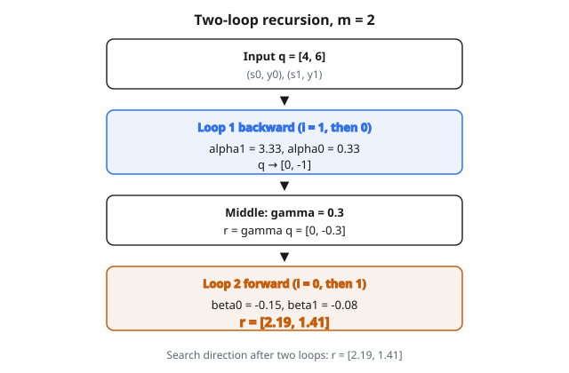

# L-BFGS Two-Loop Recursion

## Bài toán tối ưu

Trong machine learning, ta cực tiểu hóa hàm loss $f(x)$ với $x$ là vector tham số. Hạ gradient cập nhật tham số bằng:

$$
x_{k+1} = x_k - \alpha \nabla f(x_k)
$$

Cách này chỉ dùng thông tin bậc nhất (gradient). **Phương pháp Newton** dùng thông tin bậc hai (ma trận Hessian $H$):

$$
x_{k+1} = x_k - H^{-1} \nabla f(x_k)
$$

Phương pháp Newton hội tụ nhanh hơn nhưng đòi hỏi tính và nghịch đảo Hessian, tốn $O(n^2)$ bộ nhớ và $O(n^3)$ tính toán với $n$ tham số.

## L-BFGS làm gì

L-BFGS (Limited-memory Broyden-Fletcher-Goldfarb-Shanno) xấp xỉ phương pháp Newton mà không lưu Hessian đầy đủ. Nó:

1. Chỉ lưu $m$ hiệu gradient và hiệu tham số gần nhất (thường $m = 10$)
2. Biểu diễn ẩn xấp xỉ nghịch đảo Hessian
3. Tính hướng tìm kiếm trong thời gian $O(mn)$ và bộ nhớ $O(mn)$

Điều này làm tối ưu quasi-Newton khả thi với bài có hàng triệu tham số.

## Các đại lượng chính

Tại mỗi vòng lặp $k$, L-BFGS lưu:

**$s_k$:** Hiệu tham số

$$
s_k = x_{k+1} - x_k
$$

**$y_k$:** Hiệu gradient

$$
y_k = \nabla f(x_{k+1}) - \nabla f(x_k)
$$

Các cặp $(s_i, y_i)$ với $i = k-m+1, \ldots, k$ mã hóa thông tin độ cong của mặt loss.

## Two-loop recursion

Thuật toán two-loop tính hướng tìm kiếm $r = H_k \nabla f(x_k)$ mà không lập tường minh $H_k$.

**Đầu vào:**

* Gradient hiện tại $q = \nabla f(x_k)$
* Lịch sử $m$ cặp: $(s_0, y_0), (s_1, y_1), \ldots, (s_{m-1}, y_{m-1})$
* Xấp xỉ Hessian ban đầu $H_0$ (thường $H_0 = \gamma I$ với vô hướng $\gamma$)

**Vòng 1 (lùi, từ mới nhất tới cũ nhất):**

Với $i = m-1, m-2, \ldots, 0$:

$$
\begin{aligned}
\rho_i &= \frac{1}{y_i^{T} s_i} \\
\alpha_i &= \rho_i s_i^{T} q \\
q &\leftarrow q - \alpha_i y_i
\end{aligned}
$$

**Bước giữa:**

$$
r = H_0 q
$$

Thường $H_0 = \gamma I$ với $\gamma = \frac{s_{m-1}^{T} y_{m-1}}{y_{m-1}^{T} y_{m-1}}$

**Vòng 2 (tiến, từ cũ nhất tới mới nhất):**

Với $i = 0, 1, \ldots, m-1$:

$$
\begin{aligned}
\beta_i &= \rho_i y_i^{T} r \\
r &\leftarrow r + s_i (\alpha_i - \beta_i)
\end{aligned}
$$

**Đầu ra:** $r$ là hướng tìm kiếm (xấp xỉ $H_k \nabla f$)

## Ví dụ số

**Thiết lập:** bài 2D, $m = 2$ cặp lịch sử

$q = [4, 6]$ (gradient hiện tại)

Lịch sử:

* $(s_0, y_0) = ([1, 0], [2, 1])$
* $(s_1, y_1) = ([0.5, 0.5], [1, 2])$

**Tính trước các $\rho$:**

$$
\rho_0 = \frac{1}{y_0^{T} s_0} = \frac{1}{[2, 1] \cdot [1, 0]} = \frac{1}{2} = 0.5
$$

$$
\rho_1 = \frac{1}{y_1^{T} s_1} = \frac{1}{[1, 2] \cdot [0.5, 0.5]} = \frac{1}{1.5} \approx 0.667
$$

**Vòng 1 (lùi):**

$i = 1$:

$$
\alpha_1 = \rho_1 (s_1^{T} q) = 0.667 \times ([0.5, 0.5] \cdot [4, 6]) = 0.667 \times 5 = 3.33
$$

$$
\begin{aligned}
q &\leftarrow \begin{bmatrix} 4 \\ 6 \end{bmatrix} - 3.33 \cdot \begin{bmatrix} 1 \\ 2 \end{bmatrix} \\
  &= \begin{bmatrix} 4 - 3.33 \\ 6 - 6.67 \end{bmatrix} \\
  &= \begin{bmatrix} 0.67 \\ -0.67 \end{bmatrix}
\end{aligned}
$$

$i = 0$:

$$
\alpha_0 = \rho_0 (s_0^{T} q) = 0.5 \times ([1, 0] \cdot [0.67, -0.67]) = 0.5 \times 0.67 = 0.33
$$

$$
\begin{aligned}
q &\leftarrow \begin{bmatrix} 0.67 \\ -0.67 \end{bmatrix} - 0.33 \cdot \begin{bmatrix} 2 \\ 1 \end{bmatrix} \\
  &= \begin{bmatrix} 0.67 - 0.67 \\ -0.67 - 0.33 \end{bmatrix} \\
  &= \begin{bmatrix} 0 \\ -1 \end{bmatrix}
\end{aligned}
$$

**Bước giữa:**

$$
\gamma = \frac{s_1^{T} y_1}{y_1^{T} y_1} = \frac{1.5}{5} = 0.3
$$

$$
r = \gamma q = 0.3 \cdot \begin{bmatrix} 0 \\ -1 \end{bmatrix} = \begin{bmatrix} 0 \\ -0.3 \end{bmatrix}
$$

**Vòng 2 (tiến):**

$i = 0$:

$$
\beta_0 = \rho_0 (y_0^{T} r) = 0.5 \times ([2, 1] \cdot [0, -0.3]) = 0.5 \times (-0.3) = -0.15
$$

$$
\begin{aligned}
r &\leftarrow \begin{bmatrix} 0 \\ -0.3 \end{bmatrix} + \begin{bmatrix} 1 \\ 0 \end{bmatrix} \cdot (0.33 - (-0.15)) \\
  &= \begin{bmatrix} 0 \\ -0.3 \end{bmatrix} + \begin{bmatrix} 0.48 \\ 0 \end{bmatrix} \\
  &= \begin{bmatrix} 0.48 \\ -0.3 \end{bmatrix}
\end{aligned}
$$

$i = 1$:

$$
\beta_1 = \rho_1 (y_1^{T} r) = 0.667 \times ([1, 2] \cdot [0.48, -0.3]) = 0.667 \times (-0.12) = -0.08
$$

$$
\begin{aligned}
r &\leftarrow \begin{bmatrix} 0.48 \\ -0.3 \end{bmatrix} + \begin{bmatrix} 0.5 \\ 0.5 \end{bmatrix} \cdot (3.33 - (-0.08)) \\
  &= \begin{bmatrix} 0.48 \\ -0.3 \end{bmatrix} + \begin{bmatrix} 1.71 \\ 1.71 \end{bmatrix} \\
  &= \begin{bmatrix} 2.19 \\ 1.41 \end{bmatrix}
\end{aligned}
$$

**Kết quả:** Hướng tìm kiếm $r = [2.19, 1.41]$

::: {#fig-127-lbfgs-twoloop fig-cap="Two-loop recursion với m = 2: vòng lùi, bước giữa γ = 0.3, vòng tiến cho hướng tìm kiếm r = [2.19, 1.41]." fig-alt="Luồng hai vòng L-BFGS: q = [4, 6] qua vòng lùi thành [0, -1], nhân gamma = 0.3 thành r = [0, -0.3], vòng tiến cho r = [2.19, 1.41]."}
{fig-align="center"}
:::

## Vì sao hai vòng lặp?

Thuật toán khai thác cấu trúc đệ quy của công thức cập nhật BFGS. Thay vì lưu và nhân các ma trận lớn, nó:

1. **Vòng đầu:** gỡ các cập nhật “ngoài” từ mới nhất tới cũ nhất
2. **Giữa:** áp nghịch đảo Hessian cơ sở
3. **Vòng hai:** dựng lại các cập nhật “ngoài” từ cũ nhất tới mới nhất

Về toán học, điều này tương đương $H_k g$ nhưng tính trong $O(mn)$ thay vì $O(n^2)$.

## Hessian ban đầu $H_0$

Lựa chọn $H_0$ ảnh hưởng hội tụ. Các lựa chọn phổ biến:

**Đơn vị:** $H_0 = I$ (đơn giản nhưng có thể scale kém)

**Đơn vị đã scale:** $H_0 = \gamma I$ với:

$$
\gamma = \frac{s_{k-1}^{T} y_{k-1}}{y_{k-1}^{T} y_{k-1}}
$$

Scale này thích nghi với độ cong địa phương và là lựa chọn chuẩn.

## Quản lý bộ nhớ

L-BFGS lưu một **circular buffer** gồm $m$ cặp:

* Khi cặp mới $(s_k, y_k)$ tới và buffer đã đầy
* Bỏ cặp cũ nhất
* Thêm cặp mới

Giá trị điển hình: $m = 3$ tới $20$. $m$ lớn hơn cho xấp xỉ Hessian tốt hơn nhưng tốn tính toán và bộ nhớ hơn.

## Khi nào dùng L-BFGS

**Phù hợp:**

* Tối ưu lồi (logistic regression, linear SVM)
* Bài mà đánh giá hàm/gradient đắt
* Bài vừa tới lớn, Hessian đầy đủ không khả thi

**Kém phù hợp:**

* Hàm không trơn
* Tối ưu ngẫu nhiên (gradient mini-batch nhiễu)
* Mạng nơ-ron rất lớn (các biến thể SGD thường tốt hơn)

## So sánh với phương pháp khác

**Hạ gradient:** Đơn giản nhưng chậm, hội tụ tuyến tính

**Newton:** Nhanh (hội tụ bậc hai) nhưng $O(n^3)$ mỗi vòng

**BFGS:** Hội tụ siêu tuyến tính, bộ nhớ $O(n^2)$

**L-BFGS:** Hội tụ gần siêu tuyến tính, bộ nhớ $O(mn)$

L-BFGS là phương pháp mặc định cho tối ưu lồi quy mô lớn.

## Lưu ý số học

**Điều kiện độ cong:** Để cập nhật hợp lệ, cần $y_k^{T} s_k > 0$. Nếu vi phạm, bỏ qua cập nhật hoặc restart.

**Ổn định số:** Các giá trị $\rho_i$ có thể rất lớn nếu $y_i^{T} s_i$ nhỏ. Một số cài đặt thêm hàng rào an toàn.

**Line search:** L-BFGS thường đi kèm line search (điều kiện Wolfe) để chọn kích thước bước.

## Code
```python
def _dot(a, b):
    """Dot product of two vectors."""
    return sum(x * y for x, y in zip(a, b))

def lbfgs_direction(grad, s_list, y_list):
    """
    Compute the L-BFGS search direction using the two-loop recursion.
    """
    n = len(grad)
    m = len(s_list)
    q = list(grad)
    alphas = [0.0] * m
    rhos = [0.0] * m
    for i in range(m - 1, -1, -1):
        rhos[i] = 1.0 / _dot(y_list[i], s_list[i])
        alphas[i] = rhos[i] * _dot(s_list[i], q)
        q = [q[j] - alphas[i] * y_list[i][j] for j in range(n)]
    gamma = _dot(s_list[-1], y_list[-1]) / _dot(y_list[-1], y_list[-1])
    r = [gamma * q[j] for j in range(n)]
    for i in range(m):
        beta = rhos[i] * _dot(y_list[i], r)
        r = [r[j] + s_list[i][j] * (alphas[i] - beta) for j in range(n)]
    return [-r[j] for j in range(n)]

```

<!-- auto-self-check -->

::: {.callout-note}
## Kiểm tra nhanh
<details>
<summary>Ý chính của bài «L-BFGS Two-Loop Recursion» là gì?</summary>
Trong machine learning, ta cực tiểu hóa hàm loss $f(x)$ với $x$ là vector tham số.
</details>
<details>
<summary>Công thức / quan hệ cốt lõi trong bài là gì?</summary>
$$x_{k+1} = x_k - \alpha \nabla f(x_k)$$
</details>
:::
