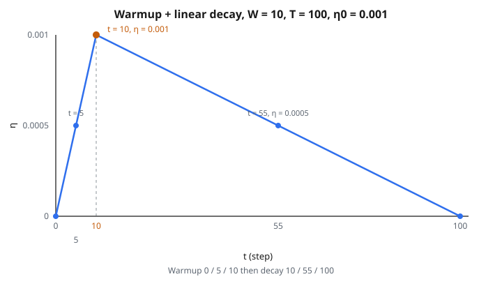

# Learning Rate Scheduler (Linear Decay)

## Vì sao learning rate quan trọng

Learning rate $\eta$ kiểm soát độ lớn bước mà optimizer đi ở mỗi vòng lặp huấn luyện:

$$
w_t = w_{t-1} - \eta \cdot g_t
$$

Nếu learning rate quá cao:

* Optimizer vượt cực tiểu, nảy qua lại
* Training loss dao động mạnh hoặc thậm chí phân kỳ ra vô cực
* Mô hình không bao giờ ổn định vào một nghiệm tốt

Nếu learning rate quá thấp:

* Mỗi bước rất nhỏ, nên huấn luyện mất rất lâu
* Optimizer có thể kẹt ở cực tiểu nông hoặc vùng phẳng
* Có thể không kịp tới nghiệm tốt trong ngân sách huấn luyện

Không có một learning rate cố định nào lý tưởng cho cả quá trình huấn luyện. Đầu tiên, ta muốn bước lớn để tiến nhanh. Về sau, ta muốn bước nhỏ hơn để tinh chỉnh nghiệm mà không overshoot. Đó là lý do dùng **learning rate scheduler**.

## Pha warmup

Ngay lúc bắt đầu huấn luyện, trọng số mô hình được khởi tạo ngẫu nhiên. Gradient tính từ các trọng số ngẫu nhiên này có thể không tin cậy và phương sai cao. Bước lớn dựa trên các gradient nhiễu sớm có thể đẩy mô hình vào vùng xấu của mặt loss, khó kéo ra.

**Warmup** xử lý việc này bằng cách bắt đầu với learning rate rất nhỏ rồi tăng dần:

* Bước $0$: learning rate bằng $0$ (hoặc rất gần $0$)
* Trong $W$ bước tiếp theo, learning rate tăng tuyến tính
* Tại bước $W$, learning rate đạt giá trị đích $\eta_0$

Trong warmup, mô hình cập nhật thận trọng, nhỏ, trong khi trạng thái nội tại của optimizer (như ước lượng moment của Adam) ổn định. Khi các ước lượng đó tin cậy, learning rate đầy đủ mới vào cuộc.

Warmup đặc biệt quan trọng với:

* **Mô hình Transformer**: không warmup, huấn luyện thường phân kỳ trong vài trăm bước đầu
* **Huấn luyện batch lớn**: batch lớn hơn cho ước lượng gradient nhiễu hơn lúc đầu
* **Adam/AdamW**: ước lượng moment bậc hai cần vài bước mới chính xác

## Linear decay

Sau warmup, learning rate đang ở đỉnh $\eta_0$. Phần còn lại của huấn luyện, nó **decay tuyến tính** về giá trị cuối $\eta_f$ (thường là $0$):

* Decay diễn ra mượt trên các bước còn lại từ $W$ tới $T$
* Tại bước $T$ (tổng số bước huấn luyện), learning rate đạt đúng $\eta_f$
* Sau bước $T$, nó đứng yên tại $\eta_f$

Vì sao decay learning rate?

* **Đầu huấn luyện**: learning rate lớn giúp thăm mặt loss và tiến nhanh tới một vùng tốt
* **Cuối huấn luyện**: learning rate nhỏ giúp optimizer ổn định chính xác vào cực tiểu mà không nảy quanh
* **Linear decay** là lịch đơn giản nhất: learning rate giảm với tốc độ không đổi mỗi bước

## Ba pha

Một lịch tuyến tính có warmup gồm ba pha rõ:

**Pha 1: Warmup** (bước $t < W$)

Learning rate tăng tuyến tính từ $0$ tới $\eta_0$:

$$
\text{LR}(t) = \frac{t \cdot \eta_0}{W}
$$

Ví dụ, với $W = 10$ và $\eta_0 = 0.001$:

* Bước $0$: $\text{LR} = 0$
* Bước $5$: $\text{LR} = 0.0005$
* Bước $10$: $\text{LR} = 0.001$

**Pha 2: Decay** ($W \leq t \leq T$)

Learning rate giảm tuyến tính từ $\eta_0$ tới $\eta_f$:

$$
\text{LR}(t) = \eta_f + (\eta_0 - \eta_f) \cdot \frac{T - t}{T - W}
$$

Đây là nội suy tuyến tính. Tại $t = W$, phân số là $\frac{T - W}{T - W} = 1$, cho $\eta_0$. Tại $t = T$, phân số là $\frac{0}{T - W} = 0$, cho $\eta_f$.

Ví dụ, với $W = 10$, $T = 100$, $\eta_0 = 0.001$, $\eta_f = 0$:

* Bước $10$: $\text{LR} = 0.001$
* Bước $55$: $\text{LR} = 0.0005$
* Bước $100$: $\text{LR} = 0$

::: {#fig-31-linear-decay fig-cap="Lịch tam giác với W = 10, T = 100, η₀ = 0.001: warmup tại bước 0 / 5 / 10 rồi decay tại 10 / 55 / 100." fig-alt="Tam giác learning rate: tăng tuyến tính từ bước 0 đến 10 tới η = 0.001, rồi giảm tuyến tính tới bước 100; đánh dấu bước 0, 5, 10, 55, 100."}
{fig-align="center"}
:::

**Pha 3: Sau huấn luyện** ($t > T$)

Learning rate đứng yên tại $\eta_f$. Không đổi thêm.

## Linear so với lịch khác

Linear decay là lịch đơn giản nhất, nhưng có các lựa chọn khác:

* **Cosine decay**: learning rate theo đường cosine, giảm chậm lúc đầu, rồi nhanh hơn, rồi chậm lại gần cuối. Đây là lựa chọn thay thế phổ biến nhất cho linear decay.
* **Step decay**: learning rate giảm một hệ số cố định (ví dụ $\times 0.1$) tại các mốc (ví dụ tại $30\%$, $60\%$, $90\%$ quá trình huấn luyện). Phổ biến trong công thức huấn luyện CNN cũ.
* **Exponential decay**: learning rate nhân một hệ số không đổi mỗi bước, cho giảm theo hàm mũ.
* **Constant**: không lịch gì cả. Hiếm khi dùng cho huấn luyện nghiêm túc.

Linear decay được ưa vì:

* Đơn giản và dự đoán được
* Không thêm hyperparameter ngoài tốc độ đầu/cuối và độ dài warmup
* Chạy tốt trong thực tế, đặc biệt khi fine-tune mô hình pretrained

## Lịch này xuất hiện ở đâu

* **Pretraining Transformer**: warmup + linear (hoặc cosine) decay là công thức chuẩn cho GPT, BERT và các mô hình tương tự. Paper gốc của BERT dùng linear warmup + linear decay.
* **Fine-tuning**: khi thích nghi mô hình pretrained sang bài mới, warmup ngắn rồi linear decay về không là phổ biến
* **Hugging Face Transformers**: scheduler mặc định của thư viện đúng là lịch này: linear warmup rồi linear decay
* **Mọi vòng lặp huấn luyện**: lập lịch learning rate là thực hành chuẩn trong deep learning hiện đại, không phải phần tùy chọn

## Code
```python
def linear_lr(step, total_steps, initial_lr, final_lr=0.0, warmup_steps=0):
    """
    Linear warmup (0→initial_lr) then linear decay (initial_lr→final_lr).
    Steps are 0-based; clamp at final_lr after total_steps.
    """
    if total_steps <= 0:
        return float(final_lr)
    step = max(0, int(step))
    if warmup_steps > 0 and step < warmup_steps:
        return float(initial_lr * (step / warmup_steps))
    s_eff = min(step, total_steps)
    decay_len = max(total_steps - warmup_steps, 1)
    return float(final_lr + (initial_lr - final_lr) * max(0.0, (total_steps - s_eff) / decay_len))

```

<!-- auto-self-check -->

::: {.callout-note}
## Kiểm tra nhanh
<details>
<summary>Ý chính của bài «Learning Rate Scheduler (Linear Decay)» là gì?</summary>
Learning rate $\eta$ kiểm soát độ lớn bước mà optimizer đi ở mỗi vòng lặp huấn luyện: Nếu learning rate quá cao: * Optimizer vượt cực tiểu, nảy qua lại * Training loss dao động mạnh hoặc thậm chí phân kỳ ra vô cực * Mô hình không bao giờ ổn định vào một…
</details>
<details>
<summary>Công thức / quan hệ cốt lõi trong bài là gì?</summary>
$$w_t = w_{t-1} - \eta \cdot g_t$$
</details>
:::
