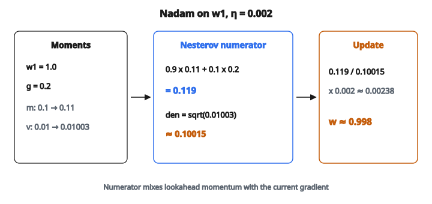

# Nadam (Nesterov + Adam)

## Bề mặt tối ưu

Huấn luyện một mạng nơ-ron nghĩa là tìm tập trọng số làm cực tiểu hàm mất mát. Bề mặt loss là landscape nhiều chiều với đồi, thung lũng, vùng phẳng, và saddle point. Việc của optimizer là đi trên landscape này hiệu quả.

Cách đơn giản nhất là **hạ gradient thuần**: tính gradient của loss theo mọi tham số, rồi bước ngược hướng đó:

$$
w_t = w_{t-1} - \eta \cdot g_t
$$

với $\eta$ là learning rate và $g_t$ là gradient tại bước $t$.

Cách này chạy được, nhưng có vấn đề:

* Nó đối xử mọi tham số như nhau, dù một số gradient luôn lớn và số khác rất nhỏ
* Nó có thể dao động qua lại theo hướng có độ cong dốc
* Nó không dùng thông tin từ các bước trước
* Chọn một learning rate duy nhất cho mọi tham số thì khó

Optimizer hiện đại sửa các vấn đề này bằng cách thêm **momentum** và **adaptive learning rate**.

## Momentum: dùng quá khứ

Thay vì chỉ dựa vào gradient hiện tại, momentum tích một trung bình chạy của các gradient quá khứ. Đây gọi là **first moment** (kỳ vọng / trung bình):

$$
m_t = \beta_1 \cdot m_{t-1} + (1 - \beta_1) \cdot g_t
$$

* $\beta_1$ là hệ số decay, thường $0.9$
* Khi $\beta_1 = 0.9$, moment mới bằng 90% moment cũ cộng 10% gradient hiện tại
* Điều này làm mượt gradient nhiễu và tích tốc theo hướng nhất quán

Hãy nghĩ như một quả bóng lăn xuống dốc. Thay vì dừng rồi khởi động lại tại mỗi điểm, nó tích vận tốc. Nếu gradient liên tục chỉ cùng hướng, quả bóng tăng tốc. Nếu gradient đột ngột đảo chiều, momentum đã tích sẽ dập thay đổi.

## Adaptive learning rate: moment bậc hai

Các tham số khác nhau cần cỡ bước khác nhau. Tham số có gradient luôn lớn có lẽ cần learning rate nhỏ hơn. Tham số có gradient rất nhỏ cần learning rate lớn hơn.

**Second moment** theo dõi gradient đã lớn đến mức nào:

$$
v_t = \beta_2 \cdot v_{t-1} + (1 - \beta_2) \cdot g_t^2
$$

* $\beta_2$ thường là $0.999$
* $v_t$ là trung bình chạy của **bình phương** gradient
* $v_t$ lớn nghĩa là gradient của tham số này gần đây lớn
* Chia cho $\sqrt{v_t}$ cho mỗi tham số learning rate adaptive riêng

Đây là ý tưởng cốt lõi sau **RMSProp** và **Adam**.

## Adam: kết hợp cả hai

Adam (Adaptive Moment Estimation) kết hợp momentum và adaptive rate:

1. Cập nhật moment bậc một: $m_t = \beta_1 m_{t-1} + (1 - \beta_1) g_t$
2. Cập nhật moment bậc hai: $v_t = \beta_2 v_{t-1} + (1 - \beta_2) g_t^2$
3. Cập nhật tham số: $w_t = w_{t-1} - \eta \cdot \frac{m_t}{\sqrt{v_t} + \epsilon}$

Tử số $m_t$ cho hướng và momentum. Mẫu số $\sqrt{v_t} + \epsilon$ co cập nhật của từng tham số theo độ lớn gradient gần đây. $\epsilon$ (thường $10^{-8}$) tránh chia cho không.

## Nesterov momentum: nhìn về phía trước

Momentum chuẩn có điểm yếu: nó tính gradient tại **vị trí hiện tại**, rồi mới áp momentum. Nhưng đến lúc cập nhật được áp, momentum đã đưa tham số đi xa hơn.

**Nesterov momentum** sửa điều này bằng cách “nhìn trước” (lookahead). Thay vì tính gradient nơi đang đứng, nó tính gradient tại nơi momentum sắp đưa tới. Điều này cho ước lượng tốt hơn về hướng thật sự nên đi.

Trong công thức gốc cho SGD thuần, Nesterov momentum hoạt động như sau:

* Trước hết, bước “lookahead” dùng momentum hiện tại
* Rồi tính gradient tại vị trí lookahead đó
* Dùng gradient đó để cập nhật momentum

Kết quả là hội tụ nhanh hơn và phản ứng tốt hơn với thay đổi trên bề mặt loss. Khi optimizer đang tiến tới cực tiểu và bắt đầu vượt quá, Nesterov momentum phát hiện sớm hơn vì nó đánh giá gradient tại vị trí tương lai.

## Nadam: Nesterov + Adam

Nadam (Nesterov-accelerated Adaptive Moment Estimation) đưa ý tưởng lookahead của Nesterov vào Adam.

Hai bước đầu giống hệt Adam:

1. Cập nhật moment bậc một: $m_t = \beta_1 m_{t-1} + (1 - \beta_1) g_t$
2. Cập nhật moment bậc hai: $v_t = \beta_2 v_{t-1} + (1 - \beta_2) g_t^2$

Khác biệt nằm ở cập nhật tham số. Thay vì dùng $m_t$ trực tiếp ở tử số, Nadam dùng tổ hợp **đã chỉnh Nesterov**:

$$
w_t = w_{t-1} - \eta \cdot \frac{\beta_1 m_t + (1 - \beta_1) g_t}{\sqrt{v_t} + \epsilon}
$$

Tách tử số $\beta_1 m_t + (1 - \beta_1) g_t$:

* $\beta_1 m_t$: hạng momentum, trọng số $\beta_1$. Đây là nơi momentum “sắp đưa ta tới”
* $(1 - \beta_1) g_t$: gradient hiện tại, trọng số $(1 - \beta_1)$. Đây là hiệu chỉnh dựa trên điều ta thấy ngay lúc này
* Cùng nhau, chúng xấp xỉ việc đánh giá gradient tại vị trí lookahead

So với Adam chuẩn, vốn chỉ dùng $m_t$ ở tử số. Phiên bản của Nadam đưa gradient hiện tại vào cập nhật trực tiếp hơn, cho nó tính chất “lookahead” của Nesterov.

## Ví dụ số

Tham số: $w = [1.0, -1.0]$, moment: $m = [0.1, -0.1]$, $v = [0.01, 0.01]$, gradient: $g = [0.2, -0.3]$, $\eta = 0.002$, $\beta_1 = 0.9$, $\beta_2 = 0.999$

**Bước 1** (moment bậc một):

* $m_1 = 0.9 \times 0.1 + 0.1 \times 0.2 = 0.09 + 0.02 = 0.11$
* $m_2 = 0.9 \times (-0.1) + 0.1 \times (-0.3) = -0.09 - 0.03 = -0.12$

**Bước 2** (moment bậc hai):

* $v_1 = 0.999 \times 0.01 + 0.001 \times 0.04 = 0.00999 + 0.00004 = 0.01003$
* $v_2 = 0.999 \times 0.01 + 0.001 \times 0.09 = 0.00999 + 0.00009 = 0.01008$

**Bước 3** (cập nhật Nesterov cho tham số thứ nhất):

* Tử số Nesterov: $0.9 \times 0.11 + 0.1 \times 0.2 = 0.099 + 0.02 = 0.119$
* Mẫu số: $\sqrt{0.01003} + 10^{-8} \approx 0.10015$

$$
\begin{aligned}
w_1 &= 1.0 - 0.002 \times \frac{0.119}{0.10015} \\
    &\approx 1.0 - 0.00238 \\
    &\approx 0.998
\end{aligned}
$$

::: {#fig-48-nadam-step fig-cap="Tử số Nesterov 0.119 / mẫu số 0.10015; với η = 0.002, w₁: 1.0 → ≈ 0.998." fig-alt="Nadam trên w1: tử số Nesterov 0.119 chia mẫu số 0.10015, w từ 1.0 xuống khoảng 0.998."}
{fig-align="center"}
:::

## Khi nào dùng Nadam

* Chạy tốt như **thay thế drop-in** cho Adam, cùng bộ hyperparameter
* Đặc biệt hiệu quả trên bài toán mà momentum giúp nhiều (gradient nhiễu, saddle point)
* Phổ biến trong tác vụ NLP, đặc biệt huấn luyện RNN và Transformer
* Learning rate mặc định thường hơi cao hơn Adam ($0.002$ so với $0.001$) vì hiệu chỉnh Nesterov làm optimizer hơi hung hăng hơn

## Code
```python
import numpy as np

def nadam_step(w, m, v, grad, lr, beta1, beta2, eps):
    """
    Perform one Nadam update step.
    """
    w = np.asarray(w, dtype=float)
    m = np.asarray(m, dtype=float)
    v = np.asarray(v, dtype=float)
    grad = np.asarray(grad, dtype=float)
    m_new = beta1 * m + (1 - beta1) * grad
    v_new = beta2 * v + (1 - beta2) * grad ** 2
    m_nesterov = beta1 * m_new + (1 - beta1) * grad
    w_new = w - lr * m_nesterov / (np.sqrt(v_new) + eps)
    return w_new, m_new, v_new

```

<!-- auto-self-check -->

::: {.callout-note}
## Kiểm tra nhanh
<details>
<summary>Ý chính của bài «Nadam (Nesterov + Adam)» là gì?</summary>
Huấn luyện một mạng nơ-ron nghĩa là tìm tập trọng số làm cực tiểu hàm mất mát.
</details>
<details>
<summary>Công thức / quan hệ cốt lõi trong bài là gì?</summary>
$$w_t = w_{t-1} - \eta \cdot g_t$$
</details>
:::
