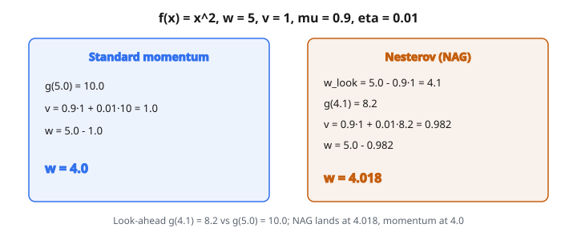

# Nesterov Momentum (NAG)

## Vì sao cần momentum

Hạ gradient thuần cập nhật tham số chỉ bằng gradient hiện tại:

$$
w_t = w_{t-1} - \eta \cdot g_t
$$

Cách này có vài vấn đề:

* **Gradient nhiễu**: mỗi mini-batch cho một ước lượng gradient hơi khác. Đường tới cực tiểu zigzag vì mỗi bước chỉ một hướng hơi lệch.
* **Chậm trong thung lũng**: xét mặt loss dốc một hướng và thoải hướng kia (như thung lũng hẹp). Hạ gradient dao động qua lại trên vách dốc trong khi tiến rất chậm dọc đáy thung lũng.
* **Không có quán tính**: mỗi bước độc lập. Optimizer không nhớ nó đang đi hướng nào. Không thể tích tốc theo một hướng nhất quán.

**Momentum** sửa cả ba bằng cách thêm số hạng velocity:

$$
v_t = \mu \cdot v_{t-1} + \eta \cdot g_t
$$

$$
w_t = w_{t-1} - v_t
$$

* $\mu$ là hệ số momentum (thường $0.9$ hoặc $0.99$)
* $v_t$ là **velocity**: tích lũy chạy của các gradient
* Velocity tăng khi gradient chỉ nhất quán một hướng
* Velocity triệt tiêu khi gradient dao động (gradient dương và âm triệt nhau)

Hình dung một quả bóng lăn xuống đồi:

* Trên dốc nhất quán, bóng tăng tốc (velocity tích lại)
* Trong thung lũng, bóng dao động trái–phải, nhưng thành phần ngang triệt nhau trong khi thành phần tiến phía trước tích lũy
* Bóng lăn dọc đáy thung lũng nhanh hơn nhiều so với từng bước thận trọng của hạ gradient

## Vấn đề của momentum chuẩn

Momentum chuẩn tính gradient tại **vị trí hiện tại** $w_{t-1}$, rồi dùng velocity để dịch chuyển. Nhưng velocity sắp đưa tham số tới chỗ mới. Khi cập nhật được áp, thông tin gradient đã hơi cũ.

Điều này gây **overshoot**. Khi optimizer tiến gần cực tiểu:

1. Velocity lớn (tích từ đoạn chạy xuống dốc)
2. Gradient tại vị trí hiện tại bảo “cứ đi tiếp” (vẫn còn trên dốc)
3. Velocity đưa tham số **vượt** cực tiểu
4. Gradient đảo chiều, nhưng velocity vẫn chỉ hướng cũ
5. Cần vài bước để gradient thắng velocity đã tích
6. Optimizer dao động quanh cực tiểu rồi mới ổn định

Momentum càng lớn ($\mu$ càng lớn), overshoot càng nặng.

## Ý tưởng Nesterov: nhìn trước khi nhảy

Nesterov Accelerated Gradient (NAG), do Yurii Nesterov đề xuất năm 1983, có cách sửa gọn:

**Thay vì tính gradient chỗ đang đứng, tính nó chỗ mà momentum sắp đưa tới.**

Thuật toán:

**Bước 1**: Tính **vị trí look-ahead** (chỗ momentum sẽ đưa tới):

$$
w_{\text{look}} = w_{t-1} - \mu \cdot v_{t-1}
$$

Đây không phải một bước cập nhật. Đây là giả định: “nếu chỉ áp velocity hiện tại, ta sẽ tới đâu?”

**Bước 2**: Tính gradient tại **vị trí look-ahead**:

$$
g_{\text{look}} = g(w_{\text{look}})
$$

Thay vì hỏi “gradient ở đây là gì?”, ta hỏi “gradient **ở kia** (chỗ đang hướng tới) là gì?”

**Bước 3**: Cập nhật velocity bằng gradient look-ahead này:

$$
v_t = \mu \cdot v_{t-1} + \eta \cdot g_{\text{look}}
$$

**Bước 4**: Cập nhật tham số:

$$
w_t = w_{t-1} - v_t
$$

## Vì sao nhìn trước giảm overshoot

Hình dung đang lăn về một thung lũng với dốc bên kia:

**Momentum chuẩn**:

* Đang trên dốc xuống
* Gradient tại chỗ đứng bảo “dốc còn xuống, cứ đi”
* Velocity lớn và chỉ xuống dốc
* Overshoot sang vùng lên dốc trước khi gradient đảo

**Nesterov momentum**:

* Đang trên dốc xuống
* Nhưng trước hết, nhảy tới chỗ momentum sẽ đưa (đã một phần lên phía bên kia)
* Gradient tại **chỗ đó** bảo “đang lên dốc, chậm lại”
* Velocity nhận hiệu chỉnh **trước khi** thực sự dịch chuyển
* Overshoot ít hơn vì hiệu chỉnh chủ động, không bị động

Khác biệt tinh tế nhưng cộng dồn qua nhiều bước. Nesterov momentum hội tụ nhanh hơn và mượt hơn một cách nhất quán.

## So sánh cạnh nhau

Cực tiểu hóa $f(x) = x^2$ (cực tiểu tại $x = 0$). Gradient: $g(x) = 2x$.

Bắt đầu: $w = 5.0$, $v = 1.0$, $\mu = 0.9$, $\eta = 0.01$

**Momentum chuẩn**:

* Gradient tại vị trí hiện tại: $g(5.0) = 10.0$
* Velocity mới: $v = 0.9 \cdot 1.0 + 0.01 \cdot 10.0 = 0.9 + 0.1 = 1.0$
* Vị trí mới: $w = 5.0 - 1.0 = 4.0$

**Nesterov momentum**:

* Look-ahead: $w_{\text{look}} = 5.0 - 0.9 \cdot 1.0 = 4.1$
* Gradient tại look-ahead: $g(4.1) = 8.2$ (nhỏ hơn, vì $4.1$ gần cực tiểu hơn)
* Velocity mới: $v = 0.9 \cdot 1.0 + 0.01 \cdot 8.2 = 0.982$
* Vị trí mới: $w = 5.0 - 0.982 = 4.018$

::: {#fig-45-nag-lookahead fig-cap="Cùng f(x) = x², w = 5, v = 1: momentum chuẩn tới 4.0; NAG dùng g(4.1) = 8.2 và tới 4.018." fig-alt="Hai cột: momentum chuẩn từ w=5, g=10 tới w=4.0; NAG look-ahead w_look=4.1, g=8.2, tới w=4.018."}
{fig-align="center"}
:::

Khác biệt:

* Nesterov dùng gradient $8.2$ thay vì $10.0$ (khớp hơn với chỗ đang hướng tới)
* Velocity của Nesterov là $0.982$ thay vì $1.0$ (nhỏ hơn một chút, ít overshoot hơn)
* Nesterov dừng tại $4.018$ thay vì $4.0$ (xa hơn một chút, vì velocity thấp hơn cũng nghĩa là “phanh” ít hơn)

Các khác biệt này nhỏ từng bước nhưng tích lại đáng kể sau hàng trăm hoặc hàng nghìn bước.

## Lý thuyết hội tụ

Với hàm lồi, Nesterov momentum có tốc độ hội tụ chứng minh được tốt hơn momentum chuẩn:

* **Hạ gradient**: tốc độ hội tụ $O(1/t)$ (sai số giảm như $1/t$)
* **Hạ gradient + momentum**: tốc độ hội tụ $O(1/t)$ (cùng bậc lý thuyết, nhưng hằng số tốt hơn)
* **Nesterov momentum**: tốc độ hội tụ $O(1/t^2)$ (nhanh hơn bậc hai!)

Đây là kết quả lý thuyết lớn. $O(1/t^2)$ thực ra là **tốc độ tối ưu** cho phương pháp bậc nhất trên hàm lồi. Không phương pháp dựa trên gradient nào làm tốt hơn (nếu không có thêm thông tin như đạo hàm bậc hai).

Với bài không lồi (như deep learning), bảo đảm lý thuyết yếu hơn, nhưng Nesterov momentum vẫn thường tốt hơn trong thực nghiệm.

## Nesterov momentum xuất hiện ở đâu

* **SGD + Nesterov**: biến thể SGD chuẩn cho phân loại ảnh. ResNet, VGG, EfficientNet và các CNN khác thường được huấn luyện bằng SGD + Nesterov momentum ($\mu = 0.9$).
* **Nadam**: Nesterov momentum nhúng trong Adam. Bước cập nhật Adam dùng moment bậc nhất đã chỉnh kiểu Nesterov thay cho moment bậc nhất chuẩn.
* **PyTorch SGD**: khi đặt `nesterov=True` trong `torch.optim.SGD`, thư viện dùng biến thể Nesterov.
* **Khi SGD thắng Adam**: trên phân loại ảnh quy mô lớn và các bài mà SGD chỉnh kỹ tổng quát hóa tốt hơn Adam, Nesterov momentum gần như luôn được kèm. Đây là cấu hình “SGD nghiêm túc” chuẩn.
* **Tối ưu lồi**: phương pháp accelerated gradient của Nesterov là nền tảng trong lý thuyết tối ưu và được dùng ở nhiều lĩnh vực ngoài machine learning.

## Code
```python
import numpy as np

def nesterov_momentum_step(w, v, grad, lr, momentum):
    """
    Perform one Nesterov Momentum update step.
    """
    w = np.array(w, dtype=float)
    v = np.array(v, dtype=float)
    grad = np.array(grad, dtype=float)
    v_new = momentum * v + lr * grad
    w_new = w - v_new
    return np.round(w_new, 6).tolist(), np.round(v_new, 6).tolist()

```
