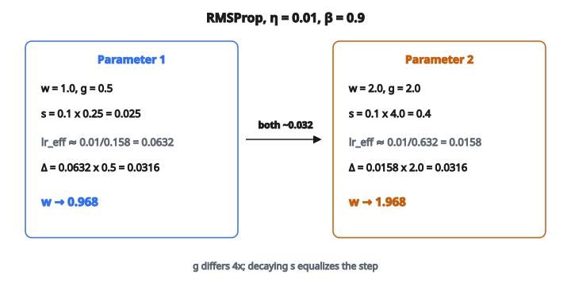

# RMSProp Optimizer

## RMSProp sửa gì

AdaGrad là một bước đột phá: nó cho mỗi tham số learning rate riêng bằng cách chia cho tổng bình phương gradient tích lũy. Nhưng accumulator của AdaGrad chỉ tăng, nên learning rate hiệu dụng cuối cùng co gần về không và mô hình ngừng học.

RMSProp (Root Mean Square Propagation) sửa điều này bằng một thay đổi đơn giản: **dùng trung bình có decay thay vì tổng.**

Geoffrey Hinton đề xuất RMSProp trong bài giảng Coursera năm 2012. Nó chưa từng được xuất bản thành bài báo chính thức, vậy mà trở thành một trong những optimizer được dùng rộng rãi nhất.

## Thay đổi cốt lõi: exponential decay

Accumulator của AdaGrad cộng mọi bình phương gradient quá khứ:

$$
G_t = G_{t-1} + g_t^2 \quad \text{(chỉ tăng)}
$$

RMSProp thay bằng một **trung bình mũ có decay**:

$$
s_t = \beta \cdot s_{t-1} + (1 - \beta) \cdot g_t^2
$$

* $\beta$ là hệ số decay (thường $0.9$ hoặc $0.99$)
* $s_t$ là **trung bình có trọng số** của bình phương gradient gần đây
* Gradient cũ tắt dần theo hàm mũ
* Accumulator **không** tăng không giới hạn

Rồi cập nhật tham số dùng cùng công thức như AdaGrad:

$$
w_t = w_{t-1} - \frac{\eta}{\sqrt{s_t + \epsilon}} \cdot g_t
$$

Khác biệt duy nhất là $s_t$ (trung bình có decay) thay cho $G_t$ (tổng luôn tăng).

## Hiểu trung bình mũ

Trung bình mũ là accumulator “rò”. Để thấy vì sao, khai triển vài bước với $\beta = 0.9$:

* $s_1 = 0.9 \times 0 + 0.1 \times g_1^2 = 0.1 g_1^2$
* $s_2 = 0.9 \times 0.1 g_1^2 + 0.1 \times g_2^2 = 0.09 g_1^2 + 0.1 g_2^2$
* $s_3 = 0.081 g_1^2 + 0.09 g_2^2 + 0.1 g_3^2$

Mỗi gradient quá khứ bị nhân thêm $\beta$ một lần nữa ở mỗi bước:

* Gradient cách 1 bước có trọng số $\beta(1-\beta) = 0.09$
* Gradient cách 5 bước có trọng số $\beta^5(1-\beta) \approx 0.059$
* Gradient cách 10 bước có trọng số $\beta^{10}(1-\beta) \approx 0.035$
* Gradient cách 50 bước có trọng số $\beta^{50}(1-\beta) \approx 0.0005$ (coi như quên)

**Cửa sổ hiệu dụng** xấp xỉ $\frac{1}{1-\beta}$ bước:

* $\beta = 0.9$: cửa sổ khoảng 10 bước
* $\beta = 0.99$: cửa sổ khoảng 100 bước
* $\beta = 0.999$: cửa sổ khoảng 1000 bước

## Vì sao cách này sửa được vấn đề của AdaGrad

Khác biệt then chốt: **learning rate hiệu dụng có thể tăng trở lại.**

Với AdaGrad:

* Nếu tham số $w_i$ có gradient lớn ở bước 1–100, $G_i$ của nó lớn
* Dù gradient trở nên nhỏ ở bước 101–200, $G_i$ vẫn lớn (nó chỉ tăng)
* Learning rate mãi nhỏ

Với RMSProp:

* Nếu tham số $w_i$ có gradient lớn ở bước 1–100, $s_i$ của nó lớn
* Nếu gradient trở nên nhỏ ở bước 101–200, các giá trị lớn cũ tắt dần
* $s_i$ giảm, và learning rate hiệu dụng **tăng** trở lại
* Optimizer thích nghi với chế độ gradient **hiện tại**, không phải toàn bộ lịch sử

Nghĩa là mô hình vẫn tiến triển có ý nghĩa suốt quá trình huấn luyện, kể cả khi tính chất của gradient đổi theo thời gian.

## Ví dụ số

Tham số: $w = [1.0, 2.0]$, accumulator: $s = [0.0, 0.0]$, $\eta = 0.01$, $\beta = 0.9$

**Bước 1 với gradient $g = [0.5, 2.0]$**:

Cập nhật accumulator:

* $s_1 = 0.9 \times 0 + 0.1 \times (0.5)^2 = 0.025$
* $s_2 = 0.9 \times 0 + 0.1 \times (2.0)^2 = 0.4$

Learning rate hiệu dụng:

* Tham số 1: $\frac{0.01}{\sqrt{0.025 + 10^{-8}}} = \frac{0.01}{0.158} \approx 0.0632$
* Tham số 2: $\frac{0.01}{\sqrt{0.4 + 10^{-8}}} = \frac{0.01}{0.632} \approx 0.0158$

Cập nhật tham số:

* $w_1 = 1.0 - 0.0632 \times 0.5 = 1.0 - 0.0316 = 0.968$
* $w_2 = 2.0 - 0.0158 \times 2.0 = 2.0 - 0.0316 = 1.968$

::: {#fig-9-rmsprop-step fig-cap="s = [0.025, 0.4] co bước của g = [0.5, 2.0] thành cùng Δ ≈ 0.032; w → [0.968, 1.968]." fig-alt="Hai tham số RMSProp: w=[1,2], g=[0.5,2], s=[0.025,0.4]; cả hai dịch chuyển khoảng 0.032 dù gradient lệch 4 lần."}
{fig-align="center"}
:::

Cả hai tham số dịch khoảng $0.032$, dù gradient của tham số 2 lớn gấp 4 lần. RMSProp san đều cỡ bước.

**Bước 2 với gradient $g = [0.5, 0.1]$** (gradient của tham số 2 giảm):

Cập nhật accumulator:

* $s_1 = 0.9 \times 0.025 + 0.1 \times 0.25 = 0.0225 + 0.025 = 0.0475$
* $s_2 = 0.9 \times 0.4 + 0.1 \times 0.01 = 0.36 + 0.001 = 0.361$

Learning rate hiệu dụng:

* Tham số 1: $\frac{0.01}{\sqrt{0.0475}} \approx 0.0459$
* Tham số 2: $\frac{0.01}{\sqrt{0.361}} \approx 0.0166$ (vẫn nhỏ vì gradient lớn ở bước 1)

Sau nhiều bước nữa với gradient nhỏ cho tham số 2, $s_2$ sẽ co về phía $0.1 \times 0.01 = 0.001$, và learning rate hiệu dụng của nó sẽ phục hồi. Với AdaGrad, nó sẽ kẹt ở $0.4 + 0.01 = 0.41$ mãi.

## Chọn beta

Hệ số decay $\beta$ kiểm soát độ dài bộ nhớ:

* **$\beta = 0.9$** (mặc định phổ biến nhất): nhớ khoảng 10 bước gần nhất. Thích nghi nhanh khi điều kiện gradient đổi. Tốt cho hầu hết tác vụ.
* **$\beta = 0.99$**: nhớ khoảng 100 bước gần nhất. Thích nghi chậm hơn, ước lượng mượt hơn. Tốt khi gradient rất nhiễu.
* **$\beta = 0.0$**: không nhớ gì. $s_t = g_t^2$ (chỉ dùng bình phương gradient hiện tại). Rất nhiễu, không nên dùng.
* **$\beta = 1.0$**: bộ nhớ vô hạn. $s_t = s_{t-1}$ (không bao giờ cập nhật). Accumulator kẹt ở giá trị ban đầu. Vô dụng.

## RMSProp trong họ optimizer

RMSProp nằm trong một dòng rõ:

* **SGD**: $w_t = w_{t-1} - \eta g_t$. Một learning rate, không thích nghi. Tính nhanh.
* **AdaGrad**: chia cho $\sqrt{G_t}$ (tổng bình phương gradient). Adaptive, nhưng learning rate decay về không.
* **RMSProp**: chia cho $\sqrt{s_t}$ (trung bình có decay của bình phương gradient). Adaptive, learning rate phục hồi. Không có momentum.
* **Adam**: RMSProp + momentum. Thêm trung bình có decay của chính gradient (moment bậc một) và bias correction. Optimizer phổ biến nhất.

Nếu đặt $\beta_1 = 0$ trong Adam (không momentum) và bỏ bias correction, ta được RMSProp.

## RMSProp được dùng ở đâu

* **Reinforcement learning**: RMSProp từng là optimizer mặc định cho DQN (agent chơi Atari), A3C, và nhiều thuật toán RL khác. Vẫn thường dùng trong RL vì thống kê gradient đổi nhanh khi policy tiến hóa.
* **Mạng hồi tiếp**: trước Adam, RMSProp là optimizer được khuyến nghị cho RNN và LSTM. Nó xử lý tốt độ lớn gradient thay đổi theo bước thời gian.
* **Khi muốn đơn giản hơn Adam**: RMSProp ít hyperparameter hơn (không $\beta_1$, không bias correction). Đôi khi đơn giản hơn thì tốt hơn.
* **Khi Adam overfit**: bỏ momentum có thể đóng vai trò regularization ẩn. Một số nghiên cứu báo cáo generalization tốt hơn với RMSProp so với Adam trên một số tác vụ.

## Code
```python
import numpy as np

def rmsprop_step(w, g, s, lr=0.001, beta=0.9, eps=1e-8):
    """
    Perform one RMSProp update step.
    """
    w = np.array(w, dtype=float)
    g = np.array(g, dtype=float)
    s = np.array(s, dtype=float)
    s_new = beta * s + (1 - beta) * g ** 2
    w_new = w - lr / np.sqrt(s_new + eps) * g
    return np.round(w_new, 6).tolist(), np.round(s_new, 6).tolist()

```

<!-- auto-self-check -->

::: {.callout-note}
## Kiểm tra nhanh
<details>
<summary>Ý chính của bài «RMSProp Optimizer» là gì?</summary>
AdaGrad là một bước đột phá: nó cho mỗi tham số learning rate riêng bằng cách chia cho tổng bình phương gradient tích lũy.
</details>
<details>
<summary>Công thức / quan hệ cốt lõi trong bài là gì?</summary>
$$G_t = G_{t-1} + g_t^2 \quad \text{(chỉ tăng)}$$
</details>
:::
