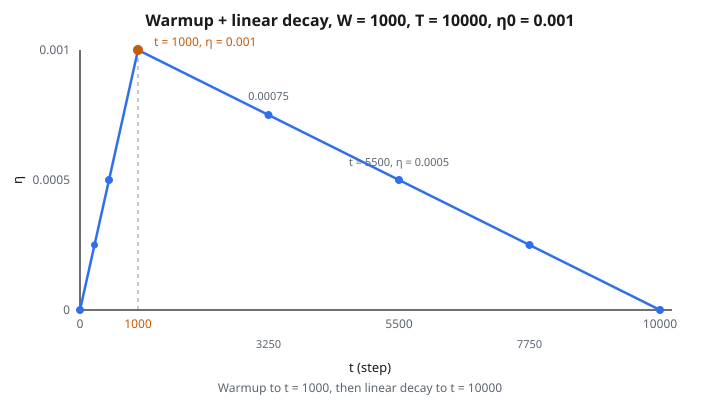

# Warmup + Linear Decay LR Schedule

## Vì sao lúc đầu huấn luyện kém

Ngay lúc bắt đầu huấn luyện, mọi thứ đều ngẫu nhiên:

* **Trọng số ngẫu nhiên**: khởi tạo từ một phân phối ngẫu nhiên (Xavier, He, v.v.)
* **Activation ngẫu nhiên**: vì đầu vào đi qua trọng số ngẫu nhiên, activation về cơ bản là nhiễu
* **Gradient không tin cậy**: tính từ activation ngẫu nhiên, các gradient này có phương sai cao và có thể chỉ hướng gây hiểu nhầm
* **Trạng thái optimizer trống**: ước lượng moment của Adam ($m$ và $v$) toàn số không, khiến vài bước cập nhật đầu hiệu chỉnh kém

Nếu áp learning rate đầy đủ lên các gradient không tin cậy này, kết quả có thể thảm:

* Một gradient lớn, nhiễu có thể đẩy trọng số rất xa vào vùng xấu
* Một khi mô hình đã vào vùng xấu, có thể mất hàng nghìn bước mới kéo ra
* Trong trường hợp cực đoan, loss phân kỳ ra vô cực hoặc thành NaN
* Dù huấn luyện cuối cùng ổn định, tổn hại sớm có thể dẫn tới kết quả cuối không tối ưu

## Warmup: bắt đầu nhẹ

**Warmup** xử lý việc này bằng cách bắt đầu với learning rate rất nhỏ (hoặc bằng không) rồi tăng dần trong vài trăm hoặc vài nghìn bước đầu.

Công thức warmup tuyến tính cho bước $t < W$ (số bước warmup):

$$
\eta(t) = \eta_0 \cdot \frac{t}{W}
$$

* Tại $t = 0$: $\eta = 0$ (không cập nhật gì)
* Tại $t = W/2$: $\eta = \eta_0/2$ (một nửa tốc độ đích)
* Tại $t = W$: $\eta = \eta_0$ (đủ tốc độ đích, warmup xong)

Trong warmup, vài thứ ổn định:

* **Moment bậc hai của Adam** ($v_t$): cần vài bước mới thành ước lượng tin cậy của độ lớn gradient. Với learning rate gần không, lệch sớm không gây hại.
* **Thống kê batch normalization**: mean và phương sai chạy cần nhiều batch mới ổn định. Learning rate nhỏ ngăn mô hình đổi quá nhanh khi các thống kê này chưa tin cậy.
* **Thang gradient**: độ lớn điển hình của gradient ổn vào một khoảng ổn định khi khởi tạo ngẫu nhiên bị “rửa” bởi vài bước cập nhật đầu.
* **Phân phối activation**: activation đi từ nhiễu ngẫu nhiên tới các mẫu có nghĩa, khiến tín hiệu gradient sau đó giàu thông tin hơn.

## Ai cần warmup (và bao nhiêu)

Các thiết lập khác nhau cần lượng warmup khác nhau:

**Mô hình Transformer**:

* Warmup về cơ bản là bắt buộc. Không có nó, huấn luyện thường phân kỳ trong $100$–$1000$ bước đầu.
* Warmup điển hình: $500$–$4000$ bước
* Paper “Attention Is All You Need” đưa warmup vào đúng cho Transformer

**Huấn luyện batch lớn**:

* Batch lớn hơn khuếch đại nhiễu gradient ở pha đầu
* Quy tắc ngón tay cái: số bước warmup nên tăng theo batch size
* GPT-3 dùng warmup $375$ triệu token

**Adam/AdamW**:

* Ước lượng moment bậc hai ($v_t$) khởi tạo bằng không và cần thời gian hiệu chỉnh
* Không warmup, vài bước Adam đầu có thể có độ lớn sai lệch mạnh
* Warmup cho $v_t$ thời gian trở nên tin cậy

**Fine-tune mô hình pretrained**:

* Warmup ngắn hơn ($100$–$500$ bước) thường đủ
* Trọng số pretrained đã ở vùng tốt, nên gradient sớm tin cậy hơn

**Mô hình nhỏ với SGD**:

* Có thể không cần warmup
* MLP đơn giản và CNN nhỏ thường huấn luyện ổn mà không cần

## Vì sao decay sau warmup

Sau warmup, learning rate đang ở giá trị đỉnh $\eta_0$. Nếu nó đứng đó suốt phần còn lại của huấn luyện:

* Optimizer cứ đi **bước lớn** suốt quá trình huấn luyện
* Gần cuối, khi mô hình đã sát cực tiểu, các bước lớn khiến nó **nảy quanh** cực tiểu thay vì ổn định vào
* Training loss dao động và không bao giờ đạt giá trị thấp nhất có thể
* Mô hình không “tinh chỉnh” được tham số

Decay learning rate theo thời gian sửa việc này:

* Tốc độ lớn lúc đầu = thăm dò nhanh
* Tốc độ giảm dần = chuyển dần từ thăm dò sang khai thác
* Tốc độ nhỏ lúc cuối = hội tụ chính xác

## Lịch đủ ba pha

**Pha 1: Warmup** (bước $t < W$)

Learning rate tăng tuyến tính từ $0$ tới $\eta_0$:

$$
\eta(t) = \eta_0 \cdot \frac{t}{W}
$$

Ví dụ với $W = 1000$, $\eta_0 = 0.001$:

* Bước $0$: $\eta = 0$
* Bước $250$: $\eta = 0.00025$
* Bước $500$: $\eta = 0.0005$
* Bước $1000$: $\eta = 0.001$ (warmup xong)

**Pha 2: Linear decay** ($W \leq t \leq T$)

Learning rate giảm tuyến tính từ $\eta_0$ về $0$:

$$
\eta(t) = \eta_0 \cdot \frac{T - t}{T - W}
$$

Ví dụ với $W = 1000$, $T = 10000$, $\eta_0 = 0.001$:

* Bước $1000$: $\eta = 0.001$ (vừa xong warmup)
* Bước $3250$: $\eta = 0.00075$
* Bước $5500$: $\eta = 0.0005$
* Bước $7750$: $\eta = 0.00025$
* Bước $10000$: $\eta = 0$ (hết huấn luyện)

::: {#fig-125-warmup-decay fig-cap="Lịch tam giác với W = 1000, T = 10000, η₀ = 0.001: đỉnh tại t = 1000 rồi decay tuyến tính về 0 tại t = 10000." fig-alt="Tam giác learning rate: tăng từ bước 0 đến W = 1000 tới η = 0.001, rồi giảm tuyến tính tới T = 10000; đánh dấu 1000, 3250, 5500, 7750, 10000."}
{fig-align="center"}
:::

**Pha 3: Sau huấn luyện** ($t > T$)

Learning rate đứng yên tại $0$ (hoặc $\eta_{\min}$ nếu được chỉ định).

## Hình dạng

Nếu vẽ $\eta$ theo bước, lịch trông như một **tam giác** (hoặc dốc lên rồi dốc xuống):

* Tăng tuyến tính trong warmup
* Đỉnh tại bước $W$
* Giảm tuyến tính trong decay
* Phẳng tại $0$ sau bước $T$

Đỉnh luôn nằm ở biên warmup $t = W$. Warmup thường ngắn hơn nhiều so với tổng quá trình huấn luyện, nên tam giác không đối xứng: đoạn lên ngắn, đoạn xuống dài.

## Các trường hợp biên

**Không warmup** ($W = 0$):

* Lịch bắt đầu tại $\eta_0$ và decay tuyến tính về $0$
* Không có pha warmup
* Đây chỉ là linear decay

**Warmup bằng tổng số bước** ($W = T$):

* Lịch tăng từ $0$ tới $\eta_0$ rồi ngay lập tức bắt đầu decay
* Đỉnh chỉ kéo dài một bước
* Không phải cấu hình hữu ích trong thực tế

**Bước vượt tổng số bước** ($t > T$):

* Learning rate bị kẹp tại $0$ (hoặc $\eta_{\min}$)
* Không có learning rate âm

## Warmup + linear decay so với lịch khác

* **Warmup + linear decay**: hình tam giác. Đơn giản, hiệu quả. Mặc định trong Hugging Face Transformers (`get_linear_schedule_with_warmup`).
* **Warmup + cosine decay**: warmup rồi một đường cosine. Mượt hơn một chút. Thường tốt hơn linear decay một chút. Dùng trong nhiều công thức huấn luyện LLM.
* **Step decay (không warmup)**: learning rate giảm một hệ số cố định (ví dụ $10\times$) tại các epoch cụ thể. Cách truyền thống cho CNN huấn luyện bằng SGD. Không có pha warmup.
* **Constant (không lịch)**: $\eta$ không bao giờ đổi. Đơn giản nhưng dưới tối ưu cho hầu hết bài.
* **Exponential decay**: $\eta$ nhân một hệ số không đổi mỗi bước. Giống linear trong thực tế nhưng hình đường cong khác.

## Lịch này xuất hiện ở đâu

* **Pretraining BERT**: paper BERT gốc dùng đúng lịch này: linear warmup + linear decay. Đây là thứ làm cách tiếp cận này phổ biến.
* **Fine-tune BERT**: công thức chuẩn khi fine-tune BERT trên bài downstream dùng warmup ($5$–$10\%$ số bước) + linear decay.
* **Hugging Face Transformers**: scheduler mặc định là `get_linear_schedule_with_warmup`, cài đúng lịch ba pha này.
* **Huấn luyện GPT-2/GPT-3**: dùng warmup + cosine decay (họ hàng gần).
* **Mọi lần huấn luyện Transformer**: warmup + một dạng decay đã thành thực hành chuẩn. Nếu đang huấn luyện hoặc fine-tune Transformer mà không dùng warmup, khả năng đang bỏ lại hiệu năng.
* **Thực hành tốt chung**: ngay cả ngoài Transformer, warmup + decay là mặc định an toàn cho mọi lần huấn luyện deep learning.

## Code
```python
def warmup_decay_schedule(base_lr, warmup_steps, total_steps, current_step):
    """
    Compute the learning rate at a given step using warmup + linear decay.
    """
    if current_step < warmup_steps:
        return round(base_lr * current_step / warmup_steps, 6)
    else:
        return round(base_lr * (total_steps - current_step) / (total_steps - warmup_steps), 6)

```
