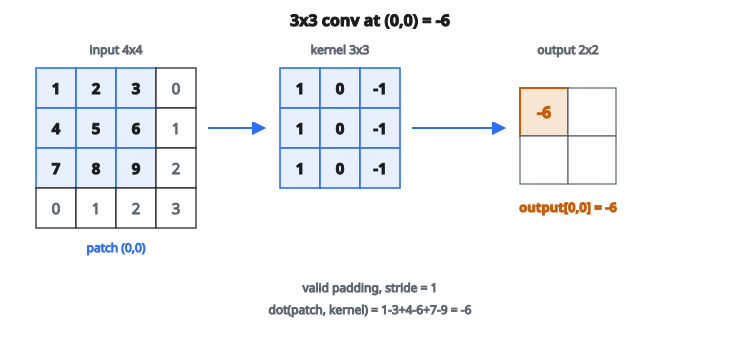

# CNN Layer (NumPy)

## Lớp tích chập làm gì

Lớp tích chập (**convolutional layer**) áp các filter (kernel) học được lên ảnh đầu vào hoặc feature map. Mỗi filter trượt trên đầu vào, tính tích vô hướng tại mỗi vị trí để tạo một feature map đầu ra.

**Ý chính:** Thay vì nối mọi đầu vào với mọi đầu ra (như lớp fully connected), convolution dùng kết nối cục bộ với trọng số chia sẻ. Cách này giảm mạnh số tham số và bắt được mẫu không gian.

## Phép tích chập

Với convolution 2D, một channel đầu vào:

$$
\text{output}[i, j] = \sum_{m=0}^{k_h-1} \sum_{n=0}^{k_w-1} \text{input}[i+m, j+n] \times \text{kernel}[m, n] + \text{bias}
$$

Kernel trượt trên đầu vào. Tại mỗi vị trí, ta nhân từng phần tử của kernel với patch đầu vào, cộng lại, rồi cộng bias.

## Các thành phần của lớp conv

Layout tensor: **NCHW**.

**Input:** Feature map shape $(C_{\text{in}}, H_{\text{in}}, W_{\text{in}})$

* $C_{\text{in}}$: số channel đầu vào (ví dụ 3 với RGB)
* $H_{\text{in}}$: chiều cao đầu vào
* $W_{\text{in}}$: chiều rộng đầu vào

**Kernel/Filter:** Tensor trọng số shape $(C_{\text{out}}, C_{\text{in}}, k_h, k_w)$

* $C_{\text{out}}$: số channel đầu ra (số filter)
* $C_{\text{in}}$: phải khớp số channel đầu vào
* $k_h, k_w$: chiều cao và rộng của kernel

**Bias:** Vector shape $(C_{\text{out}},)$, một bias mỗi channel đầu ra

**Output:** Feature map shape $(C_{\text{out}}, H_{\text{out}}, W_{\text{out}})$

## Tính kích thước đầu ra

Với kích thước đầu vào $H_{\text{in}}$, kernel $k$, padding $p$, và stride $s$:

$$
H_{\text{out}} = \left\lfloor \frac{H_{\text{in}} + 2p - k}{s} \right\rfloor + 1
$$

Cùng công thức cho chiều rộng.

**Cấu hình thường gặp:**

**"Same" padding (đầu ra = kích thước đầu vào):** $p = (k-1)/2$ với $s = 1$

**"Valid" padding (không padding):** $p = 0$, đầu ra co lại

## Ví dụ số: một channel

**Input:** ảnh $4 \times 4$

$$
\begin{bmatrix}
1 & 2 & 3 & 0 \\
4 & 5 & 6 & 1 \\
7 & 8 & 9 & 2 \\
0 & 1 & 2 & 3
\end{bmatrix}
$$

**Kernel:** $3 \times 3$

$$
\begin{bmatrix}
1 & 0 & {-1} \\
1 & 0 & {-1} \\
1 & 0 & {-1}
\end{bmatrix}
$$

**Stride:** $1$, **Padding:** $0$

**Kích thước đầu ra:** $(4 - 3)/1 + 1 = 2$, vậy đầu ra $2 \times 2$

**Vị trí $(0,0)$:** Lấy patch $3 \times 3$ góc trên-trái, nhân vô hướng với kernel:

$$
\begin{aligned}
\text{output}[0,0]
&= (1 \times 1) + (2 \times 0) + (3 \times ({-1})) \\
&\quad + (4 \times 1) + (5 \times 0) + (6 \times ({-1})) \\
&\quad + (7 \times 1) + (8 \times 0) + (9 \times ({-1})) \\
&= 1 + 0 - 3 + 4 + 0 - 6 + 7 + 0 - 9 \\
&= {-6}
\end{aligned}
$$

::: {#fig-22-conv-patch fig-cap="Valid conv, stride 1: patch (0,0) nhân kernel $3 \times 3$ cho $\mathrm{output}[0,0] = -6$." fig-alt="Lưới input 4x4; patch 3x3 góc trên-trái nhân kernel [[1,0,-1],[1,0,-1],[1,0,-1]]; ô output (0,0) bằng -6."}
{fig-align="center"}
:::

**Vị trí $(0,1)$:** Dịch kernel sang phải 1 pixel, lặp lại trên patch

$$
\begin{bmatrix}
2 & 3 & 0 \\
5 & 6 & 1 \\
8 & 9 & 2
\end{bmatrix}
$$

$$
\begin{aligned}
\text{output}[0,1]
&= (2 \times 1) + (3 \times 0) + (0 \times ({-1})) \\
&\quad + (5 \times 1) + (6 \times 0) + (1 \times ({-1})) \\
&\quad + (8 \times 1) + (9 \times 0) + (2 \times ({-1})) \\
&= 2 + 0 + 0 + 5 + 0 - 1 + 8 + 0 - 2 \\
&= 12
\end{aligned}
$$

**Vị trí $(1,0)$:** patch hàng 1–3, cột 0–2 cho $\text{output}[1,0] = {-6}$.

**Vị trí $(1,1)$:** patch hàng 1–3, cột 1–3 cho $\text{output}[1,1] = 8$.

**Đầu ra $2 \times 2$:**

$$
\begin{bmatrix}
{-6} & 12 \\
{-6} & 8
\end{bmatrix}
$$

## Nhiều channel đầu vào

Với ảnh RGB (3 channel), mỗi filter có 3 sub-kernel, một cho mỗi channel:

$$
\text{output}[i,j] = \sum_{c=0}^{C_{\text{in}}-1} \sum_{m,n} \text{input}[c, i+m, j+n] \times \text{kernel}[c, m, n] + \text{bias}
$$

Các convolution trên mọi channel đầu vào được cộng lại thành một giá trị đầu ra.

**Ví dụ:** Kernel $3 \times 3$ trên đầu vào RGB có shape $(3, 3, 3)$ = 27 trọng số mỗi filter.

## Nhiều channel đầu ra

Mỗi channel đầu ra đến từ một filter khác. Với $C_{\text{out}}$ filter:

* Filter 1 tạo channel đầu ra 1
* Filter 2 tạo channel đầu ra 2
* ...
* Filter $C_{\text{out}}$ tạo channel đầu ra $C_{\text{out}}$

**Tổng trọng số:** $C_{\text{out}} \times C_{\text{in}} \times k_h \times k_w$

**Tổng bias:** $C_{\text{out}}$

## Stride

Stride kiểm soát kernel dịch bao xa mỗi bước.

**Stride = 1:** Dịch 1 pixel, chồng lấn tối đa

**Stride = 2:** Dịch 2 pixel, kích thước đầu ra giảm khoảng một nửa

Stride lớn hơn làm nhỏ đầu ra và giảm tính toán, nhưng mất độ phân giải không gian.

## Padding

Padding thêm số 0 quanh viền đầu vào.

**Không padding (valid):**

* Kernel phải nằm trọn trong đầu vào
* Đầu ra nhỏ hơn đầu vào

**Same padding:**

* Pad sao cho đầu ra cùng kích thước không gian với đầu vào (khi stride 1)
* Kernel $3 \times 3$: pad = 1
* Kernel $5 \times 5$: pad = 2

Padding giữ kích thước không gian và cho phép xử lý các pixel ở mép.

## Số tham số

Với lớp conv: $(C_{\text{in}}, H, W) \to (C_{\text{out}}, H', W')$ với kernel $k \times k$:

**Weights:** $C_{\text{out}} \times C_{\text{in}} \times k \times k$

**Biases:** $C_{\text{out}}$

**Tổng:** $C_{\text{out}} \times (C_{\text{in}} \times k \times k + 1)$

**Ví dụ:** 64 filter, 3 channel đầu vào, kernel $3 \times 3$

Weights: $64 \times 3 \times 3 \times 3 = 1728$

Biases: $64$

Tổng: $1792$ tham số

So với fully connected: đầu vào $32 \times 32 \times 3$ tới 64 đầu ra cần $32 \times 32 \times 3 \times 64 = 196608$ tham số.

## Filter học gì

Các lớp sớm học đặc trưng cấp thấp:

* Bộ dò cạnh (ngang, dọc, chéo)
* Vùng màu
* Mẫu texture

Các lớp sâu hơn học đặc trưng cấp cao:

* Hình dạng (hình tròn, góc)
* Bộ phận đối tượng (mắt, bánh xe)
* Đối tượng đầy đủ (khuôn mặt, xe)

Mạng tự học các filter hữu ích qua lan truyền ngược.

## Hàm kích hoạt

Convolution là phép tuyến tính. Sau convolution, áp hàm kích hoạt phi tuyến:

$$
\text{output} = \text{ReLU}(\text{Conv}(\text{input}))
$$

Mẫu phổ biến: Conv -> BatchNorm -> ReLU

Hàm kích hoạt cho phép mạng học mẫu phi tuyến.

## Ghi chú khi cài đặt

**im2col:** Đổi convolution thành nhân ma trận cho hiệu quả. Tách mọi patch thành cột, nhân với kernel đã reshape.

**Parallelization:** Mỗi vị trí đầu ra tính độc lập. Song song hóa tốt trên GPU.

**Memory:** Feature map có thể rất lớn. Đánh đổi giữa lưu activation (cho backprop) và tính lại chúng.

## Code
```python
import numpy as np

def conv2d(x, W, b):
    """
    Simple 2D convolution layer forward pass.
    Valid padding, stride=1.
    """
    x = np.asarray(x, float)
    W = np.asarray(W, float)
    b = np.asarray(b, float)
    N, C_in, H, W_in = x.shape
    C_out, _, KH, KW = W.shape
    H_out, W_out = H - KH + 1, W_in - KW + 1
    y = np.zeros((N, C_out, H_out, W_out), float)
    for n in range(N):
        for co in range(C_out):
            for i in range(H_out):
                for j in range(W_out):
                    patch = x[n, :, i:i+KH, j:j+KW]
                    y[n, co, i, j] = np.sum(patch * W[co]) + b[co]
    return y

```
