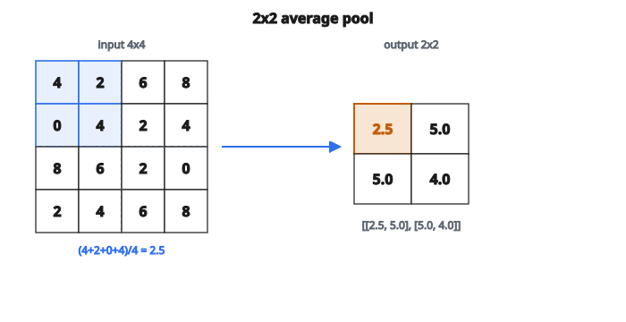

# Average Pooling 2D

## Average pooling là gì?

Average pooling là phép downsampling giảm kích thước không gian bằng cách tính trung bình trong mỗi vùng pooling. Khác với max pooling chọn activation mạnh nhất, average pooling bắt sự có mặt tổng thể của đặc trưng.

## Công thức average pooling

Với pool size $p \times p$ và cửa sổ không chồng:

$$
\text{output}[i][j] = \frac{1}{p^{2}} \sum_{a=0}^{p-1} \sum_{b=0}^{p-1} \text{input}[i \cdot p + a][j \cdot p + b]
$$

Công thức tính trung bình cộng mọi giá trị trong mỗi cửa sổ.

## Ví dụ số

**Input ($4 \times 4$):**

$$
\begin{bmatrix}
4 & 2 & 6 & 8 \\
0 & 4 & 2 & 4 \\
8 & 6 & 2 & 0 \\
2 & 4 & 6 & 8
\end{bmatrix}
$$

**Pool size:** $2 \times 2$

**Cửa sổ trên-trái:** $(4 + 2 + 0 + 4) / 4 = 10/4 = 2.5$

**Cửa sổ trên-phải:** $(6 + 8 + 2 + 4) / 4 = 20/4 = 5.0$

**Cửa sổ dưới-trái:** $(8 + 6 + 2 + 4) / 4 = 20/4 = 5.0$

**Cửa sổ dưới-phải:** $(2 + 0 + 6 + 8) / 4 = 16/4 = 4.0$

**Output ($2 \times 2$):**

$$
\begin{bmatrix}
2.5 & 5.0 \\
5.0 & 4.0
\end{bmatrix}
$$

::: {#fig-160-avgpool-2d fig-cap="Average pool $2 \times 2$: cửa sổ trên-trái $(4+2+0+4)/4 = 2.5$; đầu ra $[[2.5, 5.0],[5.0, 4.0]]$." fig-alt="Lưới 4x4 [[4,2,6,8],[0,4,2,4],[8,6,2,0],[2,4,6,8]]; average pool 2x2 cho đầu ra [[2.5,5.0],[5.0,4.0]]."}
{fig-align="center"}
:::

## Kích thước đầu ra

Giống max pooling:

$$
H_{\text{out}} = \left\lfloor \frac{H}{p} \right\rfloor
$$

$$
W_{\text{out}} = \left\lfloor \frac{W}{p} \right\rfloor
$$

Với đầu vào $6 \times 6$ và pooling $2 \times 2$: đầu ra là $3 \times 3$.

## Average pooling vs max pooling

**Average pooling:**

* Dùng mọi giá trị trong cửa sổ
* Làm mượt feature map
* Nhạy với mọi activation
* Tốt hơn với đặc trưng dày, phân bố

**Max pooling:**

* Chỉ dùng giá trị lớn nhất
* Giữ đặc trưng sắc
* Bất biến với hầu hết activation
* Tốt hơn với đặc trưng thưa, cục bộ

## Khi nào dùng average pooling

**Global average pooling (lớp cuối):**

* Thay lớp fully connected
* Trung bình cả feature map thành một giá trị mỗi channel
* Dùng trong GoogLeNet, ResNet, và các kiến trúc hiện đại
* Giảm mạnh số tham số

**Các lớp trung gian:**

* Ít phổ biến hơn max pooling
* Dùng khi muốn làm mượt
* Một số kiến trúc trộn cả hai loại

**Bài toán dự đoán dày:**

* Segmentation, ước lượng độ sâu
* Nơi mọi vùng đầu vào đều quan trọng
* Có thể giữ nhiều thông tin hơn

## Gradient (lan truyền ngược)

Khi lan truyền ngược, gradient được chia đều:

**Lượt truyền xuôi:**

* Tính trung bình của $p^{2}$ giá trị

**Lượt truyền ngược:**

* Mỗi phần tử đầu vào nhận: (gradient đi vào) / $p^{2}$
* Gradient phân bố đều trên cửa sổ

So với max pooling, nơi chỉ phần tử max nhận gradient, average pooling đưa gradient tới mọi phần tử.

## Global average pooling

Trường hợp đặc biệt khi pool size bằng kích thước không gian:

$$
\text{output}_{c} = \frac{1}{H \times W} \sum_{i=0}^{H-1} \sum_{j=0}^{W-1} \text{input}[i][j][c]
$$

Với đầu vào $H \times W \times C$, đầu ra là $1 \times 1 \times C$ (hoặc một vector độ dài $C$).

**Lợi ích:**

* Không có tham số (khác lớp fully connected)
* Làm việc với mọi kích thước đầu vào
* Giảm overfitting
* Thường theo sau bởi một lớp FC cho phân loại

## Ghi chú cài đặt

**Chỗ chia:**

* Chia cho $p^{2}$ ở cuối (sau khi cộng)
* Hoặc tích lũy trung bình chạy
* Cả hai cho cùng kết quả

**Đầu ra số thực:**

* Khác max pooling, average pooling thường ra số thực
* Dù đầu vào là số nguyên, đầu ra thường là float

**Phần dư:**

* Nếu $H$ không chia hết cho $p$, hàng/cột thừa bị bỏ
* Cùng hành vi cắt như max pooling

## Ví dụ với stride tổng quát

Với stride $s$ tổng quát (không nhất thiết bằng pool size):

$$
\text{output}[i][j] = \frac{1}{p^{2}} \sum_{a=0}^{p-1} \sum_{b=0}^{p-1} \text{input}[i \cdot s + a][j \cdot s + b]
$$

Công thức cho phép cửa sổ chồng ($s < p$) hoặc hở ($s > p$), giống max pooling.

## Average pooling trong kiến trúc hiện đại

**ResNet:**

* Dùng global average pooling trước FC cuối
* Theo sau bởi một classifier 1000 lớp

**EfficientNet:**

* Global average pooling ở cuối
* Theo sau bởi dropout và FC cuối

**MobileNet:**

* Global average pooling
* Thiết kế cho hiệu năng

Xu hướng: ít dùng average pooling trung gian, nhưng global average pooling ở cuối là chuẩn.

## Code
```python
def average_pooling_2d(X, pool_size):
    """
    Apply 2D average pooling with non-overlapping windows.
    """
    H, W = len(X), len(X[0])
    out_h = H // pool_size
    out_w = W // pool_size
    result = []
    for i in range(out_h):
        row = []
        for j in range(out_w):
            total = 0
            for pi in range(pool_size):
                for pj in range(pool_size):
                    total += X[i * pool_size + pi][j * pool_size + pj]
            row.append(total / (pool_size * pool_size))
        result.append(row)
    return result

```

<!-- auto-self-check -->

::: {.callout-note}
## Kiểm tra nhanh
<details>
<summary>Ý chính của bài «Average Pooling 2D» là gì?</summary>
Average pooling là phép downsampling giảm kích thước không gian bằng cách tính trung bình trong mỗi vùng pooling.
</details>
<details>
<summary>Công thức / quan hệ cốt lõi trong bài là gì?</summary>
$$\text{output}[i][j] = \frac{1}{p^{2}} \sum_{a=0}^{p-1} \sum_{b=0}^{p-1} \text{input}[i \cdot p + a][j \cdot p + b]$$
</details>
:::
