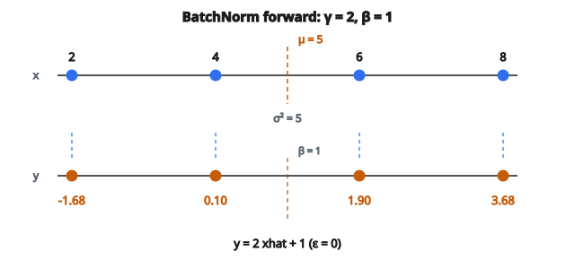

# Batch Normalization (Forward)

## Vấn đề Batch Normalization giải quyết

Huấn luyện mạng neural sâu khó vì phân phối đầu vào của mỗi lớp thay đổi trong lúc học. Khi các lớp trước cập nhật trọng số, thống kê đầu ra của chúng dịch chuyển. Các lớp sau phải liên tục thích nghi với các phân phối đang đổi.

Hiện tượng này gọi là **internal covariate shift**. Nó làm chậm huấn luyện vì:

* Các lớp không thể giả định thống kê đầu vào ổn định
* Gradient dễ vanishing hoặc exploding hơn
* Cần learning rate thấp hơn để giữ ổn định

Batch Normalization (BatchNorm) xử lý việc này bằng cách chuẩn hóa đầu vào lớp về thống kê nhất quán.

## Ý tưởng cốt lõi

Với mỗi mini-batch, chuẩn hóa activation về kỳ vọng không và phương sai đơn vị:

$$
\hat{x} = \frac{x - \mu_B}{\sqrt{\sigma_B^2 + \epsilon}}
$$

với

$$
\begin{aligned}
x &:\ \text{activation đầu vào}, \\
\mu_B &:\ \text{trung bình trên mini-batch}, \\
\sigma_B^2 &:\ \text{phương sai trên mini-batch}, \\
\epsilon &:\ \text{hằng số nhỏ để ổn định số (ví dụ } 10^{-5}\text{)}.
\end{aligned}
$$

Chuẩn hóa này được áp dụng độc lập cho từng đặc trưng/channel.

## Biến đổi BatchNorm đầy đủ

Sau chuẩn hóa, BatchNorm áp dụng scale và shift học được:

$$
y = \gamma \hat{x} + \beta
$$

với

* $\gamma$ (gamma) là tham số scale học được
* $\beta$ (beta) là tham số shift học được
* Cả hai có cùng shape với chiều đặc trưng

**Vì sao cần scale và shift?**

Chuẩn hóa thuần (ép mean $= 0$, phương sai $= 1$) có thể hạn chế những gì lớp biểu diễn được. Tham số học được cho phép mạng hoàn tác chuẩn hóa nếu cần. Nếu $\gamma = \sigma$ và $\beta = \mu$, activation gốc được khôi phục.

## Tính từng bước

**Đầu vào:** Mini-batch activation $x$ với shape (batch_size, features)

**Bước 1: Tính trung bình batch**

$$
\mu_B = \frac{1}{m} \sum_{i=1}^{m} x_i
$$

**Bước 2: Tính phương sai batch**

$$
\sigma_B^2 = \frac{1}{m} \sum_{i=1}^{m} (x_i - \mu_B)^2
$$

**Bước 3: Chuẩn hóa**

$$
\hat{x}_i = \frac{x_i - \mu_B}{\sqrt{\sigma_B^2 + \epsilon}}
$$

**Bước 4: Scale và shift**

$$
y_i = \gamma \hat{x}_i + \beta
$$

## Ví dụ số

**Mini-batch 4 mẫu, 1 đặc trưng:**

$x = [2, 4, 6, 8]$

**Bước 1: Trung bình**

$$
\mu_B = (2 + 4 + 6 + 8) / 4 = 5
$$

**Bước 2: Phương sai**

$$
\begin{aligned}
\sigma_B^2
&= \bigl((2-5)^2 + (4-5)^2 + (6-5)^2 + (8-5)^2\bigr) / 4 \\
&= (9 + 1 + 1 + 9) / 4 = 5
\end{aligned}
$$

**Bước 3: Chuẩn hóa** (với $\epsilon = 0$)

$$
\begin{aligned}
\hat{x}
&= \left[\frac{2-5}{\sqrt{5}},\ \frac{4-5}{\sqrt{5}},\ \frac{6-5}{\sqrt{5}},\ \frac{8-5}{\sqrt{5}}\right] \\
&= [-1.34,\ -0.45,\ 0.45,\ 1.34]
\end{aligned}
$$

**Bước 4: Scale và shift** (với $\gamma = 2$, $\beta = 1$)

$$
\begin{aligned}
y
&= 2 \cdot [-1.34,\ -0.45,\ 0.45,\ 1.34] + 1 \\
&= [-1.68,\ 0.10,\ 1.90,\ 3.68]
\end{aligned}
$$

::: {#fig-32-batchnorm fig-cap="x = [2, 4, 6, 8] có μ = 5, σ² = 5; sau chuẩn hóa rồi y = γ x̂ + β với γ = 2, β = 1 cho y ≈ [−1.68, 0.10, 1.90, 3.68]." fig-alt="Hai trục số: x = [2, 4, 6, 8] với μ = 5, rồi y ≈ [−1.68, 0.10, 1.90, 3.68] sau γ = 2, β = 1."}
{fig-align="center"}
:::

## BatchNorm cho lớp convolution

Với lớp conv có shape (batch, channels, height, width):

* Tính mean và phương sai **theo từng channel** trên batch, height, và width
* $\gamma$ và $\beta$ có shape (channels,)
* Mỗi channel được chuẩn hóa độc lập

Nghĩa là các vị trí không gian trong một channel chia sẻ cùng thống kê chuẩn hóa.

## Huấn luyện và suy luận

**Khi huấn luyện:**

* Dùng thống kê mini-batch ($\mu_B$, $\sigma_B^2$)
* Thống kê đổi từ batch này sang batch khác
* Đồng thời duy trì trung bình trượt cho suy luận

**Khi suy luận:**

* Dùng trung bình trượt tích lũy lúc huấn luyện
* Thống kê cố định, đầu ra xác định
* Running mean: $\mu_{\text{run}} = \alpha \mu_{\text{run}} + (1-\alpha) \mu_B$
* Running variance: exponential moving average tương tự
* $\alpha$ điển hình $= 0.9$ hoặc $0.99$

Đó là lý do phải đặt mô hình ở “eval mode” khi suy luận.

## Lợi ích của Batch Normalization

**1. Huấn luyện nhanh hơn**

* Cho phép learning rate cao hơn
* Giảm độ nhạy với khởi tạo
* Hội tụ sau ít vòng lặp hơn

**2. Hiệu ứng regularization**

* Thống kê batch thêm nhiễu (chuẩn hóa của mỗi mẫu phụ thuộc các mẫu khác trong batch)
* Đóng vai trò regularization nhẹ, có thể giảm nhu cầu dropout

**3. Giảm vanishing/exploding gradients**

* Giữ activation trong khoảng hợp lý
* Gradient chảy ổn định hơn xuyên các lớp

**4. Ít nhạy với hyperparameter**

* Mạng dung thứ learning rate và khởi tạo không tối ưu hơn

## Hạn chế

**1. Phụ thuộc batch size**

* Batch nhỏ cho thống kê nhiễu
* Hiệu năng giảm khi batch size $< 16$
* Không phù hợp batch size $= 1$

**2. Hành vi khác nhau train/test**

* Phải theo dõi thống kê trượt
* Dễ lỗi nếu không đặt đúng mode

**3. Không lý tưởng cho RNN**

* Độ dài chuỗi thay đổi
* Thống kê batch theo time step có vấn đề
* Layer Normalization thường được ưa hơn cho RNN

## Các lựa chọn thay BatchNorm

**Layer Normalization:**
Chuẩn hóa trên đặc trưng, không trên batch. Dùng được với batch size $= 1$. Ưa dùng cho Transformer và RNN.

**Instance Normalization:**
Chuẩn hóa từng mẫu độc lập (trên chiều không gian). Dùng trong style transfer.

**Group Normalization:**
Chuẩn hóa trên nhóm channel. Thỏa hiệp giữa Layer và Instance norm.

**Weight Normalization:**
Chuẩn hóa trọng số thay vì activation.

## Đặt BatchNorm ở đâu

**Vị trí phổ biến:** Sau lớp linear/conv, trước activation

Conv → BatchNorm → ReLU

**Thay thế:** Sau activation

Conv → ReLU → BatchNorm

Cả hai đều dùng được; cách thứ nhất phổ biến hơn. Một số kiến trúc gần đây bỏ hẳn BatchNorm (dùng kỹ thuật khác).

## Tham số học được

Với lớp có $C$ đặc trưng/channel:

* $\gamma$: $C$ tham số (khởi tạo bằng 1)
* $\beta$: $C$ tham số (khởi tạo bằng 0)

Tổng: $2C$ tham số học được mỗi lớp BatchNorm.

Không học (chỉ theo dõi):

* Running mean: $C$ giá trị
* Running variance: $C$ giá trị

## Gradient qua BatchNorm

Lan truyền ngược qua BatchNorm phức tạp hơn lớp thường vì mỗi đầu ra phụ thuộc mọi đầu vào trong batch (qua $\mu_B$ và $\sigma_B^2$).

Các gradient:

$$
\frac{\partial L}{\partial \gamma} = \sum_i \frac{\partial L}{\partial y_i} \hat{x}_i
$$

$$
\frac{\partial L}{\partial \beta} = \sum_i \frac{\partial L}{\partial y_i}
$$

Gradient theo đầu vào đi qua quy tắc chuỗi xuyên thống kê chuẩn hóa.

## Code
```python
import numpy as np

def batch_norm_forward(x, gamma, beta, eps=1e-5):
    """
    Forward-only BatchNorm for (N,D) or (N,C,H,W).
    """
    x = np.asarray(x, dtype=float)
    gamma = np.asarray(gamma, dtype=float)
    beta = np.asarray(beta, dtype=float)
    if x.ndim == 2:
        m = x.mean(axis=0, keepdims=True)
        v = x.var(axis=0, keepdims=True)
        xhat = (x - m) / np.sqrt(v + eps)
        return xhat * gamma[None, :] + beta[None, :]
    elif x.ndim == 4:
        m = x.mean(axis=(0,2,3), keepdims=True)
        v = x.var(axis=(0,2,3), keepdims=True)
        xhat = (x - m) / np.sqrt(v + eps)
        return xhat * gamma[None, :, None, None] + beta[None, :, None, None]
    else:
        raise ValueError("x must be (N,D) or (N,C,H,W)")

```

<!-- auto-self-check -->

::: {.callout-note}
## Kiểm tra nhanh
<details>
<summary>Ý chính của bài «Batch Normalization (Forward)» là gì?</summary>
Huấn luyện mạng neural sâu khó vì phân phối đầu vào của mỗi lớp thay đổi trong lúc học.
</details>
<details>
<summary>Công thức / quan hệ cốt lõi trong bài là gì?</summary>
$$\hat{x} = \frac{x - \mu_B}{\sqrt{\sigma_B^2 + \epsilon}}$$
</details>
:::
