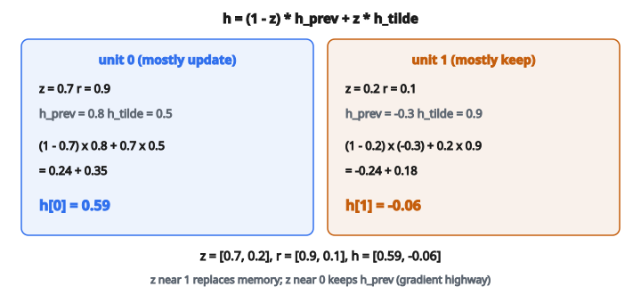

# Mini GRU Cell (forward)

## Vấn đề của vanilla RNN

Vanilla RNN xử lý sequence bằng cách duy trì hidden state được cập nhật tại mỗi time step:

$$
h_t = \tanh(W_{xh} x_t + W_{hh} h_{t-1} + b)
$$

Bước cập nhật đơn giản này có lỗi then chốt: **vanishing gradient**. Khi lan truyền ngược qua nhiều time step, gradient co theo cấp số nhân vì đi qua đạo hàm tanh (giá trị tối đa $1$) nhiều lần. Sau $50$–$100$ bước, gradient về bản chất bằng không, mạng không học được phụ thuộc tầm xa.

GRU (Gated Recurrent Unit) khắc phục bằng cách đưa vào **gate** kiểm soát luồng thông tin.

## Ý tưởng cốt lõi: gating

Gate là một vector giá trị trong $(0, 1)$ (do sigmoid tạo ra). Khi nhân một tín hiệu với gate:

* Gate gần $0$: chặn tín hiệu (nhân với $\approx 0$)
* Gate gần $1$: cho tín hiệu đi qua (nhân với $\approx 1$)
* Gate bằng $0.5$: cho đi một nửa tín hiệu

Gate giúp mạng học **khi nào** cập nhật bộ nhớ và **khi nào** giữ nguyên. Điều này tạo lối tắt để gradient chảy ngược mà không bị co.

## Tổng quan kiến trúc GRU

GRU có hai gate:

1. **Update gate** ($z_t$): quyết định giữ bao nhiêu hidden state cũ so với thay bằng thông tin mới
2. **Reset gate** ($r_t$): quyết định dùng bao nhiêu hidden state cũ khi tính candidate mới

Và một giá trị trung gian:

3. **Candidate hidden state** ($\tilde{h}_t$): hidden state mới được đề xuất, tính với reset gate

Hidden state cuối là pha trộn giữa state cũ và candidate, do update gate điều khiển.

## Tính từng bước

**Đầu vào tại time step $t$:**

* $x_t$: vector đầu vào (shape: `input_size`)
* $h_{t-1}$: hidden state trước (shape: `hidden_size`)

**Bước 1: tính update gate**

$$
z_t = \sigma(W_z x_t + U_z h_{t-1} + b_z)
$$

* $W_z$: ma trận trọng số cho đầu vào (shape: `hidden_size` $\times$ `input_size`)
* $U_z$: ma trận trọng số cho hidden state (shape: `hidden_size` $\times$ `hidden_size`)
* $b_z$: vector bias (shape: `hidden_size`)
* $\sigma$: hàm sigmoid, đầu ra trong $(0, 1)$

Update gate quyết định: “Tôi nên cập nhật hidden state bằng thông tin mới đến mức nào?”

**Bước 2: tính reset gate**

$$
r_t = \sigma(W_r x_t + U_r h_{t-1} + b_r)
$$

Cùng cấu trúc với update gate, nhưng tham số học được khác.

Reset gate quyết định: “Tôi nên xét bao nhiêu hidden state trước khi tính candidate mới?”

**Bước 3: tính candidate hidden state**

$$
\tilde{h}_t = \tanh\bigl(W_h x_t + U_h (r_t \odot h_{t-1}) + b_h\bigr)
$$

* $\odot$ là nhân từng phần tử
* $r_t \odot h_{t-1}$: reset gate lọc hidden state trước

Khi $r_t$ gần $0$, hidden state trước bị bỏ qua, candidate chủ yếu tính từ đầu vào hiện tại. Khi $r_t$ gần $1$, toàn bộ hidden state trước được dùng.

**Bước 4: tính hidden state cuối**

$$
h_t = (1 - z_t) \odot h_{t-1} + z_t \odot \tilde{h}_t
$$

Đây là **nội suy tuyến tính** giữa hidden state cũ và candidate:

* Khi $z_t$ gần $0$: $h_t \approx h_{t-1}$ (giữ state cũ)
* Khi $z_t$ gần $1$: $h_t \approx \tilde{h}_t$ (dùng candidate mới)
* Giá trị ở giữa: pha trộn cũ và mới

## Vì sao hết vanishing gradient

Chìa khóa là phương trình cập nhật:

$$
h_t = (1 - z_t) \odot h_{t-1} + z_t \odot \tilde{h}_t
$$

Khi $z_t$ gần $0$, ta có $h_t \approx h_{t-1}$. Gradient chảy thẳng từ $h_t$ về $h_{t-1}$ với hệ số gần $1$. Không tanh, không co.

Mạng có thể học giữ $z_t$ nhỏ tại các time step không có gì quan trọng, tạo “gradient highway” để thông tin chảy ngược qua nhiều bước mà không biến mất.

## Ví dụ số

Giả sử:

* Input size: $3$
* Hidden size: $2$
* $x_t = [1.0,\, 0.5,\, -0.5]$
* $h_{t-1} = [0.8,\, -0.3]$

Sau khi tính với trọng số đã học:

**Update gate:** $z_t = [0.7,\, 0.2]$

* Đơn vị hidden thứ nhất chủ yếu cập nhật ($0.7$)
* Đơn vị hidden thứ hai chủ yếu giữ giá trị cũ ($0.2$)

**Reset gate:** $r_t = [0.9,\, 0.1]$

* Đơn vị thứ nhất dùng gần như toàn bộ hidden state trước
* Đơn vị thứ hai bỏ qua gần như toàn bộ hidden state trước

**Candidate:** $\tilde{h}_t = [0.5,\, 0.9]$

**Hidden state cuối:**

* $h_t[0] = (1 - 0.7) \times 0.8 + 0.7 \times 0.5 = 0.24 + 0.35 = 0.59$
* $h_t[1] = (1 - 0.2) \times (-0.3) + 0.2 \times 0.9 = -0.24 + 0.18 = -0.06$

Kết quả: $h_t = [0.59,\, -0.06]$

::: {#fig-19-gru-gates fig-cap="Với z = [0.7, 0.2] và r = [0.9, 0.1], nội suy h = (1 − z) ⊙ h_{t−1} + z ⊙ h̃ cho h_t = [0.59, −0.06]." fig-alt="Hai đơn vị GRU: z = [0.7, 0.2], r = [0.9, 0.1]; nội suy cho h = [0.59, -0.06] từ h_prev = [0.8, -0.3] và candidate = [0.5, 0.9]."}
{fig-align="center"}
:::

## GRU vs. LSTM

Cả GRU và LSTM đều giải vanishing gradient bằng gating. Khác biệt:

**LSTM:**

* Ba gate: input, forget, output
* Cell state và hidden state tách riêng
* Nhiều tham số hơn
* Hơi giàu biểu diễn hơn

**GRU:**

* Hai gate: update, reset
* Một hidden state (không có cell state riêng)
* Ít tham số hơn (khoảng $2/3$ LSTM)
* Thường cho hiệu năng tương đương LSTM
* Huấn luyện nhanh hơn vì ít phép tính hơn

GRU có thể xem như LSTM rút gọn: gộp cell state với hidden state, và gộp input gate với forget gate thành một update gate.

## Shape tham số

Với GRU có input size $d$ và hidden size $h$:

**Ma trận trọng số (tổng $6$):**

* $W_z, W_r, W_h$: mỗi cái shape $(h, d)$
* $U_z, U_r, U_h$: mỗi cái shape $(h, h)$

**Vector bias (tổng $3$):**

* $b_z, b_r, b_h$: mỗi cái shape $(h,)$

**Tổng tham số:** $3 \times (h \times d) + 3 \times (h \times h) + 3 \times h = 3h(d + h + 1)$

## Ghi chú triển khai

**Trọng số concatenate:** nhiều triển khai ghép $W$ và $U$ thành một ma trận, ghép $x_t$ và $h_{t-1}$ thành một vector. Như vậy một phép nhân ma trận thay vì hai:

$$
[z_t;\, r_t] = \sigma([W_z;\, W_r] \cdot [x_t;\, h_{t-1}] + [b_z;\, b_r])
$$

**Xử lý theo batch:** trong thực tế đầu vào được batched, nên $x_t$ có shape $(\text{batch\_size},\, \text{input\_size})$ và mọi phép toán được vector hóa theo chiều batch.

**Bidirectional GRU:** chạy sequence theo cả hai hướng rồi concatenate hidden state, bắt cả ngữ cảnh quá khứ và tương lai.

## Code
```python
import numpy as np

def gru_cell_forward(x, h_prev, params):
    """
    Implement the GRU forward pass for one time step.
    Supports shapes (D,) & (H,) or (N,D) & (N,H).
    """
    Wz, Uz, bz = params["Wz"], params["Uz"], params["bz"]
    Wr, Ur, br = params["Wr"], params["Ur"], params["br"]
    Wh, Uh, bh = params["Wh"], params["Uh"], params["bh"]
    x = np.asarray(x, dtype=float)
    h_prev = np.asarray(h_prev, dtype=float)
    D, H = Wz.shape
    single = (x.ndim == 1)
    if single:
        x = x.reshape(1, D)
        h_prev = h_prev.reshape(1, H)
    sigmoid = lambda a: np.where(a >= 0, 1/(1+np.exp(-a)), np.exp(a)/(1+np.exp(a)))
    z = sigmoid(x @ Wz + h_prev @ Uz + bz)
    r = sigmoid(x @ Wr + h_prev @ Ur + br)
    h_tilde = np.tanh(x @ Wh + (r * h_prev) @ Uh + bh)
    h = (1.0 - z) * h_prev + z * h_tilde
    if single:
        return h.reshape(H)
    return h

```

<!-- CROSSLINK_GRU -->

::: {.callout-tip}
## Học tiếp
GRU đầy đủ (encoder–decoder): [Architecture Models — GRU](../../architecture-models/GRU/index.qmd).
:::

<!-- auto-self-check -->

::: {.callout-note}
## Kiểm tra nhanh
<details>
<summary>Ý chính của bài «Mini GRU Cell (forward)» là gì?</summary>
Vanilla RNN xử lý sequence bằng cách duy trì hidden state được cập nhật tại mỗi time step: Bước cập nhật đơn giản này có lỗi then chốt: **vanishing gradient**.
</details>
<details>
<summary>Công thức / quan hệ cốt lõi trong bài là gì?</summary>
$$h_t = \tanh(W_{xh} x_t + W_{hh} h_{t-1} + b)$$
</details>
:::
