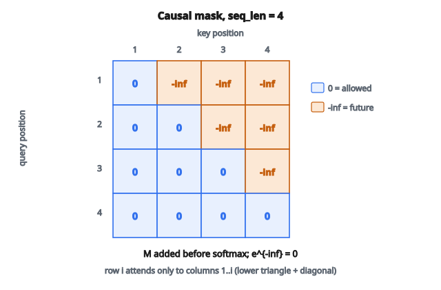

# Causal Masking cho Attention

## Vì sao cần causal masking

Trong language modeling, mục tiêu là dự đoán token tiếp theo khi đã biết mọi token trước đó. Tại vị trí $t$, mô hình chỉ được thấy token $1, 2, \ldots, t-1$ khi dự đoán token $t$.

Nhưng Transformer xử lý mọi vị trí song song. Nếu không can thiệp, self-attention cho phép mỗi vị trí attend tới mọi vị trí khác, kể cả token tương lai. Đó là **information leakage** và sẽ làm bài toán tầm thường lúc huấn luyện (chỉ việc chép đáp án).

**Causal masking** ngăn việc này bằng cách chặn attention tới vị trí tương lai.

## Cơ chế attention

Self-attention chuẩn tính:

$$
\text{Attention}(Q, K, V) = \mathrm{softmax}\left(\frac{QK^{T}}{\sqrt{d_k}}\right) V
$$

với

* $Q$ (query), $K$ (key), $V$ (value) là ma trận shape $(\text{sequence\_length},\, d_k)$
* $QK^{T}$ cho ma trận điểm attention shape $(\text{sequence\_length},\, \text{sequence\_length})$
* Mỗi hàng $i$ chứa điểm cho biết vị trí $i$ attend tới từng vị trí như thế nào

Không có mask, vị trí $3$ có thể attend tới vị trí $1, 2, 3, 4, 5, \ldots$ (mọi vị trí).

## Causal mask

Causal mask là ma trận tam giác trên gồm âm vô cùng (hoặc số âm rất lớn):

$$
M = \begin{bmatrix}
0 & -\infty & -\infty & -\infty \\
0 & 0 & -\infty & -\infty \\
0 & 0 & 0 & -\infty \\
0 & 0 & 0 & 0
\end{bmatrix}
$$

Mask được cộng vào điểm attention trước softmax:

$$
\text{Attention} = \mathrm{softmax}\left(\frac{QK^{T}}{\sqrt{d_k}} + M\right) V
$$

## Mask hoạt động thế nào

Khi cộng $-\infty$ vào một điểm attention rồi áp softmax:

$$
\mathrm{softmax}([2.0,\, 1.5,\, -\infty,\, -\infty]) = [0.62,\, 0.38,\, 0,\, 0]
$$

Các giá trị $-\infty$ thành đúng $0$ sau softmax vì $e^{-\infty} = 0$.

**Hiệu ứng:** vị trí $i$ chỉ attend được tới vị trí $1, 2, \ldots, i$. Vị trí tương lai ($i+1, i+2, \ldots$) nhận trọng số attention bằng không.

## Hình dung mask

Với sequence độ dài $4$, mẫu attention sau khi mask:

**Vị trí 1:** attend được $[1]$

**Vị trí 2:** attend được $[1, 2]$

**Vị trí 3:** attend được $[1, 2, 3]$

**Vị trí 4:** attend được $[1, 2, 3, 4]$

Ma trận attention trông như tam giác dưới:

$$
\begin{bmatrix}
\checkmark & \times & \times & \times \\
\checkmark & \checkmark & \times & \times \\
\checkmark & \checkmark & \checkmark & \times \\
\checkmark & \checkmark & \checkmark & \checkmark
\end{bmatrix}
$$

::: {#fig-20-causal-mask fig-cap="Causal mask 4×4: upper triangle là −∞, đường chéo và lower triangle là 0 — vị trí i chỉ thấy 1…i." fig-alt="Ma trận causal mask 4×4: tam giác trên là -inf, đường chéo và tam giác dưới là 0; hàng i chỉ attend cột 1 đến i."}
{fig-align="center"}
:::

## Xây mask

**Bước 1:** tạo ma trận toàn $1$ shape $(\text{seq\_len},\, \text{seq\_len})$

**Bước 2:** lấy phần tam giác trên (loại đường chéo)

**Bước 3:** thay $1$ bằng $-\infty$ (hoặc số âm lớn như $-10^{9}$)

**Bước 4:** thay $0$ bằng $0$ (hoặc giữ nguyên)

Cách khác: tạo ma trận tam giác dưới toàn $1$ (vị trí hợp lệ) rồi chuyển vị trí không hợp lệ thành $-\infty$.

**Ví dụ với $\text{seq\_len} = 4$:**

Tam giác trên (phần cần mask):

$$
\begin{bmatrix}
0 & 1 & 1 & 1 \\
0 & 0 & 1 & 1 \\
0 & 0 & 0 & 1 \\
0 & 0 & 0 & 0
\end{bmatrix}
$$

Nhân với $-\infty$:

$$
\begin{bmatrix}
0 & -\infty & -\infty & -\infty \\
0 & 0 & -\infty & -\infty \\
0 & 0 & 0 & -\infty \\
0 & 0 & 0 & 0
\end{bmatrix}
$$

## Causal vs. bidirectional attention

**Causal (autoregressive):**

* Mỗi vị trí chỉ thấy quá khứ và vị trí hiện tại
* Dùng trong: GPT, language modeling, sinh văn bản
* Mô hình sinh từng token một, trái sang phải

**Bidirectional:**

* Mỗi vị trí thấy mọi vị trí
* Dùng trong: BERT, masked language modeling, phân loại
* Mô hình xử lý cả sequence cùng lúc

**Encoder–decoder:**

* Encoder dùng bidirectional attention (thấy toàn bộ đầu vào)
* Decoder dùng causal attention (sinh đầu ra trái sang phải)
* Cross-attention từ decoder sang encoder không bị causal mask

## Vì sao không xử lý tuần tự?

RNN xử lý sequence từng bước, tự nhiên ngăn rò thông tin tương lai. Vì sao lại xử lý song song rồi mask?

**Hiệu năng:** Transformer xử lý mọi vị trí song song lúc huấn luyện. Cách này nhanh hơn nhiều trên GPU so với xử lý tuần tự.

**Training vs. inference:** lúc huấn luyện ta đã biết mọi token và tính loss tại mọi vị trí cùng lúc. Lúc inference vẫn sinh từng token một, nhưng huấn luyện thì được song song hóa.

## Chi tiết triển khai

**Dùng $-\infty$ vs. số âm lớn:**

$-\infty$ thật có thể gây NaN trên một số framework. Dùng $-10^{9}$ hoặc $-10^{4}$ gần như tương đương (softmax của $-10^{9}$ về bản chất là $0$) và ổn định số hơn.

**Broadcasting:**

Mask có shape $(\text{seq\_len},\, \text{seq\_len})$ nhưng điểm attention có shape $(\text{batch},\, \text{heads},\, \text{seq\_len},\, \text{seq\_len})$. Mask được broadcast theo chiều batch và head.

**Caching:**

Causal mask chỉ phụ thuộc độ dài sequence, không phụ thuộc nội dung. Có thể tính trước và tái sử dụng.

**Sequence độ dài khác nhau:**

Khi xử lý batch với độ dài sequence khác nhau, kết hợp causal mask với padding mask để cũng bỏ qua token padding.

## Causal masking trong multi-head attention

Cùng một causal mask được áp cho mọi attention head. Mỗi head học mẫu attention khác nhau, nhưng tất cả đều bị ràng buộc là causal.

$$
\text{head}_i = \text{Attention}(QW_i^{Q},\, KW_i^{K},\, VW_i^{V},\, \text{mask})
$$

Tham số mask giống nhau cho mọi head.

## Ứng dụng ngoài language modeling

**Time series forecasting:** dự đoán giá trị tương lai từ giá trị quá khứ. Điểm dữ liệu tương lai phải bị mask.

**Audio generation:** WaveNet và các mô hình tương tự sinh mẫu âm thanh một cách causal.

**Video prediction:** sinh frame tương lai từ frame quá khứ.

**Mọi bài toán autoregressive:** bất cứ nơi nào đầu ra tại bước $t$ chỉ được phụ thuộc đầu vào đến bước $t$.

## Code
```python
import numpy as np

def apply_causal_mask(scores, mask_value=-1e9):
    """
    scores: np.ndarray with shape (..., T, T)
    mask_value: float used to mask future positions (e.g., -1e9)
    Return: masked scores (same shape, dtype=float)
    """
    s = np.asarray(scores, dtype=float)
    T = s.shape[-1]
    upper = np.triu(np.ones((T, T), dtype=bool), k=1)
    out = s.copy()
    out[..., upper] = mask_value
    return out

```

<!-- CROSSLINK_CAUSAL -->

::: {.callout-tip}
## Học tiếp
Attention trong Transformer: [Multi-Head Attention](../../architecture-models/Transformer/multi-head.qmd) · [Encoder block](../../architecture-models/Transformer/encoder-block.qmd). Inference LLM: [Lesson 9](../../ai-optimize/lesson-09-llm-inference-systems.qmd).
:::

<!-- auto-self-check -->

::: {.callout-note}
## Kiểm tra nhanh
<details>
<summary>Ý chính của bài «Causal Masking cho Attention» là gì?</summary>
Trong language modeling, mục tiêu là dự đoán token tiếp theo khi đã biết mọi token trước đó.
</details>
<details>
<summary>Công thức / quan hệ cốt lõi trong bài là gì?</summary>
$$\text{Attention}(Q, K, V) = \mathrm{softmax}\left(\frac{QK^{T}}{\sqrt{d_k}}\right) V$$
</details>
:::
