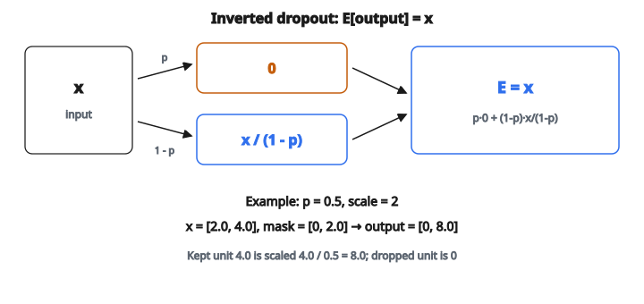

# Dropout (chế độ huấn luyện)

## Vấn đề overfitting

Một mạng neural với hàng triệu tham số có thể nhớ dữ liệu huấn luyện thay vì học pattern tổng quát. Nó đạt độ chính xác gần hoàn hảo trên mẫu huấn luyện nhưng kém trên dữ liệu mới, chưa thấy. Đó là **overfitting**.

Dấu hiệu overfitting:

* Training loss tiếp tục giảm, nhưng validation loss bắt đầu tăng
* Mô hình học nhiễu và đặc thù riêng của tập huấn luyện
* Hiệu năng giảm trên đầu vào thực tế

Có nhiều kỹ thuật chống overfitting (weight decay, data augmentation, early stopping), nhưng dropout là một trong những kỹ thuật hiệu quả và được dùng rộng rãi nhất.

## Dropout làm gì

Ở mỗi bước huấn luyện, dropout **đặt ngẫu nhiên một phần neuron về không**. Mỗi neuron có xác suất $p$ bị “drop” (gán 0) và xác suất $1 - p$ được “keep”.

Ví dụ, với $p = 0.5$ và một lớp 4 neuron giá trị $[3.0, 1.0, 4.0, 2.0]$, một kết quả có thể là:

* Neuron 1: keep
* Neuron 2: **drop** (gán 0)
* Neuron 3: keep
* Neuron 4: **drop** (gán 0)

Kết quả trước khi scale: $[3.0, 0.0, 4.0, 0.0]$

Neuron bị drop được chọn ngẫu nhiên và độc lập. Mỗi bước huấn luyện dùng một **pattern ngẫu nhiên khác**. Mạng không bao giờ biết neuron nào còn sẵn, nên không thể dựa vào một neuron đơn lẻ hay một tổ hợp neuron cố định.

## Vì sao drop ngẫu nhiên giúp

Trực giác chính: dropout ngăn **co-adaptation**.

Không có dropout, neuron có thể phát triển phụ thuộc phức tạp lẫn nhau. Neuron A có thể học cách dựa vào neuron B luôn có mặt để sửa lỗi của A. Nếu B luôn có mặt lúc huấn luyện, chiến lược này chạy trên tập huấn luyện. Nhưng nó làm mạng mong manh. Một nhiễu nhỏ có thể phá sự phối hợp mong manh đó.

Với dropout, neuron A không thể tính rằng B sẽ có mặt. Ở một số bước huấn luyện B có mặt, ở bước khác thì không. Vì vậy A phải học cách hữu ích **tự thân**. Mọi neuron bị buộc học đặc trưng có giá trị độc lập.

Điều này dẫn đến vài hiệu ứng:

* **Giảm overfitting**: mạng không thể nhớ các pattern cụ thể phụ thuộc vào việc mọi neuron cùng hoạt động
* **Ensemble ẩn**: mỗi bước huấn luyện huấn luyện một mạng con hơi khác (một tập con ngẫu nhiên các neuron). Mô hình cuối giống trung bình của mọi mạng con đó, tương tự ensemble nhiều mô hình nhỏ hơn
* **Độ bền**: mạng học cách hoạt động ngay cả khi thiếu một phần, nên chịu nhiễu tốt hơn

## Vấn đề scale

Có một điểm cần xử lý. Nếu ngẫu nhiên đưa về không một tỷ lệ $p$ các neuron, kỳ vọng tổng đầu ra của lớp giảm theo hệ số $(1 - p)$.

Không dropout, kỳ vọng đầu ra của neuron giá trị $x_i$ đúng bằng $x_i$.

Với dropout rate $p$, kỳ vọng đầu ra là:

$$
\mathbb{E}[\text{output}_i] = (1 - p) \cdot x_i + p \cdot 0 = (1 - p) \cdot x_i
$$

Kỳ vọng giờ nhỏ hơn hệ số $(1 - p)$. Điều này quan trọng vì lớp tiếp theo kỳ vọng đầu vào ở một độ lớn nhất định. Nếu độ lớn kỳ vọng đổi giữa huấn luyện (có dropout) và suy luận (không dropout), hành vi mạng sẽ không nhất quán.

## Inverted dropout: cách sửa

Cách sửa là **scale lên các neuron sống sót** lúc huấn luyện để bù các neuron bị drop. Mỗi neuron được keep nhân với $\frac{1}{1-p}$:

$$
\text{output}_i = \begin{cases} 0 & \text{nếu xác suất } p \\ x_i \cdot \frac{1}{1-p} & \text{nếu xác suất } (1-p) \end{cases}
$$

Kiểm tra kỳ vọng:

$$
\mathbb{E}[\text{output}_i] = p \cdot 0 + (1-p) \cdot x_i \cdot \frac{1}{1-p} = x_i
$$

Kỳ vọng đúng bằng $x_i$, giống như không có dropout. Đây gọi là **inverted dropout**, và là cách cài chuẩn trong thực tế (PyTorch, TensorFlow, v.v.).

Cách kia (standard dropout) không scale lúc huấn luyện mà nhân mọi đầu ra với $(1 - p)$ lúc suy luận. Inverted dropout được ưa hơn vì suy luận đơn giản: lúc test chỉ dùng mọi neuron, không chỉnh gì thêm.

::: {#fig-8-dropout-inverted fig-cap="Inverted dropout: drop về 0, keep nhân 1/(1−p); kỳ vọng E[output] = x. Với p = 0.5, mask [0, 2] đưa [2.0, 4.0] thành [0, 8.0]." fig-alt="Inverted dropout: drop về 0 với xác suất p, keep x/(1−p) với xác suất 1−p; kỳ vọng bằng x. Ví dụ p = 0.5, [2, 4] thành [0, 8]."}
{fig-align="center"}
:::

## Mask dropout

Tính ngẫu nhiên của dropout được nắm bởi một **mask** (còn gọi là dropout pattern). Mask là mảng cùng shape với đầu vào:

* $0$ tại neuron bị drop
* $\frac{1}{1-p}$ tại neuron được keep

Đầu ra đơn giản là: $\text{output} = x \cdot \text{mask}$ (nhân từng phần tử).

Với $p = 0.5$ và đầu vào $[2.0, 4.0]$, một mask có thể là $[0, 2.0]$, cho đầu ra $[0, 8.0]$. Mask khác có thể là $[2.0, 0]$, cho $[4.0, 0]$.

Trả mask kèm đầu ra hữu ích vì:

* Khi **lan truyền ngược**, cùng mask được áp cho gradient (neuron bị drop nhận gradient 0)
* Giúp phép tính tái lập khi dùng bộ sinh ngẫu nhiên có seed

## Huấn luyện và suy luận

Đây là khác biệt then chốt:

**Khi huấn luyện:**

* Sinh mask ngẫu nhiên mỗi lượt xuôi
* Đưa neuron bị drop về không
* Scale neuron được keep với $\frac{1}{1-p}$

**Khi suy luận** (với inverted dropout):

* Dùng mọi neuron
* Không cần scale
* Không có ngẫu nhiên

Mạng dùng hết dung lượng lúc test. Vì việc scale lúc huấn luyện đã bù các neuron thiếu, không cần chỉnh lúc suy luận.

## Chọn dropout rate

Dropout rate $p$ kiểm soát mức regularization:

* $p = 0$: Không dropout. Mọi neuron luôn hoạt động. Không có hiệu ứng regularization.
* $p = 0.1$ đến $0.2$: Dropout nhẹ. Phổ biến cho lớp đầu vào hoặc khi có nhiều dữ liệu huấn luyện.
* $p = 0.5$: Mặc định phổ biến nhất cho lớp ẩn. Mỗi neuron bị drop một nửa thời gian. Đây là giá trị dùng trong bài báo dropout gốc (Srivastava et al., 2014).
* $p = 0.8$ hoặc cao hơn: Rất mạnh. Chỉ 20% neuron sống sót mỗi bước. Dùng khi overfitting nặng hoặc mô hình rất lớn.
* $p \geq 1.0$: Không hợp lệ. Sẽ drop mọi neuron, cho ra toàn không.

Các lớp khác nhau có thể dùng dropout rate khác nhau. Pattern phổ biến là dropout nhẹ (hoặc không) ở lớp đầu vào và dropout mạnh hơn ở các lớp ẩn lớn.

## Dropout xuất hiện ở đâu

* **Lớp fully connected**: trường hợp gốc và phổ biến nhất. Thực hành chuẩn trong gần như mọi MLP.
* **Mạng convolution**: spatial dropout drop cả feature map thay vì từng pixel, vì pixel lân cận tương quan cao và drop từng pixel kém hiệu quả hơn.
* **Transformer**: dropout được áp sau attention weight và sau các lớp feed-forward. GPT, BERT, và hầu hết large language model dùng dropout lúc huấn luyện.
* **Mạng hồi tiếp**: dropout được áp cho đầu vào và đầu ra của lớp RNN (nhưng thường không cho kết nối hồi tiếp; ở đó dùng kỹ thuật gọi là variational dropout).
* **Fine-tuning**: tăng dropout khi fine-tune mô hình pretrained trên tập nhỏ là chiến lược phổ biến để tránh overfitting dữ liệu mới.

## Code
```python
import numpy as np

def dropout(x, p=0.5, rng=None):
    """
    Apply dropout to input x with probability p.
    Return (output, dropout_pattern).
    """
    x = np.asarray(x, float)
    rng = rng if isinstance(rng, np.random.Generator) else np.random.default_rng(0)
    keep = 1.0 - p
    mask = (rng.random(x.shape) < keep).astype(float) / keep
    return x * mask, mask

```

<!-- CROSSLINK_DROPOUT -->

::: {.callout-tip}
## Học tiếp
Dropout trên FC của AlexNet: [AlexNet — Dropout](../../architecture-models/AlexNet/dropout.qmd).
:::

<!-- auto-self-check -->

::: {.callout-note}
## Kiểm tra nhanh
<details>
<summary>Ý chính của bài «Dropout (chế độ huấn luyện)» là gì?</summary>
Một mạng neural với hàng triệu tham số có thể nhớ dữ liệu huấn luyện thay vì học pattern tổng quát.
</details>
<details>
<summary>Công thức / quan hệ cốt lõi trong bài là gì?</summary>
$$\mathbb{E}[\text{output}_i] = (1 - p) \cdot x_i + p \cdot 0 = (1 - p) \cdot x_i$$
</details>
:::
