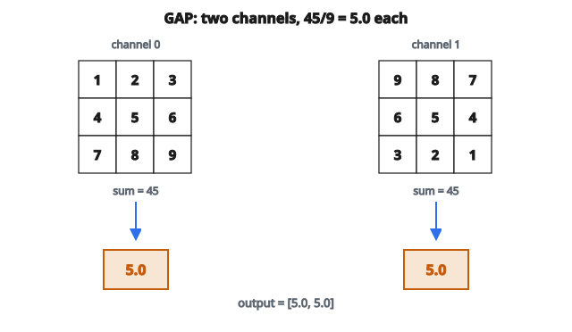

# Global Average Pooling

## Global average pooling làm gì

**Global Average Pooling** (GAP) lấy một feature map và tính trung bình mọi vị trí không gian trên từng channel. Nó gộp các chiều không gian (height và width) thành một giá trị mỗi channel.

**Input:** Feature map shape $(C, H, W)$ (layout NCHW)

**Output:** Vector shape $(C,)$

Mỗi giá trị đầu ra là trung bình mọi pixel trên feature map của channel đó.

## Công thức

Với feature map $F$ shape $(C, H, W)$:

$$
\text{GAP}(F)_{c} = \frac{1}{H \times W} \sum_{i=1}^{H} \sum_{j=1}^{W} F_{c,i,j}
$$

Mỗi channel $c$ cho một giá trị đầu ra: trung bình của $H \times W$ vị trí không gian.

## Ví dụ số

**Feature map đầu vào:** Shape $(2, 3, 3)$ - 2 channel, không gian $3 \times 3$

Channel 0:

$$
\begin{bmatrix}
1 & 2 & 3 \\
4 & 5 & 6 \\
7 & 8 & 9
\end{bmatrix}
$$

Channel 1:

$$
\begin{bmatrix}
9 & 8 & 7 \\
6 & 5 & 4 \\
3 & 2 & 1
\end{bmatrix}
$$

**Global Average Pooling:**

Channel 0: $(1+2+3+4+5+6+7+8+9) / 9 = 45 / 9 = 5.0$

Channel 1: $(9+8+7+6+5+4+3+2+1) / 9 = 45 / 9 = 5.0$

**Output:** $[5.0, 5.0]$

::: {#fig-21-gap fig-cap="GAP trên 2 channel $3 \times 3$: $45/9 = 5.0$ mỗi channel, đầu ra $[5.0, 5.0]$." fig-alt="Hai feature map 3x3: channel 0 gồm 1..9 và channel 1 gồm 9..1; mỗi channel có tổng 45, chia 9 bằng 5.0; vector đầu ra [5.0, 5.0]."}
{fig-align="center"}
:::

## Vì sao dùng global average pooling?

**1. Gộp hết chiều không gian**

Đổi mọi kích thước không gian thành vector độ dài cố định. Feature map $7 \times 7$ và $14 \times 14$ đều thành một vector mỗi channel.

**2. Không có tham số học**

Khác lớp fully connected, GAP không có trọng số để huấn luyện. Điều này giảm overfitting và kích thước mô hình.

**3. Bất biến không gian**

Đầu ra không đổi dù đặc trưng xuất hiện ở đâu trên ảnh. Tốt cho phân loại, nơi vị trí không quan trọng.

**4. Khả năng diễn giải**

Trung bình mỗi channel có thể đọc như “đặc trưng này có mặt nhiều bao nhiêu trên ảnh.”

## GAP vs flatten + fully connected

**Cách truyền thống (trước 2014):**

Conv layers -> Flatten -> FC layer -> Output

Với đầu vào $7 \times 7 \times 512$: Flatten cho 25088 giá trị. FC tới 1000 lớp cần 25 triệu tham số.

**Cách hiện đại với GAP:**

Conv layers -> GAP -> FC layer -> Output

Với đầu vào $7 \times 7 \times 512$: GAP cho 512 giá trị. FC tới 1000 lớp chỉ cần 512000 tham số.

**Mức giảm:** Ít hơn khoảng $50\times$ tham số ở classifier head.

## GAP trong kiến trúc CNN

**GoogLeNet/Inception (2014):**
Kiến trúc lớn đầu tiên dùng GAP thay flatten. Giảm mạnh số tham số.

**ResNet (2015):**
Dùng GAP trước lớp phân loại cuối.

**Kiến trúc hiện đại:**
Hầu hết CNN đều dùng GAP. Đây là cách chuẩn.

**Cấu trúc điển hình:**

Conv/ResBlocks -> Final Conv (channels = num_features) -> GAP -> FC (num_classes)

## Global max pooling

Biến thể lấy maximum thay vì trung bình:

$$
\text{GMP}(F)_{c} = \max_{i,j} F_{c,i,j}
$$

**GAP:** “Đặc trưng này có mặt tổng thể bao nhiêu?”

**GMP:** “Đặc trưng này có xuất hiện mạnh ở đâu đó không?”

GAP dùng phổ biến hơn. GMP nhạy hơn với đặc trưng cục bộ.

## Đầu vào kích thước khác nhau

GAP xử lý tự nhiên các kích thước đầu vào khác nhau:

* Input $224 \times 224$ -> sau conv: $7 \times 7 \times 512$ -> GAP: 512
* Input $448 \times 448$ -> sau conv: $14 \times 14 \times 512$ -> GAP: 512

Cùng kích thước đầu ra bất kể độ phân giải đầu vào. Nhờ đó có thể:

* Huấn luyện một kích thước, test kích thước khác
* Multi-scale testing
* Triển khai linh hoạt

## GAP để trích đặc trưng

Khi dùng CNN pretrained làm bộ trích đặc trưng:

1. Bỏ lớp phân loại cuối
2. Giữ mọi thứ đến và gồm GAP
3. Đầu ra GAP là vector đặc trưng

Cách này cho biểu diễn gọn, kích thước cố định cho mọi ảnh.

**Ví dụ:** ResNet50 cho vector 2048 chiều qua GAP.

## Mất thông tin không gian

**Đánh đổi:** GAP bỏ hết thông tin không gian. Đầu ra chỉ biết “đặc trưng gì” có mặt, không biết “ở đâu.”

**Khi điều này ổn:**

* Phân loại ảnh (“Đây có phải mèo?”)
* Trích đặc trưng cho độ tương tự

**Khi đây là vấn đề:**

* Object detection (cần biết vị trí)
* Segmentation (cần đầu ra theo pixel)
* Pose estimation (cần cấu trúc không gian)

Với tác vụ không gian, tránh GAP hoặc chỉ dùng cho nhánh phụ.

## Class Activation Maps (CAM)

GAP cho phép kỹ thuật trực quan hóa Class Activation Maps.

Nếu kiến trúc là: Conv -> GAP -> FC (trọng số $w$)

Class activation map cho lớp $c$ là:

$$
\text{CAM}_{c}(x, y) = \sum_{k} w_{c,k} \cdot F_{k}(x, y)
$$

Bản đồ cho thấy vùng không gian nào đóng góp vào việc phân loại lớp $c$. Giá trị cao chỉ vùng quan trọng.

CAM hoạt động vì GAP giữ tương ứng giữa vị trí không gian và dự đoán cuối.

## Cài đặt

**Một mẫu:**

Input: $(C, H, W)$

Output: trung bình trên các chiều $H$ và $W$ -> $(C,)$

**Một batch:**

Input: $(N, C, H, W)$

Output: trung bình trên các chiều $H$ và $W$ -> $(N, C)$

**Logic code:**

1. Cộng mọi giá trị trong mỗi channel
2. Chia cho $(H \times W)$

Tương đương: reshape thành $(N, C, H \times W)$, rồi lấy mean trên chiều cuối.

## Adaptive average pooling

Tổng quát hóa, trong đó ta chỉ định kích thước đầu ra:

* AdaptiveAvgPool2d(1, 1): global average pooling
* AdaptiveAvgPool2d(7, 7): pool về kích thước không gian $7 \times 7$

Kích thước kernel pooling được tính tự động theo kích thước đầu vào.

Global Average Pooling chính là AdaptiveAvgPool2d với output size $(1, 1)$.

## Gradient qua GAP

Gradient đơn giản: khi backprop, gradient chảy đều tới mọi vị trí không gian.

Nếu $\frac{\partial L}{\partial y_{c}}$ là gradient tại đầu ra:

$$
\frac{\partial L}{\partial F_{c,i,j}} = \frac{1}{H \times W} \frac{\partial L}{\partial y_{c}}
$$

Mọi vị trí không gian nhận cùng gradient (nhân $1/(H \times W)$).

## Code
```python
import numpy as np

def global_avg_pool(x):
    """
    Compute global average pooling over spatial dims.
    Supports (C,H,W) => (C,) and (N,C,H,W) => (N,C).
    """
    x = np.asarray(x, dtype=float)
    if x.ndim == 3:
        return np.mean(x, axis=(-2, -1))
    elif x.ndim == 4:
        return np.mean(x, axis=(-2, -1))
    else:
        raise ValueError("x must be (C,H,W) or (N,C,H,W)")

```

<!-- auto-self-check -->

::: {.callout-note}
## Kiểm tra nhanh
<details>
<summary>Ý chính của bài «Global Average Pooling» là gì?</summary>
**Global Average Pooling** (GAP) lấy một feature map và tính trung bình mọi vị trí không gian trên từng channel.
</details>
<details>
<summary>Công thức / quan hệ cốt lõi trong bài là gì?</summary>
$$\text{GAP}(F)_{c} = \frac{1}{H \times W} \sum_{i=1}^{H} \sum_{j=1}^{W} F_{c,i,j}$$
</details>
:::
