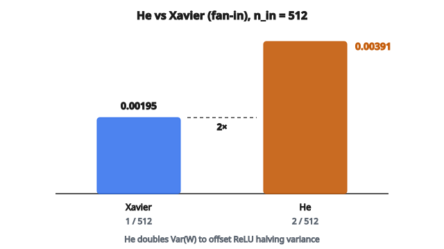

# He Initialization

## Vì sao Xavier thất bại với ReLU

Xavier initialization giả định activation gần như tuyến tính (như tanh quanh không). Nhưng ReLU khác:

$$
\text{ReLU}(x) = \max(0, x)
$$

ReLU đưa mọi giá trị âm về không, **giảm một nửa phương sai** đầu ra so với đầu vào. Nếu đầu vào có phương sai $\sigma^2$, sau ReLU phương sai khoảng $\sigma^2 / 2$.

Với Xavier initialization, sự giảm phương sai này cộng dồn qua các lớp:

* Lớp 1: phương sai $\to$ phương sai $/ 2$
* Lớp 2: phương sai $/ 2$ $\to$ phương sai $/ 4$
* Lớp 10: phương sai $\to$ phương sai $/ 1024$

Activation và gradient biến mất trong mạng sâu dùng ReLU khi khởi tạo bằng Xavier.

## He Initialization (Kaiming Initialization)

He initialization, do He et al. đề xuất (2015), bù cho việc ReLU giảm phương sai bằng cách nhân đôi phương sai trọng số:

$$
\operatorname{Var}(W) = \frac{2}{n_{in}}
$$

Đây gấp đôi phương sai Xavier (chế độ fan-in), đúng hệ số 2 bị ReLU lấy đi.

## Phân phối đều He

Lấy trọng số đều từ:

$$
W \sim U\left(-\sqrt{\frac{6}{n_{in}}}, \sqrt{\frac{6}{n_{in}}}\right)
$$

**Ví dụ:** Lớp 256 đầu vào

$$
\text{bound} = \sqrt{\frac{6}{256}} = \sqrt{0.0234} \approx 0.153
$$

Trọng số lấy từ $U(-0.153, 0.153)$

## Phân phối chuẩn He

Lấy trọng số từ phân phối chuẩn:

$$
W \sim N\left(0, \sqrt{\frac{2}{n_{in}}}\right)
$$

**Ví dụ:** Lớp 256 đầu vào

$$
\sigma = \sqrt{\frac{2}{256}} = \sqrt{0.0078} \approx 0.088
$$

Trọng số lấy từ $N(0, 0.088)$

## Suy ra công thức

Xét đầu ra lớp: $y = \text{ReLU}(Wx)$

Trước ReLU: $z = Wx$, và $\operatorname{Var}(z) = n_{in} \cdot \operatorname{Var}(W) \cdot \operatorname{Var}(x)$

Sau ReLU (giả sử phân phối đầu vào đối xứng quanh không):

* Một nửa giá trị thành không
* Nửa còn lại không đổi
* $\operatorname{Var}(y) \approx \frac{1}{2} \operatorname{Var}(z)$

Để giữ $\operatorname{Var}(y) = \operatorname{Var}(x)$:

$$
\frac{1}{2} \cdot n_{in} \cdot \operatorname{Var}(W) \cdot \operatorname{Var}(x) = \operatorname{Var}(x)
$$

$$
\operatorname{Var}(W) = \frac{2}{n_{in}}
$$

## Ví dụ số: so sánh Xavier và He

**Lớp:** 512 đầu vào, activation ReLU

**Phương sai Xavier:** $\frac{1}{n_{in}} = \frac{1}{512} = 0.00195$

**Phương sai He:** $\frac{2}{n_{in}} = \frac{2}{512} = 0.00391$

He initialization dùng trọng số có phương sai gấp đôi, bù cho ReLU.

::: {#fig-153-he-vs-xavier fig-cap="Với n_in = 512 (fan-in): Var Xavier = 0.00195, Var He = 0.00391 — gấp đúng 2 lần để bù ReLU." fig-alt="Hai cột phương sai với n_in = 512: Xavier 0.00195 và He 0.00391 gấp đôi."}
{fig-align="center"}
:::

## Với Leaky ReLU

Leaky ReLU có độ dốc nhỏ $\alpha$ cho giá trị âm:

$$
\text{LeakyReLU}(x) = \begin{cases} x & \text{nếu } x > 0 \\ \alpha x & \text{nếu } x \leq 0 \end{cases}
$$

Phương sai không bị giảm một nửa mà giảm theo hệ số $(1 + \alpha^2) / 2$.

He initialization cho Leaky ReLU:

$$
\operatorname{Var}(W) = \frac{2}{(1 + \alpha^2) \cdot n_{in}}
$$

Với Leaky ReLU chuẩn $\alpha = 0.01$, gần như trùng He thông thường.

## Chế độ fan-in và fan-out

**Chế độ fan-in (mặc định):** Dùng $n_{in}$ trong công thức

$$
\operatorname{Var}(W) = \frac{2}{n_{in}}
$$

Giữ phương sai ở lượt xuôi.

**Chế độ fan-out:** Dùng $n_{out}$ trong công thức

$$
\operatorname{Var}(W) = \frac{2}{n_{out}}
$$

Giữ phương sai ở lượt ngược.

**Trong thực tế:** Chế độ fan-in phổ biến hơn và là mặc định trong hầu hết framework.

## Với lớp convolution

Với lớp conv có kernel size $(k_h, k_w)$ và $c_{in}$ channel đầu vào:

$$
n_{in} = c_{in} \times k_h \times k_w
$$

**Ví dụ:** Conv $3 \times 3$ với 128 channel đầu vào

$$
n_{in} = 128 \times 3 \times 3 = 1152
$$

$$
\operatorname{Var}(W) = \frac{2}{1152} \approx 0.00174
$$

$$
\sigma = \sqrt{0.00174} \approx 0.042
$$

## He và Xavier cạnh nhau

Với lớp $n_{in} = 1000$:

**Xavier Normal:**
$\sigma = \sqrt{\frac{1}{n_{in}}} = \sqrt{0.001} = 0.0316$

**He Normal:**
$\sigma = \sqrt{\frac{2}{n_{in}}} = \sqrt{0.002} = 0.0447$

He có độ lệch chuẩn lớn hơn $\sqrt{2} \approx 1.41$ lần.

## Khi nào dùng He initialization

**Dùng He cho:**

* Activation ReLU
* Leaky ReLU
* PReLU
* ELU (gần đúng)
* Mọi activation kiểu ReLU đưa giá trị âm về không

**Dùng Xavier cho:**

* Tanh
* Sigmoid
* Lớp tuyến tính không có activation
* Lớp đầu ra softmax

**Quy tắc chung:** Nếu activation thuộc họ ReLU, dùng He. Nếu không, dùng Xavier.

## Mạng sâu hiện đại

He initialization cho phép huấn luyện mạng rất sâu:

**VGGNet (2014):** 16–19 lớp, gặp khó khi huấn luyện

**ResNet (2015):** 50–152+ lớp, huấn luyện thành công với He initialization

Tổ hợp của:

1. He initialization
2. Activation ReLU
3. Batch normalization
4. Skip connection

Giúp huấn luyện mạng 100+ lớp trở nên thực tế.

## Bias

Giống Xavier, bias thường được khởi tạo bằng không:

$$
b = 0
$$

Bias bằng không hoạt động tốt với He initialization.

## Kiểm chứng

Để kiểm tra He initialization đang hoạt động:

1. Tạo mạng sâu (ví dụ 50 lớp) với ReLU
2. Khởi tạo bằng He
3. Lượt xuôi dữ liệu ngẫu nhiên
4. Kiểm tra phương sai activation tại mỗi lớp

Với khởi tạo đúng:

* Phương sai gần như không đổi qua các lớp
* Không nổ cũng không sụp

Với khởi tạo sai (ví dụ Xavier cho ReLU):

* Phương sai co theo hàm mũ
* Các lớp sâu có activation gần không

## Ghi chú cài đặt

**Phân phối chuẩn:**

* Mean: 0
* Std: $\sqrt{2 / n_{in}}$

**Phân phối đều:**

* Min: $-\sqrt{6 / n_{in}}$
* Max: $+\sqrt{6 / n_{in}}$

**Hỗ trợ framework:**
Hầu hết framework có sẵn He/Kaiming initialization với tùy chọn:

* Kiểu phân phối (normal hoặc uniform)
* Chế độ (fan_in hoặc fan_out)
* Phi tuyến (relu, leaky_relu kèm slope)

## Tác động lịch sử

He initialization là thành phần then chốt trong cuộc cách mạng deep learning:

* Cho thấy khởi tạo quan trọng với mạng sâu
* Cung cấp cách tiếp cận có nguyên lý dựa trên hàm kích hoạt
* Cho phép huấn luyện ResNet và các kiến trúc sau này
* Chứng minh rằng “độ sâu” đạt được nếu kỹ thuật đúng

Cùng batch normalization và skip connection, He initialization thuộc bộ công cụ chuẩn để huấn luyện CNN sâu.

## Code
```python
import math

def he_initialization(W, fan_in):
    """
    Scale raw weights to He uniform initialization.
    """
    limit = math.sqrt(6.0 / fan_in)
    return [[round(W[i][j] * 2 * limit - limit, 4)
             for j in range(len(W[0]))] for i in range(len(W))]

```

<!-- auto-self-check -->

::: {.callout-note}
## Kiểm tra nhanh
<details>
<summary>Ý chính của bài «He Initialization» là gì?</summary>
Xavier initialization giả định activation gần như tuyến tính (như tanh quanh không).
</details>
<details>
<summary>Công thức / quan hệ cốt lõi trong bài là gì?</summary>
$$\text{ReLU}(x) = \max(0, x)$$
</details>
:::
