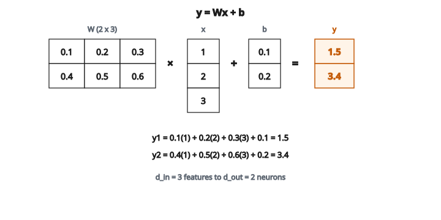

# Linear Layer Forward

## Khối xây dựng của mạng neural

Lớp tuyến tính (còn gọi là fully connected layer, dense layer, hoặc phép biến đổi affine) là phép toán nền tảng nhất trong deep learning. Gần như mọi kiến trúc mạng neural đều dùng lớp tuyến tính làm thành phần cốt lõi.

Một lớp tuyến tính biến đổi vector đầu vào $x$ chiều $d_{in}$ thành vector đầu ra $y$ chiều $d_{out}$ theo:

$$
y = Wx + b
$$

với

$$
\begin{aligned}
W &:\ \text{ma trận trọng số, shape } d_{out} \times d_{in}, \\
b &:\ \text{vector bias, shape } d_{out}, \\
x &:\ \text{vector đầu vào, shape } d_{in}, \\
y &:\ \text{vector đầu ra, shape } d_{out}.
\end{aligned}
$$

## Phân tích phép tính

Mỗi neuron đầu ra $y_j$ tính tổng có trọng số của mọi đầu vào rồi cộng bias:

$$
y_j = \sum_{i=1}^{d_{in}} W_{ji} x_i + b_j
$$

Nói cách khác: đầu ra thứ $j$ là tích vô hướng của hàng thứ $j$ của $W$ với đầu vào $x$, cộng bias thứ $j$.

## Ví dụ số

**Đầu vào:** $x = [1, 2, 3]$ (3 đặc trưng)

**Trọng số:**

$$
W = \begin{bmatrix} 0.1 & 0.2 & 0.3 \\ 0.4 & 0.5 & 0.6 \end{bmatrix}
$$

(2 neuron đầu ra, 3 đặc trưng đầu vào)

**Bias:** $b = [0.1, 0.2]$

**Tính đầu ra 1:**

$$
y_1 = (0.1)(1) + (0.2)(2) + (0.3)(3) + 0.1 = 0.1 + 0.4 + 0.9 + 0.1 = 1.5
$$

**Tính đầu ra 2:**

$$
y_2 = (0.4)(1) + (0.5)(2) + (0.6)(3) + 0.2 = 0.4 + 1.0 + 1.8 + 0.2 = 3.4
$$

**Kết quả:** $y = [1.5, 3.4]$

Đầu vào 3 chiều đã được biến đổi thành đầu ra 2 chiều.

::: {#fig-151-linear-forward fig-cap="y = Wx + b với x = [1, 2, 3], W có shape 2×3 và b = [0.1, 0.2] cho y = [1.5, 3.4]." fig-alt="Nhân ma trận W 2×3 với vector cột x = [1, 2, 3], cộng bias b = [0.1, 0.2], cho y = [1.5, 3.4]."}
{fig-align="center"}
:::

## Xử lý theo batch

Trong thực tế, ta xử lý nhiều mẫu cùng lúc. Nếu $X$ là ma trận shape $n \times d_{in}$ ($n$ mẫu, mỗi mẫu $d_{in}$ đặc trưng), phép tính theo batch là:

$$
Y = XW^{T} + b
$$

Hoặc tương đương, nếu $W$ được lưu với shape $d_{in} \times d_{out}$:

$$
Y = XW + b
$$

Ở đây:

* $X$ có shape $n \times d_{in}$
* $W$ có shape $d_{in} \times d_{out}$
* $Y$ có shape $n \times d_{out}$
* $b$ được broadcast theo từng hàng (cộng vào mọi mẫu)

Mỗi hàng của $Y$ là bản biến đổi của hàng tương ứng của $X$.

## Vì sao lớp tuyến tính được gọi là affine

Một phép biến đổi thuần tuyến tính sẽ là $y = Wx$ không có bias. Phép này ánh xạ gốc tọa độ về gốc tọa độ.

Cộng bias $b$ biến nó thành phép biến đổi affine: $y = Wx + b$. Phép affine có thể tịnh tiến gốc, cho mạng học được offset.

Không có bias, mạng chỉ học được các hàm đi qua gốc tọa độ. Hạng tử bias cung cấp độ linh hoạt cần thiết.

## Lớp tuyến tính không làm được gì

Một lớp tuyến tính đơn lẻ bị hạn chế nặng. Ghép hai lớp tuyến tính mà không có phi tuyến ở giữa tương đương một lớp tuyến tính duy nhất:

$$
y = W_2(W_1 x + b_1) + b_2 = (W_2 W_1)x + (W_2 b_1 + b_2) = W' x + b'
$$

Dù xếp bao nhiêu lớp tuyến tính, kết quả vẫn là một hàm tuyến tính. Đó là lý do các hàm kích hoạt phi tuyến (ReLU, sigmoid, v.v.) được chèn giữa các lớp tuyến tính.

## Vai trò từng thành phần

**Trọng số $W$:**

* Tham số học được, quyết định cách các đầu vào được kết hợp
* Mỗi hàng của $W$ định nghĩa pattern mà một neuron đầu ra tìm kiếm
* Neuron có trọng số $[1, -1, 0]$ tính “đầu vào thứ nhất trừ đầu vào thứ hai”

**Bias $b$:**

* Tham số học được, tịnh tiến activation
* Cho neuron kích hoạt ngay cả khi tổng có trọng số bằng không
* Một bias cho mỗi neuron đầu ra

**Đầu vào $x$:**

* Dữ liệu, hoặc đầu ra của lớp trước
* Có thể là đặc trưng thô, embedding, hoặc biểu diễn trung gian

## Gradient (lan truyền ngược)

Khi huấn luyện, cần gradient để cập nhật $W$ và $b$.

**Gradient theo $W$:**

$$
\frac{\partial L}{\partial W} = \frac{\partial L}{\partial y} \cdot x^{T}
$$

**Gradient theo $b$:**

$$
\frac{\partial L}{\partial b} = \frac{\partial L}{\partial y}
$$

**Gradient theo $x$ (để lan truyền ngược về các lớp trước):**

$$
\frac{\partial L}{\partial x} = W^{T} \cdot \frac{\partial L}{\partial y}
$$

Chú ý $W^{T}$ xuất hiện ở lượt ngược. Chuyển vị của ma trận trọng số định tuyến gradient trở lại xuyên mạng.

## Lớp tuyến tính trong các ngữ cảnh

**Mạng feedforward:**

Các lớp tuyến tính xen kẽ với activation: Linear → ReLU → Linear → ReLU → … → Linear → Output

**Phân loại:**

Lớp tuyến tính cuối thường có một đầu ra mỗi lớp. Đầu ra của nó (logit) được đưa qua softmax để ra xác suất.

**Hồi quy:**

Lớp tuyến tính cuối có một đầu ra mỗi biến mục tiêu. Không áp dụng activation (hoặc đôi khi ReLU nếu đầu ra không âm).

**Transformer:**

Khối feedforward trong transformer gồm hai lớp tuyến tính với một phi tuyến ở giữa. Cơ chế attention cũng dùng vài phép chiếu tuyến tính.

## Số tham số

Một lớp tuyến tính ánh xạ $d_{in}$ đầu vào thành $d_{out}$ đầu ra có:

* $d_{in} \times d_{out}$ trọng số
* $d_{out}$ bias
* Tổng: $d_{in} \times d_{out} + d_{out}$ tham số

Với lớp 1000 đầu vào và 500 đầu ra: $1000 \times 500 + 500 = 500{,}500$ tham số.

Con số này có thể rất lớn, nên các kiến trúc hiện đại thường dùng kỹ thuật như attention hoặc convolution để giảm số tham số.

## Code
```python
def linear_layer_forward(X, W, b):
    """
    Compute the forward pass of a linear (fully connected) layer.
    """
    n = len(X)
    d_in = len(X[0])
    d_out = len(W[0])
    return [[sum(X[i][k] * W[k][j] for k in range(d_in)) + b[j]
             for j in range(d_out)] for i in range(n)]

```

<!-- auto-self-check -->

::: {.callout-note}
## Kiểm tra nhanh
<details>
<summary>Ý chính của bài «Linear Layer Forward» là gì?</summary>
Lớp tuyến tính (còn gọi là fully connected layer, dense layer, hoặc phép biến đổi affine) là phép toán nền tảng nhất trong deep learning.
</details>
<details>
<summary>Công thức / quan hệ cốt lõi trong bài là gì?</summary>
$$y = Wx + b$$
</details>
:::
