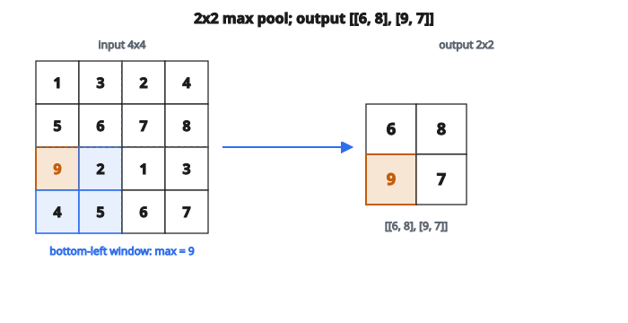

# Max Pooling 2D

## Max pooling là gì?

Max pooling là phép downsampling giảm kích thước không gian của feature map. Nó hoạt động bằng cách:

1. Chia đầu vào thành các vùng chữ nhật không chồng
2. Lấy giá trị lớn nhất từ mỗi vùng

Kết quả là feature map nhỏ hơn, giữ các đặc trưng nổi bật nhất.

## Vì sao dùng max pooling?

**Giảm số chiều:**

* Giảm tính toán cho các lớp sau
* Pool $2 \times 2$ với stride 2 giảm kích thước không gian 75%

**Bất biến tịnh tiến:**

* Dịch nhỏ trên đầu vào cho cùng đầu ra
* Nếu giá trị max dịch trong vùng pool, đầu ra không đổi

**Chọn đặc trưng:**

* Chỉ giữ activation mạnh nhất trong mỗi vùng
* Loại activation yếu hơn (có thể là nhiễu)

## Phép max pooling

Với pool size $p \times p$ và stride bằng pool size:

$$
\text{output}[i][j] = \max_{0 \leq a < p,\, 0 \leq b < p} \text{input}[i \cdot p + a][j \cdot p + b]
$$

Công thức lấy maximum trên mỗi cửa sổ $p \times p$ không chồng.

## Ví dụ số

**Input ($4 \times 4$):**

$$
\begin{bmatrix}
1 & 3 & 2 & 4 \\
5 & 6 & 7 & 8 \\
9 & 2 & 1 & 3 \\
4 & 5 & 6 & 7
\end{bmatrix}
$$

**Pool size:** $2 \times 2$

**Cửa sổ trên-trái:** $\max(1, 3, 5, 6) = 6$

**Cửa sổ trên-phải:** $\max(2, 4, 7, 8) = 8$

**Cửa sổ dưới-trái:** $\max(9, 2, 4, 5) = 9$

**Cửa sổ dưới-phải:** $\max(1, 3, 6, 7) = 7$

**Output ($2 \times 2$):**

$$
\begin{bmatrix}
6 & 8 \\
9 & 7
\end{bmatrix}
$$

Đầu ra bằng $1/4$ kích thước đầu vào.

::: {#fig-159-maxpool-2d fig-cap="Max pool $2 \times 2$ không chồng: $\max(1,3,5,6)=6$, $\max(2,4,7,8)=8$, $\max(9,2,4,5)=9$, $\max(1,3,6,7)=7$." fig-alt="Lưới 4x4 [[1,3,2,4],[5,6,7,8],[9,2,1,3],[4,5,6,7]]; max pool 2x2 cho đầu ra [[6,8],[9,7]]."}
{fig-align="center"}
:::

## Kích thước đầu ra

Với đầu vào $H \times W$, pool size $p$, và stride $s$:

$$
H_{\text{out}} = \left\lfloor \frac{H - p}{s} \right\rfloor + 1
$$

$$
W_{\text{out}} = \left\lfloor \frac{W - p}{s} \right\rfloor + 1
$$

Với pooling không chồng (stride = pool size):

$$
H_{\text{out}} = \left\lfloor \frac{H}{p} \right\rfloor
$$

## Cấu hình thường dùng

**Pool $2 \times 2$, stride 2:**

* Cấu hình phổ biến nhất
* Mỗi chiều giảm một nửa
* Giảm 75% kích thước không gian
* Dùng trong VGG, AlexNet

**Pool $3 \times 3$, stride 2:**

* Pooling chồng
* Receptive field hơi khác
* Dùng trong một số kiến trúc cũ

**Global max pooling:**

* Pool size bằng cả feature map
* Một giá trị mỗi channel
* Thường dùng trước lớp fully connected

## Max pooling vs average pooling

**Max pooling:**

* Lấy giá trị lớn nhất
* Giữ activation mạnh nhất
* Tốt để phát hiện sự có mặt của đặc trưng
* Phổ biến hơn trong phân loại

**Average pooling:**

* Lấy giá trị trung bình
* Làm mượt activation
* Tốt để giữ thông tin tổng thể
* Đôi khi được ưa ở các lớp cuối

Trong thực tế, max pooling phổ biến hơn trong CNN vì giữ đặc trưng phân biệt tốt hơn.

## Gradient (lan truyền ngược)

Khi lan truyền ngược, gradient chỉ chảy qua phần tử maximum:

**Lượt truyền xuôi:**

* Ghi phần tử nào là maximum (mask)

**Lượt truyền ngược:**

* Gradient tại vị trí max: bằng gradient đi vào
* Gradient tại các vị trí khác: 0

Đây là lý do max pooling tạo gradient thưa.

## Max pooling trong kiến trúc hiện đại

**CNN cổ điển (VGG, AlexNet):**

* Dùng nhiều max pooling $2 \times 2$
* Nhiều lớp pooling xuyên suốt mạng

**ResNet:**

* Một max pooling lúc đầu
* Chủ yếu dựa vào convolution có stride

**Xu hướng hiện đại:**

* Ít max pooling hơn, nhiều convolution có stride hơn
* Strided conv học cách downsample
* Một số kiến trúc bỏ pooling hoàn toàn

## Xử lý trường hợp biên

Khi kích thước đầu vào không chia hết cho pool size:

**Cách 1: Cắt (truncate)**

* Chỉ pool các cửa sổ đủ
* Một số giá trị đầu vào bị bỏ
* Đầu ra là $\lfloor H/p \rfloor$

**Cách 2: Pad**

* Thêm 0 hoặc lặp mép
* Mọi giá trị đầu vào đều đóng góp
* Có thể gây artifact

Hầu hết cài đặt dùng cắt (chia lấy floor).

## Max pooling nhiều channel

Với đầu vào nhiều channel:

* Áp max pooling độc lập trên từng channel
* Không tương tác giữa các channel
* Đầu ra cùng số channel với đầu vào

Nếu input là $H \times W \times C$, output là $(H/p) \times (W/p) \times C$.

## Code
```python
def max_pooling_2d(X, pool_size):
    """
    Apply 2D max pooling with non-overlapping windows.
    """
    H, W = len(X), len(X[0])
    out_h = H // pool_size
    out_w = W // pool_size
    result = []
    for i in range(out_h):
        row = []
        for j in range(out_w):
            max_val = float('-inf')
            for pi in range(pool_size):
                for pj in range(pool_size):
                    val = X[i * pool_size + pi][j * pool_size + pj]
                    if val > max_val:
                        max_val = val
            row.append(max_val)
        result.append(row)
    return result

```
