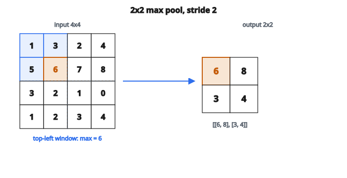

# Max Pooling Forward

## Max pooling làm gì

Max pooling là phép **downsampling** giảm kích thước không gian của feature map, đồng thời giữ thông tin quan trọng nhất. Nó trượt một cửa sổ trên đầu vào và xuất **giá trị lớn nhất** trong mỗi cửa sổ.

**Input:** Feature map shape $(C, H_{\text{in}}, W_{\text{in}})$ (layout NCHW)

**Output:** Feature map nhỏ hơn shape $(C, H_{\text{out}}, W_{\text{out}})$

Số channel không đổi. Chỉ height và width bị giảm.

## Vì sao dùng max pooling?

**1. Giảm số chiều**

Giảm kích thước không gian, từ đó giảm:

* Tính toán ở các lớp sau
* Nhu cầu bộ nhớ
* Số tham số (nếu sau đó là lớp FC)

**2. Bất biến tịnh tiến**

Dịch nhỏ trên đầu vào ít làm đổi đầu ra. Nếu một đặc trưng dịch nhẹ, max trong cửa sổ thường vẫn là cùng giá trị.

**3. Chọn đặc trưng**

Giữ activation mạnh nhất (maximum) trong mỗi vùng. Activation yếu hoặc âm bị loại.

**4. Tăng receptive field**

Mỗi neuron đầu ra “nhìn” một phần lớn hơn của đầu vào gốc sau pooling.

## Phép max pooling

Tại mỗi vị trí không gian trên đầu ra, nhìn một cửa sổ (pool) trên đầu vào và lấy maximum:

$$
\text{output}[c, i, j] = \max_{m, n} \text{input}[c, i \cdot s + m, j \cdot s + n]
$$

với

$$
\begin{aligned}
c &:\ \text{channel (pooling độc lập theo từng channel)}, \\
s &:\ \text{stride}, \\
m \in [0, k_h),\ n \in [0, k_w) &:\ \text{duyệt cửa sổ pooling}, \\
k_h, k_w &:\ \text{chiều cao và rộng của pool}.
\end{aligned}
$$

## Tính kích thước đầu ra

Với kích thước đầu vào $H_{\text{in}}$, pool size $k$, padding $p$, và stride $s$:

$$
H_{\text{out}} = \left\lfloor \frac{H_{\text{in}} + 2p - k}{s} \right\rfloor + 1
$$

Cùng công thức cho chiều rộng.

**Cấu hình phổ biến nhất:** $k = 2$, $s = 2$, $p = 0$

Cả height và width giảm một nửa: $H_{\text{out}} = H_{\text{in}} / 2$

## Ví dụ số: max pool 2x2

**Input:** Feature map $4 \times 4$ (một channel)

$$
\begin{bmatrix}
1 & 3 & 2 & 4 \\
5 & 6 & 7 & 8 \\
3 & 2 & 1 & 0 \\
1 & 2 & 3 & 4
\end{bmatrix}
$$

**Pool size:** $2 \times 2$, **Stride:** $2$, **Padding:** $0$

**Kích thước đầu ra:** $(4 - 2)/2 + 1 = 2$, vậy đầu ra $2 \times 2$

**Bước 1: Cửa sổ trên-trái (hàng 0–1, cột 0–1)**

Cửa sổ:

$$
\begin{bmatrix}
1 & 3 \\
5 & 6
\end{bmatrix}
$$

$\max(1, 3, 5, 6) = 6$

Output$[0,0] = 6$

**Bước 2: Cửa sổ trên-phải (hàng 0–1, cột 2–3)**

Cửa sổ:

$$
\begin{bmatrix}
2 & 4 \\
7 & 8
\end{bmatrix}
$$

$\max(2, 4, 7, 8) = 8$

Output$[0,1] = 8$

**Bước 3: Cửa sổ dưới-trái (hàng 2–3, cột 0–1)**

Cửa sổ:

$$
\begin{bmatrix}
3 & 2 \\
1 & 2
\end{bmatrix}
$$

$\max(3, 2, 1, 2) = 3$

Output$[1,0] = 3$

**Bước 4: Cửa sổ dưới-phải (hàng 2–3, cột 2–3)**

Cửa sổ:

$$
\begin{bmatrix}
1 & 0 \\
3 & 4
\end{bmatrix}
$$

$\max(1, 0, 3, 4) = 4$

Output$[1,1] = 4$

**Đầu ra cuối:**

$$
\begin{bmatrix}
6 & 8 \\
3 & 4
\end{bmatrix}
$$

::: {#fig-154-maxpool-2x2 fig-cap="Max pool $2 \times 2$, stride 2: cửa sổ trên-trái $\max(1,3,5,6)=6$; đầu ra $[[6,8],[3,4]]$." fig-alt="Lưới 4x4 [[1,3,2,4],[5,6,7,8],[3,2,1,0],[1,2,3,4]]; cửa sổ 2x2 góc trên-trái có max 6; đầu ra [[6,8],[3,4]]."}
{fig-align="center"}
:::

## Ví dụ chi tiết: max pool 3x3, stride 1

**Input:** Feature map $5 \times 5$

$$
\begin{bmatrix}
1 & 2 & 3 & 4 & 5 \\
6 & 7 & 8 & 9 & 10 \\
11 & 12 & 13 & 14 & 15 \\
16 & 17 & 18 & 19 & 20 \\
21 & 22 & 23 & 24 & 25
\end{bmatrix}
$$

**Pool size:** $3 \times 3$, **Stride:** $1$, **Padding:** $0$

**Kích thước đầu ra:** $(5 - 3)/1 + 1 = 3$, vậy đầu ra $3 \times 3$

**Vị trí $(0,0)$:** Cửa sổ phủ hàng 0–2, cột 0–2

$$
\begin{bmatrix}
1 & 2 & 3 \\
6 & 7 & 8 \\
11 & 12 & 13
\end{bmatrix}
$$

$\max = 13$

**Vị trí $(0,1)$:** Cửa sổ phủ hàng 0–2, cột 1–3

$$
\begin{bmatrix}
2 & 3 & 4 \\
7 & 8 & 9 \\
12 & 13 & 14
\end{bmatrix}
$$

$\max = 14$

**Vị trí $(0,2)$:** Cửa sổ phủ hàng 0–2, cột 2–4

$\max = 15$

**Tiếp tục theo mẫu này, đầu ra đầy đủ:**

$$
\begin{bmatrix}
13 & 14 & 15 \\
18 & 19 & 20 \\
23 & 24 & 25
\end{bmatrix}
$$

Các giá trị max “lan” từ vùng dưới-phải, nơi giá trị lớn nhất.

## Ví dụ nhiều channel

**Input:** $4 \times 4$ với 2 channel

Channel 0:

$$
\begin{bmatrix}
1 & 2 & 3 & 4 \\
5 & 6 & 7 & 8 \\
9 & 10 & 11 & 12 \\
13 & 14 & 15 & 16
\end{bmatrix}
$$

Channel 1:

$$
\begin{bmatrix}
16 & 15 & 14 & 13 \\
12 & 11 & 10 & 9 \\
8 & 7 & 6 & 5 \\
4 & 3 & 2 & 1
\end{bmatrix}
$$

**Max pool $2 \times 2$, stride 2:**

Channel 0, đầu ra:

$$
\begin{bmatrix}
6 & 8 \\
14 & 16
\end{bmatrix}
$$

Channel 1, đầu ra:

$$
\begin{bmatrix}
16 & 14 \\
8 & 6
\end{bmatrix}
$$

Mỗi channel được pool độc lập. Các channel không tương tác trong pooling.

## Pooling với padding

**Input:** $5 \times 5$, **Pool:** $2 \times 2$, **Stride:** $2$, **Padding:** $0$

Không padding: $(5-2)/2 + 1 = 2.5 \to 2$ (floor)

Cột phải nhất và hàng dưới cùng không được phủ đủ.

**Với padding = 1:** Đầu vào thực tế thành $7 \times 7$ (thêm 0 ở mép)

$(7-2)/2 + 1 = 3$

Padding bảo đảm mọi phần tử đầu vào được phủ, nhưng giá trị ở mép gồm cả số 0 đã pad.

## Pooling chồng vs không chồng

**Không chồng (stride = pool size):**

* Phổ biến nhất: pool $2 \times 2$ với stride 2
* Mỗi phần tử đầu vào đóng góp đúng một đầu ra
* Giảm sạch $2\times$ hoặc $4\times$

**Chồng (stride < pool size):**

* Pool $3 \times 3$ với stride 2
* Một phần tử đầu vào có thể đóng góp cho nhiều đầu ra
* Cải thiện accuracy nhẹ (dùng trong AlexNet)
* Ít gặp hơn ngày nay

## Max pooling vs average pooling

**Max pooling:**

* Lấy giá trị lớn nhất trong cửa sổ
* Giữ activation mạnh nhất
* Phổ biến hơn trong mạng phân loại
* Tạo sparsity (chỉ max có vai trò)

**Average pooling:**

* Lấy trung bình các giá trị trong cửa sổ
* Làm mượt activation
* Phổ biến cho global pooling trước classifier
* Mọi giá trị đóng góp đều

**Khi nào dùng loại nào:**

* Max pooling: trích đặc trưng tổng quát, hầu hết kiến trúc CNN
* Average pooling: global pooling, một số kiến trúc cụ thể

## Gradient khi lan truyền ngược

Ở lượt truyền xuôi, ghi lại vị trí có giá trị lớn nhất (argmax).

Khi lan truyền ngược:

* Gradient chỉ chảy tới vị trí từng là maximum
* Mọi vị trí khác nhận gradient 0

$$
\frac{\partial L}{\partial \text{input}[c, i, j]} =
\begin{cases}
\dfrac{\partial L}{\partial \text{output}} & \text{nếu }(i,j)\text{ là argmax} \\
0 & \text{các trường hợp còn lại}
\end{cases}
$$

Đây gọi là gradient “max routing”. Thông tin vị trí max phải được lưu ở lượt truyền xuôi để dùng ở lượt ngược.

## Vị trí trong kiến trúc CNN

Cấu trúc CNN điển hình:

Conv -> ReLU -> **MaxPool** -> Conv -> ReLU -> **MaxPool** -> ... -> FC

Max pooling thường đi sau khối conv + activation để giảm dần kích thước không gian.

**Xu hướng hiện đại:**

* Một số kiến trúc thay pooling bằng convolution có stride
* ResNet dùng pooling tiết kiệm (một lúc đầu, một lúc cuối)
* Vẫn dùng rộng rãi trong mạng kiểu VGG, AlexNet

## Cấu hình thường dùng

**Pooling $2 \times 2$ chuẩn:**

* Pool size: $2 \times 2$
* Stride: 2
* Padding: 0
* Hiệu ứng: giảm một nửa cả hai chiều

**Pooling chồng (AlexNet):**

* Pool size: $3 \times 3$
* Stride: 2
* Cải thiện accuracy nhẹ

**Global max pooling:**

* Pool size: toàn bộ kích thước không gian
* Đầu ra: một giá trị mỗi channel
* Dùng trước classifier trong một số mạng

## Thuật toán cài đặt

**Với mỗi vị trí đầu ra $(c, i, j)$:**

1. Tính vùng đầu vào: hàng từ $i \cdot s$ đến $i \cdot s + k_h$, cột từ $j \cdot s$ đến $j \cdot s + k_w$
2. Lấy cửa sổ từ channel $c$ của input
3. Tìm giá trị lớn nhất trong cửa sổ
4. Ghi maximum vào output$[c, i, j]$
5. (Cho backprop) Lưu vị trí của maximum

**Độ phức tạp:** $O(C \times H_{\text{out}} \times W_{\text{out}} \times k_h \times k_w)$

## Trường hợp biên

**Đầu vào không chia hết cho stride:**

* Dùng padding để chia hết
* Hoặc chấp nhận pixel mép có thể bị loại

**Đầu vào rất nhỏ:**

* Nếu đầu vào nhỏ hơn pool size thì không pool được (hoặc dùng global pooling)

**Giá trị âm:**

* Max pooling vẫn đúng với số âm
* $\max(-5, -3, -7, -2) = -2$

**Mọi giá trị giống nhau:**

* Max chính là giá trị đó
* Với gradient, thường lấy lần xuất hiện đầu tiên làm argmax

## Code
```python
def maxpool_forward(X, pool_size, stride):
    """
    Compute the forward pass of 2D max pooling.
    """
    H, W = len(X), len(X[0])
    out_h = (H - pool_size) // stride + 1
    out_w = (W - pool_size) // stride + 1
    result = []
    for i in range(out_h):
        row = []
        for j in range(out_w):
            max_val = float("-inf")
            for a in range(pool_size):
                for b in range(pool_size):
                    val = X[i * stride + a][j * stride + b]
                    if val > max_val:
                        max_val = val
            row.append(max_val)
        result.append(row)
    return result

```
