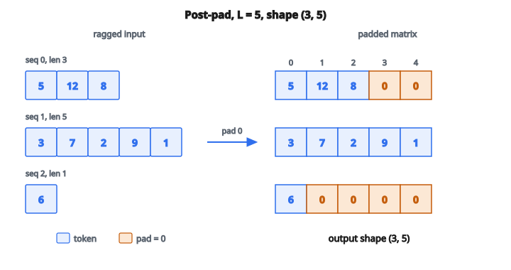

# Pad Sequences

## Padding sequences là gì

**Sequence padding** biến các sequence độ dài khác nhau thành sequence độ dài cố định bằng cách thêm token padding đặc biệt. Trong NLP, câu có số từ khác nhau; trong time series, bản ghi có thời lượng khác nhau. Mạng nơ-ron cần tensor đầu vào kích thước cố định, nên padding là bước bắt buộc khi tạo batch.

## Vì sao cần padding

**Yêu cầu xử lý theo batch**: Mạng nơ-ron xử lý dữ liệu theo batch để hiệu quả. Một batch phải là tensor hình chữ nhật, mọi sequence cùng độ dài.

**Hiệu năng GPU**: GPU làm tốt nhất với phép toán kích thước cố định. Đầu vào độ dài biến thiên buộc xử lý tuần tự, mất lợi thế song song.

**Ràng buộc API**: Hàm của framework kỳ vọng mảng/tensor có shape thống nhất.

## Quy trình padding

Cho các sequence độ dài khác nhau:

1. Xác định độ dài đích (max length trong batch, hoặc một giá trị chỉ định)
2. Sequence ngắn hơn đích: thêm token padding
3. Sequence dài hơn đích: truncate

**Vị trí padding**:

* **Post-padding** (phổ biến nhất): thêm padding ở cuối
* **Pre-padding**: thêm padding ở đầu

## Biểu diễn toán

Với một batch $B$ sequence có độ dài $l_1, l_2, \ldots, l_B$ và độ dài đích $L$:

$$
L = \max(l_1, l_2, \ldots, l_B) \quad \text{nếu max\_len là None}
$$

Với mỗi sequence $s_i$ độ dài $l_i$:

$$
\text{padded\_length} = L
$$

$$
\text{padding\_needed} = \max(0, L - l_i)
$$

$$
\text{truncation\_needed} = \max(0, l_i - L)
$$

## Ví dụ số: post-padding

**Sequence đầu vào** (token ID):

* Sequence 0: $[5, 12, 8]$ (độ dài 3)
* Sequence 1: $[3, 7, 2, 9, 1]$ (độ dài 5)
* Sequence 2: $[6]$ (độ dài 1)

**Độ dài đích**: $\max(3, 5, 1) = 5$

**Giá trị padding**: $0$

**Kết quả post-padded**:

* Sequence 0: $[5, 12, 8, 0, 0]$
* Sequence 1: $[3, 7, 2, 9, 1]$
* Sequence 2: $[6, 0, 0, 0, 0]$

**Shape đầu ra**: $(3, 5)$ — một ma trận chữ nhật đúng nghĩa.

::: {#fig-3-pad-post fig-cap="Post-padding với pad_value = 0 đưa ba sequence về shape (3, 5): [5, 12, 8, 0, 0], [3, 7, 2, 9, 1], [6, 0, 0, 0, 0]." fig-alt="Ba sequence độ dài 3, 5, 1 được post-pad thành ma trận (3, 5): hàng [5, 12, 8, 0, 0], [3, 7, 2, 9, 1], [6, 0, 0, 0, 0]; ô 0 là padding."}
{fig-align="center"}
:::

## Ví dụ số: pre-padding

**Cùng sequence đầu vào, pre-padding**:

* Sequence 0: $[0, 0, 5, 12, 8]$
* Sequence 1: $[3, 7, 2, 9, 1]$
* Sequence 2: $[0, 0, 0, 0, 6]$

**Khi dùng pre-padding**: mô hình sequence mà token cuối quan trọng nhất (ví dụ phân loại dựa trên hidden state cuối).

## Truncation

Khi sequence vượt độ dài tối đa:

**Post-truncation**: giữ `max_len` token đầu

* $[1, 2, 3, 4, 5, 6, 7]$ với $\text{max\_len} = 4$ $\to$ $[1, 2, 3, 4]$

**Pre-truncation**: giữ `max_len` token cuối

* $[1, 2, 3, 4, 5, 6, 7]$ với $\text{max\_len} = 4$ $\to$ $[4, 5, 6, 7]$

**Chọn theo tác vụ**:

* Sentiment analysis: phần đầu thường chứa luận điểm (post-truncation)
* Next-word prediction: ngữ cảnh gần đây quan trọng hơn (pre-truncation)

## Chọn giá trị padding

**Lựa chọn phổ biến**:

* $0$: phổ biến nhất, dễ nhận diện
* $-1$: phân biệt với token ID hợp lệ $0$
* Token ID đặc biệt: token `[PAD]` trong vocabulary

**Yêu cầu**:

* Không xung đột với giá trị dữ liệu hợp lệ
* Lớp embedding nên ánh xạ padding về vector không
* Attention mask phải loại các vị trí padding

## Xử lý input rỗng

Khi danh sách sequence đầu vào rỗng:

**Đầu ra kỳ vọng**: mảng shape $(0, 0)$

* Không sequence nào
* Không feature nào mỗi sequence

Cách này giữ nhất quán kiểu dữ liệu và cho phép các bước sau chạy mà không cần nhánh đặc biệt.

## Tương tác với attention mask

Token padding không được ảnh hưởng dự đoán của mô hình. Attention mask đánh dấu vị trí thật so với vị trí padded:

$$
\text{mask}_i = \begin{cases}
1 & \text{nếu vị trí } i \text{ là token thật} \\
0 & \text{nếu vị trí } i \text{ là padding}
\end{cases}
$$

**Ví dụ**: sequence $[5, 12, 8, 0, 0]$

* Attention mask: $[1, 1, 1, 0, 0]$

Transformer dùng mask này để gán trọng số attention bằng $-\infty$ tại vị trí padded, tức là bỏ qua chúng.

## Xác định độ dài tối đa

**Động (theo batch)**:

* $\text{max\_len} = \max(\text{độ dài sequence trong batch})$
* Tiết kiệm bộ nhớ nhất
* Các batch khác nhau có shape khác nhau

**Cố định**:

* $\text{max\_len}$ là hằng số định trước
* Shape tensor thống nhất
* Có thể lãng phí bộ nhớ hoặc mất thông tin

**Cân nhắc**:

* Training vs inference: mô hình đã compile thường đòi shape cố định
* Bộ nhớ: sequence dài chiếm phần lớn bộ nhớ
* Mất thông tin: truncate sequence dài thì bỏ dữ liệu

## Ví dụ số có truncation

**Sequence đầu vào**:

* Sequence 0: $[1, 2, 3, 4, 5, 6, 7, 8]$ (độ dài 8)
* Sequence 1: $[10, 20]$ (độ dài 2)
* Sequence 2: $[5, 6, 7, 8, 9]$ (độ dài 5)

**$\text{max\_len} = 4$, $\text{padding\_value} = 0$, post-truncation**:

* Sequence 0: $[1, 2, 3, 4]$ (truncate từ 8 xuống 4)
* Sequence 1: $[10, 20, 0, 0]$ (pad từ 2 lên 4)
* Sequence 2: $[5, 6, 7, 8]$ (truncate từ 5 xuống 4)

**Shape đầu ra**: $(3, 4)$

## Kiểu dữ liệu đầu ra

Đầu ra nên là mảng NumPy kiểu nguyên (thường `int32` hoặc `int64`):

* Token ID là số nguyên
* Giá trị padding là số nguyên
* Mảng nguyên tiết kiệm bộ nhớ hơn mảng float
* `dtype` thống nhất bảo đảm tương thích với embedding lookup

## Bucketed padding

Với tập lớn, nhóm sequence theo độ dài gần nhau trước khi pad sẽ giảm chỗ trống lãng phí:

**Chiến lược bucket**:

* Gom sequence theo khoảng độ dài (ví dụ $0$–$50$, $51$–$100$, $101$–$150$)
* Pad trong từng bucket
* Giảm đáng kể tổng số token padding

**Đánh đổi**: logic batching phức tạp hơn đổi lấy hiệu quả bộ nhớ

## Padding sequences xuất hiện ở đâu

* **Text classification**: review/tweet độ dài khác nhau được pad để xử lý theo batch
* **Machine translation**: sequence nguồn và đích được pad độc lập
* **Named entity recognition**: dự đoán theo token cần độ dài sequence thống nhất
* **Time series classification**: bản ghi độ dài khác nhau được căn chỉnh
* **Speech recognition**: đoạn âm thanh thời lượng khác nhau
* **DNA sequence analysis**: gene sequence độ dài khác nhau
* **Music generation**: cụm nốt với số nốt khác nhau
* **Video analysis**: clip với số frame khác nhau

## Code
```python
import numpy as np

def pad_sequences(seqs, pad_value=0, max_len=None):
    """
    Returns: np.ndarray of shape (N, L) where:
      N = len(seqs)
      L = max_len if provided else max(len(seq) for seq in seqs) or 0
    """
    if not seqs:
        return np.array([], dtype=float).reshape(0, 0)
    if max_len is None:
        max_len = max(len(s) for s in seqs)
    result = []
    for s in seqs:
        if len(s) >= max_len:
            result.append(list(s[:max_len]))
        else:
            result.append(list(s) + [pad_value] * (max_len - len(s)))
    return np.array(result, dtype=float)

```

<!-- auto-self-check -->

::: {.callout-note}
## Kiểm tra nhanh
<details>
<summary>Ý chính của bài «Pad Sequences» là gì?</summary>
**Sequence padding** biến các sequence độ dài khác nhau thành sequence độ dài cố định bằng cách thêm token padding đặc biệt.
</details>
<details>
<summary>Công thức / quan hệ cốt lõi trong bài là gì?</summary>
$$L = \max(l_1, l_2, \ldots, l_B) \quad \text{nếu max\_len là None}$$
</details>
:::
