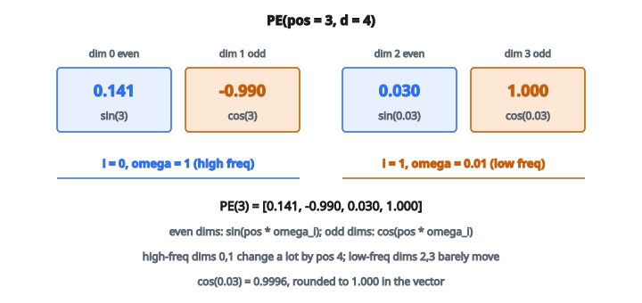

# Positional Encoding (sin/cos)

## Vấn đề vị trí trong Transformer

Self-attention, cơ chế cốt lõi của Transformer, coi đầu vào như một tập hợp. Nếu xáo trộn token, đầu ra attention chỉ xáo trộn tương ứng. Mô hình không có cảm nhận sẵn về thứ tự từ.

Nhưng thứ tự từ quan trọng. “The cat sat on the mat” khác nghĩa với “The mat sat on the cat.”

**Positional encoding** bơm thông tin vị trí vào mô hình bằng cách cộng vector phụ thuộc vị trí vào token embedding.

## Schema encoding sin/cos

Bài báo gốc “Attention Is All You Need” đưa ra positional encoding sin/cos:

$$
PE(pos, 2i) = \sin\left(\frac{pos}{10000^{2i/d}}\right)
$$

$$
PE(pos, 2i+1) = \cos\left(\frac{pos}{10000^{2i/d}}\right)
$$

với

* $pos$ là vị trí trong sequence ($0, 1, 2, \ldots$)
* $i$ là chỉ số cặp chiều ($0, 1, 2, \ldots, d/2$)
* $d$ là dimension của mô hình (kích thước embedding)

Chiều chẵn dùng sine, chiều lẻ dùng cosine.

## Hiểu các tần số

Mỗi cặp chiều $(2i, 2i+1)$ dao động với tần số khác nhau:

$$
\omega_i = \frac{1}{10000^{2i/d}}
$$

**Chiều thấp** ($i$ nhỏ): tần số cao, hoàn thành nhiều chu kỳ trên sequence.

**Chiều cao** ($i$ lớn): tần số thấp, thay đổi chậm theo vị trí.

Kết quả là một phổ tần số, giống các nốt khác nhau trong nhạc. Mỗi vị trí có một “hợp âm” duy nhất gồm các giá trị sine và cosine.

## Vì sao schema này đúng

**Encoding duy nhất:**
Không hai vị trí nào có cùng vector encoding. Tổ hợp tần số bảo đảm tính duy nhất.

**Nội suy mượt:**
Vị trí gần nhau có encoding gần nhau (giá trị sine/cosine gần nhau). Điều này cho khái niệm locality.

**Vị trí tương đối:**
Encoding cho phép mô hình học mẫu attention theo vị trí tương đối. Bài báo chỉ ra rằng $PE(pos + k)$ có thể viết như một hàm tuyến tính của $PE(pos)$.

**Ngoại suy:**
Encoding sin/cos mở rộng tự nhiên ra ngoài độ dài sequence lúc huấn luyện. (Trong thực tế, hiệu năng vẫn giảm trên sequence dài hơn nhiều.)

## Ví dụ số

**Thiết lập:** $d_{\text{model}} = 4$, $\text{position} = 3$

Tần số:

* $i = 0$: $\omega_0 = 1/10000^{0/4} = 1$
* $i = 1$: $\omega_1 = 1/10000^{2/4} = 1/100 = 0.01$

Encoding:

* $PE(3, 0) = \sin(3 \cdot 1) = \sin(3) = 0.141$
* $PE(3, 1) = \cos(3 \cdot 1) = \cos(3) = -0.990$
* $PE(3, 2) = \sin(3 \cdot 0.01) = \sin(0.03) = 0.030$
* $PE(3, 3) = \cos(3 \cdot 0.01) = \cos(0.03) = 0.9996$

Encoding vị trí $3$: $[0.141,\, -0.990,\, 0.030,\, 1.000]$

::: {#fig-5-pe-sin-cos fig-cap="PE(3) với d = 4 là [0.141, −0.990, 0.030, 1.000]: sin/cos tại ω₀ = 1 rồi ω₁ = 0.01." fig-alt="Vector PE tại pos = 3, d = 4: các chiều chẵn sine [0.141, 0.030], chiều lẻ cosine [-0.990, 1.000]; omega_0 = 1 và omega_1 = 0.01."}
{fig-align="center"}
:::

So với vị trí $4$:

* $PE(4, 0) = \sin(4) = -0.757$
* $PE(4, 1) = \cos(4) = -0.654$
* $PE(4, 2) = \sin(0.04) = 0.040$
* $PE(4, 3) = \cos(0.04) = 0.9992$

Encoding vị trí $4$: $[-0.757,\, -0.654,\, 0.040,\, 0.999]$

Thành phần tần số cao (chỉ số $0, 1$) đổi mạnh giữa vị trí $3$ và $4$. Thành phần tần số thấp (chỉ số $2, 3$) chỉ đổi rất ít.

## Cộng encoding vào embedding

Positional encoding được cộng thẳng vào token embedding:

$$
\text{input}_i = \text{embedding}(\text{token}_i) + PE(i)
$$

Giả định embedding và positional encoding cùng dimension.

Với một batch sequence shape $(\text{batch\_size},\, \text{seq\_len},\, d_{\text{model}})$:

1. Tạo ma trận PE shape $(\text{seq\_len},\, d_{\text{model}})$
2. Cộng vào mỗi sequence trong batch (broadcasting)

## Encoding học được vs. sin/cos

**Sin/cos (cố định):**

* Không có tham số để học
* Ngoại suy được sang sequence dài hơn
* Thực tế hoạt động tốt
* Dùng trong Transformer gốc

**Learned positional embedding:**

* Mỗi vị trí có một vector học được
* Linh hoạt hơn
* Không ngoại suy (độ dài tối đa cố định)
* Dùng trong BERT, GPT

**Relative positional encoding:**

* Mã hóa hiệu vị trí, không phải vị trí tuyệt đối
* Dùng trong Transformer-XL và một số kiến trúc mới hơn
* Tốt hơn cho sequence dài

## Vai trò của 10000

Cơ số $10000$ kiểm soát dải tần số:

**Cơ số nhỏ hơn** (ví dụ $100$):

* Tần số giảm nhanh hơn
* Ít phân biệt hơn giữa các vị trí xa ở chiều cao

**Cơ số lớn hơn** (ví dụ $100000$):

* Tần số giảm chậm hơn
* Nhiều biến thiên hơn ở chiều cao

$10000$ được chọn thực nghiệm và phù hợp với độ dài sequence điển hình (đến vài nghìn token).

## Xử lý số chiều lẻ

Nếu $d_{\text{model}}$ lẻ, còn một chiều thừa không có cặp. Cách chuẩn:

* Dùng sine cho chiều cuối
* Hoặc đơn giản bảo đảm $d_{\text{model}}$ luôn chẵn (thực hành phổ biến)

## Positional encoding trong thị giác

Transformer cho ảnh (như ViT) cũng cần thông tin vị trí vì patch được coi như token. Các lựa chọn:

**2D sinusoidal:** encoding riêng cho hàng và cột, rồi concatenate.

**Learned 2D:** một embedding học được cho mỗi vị trí $(\text{row}, \text{column})$.

Cùng nguyên lý: bơm thông tin vị trí để mô hình biết mỗi patch đến từ đâu.

## Vì sao không concatenate?

Thay vì cộng, có thể concatenate positional encoding vào embedding:

$$
\text{input}_i = [\text{embedding}(\text{token}_i);\, PE(i)]
$$

Cách này nhân đôi dimension đầu vào. Cộng được ưa hơn vì:

* Giữ nguyên dimension
* Thực nghiệm cho kết quả tốt
* Hiệu quả hơn

Mô hình học cách dùng tín hiệu vị trí đã cộng để điều chỉnh attention.

## Code
```python
import numpy as np

def positional_encoding(seq_len, d_model, base=10000.0):
    """
    Return PE of shape (seq_len, d_model) using sin/cos formulation.
    Odd d_model -> last column is sin.
    """
    T, d = int(seq_len), int(d_model)
    pos = np.arange(T, dtype=float)[:, None]
    i = np.arange((d + 1) // 2, dtype=float)[None, :]
    div = np.power(base, (2 * i) / d)
    angles = pos / div
    pe = np.zeros((T, d), dtype=float)
    pe[:, 0::2] = np.sin(angles[:, :(d + 1) // 2])[:, :len(pe[0, 0::2])]
    pe[:, 1::2] = np.cos(angles[:, :d // 2])[:, :len(pe[0, 1::2])]
    return pe

```

<!-- CROSSLINK_PE -->

::: {.callout-tip}
## Học tiếp
Positional encoding trong kiến trúc đầy đủ: [Transformer — Positional Encoding](../../architecture-models/Transformer/positional-encoding.qmd). Serving LLM (KV cache, batching): [Lesson 9 — LLM Inference](../../ai-optimize/lesson-09-llm-inference-systems.qmd).
:::

<!-- auto-self-check -->

::: {.callout-note}
## Kiểm tra nhanh
<details>
<summary>Ý chính của bài «Positional Encoding (sin/cos)» là gì?</summary>
Self-attention, cơ chế cốt lõi của Transformer, coi đầu vào như một tập hợp.
</details>
<details>
<summary>Công thức / quan hệ cốt lõi trong bài là gì?</summary>
$$PE(pos, 2i) = \sin\left(\frac{pos}{10000^{2i/d}}\right)$$
</details>
:::
