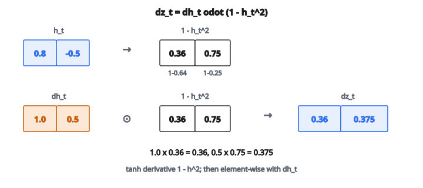

# RNN Step Backward (Vanilla RNN)

## Nhắc lại lượt truyền xuôi

Trước khi hiểu lượt truyền ngược, nhắc lại lượt truyền xuôi của vanilla RNN cell:

$$
h_t = \tanh(W_{xh} \cdot x_t + W_{hh} \cdot h_{t-1} + b_h)
$$

với

* $x_t$ là đầu vào tại time step $t$ (shape: `input_size`)
* $h_{t-1}$ là hidden state từ time step trước (shape: `hidden_size`)
* $h_t$ là hidden state mới (shape: `hidden_size`)
* $W_{xh}$ là ma trận trọng số input-to-hidden (shape: `hidden_size` $\times$ `input_size`)
* $W_{hh}$ là ma trận trọng số hidden-to-hidden (shape: `hidden_size` $\times$ `hidden_size`)
* $b_h$ là vector bias (shape: `hidden_size`)

Phép tính có thể tách thành các bước:

1. Tính tổ hợp tuyến tính: $z_t = W_{xh} \cdot x_t + W_{hh} \cdot h_{t-1} + b_h$
2. Áp hàm kích hoạt: $h_t = \tanh(z_t)$

## Lan truyền ngược tính gì

Cho gradient của loss theo $h_t$ (ký hiệu $\frac{\partial L}{\partial h_t}$ hoặc $dh_t$), lượt truyền ngược tính:

1. **Gradient theo đầu vào:** $\frac{\partial L}{\partial x_t}$
2. **Gradient theo hidden state trước:** $\frac{\partial L}{\partial h_{t-1}}$
3. **Gradient theo trọng số:** $\frac{\partial L}{\partial W_{xh}}$, $\frac{\partial L}{\partial W_{hh}}$
4. **Gradient theo bias:** $\frac{\partial L}{\partial b_h}$

Các gradient này dùng để:

* Cập nhật trọng số lúc huấn luyện
* Đẩy gradient về các time step sớm hơn (backpropagation through time)

## Quy tắc chuỗi qua tanh

Gradient chảy ngược qua hàm kích hoạt tanh trước.

**Đạo hàm tanh:**

$$
\frac{d}{dz} \tanh(z) = 1 - \tanh^{2}(z)
$$

Vì đã tính $h_t = \tanh(z_t)$ ở lượt truyền xuôi, đạo hàm là:

$$
\frac{d}{dz_t} \tanh(z_t) = 1 - h_t^{2}
$$

**Gradient theo $z_t$:**

$$
\frac{\partial L}{\partial z_t} = \frac{\partial L}{\partial h_t} \odot (1 - h_t^{2})
$$

với $\odot$ là nhân từng phần tử.

Đại lượng này thường ký hiệu $dz_t$ hoặc $d_{\text{raw}}$.

## Gradient theo trọng số và bias

Đã có $\frac{\partial L}{\partial z_t}$, ta tính gradient theo tham số.

**Gradient theo $W_{xh}$:**

Vì $z_t = W_{xh} \cdot x_t + \cdots$, gradient là:

$$
\frac{\partial L}{\partial W_{xh}} = \frac{\partial L}{\partial z_t} \cdot x_t^{T}
$$

Đây là tích ngoài: $(\text{hidden\_size}, 1)$ nhân $(\text{1}, \text{input\_size})$ cho $(\text{hidden\_size}, \text{input\_size})$.

**Gradient theo $W_{hh}$:**

Vì $z_t = \cdots + W_{hh} \cdot h_{t-1} + \cdots$, gradient là:

$$
\frac{\partial L}{\partial W_{hh}} = \frac{\partial L}{\partial z_t} \cdot h_{t-1}^{T}
$$

**Gradient theo $b_h$:**

Vì $z_t = \cdots + b_h$, gradient đơn giản là:

$$
\frac{\partial L}{\partial b_h} = \frac{\partial L}{\partial z_t}
$$

Gradient bằng đúng $dz_t$ (cộng theo batch nếu có batch).

## Gradient theo đầu vào

**Gradient theo $x_t$:**

$$
\frac{\partial L}{\partial x_t} = W_{xh}^{T} \cdot \frac{\partial L}{\partial z_t}
$$

Gradient này đẩy về đầu vào, cần nếu có lớp trước RNN.

**Gradient theo $h_{t-1}$:**

$$
\frac{\partial L}{\partial h_{t-1}} = W_{hh}^{T} \cdot \frac{\partial L}{\partial z_t}
$$

Đây là bước **then chốt** cho backpropagation through time. Nó gửi gradient về time step trước.

## Lan truyền ngược từng bước

Cho: $dh_t = \frac{\partial L}{\partial h_t}$ (gradient từ loss hoặc từ time step sau)

**Bước 1: lan truyền ngược qua tanh**

$$
dz_t = dh_t \odot (1 - h_t^{2})
$$

**Bước 2: tính gradient trọng số**

$$
dW_{xh} = dz_t \cdot x_t^{T}
$$

$$
dW_{hh} = dz_t \cdot h_{t-1}^{T}
$$

$$
db_h = dz_t
$$

**Bước 3: tính gradient đầu vào**

$$
dx_t = W_{xh}^{T} \cdot dz_t
$$

$$
dh_{t-1} = W_{hh}^{T} \cdot dz_t
$$

## Ví dụ số

Giả sử:

* `hidden_size` $= 2$, `input_size` $= 3$
* $h_t = [0.8,\, -0.5]$ (từ lượt truyền xuôi)
* $dh_t = [1.0,\, 0.5]$ (gradient từ loss)
* $x_t = [1,\, 2,\, 3]$
* $h_{t-1} = [0.3,\, 0.7]$

**Bước 1: lan truyền ngược qua tanh**

$$
1 - h_t^{2} = [1 - 0.64,\, 1 - 0.25] = [0.36,\, 0.75]
$$

$$
dz_t = [1.0 \times 0.36,\, 0.5 \times 0.75] = [0.36,\, 0.375]
$$

::: {#fig-89-rnn-backward fig-cap="dz_t = dh_t ⊙ (1 − h_t²): với h_t = [0.8, −0.5] và dh_t = [1.0, 0.5] ta được dz_t = [0.36, 0.375]." fig-alt="Nhân từng phần tử: h_t = [0.8, -0.5] cho 1 − h_t² = [0.36, 0.75]; nhân dh_t = [1.0, 0.5] ra dz_t = [0.36, 0.375]."}
{fig-align="center"}
:::

**Bước 2: gradient trọng số**

$$
\begin{aligned}
dW_{xh}
&= dz_t \cdot x_t^{T} \\
&= \begin{bmatrix} 0.36 \\ 0.375 \end{bmatrix} \cdot \begin{bmatrix} 1 & 2 & 3 \end{bmatrix} \\
&= \begin{bmatrix} 0.36 & 0.72 & 1.08 \\ 0.375 & 0.75 & 1.125 \end{bmatrix}
\end{aligned}
$$

$$
\begin{aligned}
dW_{hh}
&= dz_t \cdot h_{t-1}^{T} \\
&= \begin{bmatrix} 0.36 \\ 0.375 \end{bmatrix} \cdot \begin{bmatrix} 0.3 & 0.7 \end{bmatrix} \\
&= \begin{bmatrix} 0.108 & 0.252 \\ 0.1125 & 0.2625 \end{bmatrix}
\end{aligned}
$$

$$
db_h = [0.36,\, 0.375]
$$

**Bước 3: gradient đầu vào**

Các giá trị này phụ thuộc giá trị thật của $W_{xh}$ và $W_{hh}$.

## Backpropagation Through Time (BPTT)

Với sequence độ dài $T$, lượt truyền ngược đi từ $t = T$ về $t = 1$:

1. Tại $t = T$: nhận $dh_T$ từ loss
2. Tính gradient cho bước $T$, được $dh_{T-1}$
3. Tại $t = T-1$: $dh_{T-1}$ còn có thể nhận thêm gradient từ loss tại bước đó
4. Tiếp tục về $t = 1$

Gradient trọng số được **cộng dồn** trên mọi time step:

$$
dW_{xh} = \sum_{t=1}^{T} dW_{xh}^{(t)}
$$

Cùng trọng số được dùng ở mọi time step, nên gradient của chúng cộng lại.

## Vanishing gradient

Tại mỗi bước ngược, $dh_{t-1}$ được tính:

$$
dh_{t-1} = W_{hh}^{T} \cdot \bigl(dh_t \odot (1 - h_t^{2})\bigr)
$$

Đạo hàm tanh $(1 - h_t^{2})$ tối đa bằng $1$ (khi $h_t = 0$) và thường nhỏ hơn nhiều. Nhân với đại lượng này nhiều lần làm gradient co theo cấp số nhân.

Sau $50$–$100$ time step, $dh_1$ có thể về bản chất bằng không, khiến mạng không học được phụ thuộc tầm xa.

Đó là lý do LSTM và GRU ra đời: chúng tạo đường cho gradient chảy mà không bị nhân lặp với số nhỏ.

## Code
```python
import numpy as np

def rnn_step_backward(dh, cache):
    """
    Returns:
        dx_t: gradient wrt input x_t      (shape: D,)
        dh_prev: gradient wrt previous h (shape: H,)
        dW: gradient wrt W               (shape: H x D)
        dU: gradient wrt U               (shape: H x H)
        db: gradient wrt bias            (shape: H,)
    """
    x, h_prev, h_next, W, U, b = [np.asarray(c, dtype=float) for c in cache]
    dh = np.asarray(dh, dtype=float)
    dtanh = dh * (1.0 - h_next ** 2)
    db = dtanh.copy()
    dW = np.outer(dtanh, x)
    dU = np.outer(dtanh, h_prev)
    dx = W.T @ dtanh
    dh_prev = U.T @ dtanh
    return dx, dh_prev, dW, dU, db

```
