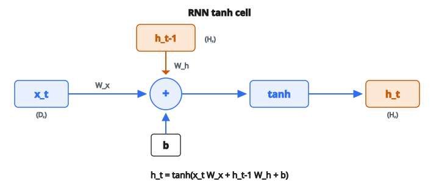

# RNN Step Forward (Tanh Cell)

## Vì sao sequence cần kiến trúc khác

Mạng nơ-ron chuẩn nhận đầu vào kích thước cố định và cho đầu ra kích thước cố định. Chúng không có khái niệm **thứ tự**. Đưa vào các từ “dog bites man” hay “man bites dog”, chúng thấy cùng một bag of words.

Nhưng nhiều bài toán vốn tuần tự:

* **Language**: thứ tự từ quyết định nghĩa
* **Audio**: waveform là dòng mẫu theo thời gian
* **Finance**: giá cổ phiếu tạo thành time series
* **Sensor**: số đo đến lần lượt

Trong mọi trường hợp trên, **phần tử sớm ảnh hưởng phần tử muộn**, và độ dài sequence có thể thay đổi. Recurrent Neural Network (RNN) xử lý việc này bằng cách duy trì **hidden state** được cập nhật ở mọi time step, đóng vai trò bộ nhớ chạy của những gì mạng đã thấy.

## Hidden state

Hidden state $h_t$ là vector kích thước $H$ tóm tắt mọi thứ mạng đã xử lý đến thời điểm $t$. Có thể nghĩ đây là “bộ nhớ làm việc” của mạng.

* Tại $t = 0$, mạng đọc đầu vào thứ nhất và tạo $h_0$.
* Tại $t = 1$, nó đọc đầu vào thứ hai **và** $h_0$, tạo $h_1$.
* Tại $t = 2$, nó đọc đầu vào thứ ba **và** $h_1$, tạo $h_2$.
* …và tiếp tục.

Mỗi hidden state mang tiếp một biểu diễn nén của toàn bộ lịch sử. Mạng không nhìn trực tiếp đầu vào quá khứ thô. Nó chỉ thấy đầu vào hiện tại và hidden state trước.

Hidden state ban đầu $h_{-1}$ thường được đặt bằng vector không.

## RNN cell tanh

Quy tắc cập nhật của RNN cell đơn giản nhất là:

$$
h_t = \tanh(x_t \, W_x + h_{t-1} \, W_h + b)
$$

Ba thành phần được **cộng lại** trước khi áp $\tanh$:

**1. Đóng góp đầu vào:** $x_t W_x$

* $x_t$ là đầu vào hiện tại, shape $(D,)$
* $W_x$ là ma trận trọng số đầu vào, shape $(D, H)$
* Tích có shape $(H,)$: chiếu đầu vào vào không gian hidden
* Đây là cách mạng “đọc” time step hiện tại

**2. Đóng góp hồi tiếp:** $h_{t-1} W_h$

* $h_{t-1}$ là hidden state trước, shape $(H,)$
* $W_h$ là ma trận trọng số hidden, shape $(H, H)$
* Tích có shape $(H,)$: biến đổi bộ nhớ trước
* Đây là **recurrent connection**, phần cho mạng có bộ nhớ
* $W_h$ vuông vì hidden state giữ nguyên kích thước qua các time step

**3. Bias:** $b$

* Shape $(H,)$, một offset học được cộng vào pre-activation

Sau khi cộng cả ba, hàm $\tanh$ nén mỗi phần tử vào $[-1, 1]$. Kết quả là hidden state mới $h_t$.

::: {#fig-84-rnn-tanh-cell fig-cap="h_t = tanh(x_t W_x + h_{t−1} W_h + b): đầu vào hiện tại và bộ nhớ trước được cộng rồi nén bởi tanh." fig-alt="Sơ đồ RNN tanh cell: x_t nhân W_x và h_{t-1} nhân W_h, cộng bias b, rồi tanh cho h_t."}
{fig-align="center"}
:::

## Vì sao tanh?

* **Zero-centered**: đầu ra trong $[-1, 1]$, nên hidden state có thể dương hoặc âm. Gradient thường tốt hơn sigmoid (chỉ cho giá trị dương).
* **Bị chặn**: ngăn hidden state tăng không giới hạn qua nhiều time step.
* **Mượt**: khả vi trên toàn miền, cần cho huấn luyện dựa trên gradient.

Bão hòa ở hai đầu (đầu ra hầu như không đổi khi đầu vào rất lớn hoặc rất nhỏ) vừa là ưu điểm (chặn biên) vừa là nhược điểm (vanishing gradient), thảo luận bên dưới.

## Unroll theo thời gian

Để xử lý cả sequence $x_0, x_1, x_2, \ldots$, cùng một cell được áp lặp lại:

$$
h_0 = \tanh(x_0 W_x + h_{-1} W_h + b)
$$

$$
h_1 = \tanh(x_1 W_x + h_0 W_h + b)
$$

$$
h_2 = \tanh(x_2 W_x + h_1 W_h + b)
$$

Hai điểm quan trọng:

* **Weight sharing**: cùng $W_x$, $W_h$, và $b$ được dùng ở mọi bước. Số tham số không tăng theo độ dài sequence. Sequence dài $10$ và sequence dài $10{,}000$ dùng cùng trọng số.
* **Chuỗi phụ thuộc**: $h_2$ phụ thuộc $h_1$, $h_1$ phụ thuộc $h_0$, $h_0$ phụ thuộc $h_{-1}$. Thông tin chảy xuôi theo chuỗi này. Huấn luyện phải gửi gradient ngược lại, gọi là **Backpropagation Through Time (BPTT)**.

## Vanishing gradient

Trong BPTT, gradient ở mỗi bước bị nhân với:

* Đạo hàm của $\tanh$ (tối đa $1$, thường nhỏ hơn nhiều)
* Ma trận trọng số $W_h$

Sau nhiều bước, các phép nhân lặp này làm gradient **co theo cấp số nhân**. Hệ quả:

* Mạng học mẫu tầm ngắn (vài bước trước) dễ dàng
* Khó với phụ thuộc tầm xa (thông tin từ $50$ hoặc $100$ bước trước)
* Phần đầu sequence hầu như không nhận tín hiệu gradient

Đó là lý do RNN tanh thuần đã phần lớn bị thay bởi kiến trúc có cổng.

## LSTM và GRU: giải vanishing gradient

**LSTM** (Long Short-Term Memory) thêm **cell state** $c_t$ riêng chảy theo thời gian với ít thay đổi, được ba gate kiểm soát:

* **Forget gate**: quyết định xóa gì khỏi cell state
* **Input gate**: quyết định ghi thông tin mới nào
* **Output gate**: quyết định lộ bao nhiêu ra hidden state

Ý then chốt: cell state có thể mang thông tin không đổi qua nhiều bước khi forget gate gần $1$, để gradient chảy mà không bị co.

**GRU** (Gated Recurrent Unit) là biến thể đơn giản hơn với hai gate:

* **Reset gate**: kiểm soát quên bao nhiêu state trước
* **Update gate**: kiểm soát tỉ lệ giữa state cũ và candidate mới

Cả hai kiến trúc đều xây trên cùng ý cốt lõi của RNN tanh (kết hợp đầu vào + state trước, rồi phi tuyến), nhưng thêm cơ chế gating để gradient sống sót trên sequence dài.

## RNN tanh xuất hiện ở đâu

* **Natural language processing**: RNN từng là kiến trúc chủ đạo cho dịch máy, sinh văn bản, và phân tích cảm xúc trước khi Transformer chiếm chỗ
* **Speech recognition**: xử lý audio từng frame, giữ state xuyên suốt utterance
* **Time series forecasting**: dự đoán giá trị tương lai từ mẫu lịch sử
* **Reservoir computing**: RNN tanh dùng với trọng số hồi tiếp cố định (không huấn luyện); chỉ lớp đầu ra được học
* **Khối xây dựng**: mẫu “tổ hợp tuyến tính rồi phi tuyến” trong tanh cell là nguyên tử dùng trong LSTM gate, GRU gate, và nhiều kiến trúc khác

## Code
```python
import numpy as np

def rnn_step_forward(x_t, h_prev, Wx, Wh, b):
    """
    Returns: h_t of shape (H,)
    """
    x_t = np.asarray(x_t)
    h_prev = np.asarray(h_prev)
    Wx = np.asarray(Wx)
    Wh = np.asarray(Wh)
    b = np.asarray(b)
    pre_act = x_t @ Wx + h_prev @ Wh + b
    h_t = np.tanh(pre_act)
    return h_t

```

<!-- CROSSLINK_RNN -->

::: {.callout-tip}
## Học tiếp
Chuỗi kiến trúc sequence: [RNN](../../architecture-models/RNN/index.qmd) → [LSTM](../../architecture-models/LSTM/index.qmd) → [GRU](../../architecture-models/GRU/index.qmd). Mini GRU: [Mini GRU Cell](build-a-mini-gru-cell-forward-pass.qmd).
:::
