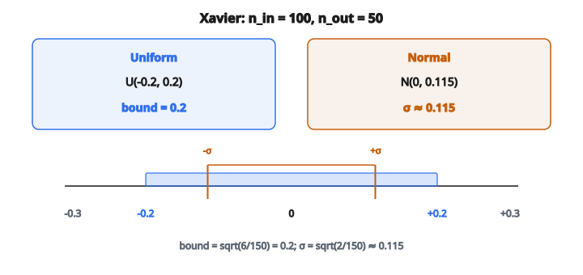

# Xavier Initialization

## Vấn đề khởi tạo

Huấn luyện mạng neural bắt đầu với trọng số ngẫu nhiên. Khởi tạo kém gây ra:

**Vanishing gradients:** Trọng số quá nhỏ, activation co qua các lớp, gradient trở nên cực nhỏ.

**Exploding gradients:** Trọng số quá lớn, activation phình qua các lớp, gradient trở nên cực lớn.

Cả hai đều cản học hiệu quả. Mạng hoặc không học gì (vanishing) hoặc mất ổn định (exploding).

## Mục tiêu của khởi tạo tốt

Ta muốn activation và gradient giữ **phương sai ổn định** khi chảy xuyên mạng:

* Lượt xuôi: phương sai activation gần như không đổi qua các lớp
* Lượt ngược: phương sai gradient gần như không đổi qua các lớp

Điều này đòi hỏi chọn phân phối trọng số ban đầu dựa trên kích thước lớp.

## Xavier Initialization (Glorot Initialization)

Xavier initialization, do Glorot và Bengio đề xuất (2010), đặt trọng số để giữ phương sai cho **activation tuyến tính** và **tanh/sigmoid**.

**Insight chính:** Với lớp có $n_{in}$ đầu vào và $n_{out}$ đầu ra, phương sai trọng số nên là:

$$
\operatorname{Var}(W) = \frac{2}{n_{in} + n_{out}}
$$

Công thức này cân bằng nhu cầu của cả lượt xuôi và lượt ngược.

## Phân phối đều Xavier

Lấy trọng số đều từ:

$$
W \sim U\left(-\sqrt{\frac{6}{n_{in} + n_{out}}}, \sqrt{\frac{6}{n_{in} + n_{out}}}\right)
$$

Cận $\pm\sqrt{\frac{6}{n_{in} + n_{out}}}$ cho đúng phương sai của phân phối đều.

**Ví dụ:** Lớp 100 đầu vào, 50 đầu ra

$$
\text{bound} = \sqrt{\frac{6}{100 + 50}} = \sqrt{0.04} = 0.2
$$

Trọng số lấy từ $U(-0.2, 0.2)$

## Phân phối chuẩn Xavier

Lấy trọng số từ phân phối chuẩn:

$$
W \sim N\left(0, \sqrt{\frac{2}{n_{in} + n_{out}}}\right)
$$

Độ lệch chuẩn là $\sqrt{\frac{2}{n_{in} + n_{out}}}$.

**Ví dụ:** Lớp 100 đầu vào, 50 đầu ra

$$
\sigma = \sqrt{\frac{2}{150}} = \sqrt{0.0133} \approx 0.115
$$

Trọng số lấy từ $N(0, 0.115)$

::: {#fig-152-xavier-bound fig-cap="Với n_in = 100 và n_out = 50: Xavier uniform có bound = 0.2, Xavier normal có σ ≈ 0.115." fig-alt="So sánh Xavier uniform bound = 0.2 và Xavier normal σ ≈ 0.115 với n_in = 100, n_out = 50."}
{fig-align="center"}
:::

## Trực giác suy ra công thức

Xét lớp tuyến tính $y = Wx$ với $W$ có shape $(n_{out}, n_{in})$.

Mỗi đầu ra $y_j = \sum_{i=1}^{n_{in}} W_{ji} x_i$

Giả sử $x_i$ và $W_{ji}$ độc lập, kỳ vọng không:

$$
\operatorname{Var}(y_j) = n_{in} \cdot \operatorname{Var}(W) \cdot \operatorname{Var}(x)
$$

Để giữ $\operatorname{Var}(y) = \operatorname{Var}(x)$:

$$
\operatorname{Var}(W) = \frac{1}{n_{in}}
$$

Với lượt ngược (gradient), phân tích tương tự cho $\operatorname{Var}(W) = \frac{1}{n_{out}}$.

Xavier thỏa hiệp: $\operatorname{Var}(W) = \frac{2}{n_{in} + n_{out}}$

## Khi Xavier hoạt động tốt

Xavier initialization được thiết kế cho:

**Activation tuyến tính:** Hàm đồng nhất, không có phi tuyến

**Activation bão hòa:** Tanh và sigmoid, nén vào một khoảng bị chặn

Các activation này có gradient gần 1 quanh không, khớp giả thiết của Xavier.

## Khi Xavier không hoạt động tốt

**Activation ReLU:**

ReLU đưa mọi giá trị âm về không, về thực chất giảm một nửa phương sai activation. Xavier initialization làm phương sai co qua các lớp dùng ReLU.

Với ReLU và các biến thể (Leaky ReLU, ELU), dùng **He initialization** thay thế.

## Fan-in và fan-out

**Fan-in ($n_{in}$):** Số đầu vào tới một neuron

**Fan-out ($n_{out}$):** Số đầu ra từ một neuron

Các biến thể nhấn mạnh một trong hai:

**Xavier (cân bằng):** Dùng cả hai: $\frac{2}{n_{in} + n_{out}}$

**LeCun initialization:** Chỉ dùng fan-in: $\frac{1}{n_{in}}$

Cách cân bằng phục vụ cả lượt xuôi và lượt ngược.

## Với lớp convolution

Với lớp conv có kernel size $(k_h, k_w)$, $c_{in}$ channel đầu vào, $c_{out}$ channel đầu ra:

**Fan-in:** $n_{in} = c_{in} \times k_h \times k_w$

**Fan-out:** $n_{out} = c_{out} \times k_h \times k_w$

Áp dụng Xavier với các giá trị này.

**Ví dụ:** Conv $3 \times 3$, 64 channel đầu vào, 128 channel đầu ra

$$
n_{in} = 64 \times 3 \times 3 = 576
$$

$$
n_{out} = 128 \times 3 \times 3 = 1152
$$

$$
\operatorname{Var}(W) = \frac{2}{576 + 1152} = \frac{2}{1728} \approx 0.00116
$$

## So sánh các phương pháp khởi tạo

**Khởi tạo không:**
Mọi trọng số $= 0$. Rất tệ: mọi neuron tính cùng một thứ, không học được.

**Ngẫu nhiên nhỏ:**
$W \sim N(0, 0.01)$. Có thể dùng cho mạng nông, thất bại với mạng sâu.

**Xavier:**
Phương sai scale theo kích thước lớp. Phù hợp tanh/sigmoid.

**He:**
Phương sai scale cho ReLU. Chuẩn cho CNN hiện đại.

## Thực hành

**Với activation tanh/sigmoid:** Dùng Xavier

**Với ReLU/Leaky ReLU:** Dùng He initialization

**Với SELU:** Dùng LeCun initialization

**Với Transformer:** Thường dùng Xavier hoặc khởi tạo scale tùy chỉnh

Hầu hết framework deep learning cung cấp cả hai:

* Xavier/Glorot uniform và normal
* He/Kaiming uniform và normal

## Bias

Bias thường được khởi tạo bằng **không**:

$$
b = 0
$$

Bias không gặp cùng vấn đề scale như trọng số. Khởi tạo không thì đơn giản và hiệu quả.

Một số ngoại lệ:

* Bias cổng forget của LSTM thường khởi tạo bằng 1
* Một số kiến trúc có thể dùng bias dương nhỏ

## Bối cảnh lịch sử

Trước Xavier (trước 2010):

* Khởi tạo ngẫu nhiên nhỏ là phổ biến
* Mạng sâu khó huấn luyện
* Người ta nghĩ deep learning không hiệu quả

Xavier initialization là bước đột phá then chốt giúp huấn luyện mạng sâu hơn, cùng với:

* Hàm kích hoạt tốt hơn
* Batch normalization
* Skip connection

## Kiểm chứng thực nghiệm

Có thể kiểm tra chất lượng khởi tạo bằng cách:

1. Khởi tạo mạng
2. Đưa dữ liệu ngẫu nhiên qua (lượt xuôi)
3. Kiểm tra thống kê activation tại mỗi lớp
4. Phương sai nên gần như không đổi (không phình cũng không co)

Nếu phương sai sụp về 0 hoặc nổ ra vô cùng, khởi tạo sai.

## Code
```python
import math

def xavier_initialization(W, fan_in, fan_out):
    """
    Scale raw weights to Xavier uniform initialization.
    """
    limit = math.sqrt(6.0 / (fan_in + fan_out))
    return [[round(W[i][j] * 2 * limit - limit, 4) for j in range(len(W[0]))] for i in range(len(W))]

```
