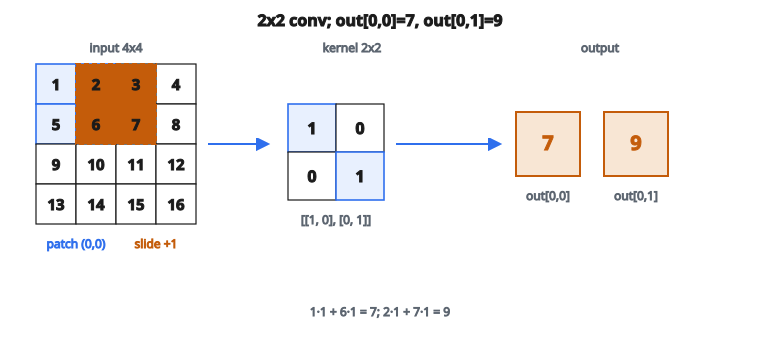

# 2D Convolution (lọc ảnh)

## Convolution là gì

Convolution là phép toán kết hợp hai tín hiệu để tạo ra tín hiệu thứ ba. Trong xử lý ảnh, kernel (ma trận nhỏ) trượt trên ảnh và tính tổng có trọng số tại mỗi vị trí.

Phép toán có hai thành phần chính:

* **Image**: lưới 2D các giá trị pixel
* **Kernel** (hay filter): ma trận 2D nhỏ chứa trọng số (thường $3 \times 3$, $5 \times 5$, hoặc $7 \times 7$)

Tại mỗi vị trí, kernel được đặt lên ảnh, các phần tử tương ứng nhân với nhau, rồi mọi tích được cộng lại thành một giá trị đầu ra.

## Công thức convolution

Với ảnh $I$ và kernel $K$ kích thước $k_h \times k_w$:

$$
\text{output}[i][j] = \sum_{m=0}^{k_h-1} \sum_{n=0}^{k_w-1} I[i+m][j+n] \cdot K[m][n]
$$

Đây là tích vô hướng giữa kernel và từng patch ảnh.

## Ví dụ số

**Ảnh ($4 \times 4$):**

$$
\begin{bmatrix}
1 & 2 & 3 & 4 \\
5 & 6 & 7 & 8 \\
9 & 10 & 11 & 12 \\
13 & 14 & 15 & 16
\end{bmatrix}
$$

**Kernel ($2 \times 2$):**

$$
\begin{bmatrix}
1 & 0 \\
0 & 1
\end{bmatrix}
$$

::: {#fig-120-conv-filter fig-cap="Kernel $2\times 2$ trượt trên ảnh $4\times 4$: $\mathrm{out}[0,0]=1\cdot 1+6\cdot 1=7$ và $\mathrm{out}[0,1]=2\cdot 1+7\cdot 1=9$." fig-alt="Anh 4x4, kernel 2x2 [[1,0],[0,1]]; cua so top-left cho out[0,0]=7, cua so truot sang phai cho out[0,1]=9."}
{fig-align="center"}
:::

**Tính $\mathrm{output}[0][0]$:**

* Đặt kernel lên patch $2 \times 2$ góc trên-trái của ảnh
* Nhân từng phần tử: $1\cdot 1 + 2\cdot 0 + 5\cdot 0 + 6\cdot 1 = 1 + 0 + 0 + 6 = 7$

**Tính $\mathrm{output}[0][1]$:**

* Trượt kernel sang phải một vị trí
* Nhân: $2\cdot 1 + 3\cdot 0 + 6\cdot 0 + 7\cdot 1 = 2 + 0 + 0 + 7 = 9$

Tiếp tục trượt để điền toàn bộ đầu ra.

## Padding

Không padding thì đầu ra nhỏ hơn đầu vào:

* Input: $H \times W$
* Kernel: $k \times k$
* Output: $(H - k + 1) \times (W - k + 1)$

Padding thêm số 0 quanh biên ảnh để kiểm soát kích thước đầu ra:

**No padding (valid):**

* Đầu ra co lại
* Mất thông tin ở mép

**Same padding:**

* Thêm đủ số 0 để đầu ra bằng kích thước đầu vào
* Với kernel $3 \times 3$: $\mathrm{pad} = 1$ mỗi phía

**Full padding:**

* Thêm $k-1$ số 0 mỗi phía
* Đầu ra lớn hơn đầu vào

## Stride

Stride kiểm soát kernel dịch bao nhiêu pixel giữa hai vị trí:

**Stride $= 1$:**

* Kernel dịch một pixel mỗi lần
* Overlap giữa các patch là lớn nhất
* Đầu ra lớn nhất

**Stride $= 2$:**

* Kernel dịch hai pixel mỗi lần
* Overlap ít hơn
* Đầu ra khoảng một nửa mỗi chiều

**Công thức kích thước đầu ra:**

$$
H_{\text{out}} = \left\lfloor \frac{H + 2p - k_h}{s} \right\rfloor + 1
$$

$$
W_{\text{out}} = \left\lfloor \frac{W + 2p - k_w}{s} \right\rfloor + 1
$$

với $p$ là padding và $s$ là stride.

## Các kernel khác nhau làm gì

**Identity (không đổi):**

$$
\begin{bmatrix}
0 & 0 & 0 \\
0 & 1 & 0 \\
0 & 0 & 0
\end{bmatrix}
$$

**Phát hiện cạnh ngang:**

$$
\begin{bmatrix}
-1 & -1 & -1 \\
0 & 0 & 0 \\
1 & 1 & 1
\end{bmatrix}
$$

**Phát hiện cạnh dọc:**

$$
\begin{bmatrix}
-1 & 0 & 1 \\
-1 & 0 & 1 \\
-1 & 0 & 1
\end{bmatrix}
$$

**Blur (trung bình):**

$$
\begin{bmatrix}
1/9 & 1/9 & 1/9 \\
1/9 & 1/9 & 1/9 \\
1/9 & 1/9 & 1/9
\end{bmatrix}
$$

**Sharpen:**

$$
\begin{bmatrix}
0 & -1 & 0 \\
-1 & 5 & -1 \\
0 & -1 & 0
\end{bmatrix}
$$

Mỗi kernel trích một loại đặc trưng khác nhau từ ảnh.

## Convolution trong mạng nơ-ron

Trong CNN, convolution học cách phát hiện đặc trưng:

**Layer 1:** Học mẫu đơn giản (cạnh, màu)

**Layer 2:** Kết hợp đặc trưng layer 1 (góc, texture)

**Layer 3+:** Học mẫu phức tạp (vật thể, khuôn mặt)

Khác biệt chính so với xử lý ảnh cổ điển:

* Giá trị kernel được **học** từ dữ liệu, không thiết kế tay
* Nhiều kernel mỗi layer tạo nhiều feature map
* Hàm kích hoạt phi tuyến (ReLU) được áp sau convolution

## Convolution đa channel

Ảnh thật có 3 channel (RGB). Kernel cũng có 3 channel:

**Input:** $H \times W \times 3$

**Kernel:** $k \times k \times 3$

Convolution cộng qua mọi channel:

$$
\text{output}[i][j] = \sum_{c=0}^{C-1} \sum_{m} \sum_{n} I[i+m][j+n][c] \cdot K[m][n][c]
$$

Để có nhiều channel đầu ra, dùng nhiều kernel. Với $N$ channel đầu ra, cần $N$ kernel, mỗi cái kích thước $k \times k \times C$.

## Vì sao convolution phù hợp với ảnh

**Kết nối cục bộ:**

* Mỗi đầu ra chỉ phụ thuộc một vùng nhỏ của đầu vào
* Bắt mẫu cục bộ như cạnh và texture
* Ít tham số hơn nhiều so với lớp fully connected

**Chia sẻ trọng số:**

* Cùng một kernel áp tại mọi vị trí
* Bộ phát hiện mẫu hoạt động ở mọi nơi trên ảnh
* Equivariance theo tịnh tiến: nếu đầu vào dịch, đầu ra dịch cùng cách

**Đặc trưng phân cấp:**

* Xếp nhiều lớp conv
* Layer sớm: đặc trưng cục bộ
* Layer sau: đặc trưng toàn cục

## Cấu hình convolution thường gặp

**Kernel $3 \times 3$, stride 1, padding 1:**

* Phổ biến nhất trong kiến trúc hiện đại
* Đầu ra cùng kích thước đầu vào
* VGG, ResNet dùng rất nhiều

**Kernel $1 \times 1$:**

* Không nhìn hàng xóm không gian
* Trộn thông tin giữa các channel
* Dùng trong Inception và bottleneck của ResNet

**Kernel lớn ($7 \times 7$, $11 \times 11$):**

* Dùng ở layer sớm của một số kiến trúc
* Receptive field lớn hơn
* Nhiều tham số hơn, nay ít gặp hơn

## Code
```python
def conv2d(image, kernel, stride=1, padding=0):
    """
    Apply 2D convolution to a single-channel image.
    """
    h, w = len(image), len(image[0])
    kh, kw = len(kernel), len(kernel[0])
    if padding > 0:
        padded = [[0.0] * (w + 2 * padding) for _ in range(h + 2 * padding)]
        for i in range(h):
            for j in range(w):
                padded[i + padding][j + padding] = image[i][j]
    else:
        padded = [r[:] for r in image]
    ph, pw = len(padded), len(padded[0])
    oh = (ph - kh) // stride + 1
    ow = (pw - kw) // stride + 1
    out = []
    for i in range(oh):
        row = []
        for j in range(ow):
            v = 0.0
            for ki in range(kh):
                for kj in range(kw):
                    v += padded[i * stride + ki][j * stride + kj] * kernel[ki][kj]
            row.append(v)
        out.append(row)
    return out

```

<!-- CROSSLINK_CONV -->

::: {.callout-tip}
## Học tiếp
Convolution trong AlexNet (geometry, stride, channel): [AlexNet — Convolution](../../architecture-models/AlexNet/convolution.qmd).
:::

<!-- auto-self-check -->

::: {.callout-note}
## Kiểm tra nhanh
<details>
<summary>Ý chính của bài «2D Convolution (lọc ảnh)» là gì?</summary>
Convolution là phép toán kết hợp hai tín hiệu để tạo ra tín hiệu thứ ba.
</details>
<details>
<summary>Công thức / quan hệ cốt lõi trong bài là gì?</summary>
$$\text{output}[i][j] = \sum_{m=0}^{k_h-1} \sum_{n=0}^{k_w-1} I[i+m][j+n] \cdot K[m][n]$$
</details>
:::
