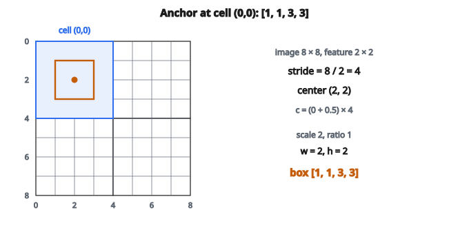

# Anchor Box Generation

## Anchor box là gì

**Anchor box** (còn gọi là prior box hoặc default box) là các bounding box định sẵn dùng trong object detection. Thay vì dự đoán tọa độ hộp từ đầu, mạng dự đoán phần chỉnh so với các anchor này.

Ý then chốt: rải anchor dày trên ảnh, rồi phân loại từng anchor có chứa đối tượng hay không, và tinh chỉnh tọa độ hộp.

## Vì sao dùng anchor

**Khó khăn khi không có anchor:**

* Mạng phải dự đoán tọa độ tuyệt đối $(x, y, w, h)$
* Không gian tìm kiếm lớn
* Khó học

**Khi có anchor:**

* Mạng dự đoán offset nhỏ so với vị trí đã biết
* Mỗi anchor là một “đoán trước” để mạng tinh chỉnh
* Bài toán tối ưu dễ hơn nhiều

Tương tự hồi quy: dự đoán phần dư so với một baseline dễ hơn dự đoán giá trị thô.

## Tham số của anchor

Anchor được xác định bởi:

**Vị trí (từ lưới feature map):**

* Mỗi ô trên feature map sinh các anchor
* Tâm anchor nằm tại tâm ô, theo tọa độ ảnh

**Scale:**

* Kích thước cơ sở của anchor
* Ví dụ: $32$, $64$, $128$ pixel

**Aspect ratio:**

* Tỉ lệ rộng trên cao
* Ví dụ: $1:1$ (vuông), $1:2$ (cao), $2:1$ (rộng)

Mỗi tổ hợp (vị trí, scale, aspect ratio) cho một anchor.

## Từ lưới feature map sang tọa độ ảnh

Feature map nhỏ hơn ảnh (do pooling / stride). Để ánh xạ vị trí lưới sang tọa độ ảnh:

$$
\mathrm{stride} = \frac{\text{kích thước ảnh}}{\text{kích thước feature}}
$$

Với ô lưới $(i, j)$:

$$
c_x = (j + 0.5) \times \mathrm{stride}
$$

$$
c_y = (i + 0.5) \times \mathrm{stride}
$$

Số $+0.5$ đặt anchor đúng tâm ô.

## Tính kích thước anchor

Cho scale $s$ và aspect ratio $r$:

$$
w = s \cdot \sqrt{r}
$$

$$
h = \frac{s}{\sqrt{r}}
$$

Nhờ đó diện tích anchor xấp xỉ $s^2$ bất kể tỉ lệ khung.

**Ví dụ với $\mathrm{scale}=64$, $\mathrm{ratio}=2$ (rộng):**

* $w = 64 \cdot \sqrt{2} \approx 90.5$
* $h = 64 / \sqrt{2} \approx 45.3$
* Diện tích $= 90.5 \cdot 45.3 = 4099$ (gần $64^2 = 4096$)

## Tọa độ hộp anchor

Hộp anchor dạng $(x_1, y_1, x_2, y_2)$:

$$
x_1 = c_x - \frac{w}{2}, \quad y_1 = c_y - \frac{h}{2}
$$

$$
x_2 = c_x + \frac{w}{2}, \quad y_2 = c_y + \frac{h}{2}
$$

## Ví dụ số

**Tham số:**

* Kích thước feature: $2 \times 2$
* Kích thước ảnh: $8$
* Scales: $[2, 4]$
* Aspect ratios: $[1.0, 2.0]$

**Stride:** $8 / 2 = 4$

**Tâm ô $(0, 0)$:** $c_x = 0.5 \cdot 4 = 2$, $c_y = 0.5 \cdot 4 = 2$

::: {#fig-10-anchors fig-cap="Ô (0,0), stride = 4, tâm (2,2). Scale 2 và ratio 1 cho w = h = 2, nên hộp [1, 1, 3, 3]." fig-alt="Ảnh 8×8 với feature map 2×2, stride 4; ô (0,0) có tâm (2,2); anchor scale 2, ratio 1 là hộp [1,1,3,3]."}
{fig-align="center"}
:::

**Anchor tại $(0, 0)$:**

Scale $2$, ratio $1.0$:

* $w = 2 \cdot 1 = 2$, $h = 2 / 1 = 2$
* Hộp: $[2-1, 2-1, 2+1, 2+1] = [1, 1, 3, 3]$

Scale $2$, ratio $2.0$:

* $w = 2 \cdot 1.41 = 2.83$, $h = 2 / 1.41 = 1.41$
* Hộp: $[2-1.41, 2-0.71, 2+1.41, 2+0.71] = [0.59, 1.29, 3.41, 2.71]$

Scale $4$, ratio $1.0$:

* $w = 4$, $h = 4$
* Hộp: $[0, 0, 4, 4]$

Scale $4$, ratio $2.0$:

* $w = 5.66$, $h = 2.83$
* Hộp: $[-0.83, 0.59, 4.83, 3.41]$

Và tương tự cho cả $4$ ô…

## Tổng số anchor

$$
\text{tổng số anchor} = H_{\mathrm{feat}} \times W_{\mathrm{feat}} \times |\text{scales}| \times |\text{ratios}|
$$

Với feature map $50 \times 50$, $3$ scale và $3$ ratio:

* $50 \cdot 50 \cdot 3 \cdot 3 = 22500$ anchor

Phủ dày như vậy đảm bảo ít nhất một anchor chồng tốt với mọi đối tượng.

## Ghép anchor

Khi huấn luyện, mỗi anchor được ghép với ground truth:

**Anchor dương:**

* $\mathrm{IoU}$ với một hộp ground truth $\geq 0.7$
* Hoặc anchor có IoU cao nhất với từng ground truth

**Anchor âm:**

* $\mathrm{IoU}$ với mọi hộp ground truth $< 0.3$

**Bỏ qua:**

* IoU nằm giữa $0.3$ và $0.7$
* Không dùng để huấn luyện

## Anchor đa tỉ lệ

Detector hiện đại đặt anchor ở nhiều độ phân giải feature map:

**Feature map nhỏ (thô):**

* Receptive field lớn
* Anchor lớn
* Phát hiện đối tượng to

**Feature map lớn (mịn):**

* Receptive field nhỏ
* Anchor nhỏ
* Phát hiện đối tượng nhỏ

Đây là cách Feature Pyramid Network (FPN) dùng trong nhiều detector hiện đại.

## Kiến trúc dùng anchor

**Faster R-CNN:**

* Region Proposal Network (RPN) sinh proposal từ anchor
* $9$ anchor mỗi vị trí ($3$ scale $\times$ $3$ ratio)

**SSD (Single Shot Detector):**

* Anchor ở nhiều tầng feature map
* Scale khác nhau ở các tầng khác nhau

**RetinaNet:**

* $9$ anchor mỗi vị trí
* Backbone FPN cho detection đa tỉ lệ

**YOLO v2+:**

* Kích thước anchor học từ dữ liệu (phân cụm k-means)
* Gọi là “anchor prior”

## Các hướng không dùng anchor

Detector gần đây bỏ hẳn anchor:

**FCOS:**

* Dự đoán khoảng cách tới các cạnh hộp từ mỗi điểm
* Không còn hyperparameter anchor phải chỉnh

**CenterNet:**

* Dự đoán tâm đối tượng dưới dạng heatmap
* Dự đoán kích thước tại mỗi tâm

Phương pháp không anchor đơn giản hơn, nhưng anchor vẫn cạnh tranh được.

## Code
```python
import math

def generate_anchors(feature_size, image_size, scales, aspect_ratios):
    """
    Generate anchor boxes for object detection.
    """
    stride = image_size / feature_size
    anchors = []
    for i in range(feature_size):
        for j in range(feature_size):
            cx = (j + 0.5) * stride
            cy = (i + 0.5) * stride
            for s in scales:
                for r in aspect_ratios:
                    w = s * math.sqrt(r)
                    h = s / math.sqrt(r)
                    anchors.append([cx - w/2, cy - h/2, cx + w/2, cy + h/2])
    return anchors

```

<!-- auto-self-check -->

::: {.callout-note}
## Kiểm tra nhanh
<details>
<summary>Ý chính của bài «Anchor Box Generation» là gì?</summary>
**Anchor box** (còn gọi là prior box hoặc default box) là các bounding box định sẵn dùng trong object detection.
</details>
<details>
<summary>Công thức / quan hệ cốt lõi trong bài là gì?</summary>
$$\mathrm{stride} = \frac{\text{kích thước ảnh}}{\text{kích thước feature}}$$
</details>
:::
