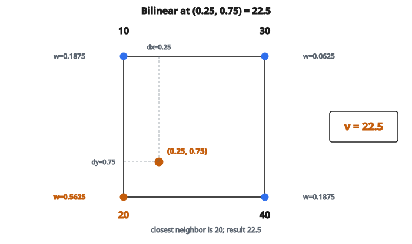

# Bilinear Interpolation

## Nội suy là gì

Nội suy ước lượng giá trị tại các vị trí nằm giữa các điểm dữ liệu đã biết. Trong xử lý ảnh, nó được dùng khi:

* Resize ảnh (phóng to hoặc thu nhỏ)
* Xoay ảnh
* Hiệu chỉnh méo ống kính
* Mọi phép biến đổi hình học

Đầu vào là lưới các giá trị pixel đã biết. Đầu ra cần giá trị tại các vị trí không nguyên.

## Ý tưởng bilinear

Bilinear interpolation dùng bốn pixel gần nhất để ước lượng giá trị tại một điểm bất kỳ. Nó thực hiện:

1. Nội suy tuyến tính theo hướng $x$ (ngang)
2. Nội suy tuyến tính theo hướng $y$ (dọc)

Kết quả là pha trộn mượt của bốn láng giềng.

## Công thức chính

Với điểm $(x, y)$ trong đó $(x_0, y_0)$ là phần nguyên (láng giềng trên-trái):

Đặt $dx = x - x_0$ và $dy = y - y_0$ là phần lẻ.

Bốn láng giềng là:

* Trên-trái: $I[y_0][x_0]$
* Trên-phải: $I[y_0][x_1]$ với $x_1 = x_0 + 1$
* Dưới-trái: $I[y_1][x_0]$ với $y_1 = y_0 + 1$
* Dưới-phải: $I[y_1][x_1]$

Giá trị nội suy:

$$
\begin{aligned}
v &= I[y_0][x_0](1-dx)(1-dy) + I[y_0][x_1] \cdot dx(1-dy) \\
  &\quad + I[y_1][x_0](1-dx) \cdot dy + I[y_1][x_1] \cdot dx \cdot dy
\end{aligned}
$$

## Hiểu các trọng số

Mỗi láng giềng đóng góp theo khoảng cách:

**Trọng số trên-trái:** $(1-dx)(1-dy)$

* Lớn khi điểm gần góc trên-trái

**Trọng số trên-phải:** $dx(1-dy)$

* Lớn khi điểm gần góc trên-phải

**Trọng số dưới-trái:** $(1-dx) \cdot dy$

* Lớn khi điểm gần góc dưới-trái

**Trọng số dưới-phải:** $dx \cdot dy$

* Lớn khi điểm gần góc dưới-phải

Các trọng số luôn cộng thành $1$.

## Ví dụ số

**Pixel đã biết (lưới $2 \times 2$):**

$$
\begin{bmatrix}
10 & 30 \\
20 & 40
\end{bmatrix}
$$

**Điểm truy vấn:** $(0.25, 0.75)$

* $x = 0.25$, nên $dx = 0.25$
* $y = 0.75$, nên $dy = 0.75$
* $x_0 = 0$, $y_0 = 0$

::: {#fig-121-bilinear fig-cap="Tại $(x,y)=(0.25,0.75)$, trọng số lớn nhất là góc dưới-trái $20$ ($0.5625$), nên $v=22.5$ lệch về phía $20$." fig-alt="Don vi vuong 2x2 voi goc 10, 30, 20, 40; diem truy van (0.25, 0.75) gan goc duoi-trai, ket qua v = 22.5."}
{fig-align="center"}
:::

**Láng giềng:**

* Trên-trái $(0,0)$: $10$
* Trên-phải $(0,1)$: $30$
* Dưới-trái $(1,0)$: $20$
* Dưới-phải $(1,1)$: $40$

**Trọng số:**

* Trên-trái: $(1-0.25)(1-0.75) = 0.75 \cdot 0.25 = 0.1875$
* Trên-phải: $0.25 \cdot 0.25 = 0.0625$
* Dưới-trái: $0.75 \cdot 0.75 = 0.5625$
* Dưới-phải: $0.25 \cdot 0.75 = 0.1875$

**Kết quả:**

$$
\begin{aligned}
v &= 10 \cdot 0.1875 + 30 \cdot 0.0625 + 20 \cdot 0.5625 + 40 \cdot 0.1875 \\
  &= 1.875 + 1.875 + 11.25 + 7.5 \\
  &= 22.5
\end{aligned}
$$

Điểm gần góc dưới-trái ($20$) hơn, và kết quả $22.5$ phản ánh điều đó.

## Resize ảnh bằng bilinear

Để đổi kích thước từ $(H, W)$ sang $(H_{\text{new}}, W_{\text{new}})$:

Với mỗi pixel đầu ra $(i, j)$:

1. Ánh xạ sang tọa độ nguồn:

$$
\text{src}_y = i \cdot \frac{H - 1}{H_{\text{new}} - 1}
$$

$$
\text{src}_x = j \cdot \frac{W - 1}{W_{\text{new}} - 1}
$$

2. Áp bilinear interpolation tại $(\text{src}_y, \text{src}_x)$
3. Lưu kết quả vào $\text{output}[i][j]$

## Chi tiết ánh xạ tọa độ

**Vì sao $(H-1)/(H_{\text{new}}-1)$?**

Công thức này ánh xạ góc tới góc:

* Đầu ra $(0, 0)$ ánh xạ tới đầu vào $(0, 0)$
* Đầu ra $(H_{\text{new}}-1, W_{\text{new}}-1)$ ánh xạ tới đầu vào $(H-1, W-1)$

**Phương án khác: $H / H_{\text{new}}$**

* Ánh xạ tâm pixel đầu tiên tới tâm pixel đầu tiên
* Căn chỉnh hơi khác
* Cả hai đều hợp lệ; công thức trên phổ biến hơn

**Trường hợp biên: $H_{\text{new}} = 1$**

* Chia cho không
* Xử lý riêng: $\text{src} = 0$

## Xử lý biên

Khi điểm nội suy nằm ở mép ảnh:

**Vấn đề:** $x_1 = x_0 + 1$ hoặc $y_1 = y_0 + 1$ có thể ra ngoài biên

**Cách xử lý:** Kẹp vào khoảng hợp lệ

* $x_1 = \min(x_0 + 1, W - 1)$
* $y_1 = \min(y_0 + 1, H - 1)$

Cách này thực chất lặp lại pixel mép.

## Bilinear và nearest neighbor

**Nearest neighbor:**

* Nhanh (không nhân)
* Kết quả dạng khối
* Giữ cạnh sắc (nhưng có artifact bậc thang)

**Bilinear:**

* Kết quả mượt
* Làm mờ nhẹ các cạnh sắc
* Chuẩn cho hầu hết ứng dụng

**Khi dùng nearest neighbor:**

* Pixel art (cố ý dạng khối)
* Ảnh nhị phân
* Khi tốc độ là then chốt

## Bilinear và bicubic

**Bilinear:**

* Dùng 4 láng giềng
* Nhanh
* Hơi mờ

**Bicubic:**

* Dùng 16 láng giềng (lưới $4 \times 4$)
* Mượt hơn, sắc hơn
* Chậm hơn (phải tính 16 trọng số)
* Tốt hơn khi resize chất lượng cao

Với hầu hết ứng dụng, bilinear là đủ. Bicubic dùng khi chất lượng quan trọng (sửa ảnh, in).

## Tính tách được

Bilinear interpolation tách được:

1. Nội suy theo phương ngang để được hai giá trị
2. Nội suy theo phương dọc giữa hai giá trị đó

Cách này tương đương toán học với công thức 4 điểm và có thể hơi nhanh hơn.

**Ngang trước:**

$$
\begin{aligned}
\text{top} &= I[y_0][x_0] \cdot (1-dx) + I[y_0][x_1] \cdot dx \\
\text{bottom} &= I[y_1][x_0] \cdot (1-dx) + I[y_1][x_1] \cdot dx \\
\text{result} &= \text{top} \cdot (1-dy) + \text{bottom} \cdot dy
\end{aligned}
$$

## Ứng dụng

* **Image scaling**: phóng to hoặc thu nhỏ ảnh
* **Texture mapping**: ánh xạ texture 2D lên bề mặt 3D
* **Image registration**: căn chỉnh ảnh từ các nguồn khác nhau
* **Video processing**: nội suy khung hình, ổn định video
* **ROI pooling**: trích đặc trưng tại vị trí tùy ý

## Code
```python
def bilinear_resize(image, new_h, new_w):
    """
    Resize a 2D grid using bilinear interpolation.
    """
    h, w = len(image), len(image[0])
    out = []
    for i in range(new_h):
        row = []
        for j in range(new_w):
            sy = i * (h - 1) / (new_h - 1) if new_h > 1 else 0.0
            sx = j * (w - 1) / (new_w - 1) if new_w > 1 else 0.0
            y0 = int(sy)
            x0 = int(sx)
            y1 = min(y0 + 1, h - 1)
            x1 = min(x0 + 1, w - 1)
            dy = sy - y0
            dx = sx - x0
            v = image[y0][x0]*(1-dy)*(1-dx) + image[y1][x0]*dy*(1-dx) + image[y0][x1]*(1-dy)*dx + image[y1][x1]*dy*dx
            row.append(v)
        out.append(row)
    return out

```

<!-- auto-self-check -->

::: {.callout-note}
## Kiểm tra nhanh
<details>
<summary>Ý chính của bài «Bilinear Interpolation» là gì?</summary>
Nội suy ước lượng giá trị tại các vị trí nằm giữa các điểm dữ liệu đã biết.
</details>
<details>
<summary>Công thức / quan hệ cốt lõi trong bài là gì?</summary>
$$\begin{aligned} v &= I[y_0][x_0](1-dx)(1-dy) + I[y_0][x_1] \cdot dx(1-dy) \\ &\quad + I[y_1][x_0](1-dx) \cdot dy + I[y_1][x_1] \cdot dx \cdot dy \end{aligned}$$
</details>
:::
