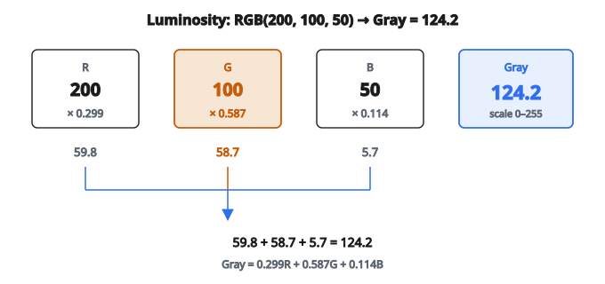

# Color to Grayscale

## Chuyển grayscale là gì

**Chuyển grayscale** biến một ảnh màu (các channel red, green, blue tách riêng) thành ảnh một channel biểu diễn luminance hay độ sáng. Ba giá trị màu của mỗi pixel được gộp thành một giá trị intensity.

$$
\text{Gray} = f(R, G, B)
$$

Phép chuyển giảm dữ liệu ảnh từ 3 channel xuống 1 channel.

## Vì sao chuyển sang grayscale

**1. Giảm chi phí tính toán:**

Xử lý một channel thay vì ba làm thuật toán nhanh hơn (ít dữ liệu gấp 3 lần).

**2. Đơn giản hóa mô hình:**

Nhiều tác vụ computer vision (phát hiện cạnh, nhận diện khuôn mặt) làm việc tốt với grayscale.

**3. Tập trung vào cấu trúc:**

Loại thông tin màu, nhấn hình dạng, cạnh, và texture.

**4. Tiết kiệm bộ nhớ:**

Ảnh grayscale dùng 1/3 dung lượng so với ảnh màu.

**5. Tương thích:**

Một số thuật toán hoặc màn hình chỉ hỗ trợ grayscale.

## Phương pháp luminosity (tri giác)

Phương pháp chính xác nhất tính đến tri giác của người:

$$
\text{Gray} = 0.299R + 0.587G + 0.114B
$$

**Lý do:** Mắt người nhạy nhất với green, rồi red, rồi blue.

**Hệ số cộng thành 1:** Giữ thang độ sáng.

**Chuẩn:** ITU-R BT.601 (chuẩn NTSC)

## Luminosity sRGB (chuẩn hiện đại)

Với không gian màu sRGB:

$$
\text{Gray} = 0.2126R + 0.7152G + 0.0722B
$$

**Chuẩn:** ITU-R BT.709 (chuẩn HDTV)

**Khác biệt:** Tính đến gamma correction của sRGB.

**Khi nào dùng:** Màn hình và camera hiện đại dùng sRGB.

## Ví dụ số: phương pháp luminosity

**Giá trị pixel màu (thang 0–255):**

* Red: 200
* Green: 100
* Blue: 50

**Chuyển đổi:**

$$
\text{Gray} = 0.299 \times 200 + 0.587 \times 100 + 0.114 \times 50
$$

$$
\text{Gray} = 59.8 + 58.7 + 5.7 = 124.2
$$

**Kết quả:** Giá trị grayscale $\approx 124$ (thang 0–255)

::: {#fig-161-rgb-gray fig-cap="Gray = 0.299·200 + 0.587·100 + 0.114·50 = 59.8 + 58.7 + 5.7 = 124.2 trên thang 0–255." fig-alt="Ba channel R=200, G=100, B=50 nhân trọng số 0.299, 0.587, 0.114 rồi cộng thành Gray=124.2."}
{fig-align="center"}
:::

## Phương pháp trung bình

Lấy trung bình cộng các giá trị RGB:

$$
\text{Gray} = \frac{R + G + B}{3}
$$

**Ưu điểm:** Đơn giản, nhanh.

**Nhược điểm:** Không tính đến tri giác. Green trông sáng hơn mức phải, blue trông quá sáng.

**Ví dụ:**

RGB$(200, 100, 50)$ $\to$ $(200 + 100 + 50)/3 = 116.67$

So với phương pháp luminosity: $124.2$

## Phương pháp lightness

Trung bình của channel lớn nhất và nhỏ nhất:

$$
\text{Gray} = \frac{\max(R, G, B) + \min(R, G, B)}{2}
$$

**Ví dụ:**

RGB$(200, 100, 50)$ $\to$ $(200 + 50)/2 = 125$

**Khi dùng:** Giữ highlight và bóng, nhưng có thể méo mid-tone.

## Desaturation (HSL/HSV)

Chuyển sang HSL (Hue, Saturation, Lightness) hoặc HSV (Hue, Saturation, Value), lấy L hoặc V:

**HSL Lightness:**

$$
L = \frac{\max(R,G,B) + \min(R,G,B)}{2}
$$

(Giống phương pháp lightness)

**HSV Value:**

$$
V = \max(R,G,B)
$$

Chỉ lấy channel sáng nhất.

## Cân nhắc gamma correction

**Giá trị RGB tuyến tính:**

Nếu ảnh dùng RGB đã mã hóa gamma (phổ biến nhất):

**Bước 1:** Chuyển sang RGB tuyến tính:

$$
R_{\text{linear}} = \left(\frac{R}{255}\right)^{2.2}
$$

(Tương tự cho G và B)

**Bước 2:** Áp trọng số luminosity:

$$
Y_{\text{linear}} = 0.2126 R_{\text{linear}} + 0.7152 G_{\text{linear}} + 0.0722 B_{\text{linear}}
$$

**Bước 3:** Áp mã hóa gamma:

$$
\text{Gray} = 255 \times Y_{\text{linear}}^{1/2.2}
$$

**Đơn giản hóa:** Hầu hết triển khai bỏ bước này và làm việc trực tiếp trên giá trị đã mã hóa gamma.

## So sánh ví dụ số

**Pixel màu:** RGB$(255, 0, 0)$ — đỏ thuần

**Phương pháp trung bình:**

$(255 + 0 + 0)/3 = 85$

**Phương pháp lightness:**

$(255 + 0)/2 = 127.5$

**Phương pháp luminosity:**

$0.299 \times 255 = 76.2$

**Nhận xét:** Các phương pháp cho kết quả khác nhau rõ. Luminosity tối nhất (khớp tri giác).

## Ví dụ khác

**Pixel màu:** RGB$(0, 255, 0)$ — xanh lá thuần

**Trung bình:** 85

**Lightness:** 127.5

**Luminosity:** $0.587 \times 255 = 149.7$

Green trông sáng hơn red nhiều (phương pháp luminosity nắm được điều này).

## Kích thước ảnh

**Shape ảnh màu:** Height $\times$ Width $\times$ 3

**Shape ảnh grayscale:** Height $\times$ Width $\times$ 1 (hoặc Height $\times$ Width)

**Giảm bộ nhớ:**

Ảnh màu 1 megapixel: 3 MB (không nén)

Ảnh grayscale 1 megapixel: 1 MB (không nén)

## Tính không đảo ngược

**Chuyển grayscale không đảo ngược được.**

Không thể dựng lại các giá trị RGB gốc từ một giá trị grayscale duy nhất.

**Mất thông tin:**

* RGB$(255, 0, 0)$, RGB$(200, 55, 0)$, RGB$(180, 75, 0)$ có thể cùng ánh xạ tới các giá trị grayscale gần nhau
* Thông tin màu bị loại bỏ vĩnh viễn

**Colorization:** Cố thêm màu trở lại là bài toán ill-posed, cần mô hình đã học.

## Trích một kênh

**Thay thế cho tổ hợp có trọng số:**

Chỉ lấy một channel.

**Chỉ kênh red:**

$$
\text{Gray} = R
$$

**Chỉ kênh green:**

$$
\text{Gray} = G
$$

**Chỉ kênh blue:**

$$
\text{Gray} = B
$$

**Khi dùng:** Một số imaging chuyên biệt (hồng ngoại, y khoa) trong đó một channel chứa toàn bộ thông tin liên quan.

## Grayscale cho phát hiện cạnh

Nhiều thuật toán phát hiện cạnh (Sobel, Canny) làm việc trên grayscale:

**Tính gradient:**

$$
G_x = \frac{\partial I}{\partial x}, \quad G_y = \frac{\partial I}{\partial y}
$$

Đơn giản hơn với ảnh một channel $I$.

**Độ lớn cạnh:**

$$
|G| = \sqrt{G_x^2 + G_y^2}
$$

Grayscale giảm tính toán gấp 3 lần.

## Phân tích texture

Ảnh grayscale giữ thông tin texture:

**Đặc trưng texture:**

* Entropy
* Contrast
* Homogeneity
* Local Binary Patterns (LBP)

**Gray Level Co-occurrence Matrix (GLCM):**

Tính trên ảnh grayscale để trích mô tả texture.

## Histogram grayscale

Phân phối các giá trị intensity:

$$
H(k) = \text{số pixel có intensity } k
$$

Với grayscale 8-bit: $k \in [0, 255]$

**Ứng dụng:**

* Histogram equalization (tăng contrast)
* Thresholding cho segmentation
* So sánh độ tương tự ảnh

## Thresholding trên grayscale

Chuyển grayscale sang nhị phân (đen–trắng):

**Thresholding đơn giản:**

$$
B(x,y) = \begin{cases}
255 & \text{nếu } I(x,y) > T \\
0 & \text{nếu không}
\end{cases}
$$

**Phương pháp Otsu:**

Tự tìm ngưỡng tối ưu $T$ làm cực đại phương sai giữa các lớp.

**Adaptive thresholding:**

Ngưỡng thay đổi trên ảnh theo thống kê cục bộ.

## Grayscale cho neural network

**Giảm kích thước đầu vào:**

Ảnh RGB: $H \times W \times 3$

Grayscale: $H \times W \times 1$

**Huấn luyện nhanh hơn:**

Ít tham số hơn ở convolutional layer đầu.

**Khi màu quan trọng:**

Giữ RGB (phân loại đối tượng thường cần màu).

**Khi màu không quan trọng:**

Dùng grayscale (nhận dạng chữ số, X-quang y khoa).

## Xử lý kênh alpha

**Ảnh RGBA:** Red, Green, Blue, Alpha (trong suốt)

**Các lựa chọn:**

**1. Bỏ qua alpha:**

$$
\text{Gray} = 0.299R + 0.587G + 0.114B
$$

**2. Composite lên nền:**

Giả sử nền trắng:

$$
R' = R \times \alpha + 255 \times (1 - \alpha)
$$

Rồi chuyển RGB đã composite sang grayscale.

## Lookup table (LUT)

Tính sẵn giá trị grayscale cho mọi tổ hợp RGB:

**Kích thước bảng:** $256^3$ mục (16.7 triệu)

**Tra cứu:**

$$
\text{Gray} = \text{LUT}[R][G][B]
$$

**Đánh đổi:** Tốn bộ nhớ để đổi lấy tốc độ tính.

**Thực tế:** Thường không đáng. Tính trực tiếp đủ nhanh.

## Triển khai vector hóa

**Vòng lặp ngây thơ (chậm):**

Với mỗi pixel, tính tổng có trọng số.

**Vector hóa (nhanh):**

Biểu diễn ảnh như tensor $H \times W \times 3$, tính:

$$
\text{Gray} = \text{Image}[:,:,0] \times 0.299 + \text{Image}[:,:,1] \times 0.587 + \text{Image}[:,:,2] \times 0.114
$$

Một phép toán ma trận xử lý toàn ảnh.

## Giá trị chuẩn hóa so với số nguyên

**Biểu diễn số nguyên (0–255):**

$$
\text{Gray}_{\text{int}} = \operatorname{round}(0.299R + 0.587G + 0.114B)
$$

**Biểu diễn chuẩn hóa (0.0–1.0):**

$$
\text{Gray}_{\text{norm}} = 0.299 \times \frac{R}{255} + 0.587 \times \frac{G}{255} + 0.114 \times \frac{B}{255}
$$

Neural network thường dùng khoảng chuẩn hóa $[0, 1]$.

## Đánh giá chất lượng

**Mean Squared Error so với gốc:**

Với các tác vụ nén/tái tạo, so sánh chất lượng chuyển grayscale.

**Chất lượng tri giác:**

Đánh giá theo hệ thị giác người. Phương pháp luminosity khớp tri giác nhất.

**Bảo toàn thông tin:**

Đo mutual information giữa phiên bản màu và grayscale.

## Hiển thị grayscale

**Hiển thị một channel:**

Intensity tại mỗi pixel quyết định độ sáng.

**Bảng màu (pseudo-coloring):**

Ánh xạ giá trị grayscale sang palette màu (ví dụ heat map).

Không phải grayscale thật mà là kỹ thuật trực quan hóa.

## Bối cảnh lịch sử

**Nhiếp ảnh và màn hình sớm:**

Chỉ có grayscale.

**TV đen trắng:**

Dùng công thức luminosity để tương thích với phát sóng màu.

**Dùng hiện đại:**

Dù màn hình màu, grayscale vẫn hữu ích cho tính toán.

## Giữ nhiều biểu diễn

**Một số pipeline giữ cả hai:**

* Grayscale cho một số phép (phát hiện cạnh)
* Màu cho quyết định cuối (phân loại)

**Ví dụ:**

Phát hiện khuôn mặt trên grayscale (nhanh hơn), phân loại biểu cảm bằng màu.

## Code
```python
def color_to_grayscale(image):
    """
    Convert an RGB image to grayscale using luminance weights.
    """
    H, W = len(image), len(image[0])
    result = []
    for i in range(H):
        row = []
        for j in range(W):
            r, g, b = image[i][j][0], image[i][j][1], image[i][j][2]
            gray = 0.299 * r + 0.587 * g + 0.114 * b
            row.append(gray)
        result.append(row)
    return result

```

<!-- auto-self-check -->

::: {.callout-note}
## Kiểm tra nhanh
<details>
<summary>Ý chính của bài «Color to Grayscale» là gì?</summary>
**Chuyển grayscale** biến một ảnh màu (các channel red, green, blue tách riêng) thành ảnh một channel biểu diễn luminance hay độ sáng.
</details>
<details>
<summary>Công thức / quan hệ cốt lõi trong bài là gì?</summary>
$$\text{Gray} = f(R, G, B)$$
</details>
:::
