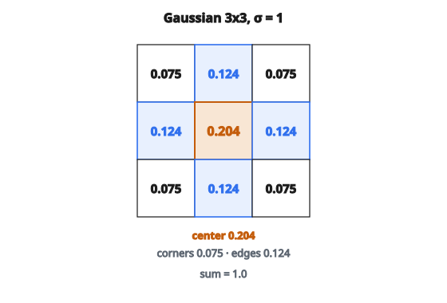

# Gaussian Blur Kernel

## Gaussian blur là gì

Gaussian blur là bộ lọc làm mượt được dùng rộng rãi nhất trong xử lý ảnh. Nó loại nhiễu tần số cao nhưng giữ cạnh tốt hơn phép trung bình đơn giản. Mức blur được kiểm soát bởi tham số sigma ($\sigma$).

## Hàm Gaussian

Hàm Gaussian 2D là:

$$
G(x, y) = \frac{1}{2\pi\sigma^2} e^{-\frac{x^2 + y^2}{2\sigma^2}}
$$

với

$$
\begin{aligned}
(x, y) &:\ \text{offset so với tâm kernel}, \\
\sigma &:\ \text{độ lệch chuẩn (kiểm soát mức blur)}.
\end{aligned}
$$

Hàm đối xứng quanh tâm.

## Xây kernel

Để tạo Gaussian kernel:

**Bước 1: Chọn kích thước kernel**

* Thường lẻ ($3$, $5$, $7$, …) để có pixel tâm
* Quy tắc ngón tay cái: $\text{size} \geq 6\sigma$ (bắt phần lớn khối Gaussian)

**Bước 2: Tính offset**

* Với $\text{size}=5$: tâm ở vị trí $2$
* Offset chạy từ $-2$ đến $+2$

**Bước 3: Áp công thức Gaussian**

* Tại mỗi vị trí, tính phần mũ $\exp\bigl(-(x^2+y^2)/(2\sigma^2)\bigr)$
* Hệ số $1/(2\pi\sigma^2)$ triệt tiêu khi chuẩn hóa; kết quả là trọng số chưa chuẩn hóa

**Bước 4: Chuẩn hóa**

* Chia mọi giá trị cho tổng của chúng
* Bảo đảm kernel cộng thành $1$ (giữ độ sáng)

## Ví dụ số

**Tham số:** $\text{size} = 3$, $\sigma = 1.0$

**Offset:**

$$
\begin{bmatrix}
(-1,-1) & (-1,0) & (-1,1) \\
(0,-1) & (0,0) & (0,1) \\
(1,-1) & (1,0) & (1,1)
\end{bmatrix}
$$

**Trọng số chưa chuẩn hóa** (tính $\exp\bigl(-(x^2+y^2)/2\bigr)$ vì $\sigma = 1$):

* $G(-1,-1) = \exp(-(1+1)/2) = \exp(-1) = 0.368$
* $G(-1,0) = \exp(-(1+0)/2) = \exp(-0.5) = 0.607$
* $G(0,0) = \exp(-(0+0)/2) = \exp(0) = 1.0$
* (các vị trí còn lại đối xứng tương tự)

**Kernel trước chuẩn hóa:**

$$
\begin{bmatrix}
0.368 & 0.607 & 0.368 \\
0.607 & 1.000 & 0.607 \\
0.368 & 0.607 & 0.368
\end{bmatrix}
$$

**Tổng:** $0.368 \cdot 4 + 0.607 \cdot 4 + 1.0 = 4.9$

**Kernel đã chuẩn hóa:**

$$
\begin{bmatrix}
0.075 & 0.124 & 0.075 \\
0.124 & 0.204 & 0.124 \\
0.075 & 0.124 & 0.075
\end{bmatrix}
$$

::: {#fig-124-gaussian-kernel fig-cap="Kernel $3\times 3$ với $\sigma=1$: tâm $0.204$, bốn góc $0.075$; các trọng số cộng thành $1$." fig-alt="Kernel Gaussian 3x3, sigma=1: tam 0.204, canh 0.124, bon goc 0.075; tong bang 1."}
{fig-align="center"}
:::

Tổng bằng $1.0$.

## Ảnh hưởng của sigma

**Sigma nhỏ (ví dụ $0.5$):**

* Gaussian nhọn
* Phần lớn trọng số tập trung ở tâm
* Blur tối thiểu
* Kernel có thể nhỏ

**Sigma vừa (ví dụ $1.0$):**

* Độ trải vừa
* Blur cân bằng
* Mặc định thường dùng

**Sigma lớn (ví dụ $3.0$):**

* Gaussian rộng
* Trọng số trải xa tâm
* Blur mạnh
* Cần kernel lớn hơn để bắt phần đuôi

## Kích thước kernel và sigma

Kernel phải đủ lớn để bắt phần lớn khối Gaussian:

**Quy tắc ngón tay cái:** $\text{kernel\_size} = \lceil 6\sigma \rceil + 1$ (làm tròn lên số lẻ)

Với $\sigma = 1$: $\text{size} \geq 7$ (nhưng $5$ hoặc $3$ thường vẫn dùng được)

Với $\sigma = 2$: $\text{size} \geq 13$ (thường dùng $9$ hoặc $11$)

Nếu kernel quá nhỏ:

* Cắt đuôi Gaussian
* Tổng giá trị thô nhỏ hơn kỳ vọng
* Chuẩn hóa bù lại, nhưng blur hơi khác

## Tính chất của Gaussian blur

**Tính tách được:**
Gaussian 2D tách được:

$$
G(x, y) = G(x) \cdot G(y)
$$

Nghĩa là convolution 2D có thể làm bằng hai convolution 1D:

1. Blur ngang với kernel 1D
2. Blur dọc với kernel 1D

Cách này nhanh hơn nhiều: $O(nk)$ thay vì $O(nk^{2})$ mỗi pixel.

**Tuyến tính:**
Blur hai lần với $\sigma_1$ và $\sigma_2$ bằng blur một lần với:

$$
\sigma_{\text{combined}} = \sqrt{\sigma_1^2 + \sigma_2^2}
$$

## Gaussian blur và box blur

**Box blur (trung bình đơn giản):**

* Mọi trọng số kernel bằng nhau ($1/k^{2}$)
* Tính nhanh hơn
* Tạo artifact nhìn thấy được (mép dạng khối)
* Không tách được theo cách gọn tương tự

**Gaussian blur:**

* Trọng số giảm mượt từ tâm
* Blur trông tự nhiên hơn
* Giữ cạnh tốt hơn
* Toán học ổn định

Gaussian blur được ưa dùng cho hầu hết ứng dụng.

## Ứng dụng

**Giảm nhiễu:**

* Trung bình làm giảm nhiễu ngẫu nhiên
* Gaussian giữ cạnh tốt hơn trung bình đều

**Scale-space:**

* Các $\sigma$ khác nhau lộ đặc trưng ở các tỉ lệ khác nhau
* Dùng trong phát hiện đặc trưng SIFT

**Tiền xử lý:**

* Trước phát hiện cạnh (giảm nhạy nhiễu)
* Trước downsampling (chống aliasing)

**Hiệu ứng nghệ thuật:**

* Blur nền (mô phỏng bokeh)
* Hiệu ứng phát sáng

## Gợi ý cài đặt

**Tránh tính $\exp()$ lặp lại:**

* Hàm mũ tốn kém
* Tính sẵn mọi giá trị kernel một lần

**Dùng đối xứng:**

* Kernel đối xứng: $G(-x,-y) = G(x,y)$
* Có thể tính một góc phần tư rồi phản xạ

**Chuẩn hóa cẩn thận:**

* Cộng mọi giá trị trước
* Rồi chia từng phần tử cho tổng
* Bảo đảm độ sáng được giữ

## Code
```python
import math

def gaussian_kernel(size, sigma):
    """
    Generate a normalized 2D Gaussian blur kernel.
    """
    center = size // 2
    kernel = []
    total = 0.0
    for i in range(size):
        row = []
        for j in range(size):
            x, y = j - center, i - center
            val = math.exp(-(x * x + y * y) / (2 * sigma * sigma))
            row.append(val)
            total += val
        kernel.append(row)
    for i in range(size):
        for j in range(size):
            kernel[i][j] /= total
    return kernel

```

<!-- auto-self-check -->

::: {.callout-note}
## Kiểm tra nhanh
<details>
<summary>Ý chính của bài «Gaussian Blur Kernel» là gì?</summary>
Gaussian blur là bộ lọc làm mượt được dùng rộng rãi nhất trong xử lý ảnh.
</details>
<details>
<summary>Công thức / quan hệ cốt lõi trong bài là gì?</summary>
$$G(x, y) = \frac{1}{2\pi\sigma^2} e^{-\frac{x^2 + y^2}{2\sigma^2}}$$
</details>
:::
