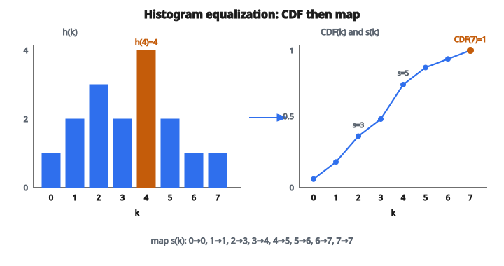

# Histogram Equalization

## Histogram equalization là gì

**Histogram equalization** là kỹ thuật xử lý ảnh điều chỉnh contrast bằng cách phân bố lại giá trị intensity của pixel. Mục tiêu là trải các mức intensity xuất hiện nhiều nhất, từ đó tăng contrast toàn cục. Ảnh có dải intensity hẹp được biến đổi thành ảnh dùng gần như toàn bộ dải khả dĩ.

## Vì sao dùng histogram equalization

**Tăng contrast**: Ảnh thiếu sáng hoặc dynamic range hẹp trở nên giàu thông tin thị giác hơn.

**Chuẩn hóa ảnh**: Các ảnh chụp trong điều kiện khác nhau có thể được đưa về phân phối intensity tương tự.

**Tiền xử lý cho phân tích**: Nhiều thuật toán computer vision làm việc tốt hơn trên ảnh đã tăng contrast.

**Lộ chi tiết ẩn**: Đặc trưng ở vùng tối hoặc vùng nhạt hiện rõ sau equalization.

## Hiểu histogram ảnh

Histogram ảnh mô tả phân phối intensity của pixel:

**Trục X**: Giá trị intensity (0 đến 255 với grayscale 8-bit)

**Trục Y**: Số pixel ở mỗi mức intensity

**Histogram hẹp**: Contrast thấp — pixel tụ trong một khoảng intensity nhỏ

**Histogram rộng**: Contrast cao — pixel trải trên toàn dải intensity

**Histogram lệch**: Ảnh chủ yếu tối (lệch trái) hoặc sáng (lệch phải)

## Mục tiêu equalization

Biến đổi histogram sao cho xấp xỉ đều — mỗi mức intensity có khoảng cùng số pixel.

**Trước**: Histogram nhọn tại một số giá trị, thưa ở chỗ khác

**Sau**: Histogram xấp xỉ phẳng trên mọi mức intensity

**Hiệu ứng**: Cực đại entropy thông tin của ảnh

## Nền tảng toán

Phép biến đổi dựa trên cumulative distribution function (CDF) của intensity pixel.

**Bước 1 — Tính histogram**:

$$
h(k) = \text{số pixel có intensity } k
$$

Với $k = 0, 1, 2, \ldots, L-1$ trong đó $L$ là số mức intensity (thường 256).

**Bước 2 — Tính phân phối xác suất**:

$$
p(k) = \frac{h(k)}{N}
$$

với $N$ là tổng số pixel.

**Bước 3 — Tính cumulative distribution function (CDF)**:

$$
\text{CDF}(k) = \sum_{j=0}^{k} p(j)
$$

**Bước 4 — Áp dụng biến đổi**:

$$
s_k = \operatorname{round}\bigl((L-1) \cdot \text{CDF}(k)\bigr)
$$

Intensity mới $s_k$ cho mỗi intensity gốc $k$ là CDF được scale về dải đầu ra.

## Ví dụ số

**Ảnh nhỏ** ($4 \times 4$ pixel, intensity 0–7):

Giá trị pixel: $[0, 1, 1, 2, 2, 2, 3, 3, 4, 4, 4, 4, 5, 5, 6, 7]$

**Bước 1 — Tính histogram**:

* $h(0) = 1$
* $h(1) = 2$
* $h(2) = 3$
* $h(3) = 2$
* $h(4) = 4$
* $h(5) = 2$
* $h(6) = 1$
* $h(7) = 1$

Tổng số pixel $N = 16$

**Bước 2 — Tính xác suất**:

* $p(0) = 1/16 = 0.0625$
* $p(1) = 2/16 = 0.125$
* $p(2) = 3/16 = 0.1875$
* $p(3) = 2/16 = 0.125$
* $p(4) = 4/16 = 0.25$
* $p(5) = 2/16 = 0.125$
* $p(6) = 1/16 = 0.0625$
* $p(7) = 1/16 = 0.0625$

**Bước 3 — Tính CDF**:

* $\text{CDF}(0) = 0.0625$
* $\text{CDF}(1) = 0.0625 + 0.125 = 0.1875$
* $\text{CDF}(2) = 0.1875 + 0.1875 = 0.375$
* $\text{CDF}(3) = 0.375 + 0.125 = 0.5$
* $\text{CDF}(4) = 0.5 + 0.25 = 0.75$
* $\text{CDF}(5) = 0.75 + 0.125 = 0.875$
* $\text{CDF}(6) = 0.875 + 0.0625 = 0.9375$
* $\text{CDF}(7) = 0.9375 + 0.0625 = 1.0$

**Bước 4 — Tính intensity mới** ($L = 8$):

* $s(0) = \operatorname{round}(7 \times 0.0625) = \operatorname{round}(0.44) = 0$
* $s(1) = \operatorname{round}(7 \times 0.1875) = \operatorname{round}(1.31) = 1$
* $s(2) = \operatorname{round}(7 \times 0.375) = \operatorname{round}(2.63) = 3$
* $s(3) = \operatorname{round}(7 \times 0.5) = \operatorname{round}(3.5) = 4$
* $s(4) = \operatorname{round}(7 \times 0.75) = \operatorname{round}(5.25) = 5$
* $s(5) = \operatorname{round}(7 \times 0.875) = \operatorname{round}(6.13) = 6$
* $s(6) = \operatorname{round}(7 \times 0.9375) = \operatorname{round}(6.56) = 7$
* $s(7) = \operatorname{round}(7 \times 1.0) = \operatorname{round}(7) = 7$

**Ánh xạ biến đổi**: $0 \to 0$, $1 \to 1$, $2 \to 3$, $3 \to 4$, $4 \to 5$, $5 \to 6$, $6 \to 7$, $7 \to 7$

Các intensity giờ trải rộng hơn trên dải.

::: {#fig-129-histeq-cdf fig-cap="h(4) = 4 là bin cao nhất; CDF(7) = 1. Ánh xạ s_k = round(7 · CDF(k)) trải intensity: 2→3, 4→5, 7→7." fig-alt="Histogram h(k) cho k = 0..7 với h(4) = 4, và CDF tăng tới CDF(7) = 1 cùng ánh xạ s(k)."}
{fig-align="center"}
:::

## CDF như hàm biến đổi

CDF tự nhiên tạo một phép biến đổi mà:

**Kéo giãn intensity phổ biến**: Vùng có nhiều pixel (cột histogram cao) được ánh xạ sang dải đầu ra rộng hơn.

**Nén intensity hiếm**: Vùng có ít pixel bị nén lại.

**Đơn điệu**: Phép biến đổi giữ thứ tự — pixel sáng hơn vẫn sáng hơn.

## Tính chất của histogram equalization

**Tự động**: Không có tham số cần chỉnh — thuật toán thích nghi với từng ảnh.

**Deterministic**: Cùng đầu vào luôn cho cùng đầu ra.

**Đảo ngược được về lý thuyết**: Hàm ánh xạ có thể đảo (dù thông tin mất vì làm tròn).

**Toán tử toàn cục**: Dùng thống kê của toàn ảnh.

## Xử lý các độ sâu bit khác nhau

**Ảnh 8-bit**: $L = 256$ mức intensity (0–255)

**Ảnh 16-bit**: $L = 65536$ mức intensity (0–65535)

**Ảnh số thực**: Phải lượng tử hóa hoặc xử lý khác

Công thức scale đúng theo $L$.

## Hạn chế của histogram equalization toàn cục

**Over-enhancement**: Có thể khuếch đại nhiễu ở vùng đồng nhất.

**Mất contrast cục bộ**: Thống kê toàn cục có thể không phù hợp mọi vùng ảnh.

**Ngoại hình không tự nhiên**: Equalization mạnh có thể tạo kết quả trông nhân tạo.

**Khuếch đại nhiễu nền**: Vùng tối có nhiễu cảm biến trở nên lộ hơn.

## Adaptive Histogram Equalization (AHE)

Khắc phục hạn chế bằng cách equalization cục bộ:

**Quy trình**:

1. Chia ảnh thành các tile nhỏ
2. Equalize độc lập từng tile
3. Nội suy tại biên tile để tránh artifact

**CLAHE** (Contrast Limited AHE):

* Giới hạn khuếch đại contrast bằng cách cắt histogram
* Phân bố lại pixel bị cắt một cách đều
* Ngăn over-enhancement

## Equalization cho ảnh màu

Với ảnh màu, các lựa chọn gồm:

**Equalize độc lập từng channel**: Có thể gây lệch màu

**Chuyển HSV/LAB, chỉ equalize intensity**: Giữ quan hệ màu

* Chuyển sang HSV
* Equalize kênh V (value)
* Chuyển lại RGB

**Equalize luminance trong không gian LAB**: Thường cho kết quả tốt nhất

## Độ phức tạp tính toán

**Tính histogram**: $O(N)$ với $N$ là số pixel

**Tính CDF**: $O(L)$ với $L$ là số mức intensity

**Biến đổi**: $O(N)$ — áp lookup table cho từng pixel

**Tổng độ phức tạp**: $O(N + L)$, thực tế $O(N)$ vì thường $L \ll N$

**Bộ nhớ**: $O(L)$ cho mảng histogram và CDF

## Liên hệ với lý thuyết xác suất

Histogram equalization thực hiện phép biến đổi tích phân xác suất (probability integral transform):

**Phân phối gốc**: PDF cho bởi histogram chuẩn hóa

**Phân phối đích**: Phân phối đều

**Biến đổi CDF**: Ánh xạ mọi phân phối về phân phối đều

Đây là kỹ thuật nền tảng trong xác suất và thống kê để sinh biến ngẫu nhiên đều từ phân phối tùy ý.

## Histogram equalization xuất hiện ở đâu

* **Medical imaging**: Tăng cường X-quang, MRI, CT để chẩn đoán rõ hơn
* **Ảnh vệ tinh**: Cải thiện contrast trong remote sensing
* **Hệ thống an ninh**: Tăng cường footage giám sát
* **Quét tài liệu**: Cải thiện độ đọc của tài liệu đã scan
* **Photography**: Tự chỉnh contrast trong trình sửa ảnh
* **Tiền xử lý computer vision**: Chuẩn hóa ảnh trước khi trích đặc trưng
* **Microscopy**: Tăng cường mẫu sinh học
* **Thiên văn**: Xử lý ảnh kính thiên văn với dynamic range hẹp
* **Kiểm soát chất lượng**: Kiểm tra linh kiện sản xuất dưới ánh sáng thay đổi
* **Face recognition**: Chuẩn hóa ảnh khuôn mặt cho đầu vào ổn định

## Code
```python
def histogram_equalize(image):
    """
    Apply histogram equalization to enhance image contrast.
    """
    h, w = len(image), len(image[0])
    total = h * w
    hist = [0] * 256
    for row in image:
        for v in row:
            hist[v] += 1
    cdf = [0] * 256
    cdf[0] = hist[0]
    for i in range(1, 256):
        cdf[i] = cdf[i - 1] + hist[i]
    cdf_min = next(c for c in cdf if c > 0)
    denom = total - cdf_min
    mapping = [0] * 256
    if denom > 0:
        for i in range(256):
            if cdf[i] > 0:
                mapping[i] = round((cdf[i] - cdf_min) / denom * 255)
    return [[mapping[v] for v in row] for row in image]

```
