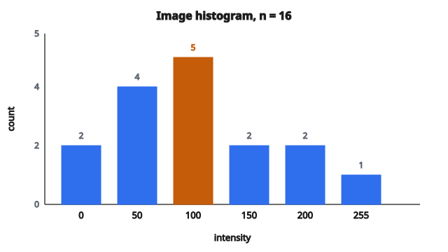

# Image Histogram

## Histogram là gì

**Histogram** đếm số lần mỗi giá trị xuất hiện trong một tập dữ liệu. Với ảnh grayscale, histogram đếm bao nhiêu pixel có từng mức intensity khả dĩ (0 đến 255).

Histogram là một mảng 1D gồm 256 bin:

* bin[0]: số pixel có giá trị 0 (đen)
* bin[127]: số pixel có giá trị 127 (xám giữa)
* bin[255]: số pixel có giá trị 255 (trắng)

## Vì sao histogram quan trọng

**Phân tích ảnh:**

* Cho thấy độ sáng tổng thể (lệch trái = tối, lệch phải = sáng)
* Cho thấy độ tương phản (phân bố hẹp = contrast thấp, phân bố rộng = contrast cao)
* Phát hiện clipping (đỉnh nhọn tại 0 hoặc 255)

**Xử lý ảnh:**

* Thresholding tự động (tìm thung lũng trên histogram hai đỉnh)
* Histogram equalization (cải thiện contrast)
* Hiệu chỉnh phơi sáng

**Computer vision:**

* So sánh ảnh (độ tương tự histogram)
* Nhận dạng đối tượng (histogram màu)
* Truy hồi ảnh theo nội dung

## Tính histogram

**Bước 1: Khởi tạo bin**

* Tạo mảng 256 số 0

**Bước 2: Duyệt từng pixel**

* Với mỗi giá trị pixel $v$: tăng `bin[v]` lên 1

**Bước 3: Kết quả**

* `histogram[i]` = số pixel có intensity $i$

## Ví dụ số

**Ảnh nhỏ $4 \times 4$:**

$$
\begin{bmatrix}
0 & 50 & 50 & 100 \\
0 & 50 & 100 & 100 \\
50 & 100 & 150 & 200 \\
100 & 150 & 200 & 255
\end{bmatrix}
$$

**Đếm:**

* Giá trị 0 xuất hiện 2 lần
* Giá trị 50 xuất hiện 4 lần
* Giá trị 100 xuất hiện 5 lần
* Giá trị 150 xuất hiện 2 lần
* Giá trị 200 xuất hiện 2 lần
* Giá trị 255 xuất hiện 1 lần
* Mọi giá trị còn lại xuất hiện 0 lần

**Histogram (chỉ các bin khác 0):**

* `histogram[0]` = 2
* `histogram[50]` = 4
* `histogram[100]` = 5
* `histogram[150]` = 2
* `histogram[200]` = 2
* `histogram[255]` = 1

Tổng: $2 + 4 + 5 + 2 + 2 + 1 = 16$ (tổng số pixel)

::: {#fig-123-histogram fig-cap="histogram[100] = 5 là đỉnh; tổng 6 bin khác 0 bằng n = 16 pixel của ảnh 4×4." fig-alt="Histogram intensity với 6 bin khác 0: 0:2, 50:4, 100:5, 150:2, 200:2, 255:1; tổng n = 16 pixel."}
{fig-align="center"}
:::

## Đọc histogram

**Ảnh tối:**

* Phần lớn pixel có giá trị thấp
* Histogram tập trung bên trái
* Ít pixel ở vùng sáng

**Ảnh sáng:**

* Phần lớn pixel có giá trị cao
* Histogram tập trung bên phải
* Ít pixel ở vùng tối

**Contrast thấp:**

* Pixel tụ trong một khoảng hẹp
* Histogram có một đỉnh hẹp
* Ảnh trông “nhạt” (washed out)

**Contrast cao:**

* Pixel trải trên toàn dải
* Histogram rộng và tương đối phẳng
* Ảnh có cả vùng tối và vùng sáng

**Hai đỉnh (bimodal):**

* Hai đỉnh tách rõ
* Thường tương ứng foreground so với background
* Hữu ích cho thresholding

## Histogram chuẩn hóa

Histogram chuẩn hóa chuyển count thành xác suất:

$$
p[i] = \frac{\text{histogram}[i]}{\text{tổng số pixel}}
$$

Tính chất:

* Mọi giá trị nằm trong $[0, 1]$
* Tổng mọi bin bằng 1
* Biểu diễn phân phối xác suất của intensity

## Histogram tích lũy

Histogram tích lũy đếm số pixel đến từng mức intensity:

$$
C[i] = \sum_{j=0}^{i} \text{histogram}[j]
$$

Tính chất:

* Tăng đơn điệu
* $C[255]$ = tổng số pixel
* Dùng trong histogram equalization

## Ứng dụng

**Thresholding tự động (phương pháp Otsu):**

* Tìm ngưỡng làm cực đại phương sai giữa các lớp
* Dùng histogram để tách foreground và background

**Histogram equalization:**

* Trải giá trị pixel cho đầy dải
* Cải thiện contrast
* Dùng histogram tích lũy

**Histogram matching:**

* Biến đổi ảnh sao cho histogram khớp một mục tiêu
* Dùng cho chuẩn hóa màu

**Phát hiện phơi sáng:**

* Kiểm tra clipping (nhiều pixel tại 0 hoặc 255)
* Nhận diện over/under exposure

## Histogram màu

Với ảnh màu, tính histogram riêng cho từng channel:

* Histogram red (256 bin)
* Histogram green (256 bin)
* Histogram blue (256 bin)

Hoặc tính histogram đồng thời (joint):

* $256 \times 256 \times 256 = 16.7$ triệu bin (không thực tế)
* Thay vào đó, giảm số bin (ví dụ $8 \times 8 \times 8 = 512$ bin)

## Ghi chú triển khai

**Hiệu năng:**

* Một lần duyệt ảnh: $O(H \times W)$
* Mỗi pixel: một lần truy cập mảng và tăng đếm

**Bộ nhớ:**

* Chỉ cần 256 số nguyên (1 KB với int 32-bit)
* Cấu trúc dữ liệu rất nhẹ

**Trường hợp biên:**

* Ảnh rỗng: mọi bin bằng 0
* Ảnh đồng nhất: một bin bằng $H \times W$, các bin còn lại bằng 0

## Code
```python
def image_histogram(image):
    """
    Compute the intensity histogram of a grayscale image.
    """
    hist = [0] * 256
    for row in image:
        for v in row:
            hist[v] += 1
    return hist

```
