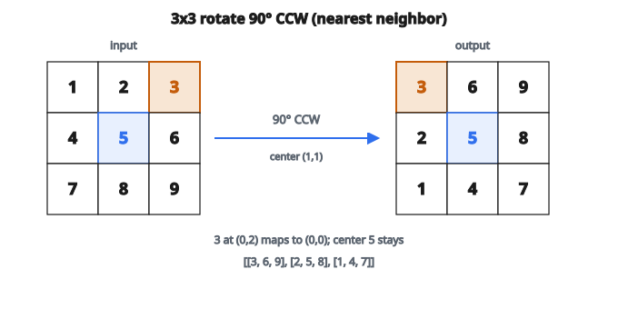

# Image Rotation (Nearest Neighbor)

## Cơ bản về xoay ảnh

Xoay ảnh một góc tùy ý đòi hỏi:

1. Tính mỗi pixel đầu ra ánh xạ tới đâu trên đầu vào
2. Lấy mẫu đầu vào tại vị trí đó (thường không nguyên)
3. Điền đầu ra bằng các giá trị đã lấy mẫu

Phép xoay thực hiện quanh tâm ảnh.

## Toán học phép xoay

Để xoay điểm $(x, y)$ góc $\theta$ quanh gốc:

$$
x' = x \cos\theta - y \sin\theta
$$

$$
y' = x \sin\theta + y \cos\theta
$$

Để xoay quanh tâm ảnh $(c_x, c_y)$:

1. Tịnh tiến về gốc: $(x - c_x, y - c_y)$
2. Xoay
3. Tịnh tiến ngược: cộng $(c_x, c_y)$

## Ánh xạ ngược

Với mỗi pixel đầu ra, cần tìm pixel đầu vào mà nó tới từ đó. Việc này cần phép xoay **ngược** (xoay $-\theta$).

Với pixel đầu ra $(i, j)$:

1. Tính offset so với tâm: $dx = j - c_x$, $dy = i - c_y$
2. Áp xoay ngược (công thức khớp cài đặt, tọa độ ảnh với hàng tăng xuống dưới):

$$
\begin{aligned}
\text{src}_y &= c_y + dy \cos\theta + dx \sin\theta \\
\text{src}_x &= c_x - dy \sin\theta + dx \cos\theta
\end{aligned}
$$

3. Lấy mẫu đầu vào tại $(\text{src}_y, \text{src}_x)$

## Nội suy nearest neighbor

Tọa độ nguồn thường không nguyên. Nearest neighbor interpolation làm tròn về pixel gần nhất:

$$
i_{\text{src}} = \text{round}(\text{src}_y)
$$

$$
j_{\text{src}} = \text{round}(\text{src}_x)
$$

Nếu tọa độ đã làm tròn nằm trong biên, chép pixel đó. Nếu không, điền $0$ (hoặc một giá trị nền khác).

## Ví dụ số

**Ảnh ($3 \times 3$):**

$$
\begin{bmatrix}
1 & 2 & 3 \\
4 & 5 & 6 \\
7 & 8 & 9
\end{bmatrix}
$$

**Xoay: $90$ độ ngược chiều kim đồng hồ**

Tâm: $(1, 1)$

::: {#fig-131-rotate-nn fig-cap="Xoay $90^{\circ}$ CCW quanh tâm $(1,1)$: $[[1,2,3],[4,5,6],[7,8,9]] \to [[3,6,9],[2,5,8],[1,4,7]]$." fig-alt="Anh 3x3 gia tri 1-9 xoay 90 do CCW thanh [[3,6,9],[2,5,8],[1,4,7]]; tam 5 giu nguyen."}
{fig-align="center"}
:::

**Với pixel đầu ra $(0, 0)$:**

* $dx = 0 - 1 = -1$, $dy = 0 - 1 = -1$
* $\cos 90^{\circ} = 0$, $\sin 90^{\circ} = 1$
* $\text{src}_y = 1 + (-1)\cdot 0 + (-1)\cdot 1 = 0$
* $\text{src}_x = 1 - (-1)\cdot 1 + (-1)\cdot 0 = 2$
* Nguồn: $(0, 2) = 3$

**Với pixel đầu ra $(0, 2)$:**

* $dx = 2 - 1 = 1$, $dy = 0 - 1 = -1$
* $\text{src}_y = 1 + (-1)\cdot 0 + (1)\cdot 1 = 2$
* $\text{src}_x = 1 - (-1)\cdot 1 + (1)\cdot 0 = 2$
* Nguồn: $(2, 2) = 9$

**Kết quả:**

$$
\begin{bmatrix}
3 & 6 & 9 \\
2 & 5 & 8 \\
1 & 4 & 7
\end{bmatrix}
$$

Đây đúng là xoay $90$ độ CCW.

## Vì sao dùng ánh xạ ngược?

**Ánh xạ xuôi:**

* Với mỗi pixel đầu vào, tính nó đi tới đâu trên đầu ra
* Vấn đề: nhiều đầu vào có thể ánh xạ cùng một đầu ra (xung đột)
* Vấn đề: một số đầu ra có thể không có đầu vào (lỗ)

**Ánh xạ ngược:**

* Với mỗi pixel đầu ra, tìm đầu vào mà nó tới từ đó
* Bảo đảm mọi đầu ra nhận một giá trị
* Không lỗ, không xung đột

Ánh xạ ngược là cách chuẩn cho biến đổi ảnh.

## Nearest neighbor và các phương pháp khác

**Nearest neighbor:**

* Nhanh (không tính nội suy)
* Kết quả dạng khối / aliasing
* Tốt cho ảnh nhị phân hoặc pixel art
* Giữ nguyên giá trị pixel

**Bilinear interpolation:**

* Trung bình có trọng số của 4 pixel gần nhất
* Kết quả mượt hơn
* Hơi mờ
* Lựa chọn phổ biến nhất

**Bicubic interpolation:**

* Trung bình có trọng số của 16 pixel
* Mượt hơn nữa
* Tốt hơn khi resize chất lượng cao
* Tốn tính toán hơn

## Xử lý ra ngoài biên

Khi tọa độ nguồn rơi ra ngoài ảnh đầu vào:

**Zero fill:**

* Pixel đầu ra bằng $0$ (đen)
* Tạo góc đen sau khi xoay

**Border replication:**

* Dùng pixel hợp lệ gần nhất
* Kéo dài mép

**Wrap around:**

* Coi ảnh như lát gạch
* Ít khi dùng cho xoay

Cài đặt dưới đây dùng zero fill.

## Quy ước góc xoay

**Ngược chiều kim đồng hồ (góc dương):**

* Quy ước toán học chuẩn
* $90$ độ: phía phải đi lên
* Dùng trong hầu hết ngữ cảnh toán

**Theo chiều kim đồng hồ (góc dương):**

* Dùng trong một số hệ đồ họa
* $90$ độ: phía phải đi xuống

Cài đặt dưới đây dùng xoay ngược chiều kim đồng hồ.

## Tâm ảnh

Tâm xoay ảnh hưởng tới kết quả:

**Quy ước tâm pixel:**

$$
c_x = \frac{W - 1}{2}, \quad c_y = \frac{H - 1}{2}
$$

Với ảnh $5 \times 5$: tâm là $(2, 2)$

Với ảnh $4 \times 4$: tâm là $(1.5, 1.5)$

Cách này đặt tâm tại pixel giữa (hoặc giữa hai pixel khi kích thước chẵn).

## Artifact aliasing

Xoay nearest neighbor tạo artifact nhìn thấy được:

* Mép răng cưa (hiệu ứng bậc thang)
* Pixel “nhảy” trong animation
* Mất chi tiết mảnh

Các artifact này tệ hơn với:

* Góc xoay nhỏ
* Nội dung tần số cao (chữ, cạnh sắc)
* Xoay lặp lại

Để chất lượng tốt hơn, dùng bilinear hoặc bicubic interpolation.

## Code
```python
import math

def rotate_image(image, angle_degrees):
    """
    Rotate the image counterclockwise by the given angle using nearest neighbor interpolation.
    """
    h, w = len(image), len(image[0])
    cy, cx = (h - 1) / 2.0, (w - 1) / 2.0
    theta = math.radians(angle_degrees)
    cos_t, sin_t = math.cos(theta), math.sin(theta)
    out = []
    for i in range(h):
        row = []
        for j in range(w):
            dy, dx = i - cy, j - cx
            src_y = cy + dy * cos_t + dx * sin_t
            src_x = cx - dy * sin_t + dx * cos_t
            sy, sx = round(src_y), round(src_x)
            row.append(image[sy][sx] if 0 <= sy < h and 0 <= sx < w else 0)
        out.append(row)
    return out

```

<!-- auto-self-check -->

::: {.callout-note}
## Kiểm tra nhanh
<details>
<summary>Ý chính của bài «Image Rotation (Nearest Neighbor)» là gì?</summary>
Xoay ảnh một góc tùy ý đòi hỏi: 1.
</details>
<details>
<summary>Công thức / quan hệ cốt lõi trong bài là gì?</summary>
$$x' = x \cos\theta - y \sin\theta$$
</details>
:::
