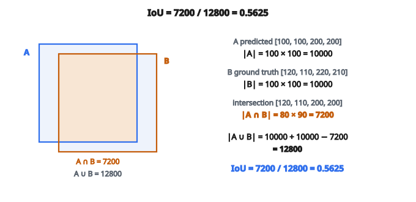

# Intersection over Union (IoU)

## IoU là gì

**Intersection over Union (IoU)**, còn gọi là chỉ số Jaccard, đo mức độ chồng lấp của hai vùng:

$$
\mathrm{IoU} = \frac{|A \cap B|}{|A \cup B|} = \frac{\text{diện tích giao}}{\text{diện tích hợp}}
$$

Với bounding box:

* $A$ là bounding box dự đoán
* $B$ là bounding box ground truth
* Phần giao là nơi hai hộp chồng lên nhau
* Phần hợp là toàn bộ diện tích được phủ bởi ít nhất một hộp

## Khoảng giá trị và cách diễn giải

IoU nằm trong $[0, 1]$:

**IoU = 0:** Không chồng lấp. Hai hộp hoàn toàn tách rời.
**IoU = 0.5:** Chồng lấp vừa. Thường dùng làm ngưỡng cho detection “đúng”.
**IoU = 0.75:** Chồng lấp tốt. Dùng khi đánh giá chặt hơn (COCO AP75).
**IoU = 1.0:** Chồng lấp hoàn hảo. Hai hộp trùng nhau.

Ngưỡng phổ biến trong object detection:

* $\mathrm{IoU} \geq 0.5$: detection “đúng” trong PASCAL VOC
* $\mathrm{IoU} \geq 0.5, 0.55, \ldots, 0.95$: trung bình trong COCO mAP

## Tính IoU cho hộp song song trục

Cho hai hộp dạng $(x_1, y_1, x_2, y_2)$, trong đó $(x_1, y_1)$ là góc trên-trái và $(x_2, y_2)$ là góc dưới-phải:

**Bước 1: Tọa độ phần giao**

* $\mathrm{inter\_x1} = \max(\mathrm{box1\_x1}, \mathrm{box2\_x1})$
* $\mathrm{inter\_y1} = \max(\mathrm{box1\_y1}, \mathrm{box2\_y1})$
* $\mathrm{inter\_x2} = \min(\mathrm{box1\_x2}, \mathrm{box2\_x2})$
* $\mathrm{inter\_y2} = \min(\mathrm{box1\_y2}, \mathrm{box2\_y2})$

**Bước 2: Diện tích giao**

* $\mathrm{inter\_width} = \max(0, \mathrm{inter\_x2} - \mathrm{inter\_x1})$
* $\mathrm{inter\_height} = \max(0, \mathrm{inter\_y2} - \mathrm{inter\_y1})$
* $\mathrm{intersection} = \mathrm{inter\_width} \cdot \mathrm{inter\_height}$

**Bước 3: Diện tích hợp**

* $\mathrm{area1} = (\mathrm{box1\_x2} - \mathrm{box1\_x1}) \cdot (\mathrm{box1\_y2} - \mathrm{box1\_y1})$
* $\mathrm{area2} = (\mathrm{box2\_x2} - \mathrm{box2\_x1}) \cdot (\mathrm{box2\_y2} - \mathrm{box2\_y1})$
* $\mathrm{union} = \mathrm{area1} + \mathrm{area2} - \mathrm{intersection}$

**Bước 4: IoU**

* $\mathrm{IoU} = \mathrm{intersection} / \mathrm{union}$

## Ví dụ số

Hộp A (dự đoán): $x_1=100$, $y_1=100$, $x_2=200$, $y_2=200$
Hộp B (ground truth): $x_1=120$, $y_1=110$, $x_2=220$, $y_2=210$

::: {#fig-118-iou-boxes fig-cap="Union = |A| + |B| − |A ∩ B| = 10000 + 10000 − 7200 = 12800, nên IoU = 7200/12800 = 0.5625. Phần hợp không phải tổng hai diện tích khi chưa trừ giao." fig-alt="Hai hộp A [100,100,200,200] và B [120,110,220,210]; phần giao 80×90 = 7200 được tô riêng; phần hợp là đa giác A∪B với diện tích 10000+10000−7200 = 12800, IoU = 0.5625."}
{fig-align="center"}
:::

**Phần giao:**

* $\mathrm{inter\_x1} = \max(100, 120) = 120$
* $\mathrm{inter\_y1} = \max(100, 110) = 110$
* $\mathrm{inter\_x2} = \min(200, 220) = 200$
* $\mathrm{inter\_y2} = \min(200, 210) = 200$
* $\mathrm{inter\_width} = 200 - 120 = 80$
* $\mathrm{inter\_height} = 200 - 110 = 90$
* $\mathrm{intersection} = 80 \cdot 90 = 7200$

**Diện tích:**

* $\mathrm{area\_A} = (200-100) \cdot (200-100) = 10000$
* $\mathrm{area\_B} = (220-120) \cdot (210-110) = 10000$
* $\mathrm{union} = 10000 + 10000 - 7200 = 12800$

**IoU:** $7200 / 12800 = 0.5625$

## IoU như hàm mất mát

Dùng IoU trực tiếp làm loss:

$$
L_{\mathrm{IoU}} = 1 - \mathrm{IoU}
$$

Loss bằng $0$ khi hai hộp chồng hoàn hảo và bằng $1$ khi không chồng chút nào.

Ưu điểm:

* Bất biến theo tỉ lệ: cùng loss cho hộp lớn và hộp nhỏ nếu mức chồng lấp tương đối giống nhau
* Tối ưu trực tiếp metric đánh giá
* Xem xét đồng thời cả bốn tọa độ của hộp

Nhược điểm:

* Gradient bằng $0$ khi hai hộp không chồng ($\mathrm{IoU} = 0$)
* Không học được cách dịch hộp lại gần nhau nếu lúc đầu chúng ở xa

## Vấn đề không chồng lấp

Xét hai hộp không chồng:

* Hộp A: $(0, 0, 10, 10)$
* Hộp B: $(100, 100, 110, 110)$

$\mathrm{IoU} = 0$, nên IoU loss $= 1$.

Dịch hộp A sang phải một chút:

* Hộp A: $(1, 0, 11, 10)$

Vẫn không chồng, $\mathrm{IoU} = 0$, loss $= 1$.

Gradient bằng không. Mô hình không nhận tín hiệu về hướng cần dịch. Đây là hạn chế then chốt của IoU loss thuần.

## GIoU: Generalized IoU

GIoU (Generalized Intersection over Union) khắc phục vấn đề không chồng lấp:

$$
\mathrm{GIoU} = \mathrm{IoU} - \frac{|C - (A \cup B)|}{|C|}
$$

với $C$ là hộp bao nhỏ nhất chứa cả $A$ và $B$.

**Ý then chốt:** ngay cả khi hai hộp không chồng, hộp bao $C$ vẫn đổi khi hộp di chuyển. Điều đó tạo tín hiệu gradient.

Khoảng GIoU: $[-1, 1]$

* $\mathrm{GIoU} = 1$: chồng hoàn hảo
* $\mathrm{GIoU} = 0$: hai hộp kề nhau
* $\mathrm{GIoU} < 0$: hai hộp ở xa nhau

Loss: $L_{\mathrm{GIoU}} = 1 - \mathrm{GIoU}$

## DIoU và CIoU

**DIoU (Distance IoU):** thêm phạt khoảng cách tâm

$$
\mathrm{DIoU} = \mathrm{IoU} - \frac{d^2}{c^2}
$$

với:

* $d$ là khoảng cách Euclid giữa hai tâm hộp
* $c$ là đường chéo của hộp bao

Công thức này thúc hai hộp có tâm gần nhau.

**CIoU (Complete IoU):** thêm phạt lệch tỉ lệ khung hình

$$
\mathrm{CIoU} = \mathrm{IoU} - \frac{d^2}{c^2} - \alpha v
$$

với:

* $v$ đo độ nhất quán tỉ lệ khung hình
* $\alpha$ là hệ số cân bằng

CIoU xét chồng lấp, khoảng cách tâm, và độ giống hình dạng.

## So sánh các biến thể IoU

**Vanilla IoU:**

* Đơn giản, trực quan
* Gradient bằng không khi hộp không chồng
* Tốt cho đánh giá, khó dùng khi huấn luyện

**GIoU:**

* Xử lý được hộp không chồng
* Có thể hội tụ chậm (thường phình hộp trước, rồi mới co)
* Lựa chọn đa dụng tốt

**DIoU:**

* Hội tụ nhanh hơn GIoU
* Tối ưu trực tiếp sự thẳng hàng của tâm
* Tốt hơn khi hộp cần dịch xa

**CIoU:**

* Công thức đầy đủ nhất
* Hiệu năng tổng thể tốt nhất trên hầu hết benchmark
* Cài đặt hơi phức tạp hơn

## Gradient của IoU

Với IoU loss, gradient theo tọa độ hộp không tầm thường vì liên quan các phép $\min$/$\max$.

Với tọa độ hộp dự đoán $(x_1, y_1, x_2, y_2)$:

* Gradient chảy qua phép tính phần giao
* Chỉ “active” khi tọa độ nằm trên biên của phần giao
* Đó là lý do IoU loss có thể có gradient thưa

Framework deep learning hiện đại tính việc này tự động qua autograd.

## IoU loss được dùng ở đâu

* **Object detection**: YOLO, Faster R-CNN, RetinaNet đều dùng các loss dựa trên IoU
* **Instance segmentation**: mask IoU để đánh giá mask dự đoán
* **Tracking**: đo tracker bám đối tượng tốt đến đâu
* **Image registration**: căn chỉnh ảnh hoặc vùng
* **Mọi bài toán hồi quy bounding box**

Thực hành tốt:

* Dùng GIoU hoặc CIoU khi huấn luyện (gradient tốt hơn)
* Dùng IoU khi đánh giá (metric chuẩn)
* Kết hợp với classification loss cho detection (tổng loss = classification + box regression)

## Code
```python
def iou(box_a, box_b):
    """
    Compute Intersection over Union of two bounding boxes.
    """
    x1 = max(box_a[0], box_b[0])
    y1 = max(box_a[1], box_b[1])
    x2 = min(box_a[2], box_b[2])
    y2 = min(box_a[3], box_b[3])
    inter = max(0, x2 - x1) * max(0, y2 - y1)
    area_a = (box_a[2] - box_a[0]) * (box_a[3] - box_a[1])
    area_b = (box_b[2] - box_b[0]) * (box_b[3] - box_b[1])
    union = area_a + area_b - inter
    if union == 0:
        return 0.0
    return inter / union

```

<!-- auto-self-check -->

::: {.callout-note}
## Kiểm tra nhanh
<details>
<summary>Ý chính của bài «Intersection over Union (IoU)» là gì?</summary>
**Intersection over Union (IoU)**, còn gọi là chỉ số Jaccard, đo mức độ chồng lấp của hai vùng: Với bounding box: * $A$ là bounding box dự đoán * $B$ là bounding box ground truth * Phần giao là nơi hai hộp chồng lên nhau * Phần hợp là toàn bộ diện tích được…
</details>
<details>
<summary>Công thức / quan hệ cốt lõi trong bài là gì?</summary>
$$\mathrm{IoU} = \frac{|A \cap B|}{|A \cup B|} = \frac{\text{diện tích giao}}{\text{diện tích hợp}}$$
</details>
:::
