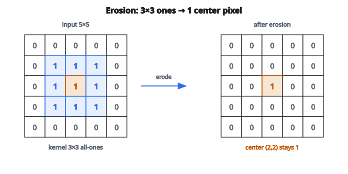

# Morphological Erosion and Dilation

## Morphological operations là gì

**Morphological operations** là bộ lọc phi tuyến cho ảnh nhị phân (đen–trắng). Chúng sửa hình dạng dựa trên cấu trúc cục bộ, dùng một template nhỏ gọi là structuring element.

Hai phép toán nền tảng:

* **Erosion**: co vùng foreground
* **Dilation**: giãn vùng foreground

## Quy ước ảnh nhị phân

Trong ảnh nhị phân:

* **1 (foreground)**: các đối tượng quan tâm
* **0 (background)**: phần còn lại

Morphological operations sửa biên giữa foreground và background.

## Structuring element

Structuring element (kernel) định nghĩa hình dạng lân cận:

**Vuông $3 \times 3$ (phổ biến nhất):**

$$
\begin{bmatrix}
1 & 1 & 1 \\
1 & 1 & 1 \\
1 & 1 & 1
\end{bmatrix}
$$

**Chữ thập $3 \times 3$:**

$$
\begin{bmatrix}
0 & 1 & 0 \\
1 & 1 & 1 \\
0 & 1 & 0
\end{bmatrix}
$$

**Đĩa (circular, nhiều kích thước):**

* Xấp xỉ một hình tròn
* Dùng cho phép toán không phụ thuộc hướng

Structuring element được đặt tâm tại từng pixel, và phép toán xét mọi vị trí mà phần tử có giá trị 1.

## Erosion

Erosion co vùng foreground. Một pixel foreground chỉ còn là foreground nếu **mọi** vị trí trong structuring element chồng lên foreground.

$$
\text{eroded}[i][j] = \begin{cases}
1 & \text{nếu mọi vị trí kernel khớp foreground} \\
0 & \text{nếu không}
\end{cases}
$$

**Hiệu ứng của erosion:**

* Loại đối tượng nhỏ (nhỏ hơn structuring element)
* Loại phần nhô mỏng
* Tách các đối tượng đang chạm nhau
* Co mọi đối tượng

## Dilation

Dilation giãn vùng foreground. Một pixel trở thành foreground nếu **bất kỳ** vị trí nào trong structuring element chồng lên foreground.

$$
\text{dilated}[i][j] = \begin{cases}
1 & \text{nếu có vị trí kernel khớp foreground} \\
0 & \text{nếu không}
\end{cases}
$$

**Hiệu ứng của dilation:**

* Lấp lỗ nhỏ
* Nối các đối tượng gần nhau
* Giãn mọi đối tượng
* Làm mượt biên lồi

## Ví dụ erosion từng bước

**Ảnh đầu vào:**

$$
\begin{bmatrix}
0 & 0 & 0 & 0 & 0 \\
0 & 1 & 1 & 1 & 0 \\
0 & 1 & 1 & 1 & 0 \\
0 & 1 & 1 & 1 & 0 \\
0 & 0 & 0 & 0 & 0
\end{bmatrix}
$$

**Structuring element vuông $3 \times 3$**

**Pixel tâm $(2,2)$:**

* Cả 9 lân cận đều là 1
* Đầu ra: 1

**Pixel $(1,1)$:**

* Lân cận trên-trái là 0
* Đầu ra: 0

**Kết quả:**

$$
\begin{bmatrix}
0 & 0 & 0 & 0 & 0 \\
0 & 0 & 0 & 0 & 0 \\
0 & 0 & 1 & 0 & 0 \\
0 & 0 & 0 & 0 & 0 \\
0 & 0 & 0 & 0 & 0
\end{bmatrix}
$$

Khối vuông $3 \times 3$ co còn một pixel.

::: {#fig-130-erosion fig-cap="Erosion với kernel 3×3 toàn 1: khối 3×3 foreground co còn đúng một pixel tại tâm (2,2)." fig-alt="Lưới 5x5 với khối 3x3 toàn 1 co còn đúng một pixel 1 tại tâm sau erosion."}
{fig-align="center"}
:::

## Ví dụ dilation từng bước

**Ảnh đầu vào:**

$$
\begin{bmatrix}
0 & 0 & 0 & 0 & 0 \\
0 & 0 & 0 & 0 & 0 \\
0 & 0 & 1 & 0 & 0 \\
0 & 0 & 0 & 0 & 0 \\
0 & 0 & 0 & 0 & 0
\end{bmatrix}
$$

**Structuring element vuông $3 \times 3$**

**Pixel $(1,1)$:**

* Một lân cận $(2,2)$ là 1
* Đầu ra: 1

**Kết quả:**

$$
\begin{bmatrix}
0 & 0 & 0 & 0 & 0 \\
0 & 1 & 1 & 1 & 0 \\
0 & 1 & 1 & 1 & 0 \\
0 & 1 & 1 & 1 & 0 \\
0 & 0 & 0 & 0 & 0
\end{bmatrix}
$$

Một pixel giãn thành khối vuông $3 \times 3$.

## Opening và closing

**Opening (erosion rồi dilation):**

* Loại đốm sáng nhỏ
* Tách các nối mỏng
* Làm mượt contour mà ít đổi kích thước

**Closing (dilation rồi erosion):**

* Lấp lỗ tối nhỏ
* Nối các đối tượng gần nhau
* Làm mượt contour mà ít đổi kích thước

Hai phép này hữu ích hơn erosion hay dilation đơn lẻ vì chúng khử nhiễu mà không đổi đáng kể kích thước đối tượng.

## Phát hiện biên

Biên có thể tách bằng morphology:

$$
\text{boundary} = \text{image} - \text{eroded}(\text{image})
$$

Kết quả là outline của mọi đối tượng foreground.

## Ứng dụng

**Khử nhiễu:**

* Opening loại salt noise (đốm trắng nhỏ)
* Closing loại pepper noise (đốm đen nhỏ)

**Tách đối tượng:**

* Erosion có thể tách các đối tượng đang chạm
* Hữu ích trước khi đếm hoặc đo

**Lấp lỗ:**

* Dilation rồi AND logic với ảnh gốc
* Hoặc dùng thuật toán fill chuyên biệt

**Skeletonization:**

* Lặp các phép thinning
* Đưa hình dạng về skeleton dày một pixel

**Xử lý chữ:**

* Nối ký tự đứt (dilation)
* Tách ký tự dính (erosion)

## Padding

Morphological operations cần xử lý biên:

**Zero padding:**

* Coi pixel ngoài ảnh là 0 (background)
* Đối tượng chạm biên sẽ bị co
* Chuẩn cho hầu hết ứng dụng

**Replication:**

* Sao chép pixel biên
* Giữ đối tượng tại biên

Triển khai dùng zero padding.

## Ảnh đa kênh

Với ảnh grayscale, morphology tổng quát hóa:

* **Grayscale erosion**: cực tiểu cục bộ
* **Grayscale dilation**: cực đại cục bộ

Hữu ích để khử nhiễu và tăng contrast trên ảnh không nhị phân.

## Code
```python
def morphological_op(image, kernel, operation):
    """
    Apply morphological erosion or dilation to a binary image.
    """
    h, w = len(image), len(image[0])
    kh, kw = len(kernel), len(kernel[0])
    ph, pw = kh // 2, kw // 2
    padded = [[0] * (w + 2 * pw) for _ in range(h + 2 * ph)]
    for i in range(h):
        for j in range(w):
            padded[i + ph][j + pw] = image[i][j]
    out = []
    for i in range(h):
        row = []
        for j in range(w):
            if operation == "erode":
                val = 1
                for di in range(kh):
                    for dj in range(kw):
                        if kernel[di][dj] == 1 and padded[i + di][j + dj] != 1:
                            val = 0; break
                    if val == 0: break
            else:
                val = 0
                for di in range(kh):
                    for dj in range(kw):
                        if kernel[di][dj] == 1 and padded[i + di][j + dj] == 1:
                            val = 1; break
                    if val == 1: break
            row.append(val)
        out.append(row)
    return out

```
