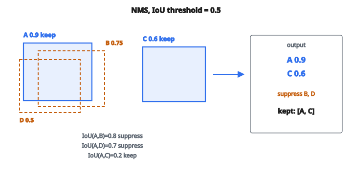

# Non-Maximum Suppression

## Non-Maximum Suppression là gì

**Non-Maximum Suppression (NMS)** loại các detection chồng lấp thừa, chỉ giữ cái tốt nhất. Khi bộ phát hiện đối tượng sinh nhiều bounding box cho cùng một vật, NMS lọc còn một detection bằng cách loại những hộp không phải cực đại địa phương theo điểm tin cậy (confidence score).

## Vì sao cần NMS

**Hành vi của detector**: Các bộ phát hiện như YOLO, Faster R-CNN và SSD sinh hàng nghìn bounding box ứng viên kèm confidence score.

**Dự đoán chồng lấp**: Nhiều hộp thường phủ cùng một đối tượng, với độ chính xác khác nhau.

**Di sản sliding window**: Ngay cả detector hiện đại vẫn có thể đề xuất nhiều hộp cho một đối tượng vì anchor box hoặc dự đoán theo lưới.

**Đầu ra sạch**: Các bước sau cần đúng một detection mỗi đối tượng để đếm, tracking, hoặc phân tích.

## Ý tưởng cốt lõi

**Mục tiêu**: Trong mỗi nhóm detection chồng lấp của cùng một đối tượng, chỉ giữ hộp có confidence cao nhất.

**Cách làm**: Lặp: chọn hộp điểm cao nhất, loại mọi hộp chồng đáng kể với nó, rồi lặp lại.

**Tham số then chốt**: ngưỡng IoU — định nghĩa thế nào là “chồng đáng kể”

## Intersection over Union (IoU)

IoU đo mức chồng lấp giữa hai bounding box:

$$
\mathrm{IoU}(A, B) = \frac{\mathrm{Area}(A \cap B)}{\mathrm{Area}(A \cup B)}
$$

**Tính chất**:

* Khoảng: $[0, 1]$
* $\mathrm{IoU} = 0$: không chồng
* $\mathrm{IoU} = 1$: chồng hoàn hảo (hai hộp trùng nhau)
* $\mathrm{IoU} = 0.5$: hai hộp chồng khoảng một nửa diện tích hợp

**Cách tính**:

$$
\mathrm{Area}(A \cap B) = \max(0, x_2^{\mathrm{int}} - x_1^{\mathrm{int}}) \times \max(0, y_2^{\mathrm{int}} - y_1^{\mathrm{int}})
$$

Tọa độ phần giao:

* $x_1^{\mathrm{int}} = \max(x_1^A, x_1^B)$
* $y_1^{\mathrm{int}} = \max(y_1^A, y_1^B)$
* $x_2^{\mathrm{int}} = \min(x_2^A, x_2^B)$
* $y_2^{\mathrm{int}} = \min(y_2^A, y_2^B)$

$$
\mathrm{Area}(A \cup B) = \mathrm{Area}(A) + \mathrm{Area}(B) - \mathrm{Area}(A \cap B)
$$

## Thuật toán NMS

**Đầu vào**:

* Danh sách bounding box kèm tọa độ
* Confidence score của mỗi hộp
* Ngưỡng IoU (thường $0.5$)

**Quy trình**:

1. Sắp xếp mọi hộp theo confidence (giảm dần)
2. Chọn hộp điểm cao nhất, thêm vào đầu ra
3. Xóa mọi hộp có $\mathrm{IoU}$ lớn hơn ngưỡng với hộp vừa chọn
4. Lặp bước 2–3 đến khi không còn hộp

**Đầu ra**: danh sách hộp đã lọc, không còn chồng đáng kể

## Ví dụ số

**Detection** (tọa độ hộp và điểm):

* Hộp A: $\mathrm{score}=0.9$
* Hộp B: $\mathrm{score}=0.75$, $\mathrm{IoU}$ với A $= 0.8$
* Hộp C: $\mathrm{score}=0.6$, $\mathrm{IoU}$ với A $= 0.2$, $\mathrm{IoU}$ với B $= 0.3$
* Hộp D: $\mathrm{score}=0.5$, $\mathrm{IoU}$ với A $= 0.7$, $\mathrm{IoU}$ với B $= 0.9$, $\mathrm{IoU}$ với C $= 0.1$

::: {#fig-119-nms fig-cap="NMS với ngưỡng IoU = 0.5 giữ A (0.9) và C (0.6); B (IoU với A = 0.8) và D (IoU với A = 0.7) bị suppress vì là bản sao của A." fig-alt="Bốn hộp: A score 0.9 giữ, B 0.75 bị loại vì IoU với A bằng 0.8, C 0.6 giữ vì IoU với A bằng 0.2, D 0.5 bị loại; đầu ra A và C."}
{fig-align="center"}
:::

**NMS với ngưỡng $= 0.5$**:

**Vòng 1**:

* Chọn hộp A (điểm cao nhất $0.9$)
* Kiểm tra chồng: B có $\mathrm{IoU}\, 0.8 > 0.5$ (suppress), D có $\mathrm{IoU}\, 0.7 > 0.5$ (suppress)
* Xóa B và D
* Còn lại: C

**Vòng 2**:

* Chọn hộp C (điểm $0.6$)
* Không còn hộp để so sánh
* Xong

**Đầu ra**: $[\text{hộp A}, \text{hộp C}]$

Hộp A và C đại diện hai đối tượng khác nhau (IoU thấp). Hộp B và D là bản sao của A.

## Chọn ngưỡng IoU

**Ngưỡng cao (ví dụ $0.7$)**:

* Nới hơn — giữ nhiều hộp hơn
* Rủi ro: có thể giữ detection trùng
* Dùng khi: đối tượng nằm dày đặc

**Ngưỡng thấp (ví dụ $0.3$)**:

* Gắt hơn — xóa nhiều hộp hơn
* Rủi ro: có thể suppress detection hợp lệ ở gần
* Dùng khi: đối tượng tách rõ

**Mặc định phổ biến**: $0.5$ cân bằng false positive và detection bị bỏ sót

## NMS theo lớp

Khi phát hiện nhiều lớp đối tượng:

**Lựa chọn 1 — NMS từng lớp**:

* Chạy NMS riêng trong từng lớp
* Hộp xe không suppress hộp người dù chồng nhau
* Cách dùng phổ biến nhất

**Lựa chọn 2 — NMS không phân lớp (class-agnostic)**:

* Chạy NMS trên mọi lớp
* Hộp confidence cao suppress mọi hộp chồng có confidence thấp hơn
* Dùng khi các lớp loại trừ nhau tại một vị trí

## Soft-NMS

NMS chuẩn xóa hẳn hộp chồng. Soft-NMS giảm điểm của chúng thay vì xóa:

**Suy giảm tuyến tính**:

$$
s_i =
\begin{cases}
s_i & \text{nếu } \mathrm{IoU}(M, b_i) < \text{threshold} \\
s_i \bigl(1 - \mathrm{IoU}(M, b_i)\bigr) & \text{nếu không}
\end{cases}
$$

**Suy giảm Gaussian**:

$$
s_i = s_i \cdot e^{-\frac{\mathrm{IoU}(M, b_i)^2}{\sigma}}
$$

với $M$ là hộp vừa chọn và $b_i$ là hộp khác.

**Lợi ích**: xử lý tốt hơn khi đối tượng thực sự nằm sát nhau

## Độ phức tạp tính toán

**Cài đặt ngây thơ**: $O(N^2)$ với $N$ là số hộp

* So mọi cặp hộp

**Cài đặt tối ưu**:

* Sắp theo điểm: $O(N \log N)$
* Chỉ mục không gian có thể giảm số phép so sánh
* Bản tăng tốc GPU cho ứng dụng thời gian thực

**Thực tế**: $N$ thường nhỏ sau khi lọc theo confidence (hàng trăm, không phải hàng nghìn)

## Biểu diễn bounding box

Các định dạng phổ biến:

**Corner format**: $(x_1, y_1, x_2, y_2)$ — góc trên-trái và dưới-phải

**Center format**: $(c_x, c_y, w, h)$ — tâm và kích thước

**YOLO format**: $(c_x, c_y, w, h)$ chuẩn hóa về $[0, 1]$ theo kích thước ảnh

**Cần đổi định dạng**: tính IoU thường dùng corner format

## Trường hợp biên

**Không có hộp**: trả về danh sách rỗng

**Một hộp**: trả về đúng hộp đó (không cần suppress)

**Mọi hộp bị suppress**: có thể xảy ra nếu một hộp confidence cao chồng tất cả hộp còn lại

**Hòa điểm tin cậy**: thứ tự có thể đổi kết quả; thường xử lý bằng sắp xếp ổn định (stable sort)

## Hạn chế của NMS chuẩn

**Chọn tham lam**: có thể không ra nghiệm tối ưu toàn cục

**Ngưỡng cứng**: quyết định nhị phân giữ hoặc xóa

**Che khuất**: khó khi đối tượng thực sự chồng nhau

**Tốc độ**: có thể thành nút thắt với hệ thời gian thực khi có nhiều detection

## Các biến thể NMS

**Weighted NMS**: trung bình tọa độ các hộp được gộp, trọng số theo confidence

**Cluster-NMS**: nhóm hộp thành cụm rồi mới suppress

**Matrix NMS**: bản song song hóa bằng phép toán ma trận

**DIoU-NMS**: dùng Distance-IoU thay IoU chuẩn, có xét khoảng cách tâm

## Gắn vào pipeline detection

**Luồng điển hình**:

1. Detector sinh dự đoán thô (hàng nghìn hộp)
2. Lọc theo confidence, bỏ hộp điểm thấp
3. NMS xóa detection trùng
4. Đầu ra cuối: tập detection sạch

**Khi áp dụng**: bước hậu xử lý sau inference của mô hình

## NMS xuất hiện ở đâu

* **Object detection**: YOLO, SSD, Faster R-CNN đều cần NMS hậu xử lý
* **Face detection**: loại nhiều detection của cùng một khuôn mặt
* **Pedestrian detection**: xe tự hành phát hiện người
* **Edge detection**: Canny dùng NMS để làm mỏng cạnh
* **Feature detection**: Harris corner, SIFT keypoint dùng NMS địa phương
* **Text detection**: hệ OCR phát hiện vùng chữ
* **Medical imaging**: phát hiện tổn thương, khối u, hoặc cấu trúc giải phẫu
* **Pose estimation**: chọn ứng viên keypoint tốt nhất
* **Tracking**: khởi tạo track từ nhiều detection
* **Instance segmentation**: chọn đề xuất mask tốt nhất

## Code
```python
def nms(boxes, scores, iou_threshold):
    """
    Apply Non-Maximum Suppression.
    """
    if not boxes:
        return []
    indices = sorted(range(len(scores)), key=lambda i: scores[i], reverse=True)
    kept = []
    while indices:
        c = indices.pop(0)
        kept.append(c)
        remaining = []
        for i in indices:
            x1 = max(boxes[c][0], boxes[i][0])
            y1 = max(boxes[c][1], boxes[i][1])
            x2 = min(boxes[c][2], boxes[i][2])
            y2 = min(boxes[c][3], boxes[i][3])
            inter = max(0, x2 - x1) * max(0, y2 - y1)
            a1 = (boxes[c][2] - boxes[c][0]) * (boxes[c][3] - boxes[c][1])
            a2 = (boxes[i][2] - boxes[i][0]) * (boxes[i][3] - boxes[i][1])
            iou = inter / (a1 + a2 - inter) if (a1 + a2 - inter) else 0.0
            if iou < iou_threshold:
                remaining.append(i)
        indices = remaining
    return kept

```
