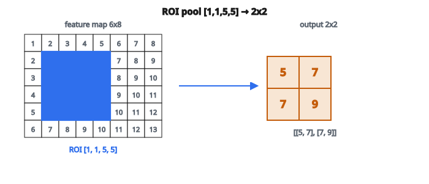

# ROI Pooling

## Vấn đề ROI Pooling giải quyết

Trong object detection, mạng đề xuất vùng (region proposal network) gợi ý nhiều vùng quan tâm (ROI) kích thước khác nhau. Nhưng bộ phân loại phía sau cần đầu vào kích thước cố định.

**Thách thức:**

* ROI 1: $100 \times 150$ pixel
* ROI 2: $50 \times 50$ pixel
* ROI 3: $200 \times 80$ pixel
* Classifier kỳ vọng: $7 \times 7$ pixel

**ROI pooling** biến vùng kích thước tùy ý thành feature map kích thước cố định.

## ROI Pooling hoạt động thế nào

Cho:

* Một feature map (đầu ra CNN)
* Danh sách ROI (bounding box theo tọa độ feature map)
* Kích thước đầu ra đích (ví dụ $7 \times 7$)

Với mỗi ROI:

1. Chia ROI thành lưới $\mathrm{output\_size} \times \mathrm{output\_size}$ bin
2. Max pooling trong từng bin
3. Kết quả: một feature map $\mathrm{output\_size} \times \mathrm{output\_size}$ mỗi ROI

## Tính bin

Với ROI tọa độ $(x_1, y_1, x_2, y_2)$:

Kích thước ROI:

* $\mathrm{roi\_h} = y_2 - y_1$
* $\mathrm{roi\_w} = x_2 - x_1$

Với bin $(i, j)$ trên lưới đầu ra:

$$
h_{\mathrm{start}} = y_1 + \left\lfloor \frac{i \cdot \mathrm{roi\_h}}{\text{output size}} \right\rfloor
$$

$$
h_{\mathrm{end}} = y_1 + \left\lfloor \frac{(i+1) \cdot \mathrm{roi\_h}}{\text{output size}} \right\rfloor
$$

Tương tự theo chiều rộng. Rồi lấy giá trị max trong vùng bin đó.

## Ví dụ số

**Feature map ($6 \times 8$):**

```
 1  2  3  4  5  6  7  8
 2  3  4  5  6  7  8  9
 3  4  5  6  7  8  9 10
 4  5  6  7  8  9 10 11
 5  6  7  8  9 10 11 12
 6  7  8  9 10 11 12 13
```

**ROI:** $[1, 1, 5, 5]$ ($x_1=1$, $y_1=1$, $x_2=5$, $y_2=5$)
**Kích thước đầu ra:** $2 \times 2$

Kích thước ROI: $\mathrm{roi\_h} = 4$, $\mathrm{roi\_w} = 4$

::: {#fig-122-roi-pool fig-cap="ROI [1, 1, 5, 5] chia thành 4 bin; max pooling cho đầu ra 2×2 bằng [[5, 7], [7, 9]]." fig-alt="Feature map 6×8 với ROI [1,1,5,5] chia 2×2 bin; max từng bin là 5, 7, 7, 9 nên đầu ra [[5,7],[7,9]]."}
{fig-align="center"}
:::

**Bin $(0, 0)$:**

* $h_{\mathrm{start}} = 1 + \lfloor 0 \cdot 4 / 2 \rfloor = 1$
* $h_{\mathrm{end}} = 1 + \lfloor 1 \cdot 4 / 2 \rfloor = 3$
* $w_{\mathrm{start}} = 1 + \lfloor 0 \cdot 4 / 2 \rfloor = 1$
* $w_{\mathrm{end}} = 1 + \lfloor 1 \cdot 4 / 2 \rfloor = 3$
* Vùng: hàng $1$–$2$, cột $1$–$2$ $= [[3,4], [4,5]]$
* Max: $5$

**Bin $(0, 1)$:**

* $w_{\mathrm{start}} = 1 + \lfloor 1 \cdot 4 / 2 \rfloor = 3$
* $w_{\mathrm{end}} = 1 + \lfloor 2 \cdot 4 / 2 \rfloor = 5$
* Vùng: hàng $1$–$2$, cột $3$–$4$ $= [[5,6], [6,7]]$
* Max: $7$

**Bin $(1, 0)$:**

* Vùng: hàng $3$–$4$, cột $1$–$2$ $= [[5,6], [6,7]]$
* Max: $7$

**Bin $(1, 1)$:**

* Vùng: hàng $3$–$4$, cột $3$–$4$ $= [[7,8], [8,9]]$
* Max: $9$

**Đầu ra:**

```
5  7
7  9
```

## Lỗi lượng tử hóa

ROI pooling có sai số lượng tử hóa:

**Vấn đề 1: tọa độ ROI bị lượng tử hóa**

* ROI gốc có thể là $[1.3, 2.7, 5.8, 6.2]$
* Lượng tử hóa thành $[1, 2, 5, 6]$
* Mất độ chính xác dưới pixel

**Vấn đề 2: biên bin bị lượng tử hóa**

* Các bin có thể khác số pixel
* Một số bin có thể rỗng (nếu ROI rất nhỏ)

Các lỗi này làm giảm độ chính xác, đặc biệt với đối tượng nhỏ.

## Xử lý trường hợp biên

**Bin rỗng:**

* Nếu $h_{\mathrm{end}} = h_{\mathrm{start}}$, đặt $h_{\mathrm{end}} = h_{\mathrm{start}} + 1$
* Bảo đảm mỗi bin có ít nhất một pixel

**ROI nằm ngoài feature map:**

* Cắt tọa độ về khoảng hợp lệ
* Hoặc pad feature map bằng không

**ROI rất nhỏ:**

* Có thể có ít pixel hơn số bin đầu ra
* Một số bin chia sẻ pixel

## ROI Align: cải tiến

ROI Align (từ Mask R-CNN) sửa lỗi lượng tử hóa:

**Khác biệt chính:**

* Không làm tròn tọa độ ROI
* Dùng nội suy bilinear thay cho max pooling
* Lấy mẫu tại các vị trí dưới pixel cố định trong mỗi bin

**Kết quả:**

* Định vị chính xác hơn
* Cần thiết cho bài toán mức pixel (segmentation)
* Chuẩn trong detector hiện đại

## ROI Pooling đa kênh

Với feature map $C$ kênh:

* Áp ROI pooling độc lập trên từng kênh
* Đầu ra: $\mathrm{output\_size} \times \mathrm{output\_size} \times C$ mỗi ROI

Phép pooling giống nhau; chỉ lặp lại theo từng kênh.

## ROI Pooling được dùng ở đâu

**Faster R-CNN:**

* RPN đề xuất khoảng $300$ ROI
* ROI pooling trích đặc trưng $7 \times 7$ từ mỗi ROI
* Tiếp theo là tầng FC cho phân loại và tinh chỉnh hộp

**Fast R-CNN:**

* ROI đến từ đề xuất ngoài (Selective Search)
* Cùng cơ chế ROI pooling

**Feature Pyramid Networks:**

* ROI được gán vào các tầng FPN khác nhau theo kích thước
* ROI lớn dùng feature map thô hơn

## ROI Pooling so với Spatial Pyramid Pooling

**ROI Pooling:**

* Nhiều ROI từ một ảnh
* Mỗi ROI cho một đầu ra kích thước cố định
* Các ROI có thể chồng nhau

**Spatial Pyramid Pooling (SPP):**

* Nhiều kích thước pooling cho một vùng
* Nối đầu ra từ các lưới khác kích thước
* Tạo biểu diễn đa tỉ lệ

Cả hai giải bài toán “kích thước biến thiên → kích thước cố định”, nhưng theo cách khác nhau.

## Chiến lược cài đặt

Với mỗi ROI:

1. Lấy biên ROI
2. Tính biên bin (chia lấy phần nguyên dưới)
3. Với mỗi bin:
   a. Xử lý trường hợp bin rỗng
   b. Cắt vùng từ feature map
   c. Tính giá trị max
   d. Ghi vào đầu ra
4. Trả về tensor đầu ra

Khi xử lý nhiều ROI, kết quả là danh sách (hoặc batch) các feature map kích thước cố định.

## Code
```python
import math

def roi_pool(feature_map, rois, output_size):
    """
    Apply ROI Pooling to extract fixed-size features.
    """
    results = []
    for roi in rois:
        x1, y1, x2, y2 = roi
        rh, rw = y2 - y1, x2 - x1
        pooled = []
        for i in range(output_size):
            row = []
            for j in range(output_size):
                hs = y1 + int(math.floor(i * rh / output_size))
                he = y1 + int(math.floor((i + 1) * rh / output_size))
                ws = x1 + int(math.floor(j * rw / output_size))
                we = x1 + int(math.floor((j + 1) * rw / output_size))
                he, we = max(he, hs + 1), max(we, ws + 1)
                mx = float("-inf")
                for r in range(hs, he):
                    for c in range(ws, we):
                        if 0 <= r < len(feature_map) and 0 <= c < len(feature_map[0]):
                            mx = max(mx, feature_map[r][c])
                row.append(mx)
            pooled.append(row)
        results.append(pooled)
    return results

```
