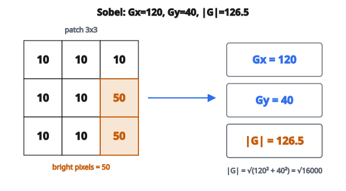

# Sobel Edge Detection

## Cạnh là gì

Cạnh trên ảnh là ranh giới nơi cường độ pixel đổi đột ngột. Chúng tương ứng với:

* Biên vật thể
* Thay đổi hướng bề mặt
* Thay đổi vật liệu hoặc ánh sáng
* Gián đoạn độ sâu

Phát hiện cạnh là nền tảng cho nhiều tác vụ computer vision: object detection, segmentation, và trích đặc trưng.

## Tiếp cận bằng gradient

Cạnh xuất hiện nơi cường độ ảnh đổi nhanh. Về toán, đó là nơi **gradient** lớn:

$$
\nabla I = \left( \frac{\partial I}{\partial x}, \frac{\partial I}{\partial y} \right)
$$

Gradient có hai thành phần:

* $\partial I / \partial x$: tốc độ đổi theo phương ngang
* $\partial I / \partial y$: tốc độ đổi theo phương dọc

Độ lớn gradient cho biết độ mạnh của cạnh:

$$
|\nabla I| = \sqrt{\left(\frac{\partial I}{\partial x}\right)^2 + \left(\frac{\partial I}{\partial y}\right)^2}
$$

## Toán tử Sobel

Toán tử Sobel xấp xỉ gradient ảnh bằng convolution với hai kernel $3 \times 3$:

**Kernel gradient ngang ($K_x$):**

$$
K_x = \begin{bmatrix}
-1 & 0 & 1 \\
-2 & 0 & 2 \\
-1 & 0 & 1
\end{bmatrix}
$$

**Kernel gradient dọc ($K_y$):**

$$
K_y = \begin{bmatrix}
-1 & -2 & -1 \\
0 & 0 & 0 \\
1 & 2 & 1
\end{bmatrix}
$$

Hai kernel này được thiết kế để:

* Tính sai phân hữu hạn (xấp xỉ đạo hàm)
* Áp làm mượt để giảm nhiễu (trung bình có trọng số)

## Kernel hoạt động thế nào

**$K_x$ phát hiện cạnh dọc:**

* Dương bên phải, âm bên trái
* Đáp ứng lớn khi bên trái tối và bên phải sáng
* Đáp ứng không khi vùng đều

**$K_y$ phát hiện cạnh ngang:**

* Dương phía dưới, âm phía trên
* Đáp ứng lớn khi phía trên tối và phía dưới sáng

Các trọng số $(1, 2, 1)$ làm mượt vuông góc với hướng gradient.

## Các bước tính

**Bước 1: Pad ảnh**

* Thêm 1 pixel số 0 quanh mọi mép
* Bảo đảm đầu ra cùng kích thước đầu vào

**Bước 2: Tính gradient ngang**

* Convolution ảnh đã pad với $K_x$
* Kết quả: $G_x$ (gradient ngang tại mỗi pixel)

**Bước 3: Tính gradient dọc**

* Convolution ảnh đã pad với $K_y$
* Kết quả: $G_y$ (gradient dọc tại mỗi pixel)

**Bước 4: Tính độ lớn**

$$
G = \sqrt{G_x^2 + G_y^2}
$$

Đây là độ mạnh cạnh tại mỗi pixel.

## Ví dụ số

**Patch ảnh ($3 \times 3$) từ ảnh đã pad:**

$$
\begin{bmatrix}
10 & 10 & 10 \\
10 & 10 & 50 \\
10 & 10 & 50
\end{bmatrix}
$$

::: {#fig-128-sobel fig-cap="Patch có cạnh dọc (cột phải $50$): $G_x=120$, $G_y=40$, $|G|=\sqrt{16000}\approx 126.5$." fig-alt="Patch 3x3 voi cot phai 50; Sobel cho Gx=120, Gy=40, magnitude 126.5."}
{fig-align="center"}
:::

**Tính $G_x$ (tại pixel tâm):**

Áp $K_x$:

$$
\begin{aligned}
G_x &= (-1)(10) + (0)(10) + (1)(10) \\
    &\quad + (-2)(10) + (0)(10) + (2)(50) \\
    &\quad + (-1)(10) + (0)(10) + (1)(50) \\
    &= -10 + 0 + 10 - 20 + 0 + 100 - 10 + 0 + 50 \\
    &= 120
\end{aligned}
$$

**Tính $G_y$ (tại pixel tâm):**

Áp $K_y$:

$$
\begin{aligned}
G_y &= (-1)(10) + (-2)(10) + (-1)(10) \\
    &\quad + (0)(10) + (0)(10) + (0)(50) \\
    &\quad + (1)(10) + (2)(10) + (1)(50) \\
    &= -10 - 20 - 10 + 0 + 0 + 0 + 10 + 20 + 50 \\
    &= 40
\end{aligned}
$$

**Độ lớn:** $\sqrt{120^{2} + 40^{2}} = \sqrt{14400 + 1600} = \sqrt{16000} = 126.5$

Giá trị này cho thấy một cạnh mạnh tại vị trí đó.

## Hướng gradient

Hướng gradient cho biết hướng của cạnh:

$$
\theta = \arctan\left(\frac{G_y}{G_x}\right)
$$

Góc này chỉ vuông góc với cạnh (theo hướng tăng nhanh nhất).

**Với ví dụ trên:**

* $\theta = \arctan(40/120) = \arctan(0.333) = 18.4$ độ

Cạnh chủ yếu là dọc (gradient chỉ chủ yếu theo phương ngang).

## Tính chất của Sobel

**Điểm mạnh:**

* Đơn giản và nhanh
* Cho cả độ lớn lẫn hướng
* Làm mượt tích hợp sẵn, giảm nhạy nhiễu
* Tốt cho phát hiện cạnh đa dụng

**Điểm yếu:**

* Cạnh dày (không chính xác tới từng pixel)
* Nhạy nhiễu với gradient nhỏ
* Tỉ lệ cố định (chỉ bắt cạnh ở một scale)

## Sobel và các detector khác

**Sai phân hữu hạn đơn giản:**

* Kernel: $[[-1, 1]]$ và $[[-1], [1]]$
* Không làm mượt, rất nhạy nhiễu
* Sobel thêm bước làm mượt

**Toán tử Prewitt:**

* Cùng cấu trúc Sobel nhưng trọng số $(1, 1, 1)$
* Làm mượt ít hơn Sobel
* Hơi sắc hơn nhưng nhạy nhiễu hơn

**Toán tử Scharr:**

* Trọng số $(3, 10, 3)$ thay cho $(1, 2, 1)$
* Bất biến quay tốt hơn
* Dùng khi cần chính xác hơn

**Canny edge detector:**

* Dùng Sobel như một thành phần
* Thêm non-maximum suppression và hysteresis
* Cho cạnh mỏng, định vị tốt

## Ứng dụng

**Tiền xử lý cho thuật toán khác:**

* Phát hiện đặc trưng (góc, đường)
* Object detection
* Image segmentation

**Phân tích ảnh:**

* Quét tài liệu (tìm mép giấy)
* Ảnh y khoa (biên cơ quan)
* Kiểm tra công nghiệp (phát hiện khuyết tật)

**Hiệu ứng nghệ thuật:**

* Cartoon / sketch
* Tăng cường cạnh

## Ghi chú cài đặt

**Padding:**

* Zero padding là chuẩn
* Replication padding có thể giảm artifact ở mép

**Kiểu dữ liệu:**

* Gradient có thể âm ($G_x$ và $G_y$)
* Dùng số nguyên có dấu hoặc float cho kết quả trung gian
* Độ lớn luôn không âm

**Chuẩn hóa:**

* Độ lớn thô có thể lớn (tới khoảng $1443$ với ảnh 8-bit)
* Thường chuẩn hóa về $[0, 255]$ để hiển thị

## Code
```python
import math

def sobel_edges(image):
    """
    Apply the Sobel operator to detect edges.
    """
    h, w = len(image), len(image[0])
    padded = [[0]*(w+2) for _ in range(h+2)]
    for i in range(h):
        for j in range(w):
            padded[i+1][j+1] = image[i][j]
    Kx = [[-1,0,1],[-2,0,2],[-1,0,1]]
    Ky = [[-1,-2,-1],[0,0,0],[1,2,1]]
    out = []
    for i in range(h):
        row = []
        for j in range(w):
            gx = gy = 0.0
            for di in range(3):
                for dj in range(3):
                    v = padded[i+di][j+dj]
                    gx += v * Kx[di][dj]
                    gy += v * Ky[di][dj]
            row.append(math.sqrt(gx*gx + gy*gy))
        out.append(row)
    return out

```

<!-- auto-self-check -->

::: {.callout-note}
## Kiểm tra nhanh
<details>
<summary>Ý chính của bài «Sobel Edge Detection» là gì?</summary>
Cạnh trên ảnh là ranh giới nơi cường độ pixel đổi đột ngột.
</details>
<details>
<summary>Công thức / quan hệ cốt lõi trong bài là gì?</summary>
$$\nabla I = \left( \frac{\partial I}{\partial x}, \frac{\partial I}{\partial y} \right)$$
</details>
:::
