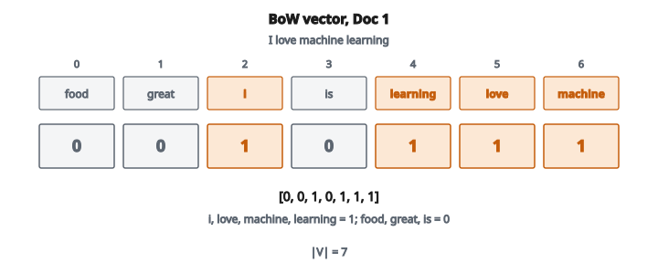

# Bag-of-Words Vector

## Bag of Words là gì

Mô hình **Bag of Words (BoW)** biểu diễn văn bản như một tập đếm từ, hoàn toàn bỏ qua ngữ pháp, thứ tự từ, và cấu trúc câu. Nó coi tài liệu như một "túi" (multiset) trong đó chỉ sự xuất hiện và tần suất của từ là quan trọng.

**Ví dụ:**

"The cat sat on the mat" trở thành:

* the: 2
* cat: 1
* sat: 1
* on: 1
* mat: 1

Việc "cat" đứng trước "sat" bị mất. Mô hình chỉ biết từ nào xuất hiện và xuất hiện bao nhiêu lần.

## Vì sao bỏ qua thứ tự từ

Đây trông như một hạn chế lớn, và đúng là vậy. Nhưng BoW vẫn hữu ích bất ngờ:

**1. Đơn giản**

Biểu diễn chỉ là một vector đếm. Không cần parsing phức tạp, không phụ thuộc, không cần mạng neural.

**2. Hiệu quả**

Xây BoW nhanh. So sánh tài liệu chỉ là tính độ tương đồng vector.

**3. Hiệu quả cho nhiều tác vụ**

Với phân loại chủ đề, phát hiện spam, và phân tích cảm xúc, sự hiện diện của từ thường là tín hiệu mạnh nhất. "The movie was terrible" và "terrible was the movie" có cùng sentiment.

**4. Nền tảng cho mô hình tốt hơn**

TF-IDF, BM25, và cả một số mô hình neural xây trên khái niệm BoW.

## Xây dựng vocabulary

Trước khi tạo vector BoW, cần một **vocabulary**: danh sách mọi từ phân biệt trên toàn corpus.

**Corpus:**

* Doc 1: "I love machine learning"
* Doc 2: "machine learning is great"
* Doc 3: "I love great food"

**Vocabulary (sắp xếp alphabet):**

[food, great, i, is, learning, love, machine]

Mỗi từ nhận một chỉ số:

* food: 0
* great: 1
* i: 2
* is: 3
* learning: 4
* love: 5
* machine: 6

## Tạo vector BoW

Mỗi tài liệu trở thành một vector độ dài $|V|$ (kích thước vocabulary), trong đó vị trí $i$ chứa số lần xuất hiện của từ $i$.

**Doc 1: "I love machine learning"**

* food: 0
* great: 0
* i: 1
* is: 0
* learning: 1
* love: 1
* machine: 1

Vector: $[0, 0, 1, 0, 1, 1, 1]$

::: {#fig-101-bow-vector fig-cap="Doc 1 'I love machine learning' trên $V =$ [food, great, i, is, learning, love, machine] cho vector $[0, 0, 1, 0, 1, 1, 1]$: i, love, machine, learning mỗi từ đếm 1." fig-alt="Vector BoW của Doc 1 trên vocabulary food, great, i, is, learning, love, machine; bốn ô i, learning, love, machine bằng 1, các ô còn lại bằng 0."}
{fig-align="center"}
:::

**Doc 2: "machine learning is great"**

Vector: $[0, 1, 0, 1, 1, 0, 1]$

**Doc 3: "I love great food"**

Vector: $[1, 1, 1, 0, 0, 1, 0]$

## Ma trận document-term

Xếp mọi vector tài liệu để tạo **ma trận document-term**:

$$
\begin{bmatrix}
0 & 0 & 1 & 0 & 1 & 1 & 1 \\
0 & 1 & 0 & 1 & 1 & 0 & 1 \\
1 & 1 & 1 & 0 & 0 & 1 & 0
\end{bmatrix}
$$

* Hàng là tài liệu
* Cột là term trong vocabulary
* Mỗi ô là số lần term đó xuất hiện trong tài liệu đó

Ma trận này thường rất **thưa** (phần lớn là không) vì mỗi tài liệu chỉ dùng một phần nhỏ của toàn bộ vocabulary.

## Tiền xử lý cho BoW

Văn bản thô cần được làm sạch trước khi BoW hoạt động tốt:

**1. Lowercasing**

"Machine" và "machine" phải là cùng một từ.

**2. Tokenization**

Tách văn bản thành từ. Xử lý dấu câu, rút gọn, từ có gạch nối.

"don't" có thể thành ["do", "n't"] hoặc ["dont"] hoặc ["don't"]

**3. Stopword removal**

Loại từ phổ biến như "the", "is", "a" xuất hiện khắp nơi và thêm nhiễu.

**4. Stemming/Lemmatization**

Đưa từ về dạng gốc.

* "learning", "learned", "learns" đều thành "learn"
* Giảm kích thước vocabulary và nhóm các từ liên quan

**5. Loại từ hiếm**

Từ chỉ xuất hiện trong 1–2 tài liệu thêm chiều mà không mang tín hiệu hữu ích.

**6. Loại từ rất phổ biến**

Từ xuất hiện trong hơn 90% tài liệu (ngoài stopwords) có thể không phân biệt được lớp.

## Binary vs. count vs. frequency

**Binary BoW:**

1 nếu từ xuất hiện, 0 nếu không. Bỏ qua số lần xuất hiện.

Doc: "the cat sat on the mat"

Binary: the=1, cat=1, sat=1, on=1, mat=1

**Count BoW (chuẩn):**

Đếm thô mỗi từ.

Count: the=2, cat=1, sat=1, on=1, mat=1

**Term frequency (chuẩn hóa):**

Đếm chia cho độ dài tài liệu.

TF: the=$2/6$, cat=$1/6$, sat=$1/6$, on=$1/6$, mat=$1/6$

Chuẩn hóa giúp khi so sánh tài liệu khác độ dài.

## Cân nhắc kích thước vocabulary

Vocabulary thực tế có thể rất lớn:

* Tiếng Anh có hơn 170,000 từ trong từ điển
* Một corpus lớn có thể có hơn 1,000,000 token phân biệt (kể cả lỗi chính tả, tên, số)

**Vấn đề với vocabulary lớn:**

* Vector chiều cao (bộ nhớ, tính toán)
* Biểu diễn thưa (hầu hết phần tử bằng không)
* Nhiễu từ token hiếm/vô nghĩa

**Cách xử lý:**

* Chỉ giữ top $N$ từ xuất hiện nhiều nhất (ví dụ $N = 10{,}000$)
* Loại từ xuất hiện ở ít hơn $K$ tài liệu
* Dùng tokenization subword (nhưng lúc này đã vượt BoW đơn giản)

## Độ tương đồng tài liệu với BoW

Khi tài liệu đã là vector, có thể tính độ tương đồng:

**Cosine similarity:**

$$
\text{sim}(A, B) = \frac{A \cdot B}{\|A\| \times \|B\|}
$$

Đại lượng này đo góc giữa hai vector, bỏ qua độ lớn.

**Ví dụ:**

Doc A: $[1, 2, 0, 1]$

Doc B: $[2, 1, 0, 1]$

$$
\begin{aligned}
A \cdot B &= 1 \times 2 + 2 \times 1 + 0 \times 0 + 1 \times 1 = 5 \\
\|A\| &= \sqrt{1 + 4 + 0 + 1} = \sqrt{6} \\
\|B\| &= \sqrt{4 + 1 + 0 + 1} = \sqrt{6} \\
\text{sim}(A, B) &= \frac{5}{6} \approx 0.83
\end{aligned}
$$

## Hạn chế của BoW

**1. Không có thứ tự từ**

"Dog bites man" và "Man bites dog" có cùng biểu diễn BoW nhưng nghĩa ngược nhau.

**2. Không có ngữ nghĩa**

"Happy" và "joyful" bị coi là hai từ hoàn toàn khác, không liên hệ.

**3. Chiều cao**

Vocabulary lớn tạo vector thưa, chiều cao.

**4. Không có ngữ cảnh**

"Bank" (tài chính) và "bank" (bờ sông) là cùng một từ trong BoW.

**5. Từ ngoài vocabulary**

Từ không gặp khi xây vocabulary không thể biểu diễn.

## Ngoài BoW

**N-grams:**

Thay vì từ đơn, dùng cặp (bigram) hoặc bộ ba (trigram). "New York" trở thành một feature thay vì "new" và "york" tách rời.

**TF-IDF:**

Gán trọng số term theo mức độ hiếm trên corpus. Giảm ảnh hưởng của từ phổ biến.

**Word embeddings:**

Vector dày (Word2Vec, GloVe) bắt quan hệ ngữ nghĩa. "King" $-$ "man" $+$ "woman" $=$ "queen"

**Mô hình neural:**

Transformer và RNN xét thứ tự từ và ngữ cảnh.

Dù có các tiến bộ này, BoW vẫn hữu ích như baseline, cho ứng dụng cần hiệu năng, và như một thành phần trong hệ lai.

## Code
```python
import numpy as np

def bag_of_words_vector(tokens, vocab):
    """
    Returns: np.ndarray of shape (len(vocab),), dtype=int
    """
    vocab_idx = {word: i for i, word in enumerate(vocab)}
    vec = np.zeros(len(vocab), dtype=int)
    for token in tokens:
        if token in vocab_idx:
            vec[vocab_idx[token]] += 1
    return vec

```
