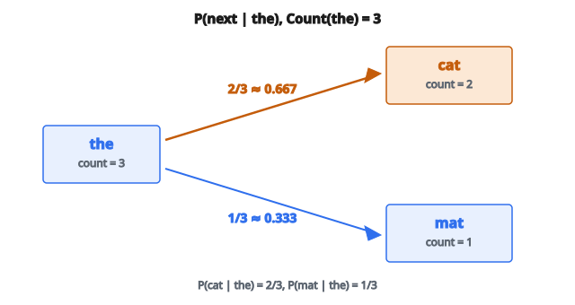

# Bigram Probabilities (Add-1 Smoothing)

## Bigram là gì

Một **bigram** là chuỗi hai phần tử liên tiếp. Trong NLP, bigram là cặp từ (hoặc ký tự) đứng liền nhau:

**Bigram từ trong "I love machine learning":**

* (I, love)
* (love, machine)
* (machine, learning)

**Bigram ký tự trong "hello":**

* (h, e)
* (e, l)
* (l, l)
* (l, o)

Bigram bắt ngữ cảnh cục bộ: từ hoặc ký tự nào có khuynh hướng đi sau một từ/ký tự khác.

## Mô hình ngôn ngữ bigram

Mô hình ngôn ngữ bigram ước lượng xác suất của một từ chỉ cho từ đứng ngay trước:

$$
P(w_n \mid w_1, w_2, \ldots, w_{n-1}) \approx P(w_n \mid w_{n-1})
$$

Đây là **giả thiết Markov**: từ tiếp theo chỉ phụ thuộc từ hiện tại, không phụ thuộc toàn bộ lịch sử.

Xác suất của cả câu là tích các xác suất bigram:

$$
P(w_1, w_2, \ldots, w_n) = P(w_1) \times P(w_2 \mid w_1) \times P(w_3 \mid w_2) \times \cdots \times P(w_n \mid w_{n-1})
$$

## Tính xác suất bigram

Xác suất bigram được ước lượng từ corpus bằng **maximum likelihood estimation**:

$$
P(w_2 \mid w_1) = \frac{\operatorname{Count}(w_1, w_2)}{\operatorname{Count}(w_1)}
$$

Đây là số lần bigram $(w_1, w_2)$ xuất hiện, chia cho số lần $w_1$ xuất hiện.

## Ví dụ số

**Corpus:** "the cat sat on the mat the cat slept"

**Bước 1: Đếm mọi bigram**

* (the, cat): 2
* (cat, sat): 1
* (sat, on): 1
* (on, the): 1
* (the, mat): 1
* (mat, the): 1
* (cat, slept): 1

**Bước 2: Đếm mọi unigram (từ đơn)**

* the: 3
* cat: 2
* sat: 1
* on: 1
* mat: 1
* slept: 1

**Bước 3: Tính xác suất bigram**

$$
\begin{aligned}
P(\text{cat} \mid \text{the})
&= \frac{\operatorname{Count}(\text{the}, \text{cat})}{\operatorname{Count}(\text{the})}
= \frac{2}{3} \approx 0.667 \\
P(\text{mat} \mid \text{the})
&= \frac{\operatorname{Count}(\text{the}, \text{mat})}{\operatorname{Count}(\text{the})}
= \frac{1}{3} \approx 0.333 \\
P(\text{sat} \mid \text{cat})
&= \frac{\operatorname{Count}(\text{cat}, \text{sat})}{\operatorname{Count}(\text{cat})}
= \frac{1}{2} = 0.5 \\
P(\text{slept} \mid \text{cat})
&= \frac{\operatorname{Count}(\text{cat}, \text{slept})}{\operatorname{Count}(\text{cat})}
= \frac{1}{2} = 0.5
\end{aligned}
$$

::: {#fig-99-bigram-probs fig-cap="$P(\text{cat}\mid\text{the}) = 2/3 \approx 0.667$ và $P(\text{mat}\mid\text{the}) = 1/3$, vì $\operatorname{Count}(\text{the}) = 3$." fig-alt="Hai nhánh P(cat|the)=2/3 ≈ 0.667 và P(mat|the)=1/3 khi Count(the)=3."}
{fig-align="center"}
:::

## Token bắt đầu và kết thúc

Văn bản thật có đầu và cuối. Ta dùng token đặc biệt:

* `<s>` hoặc `<start>`: đánh dấu đầu câu
* `</s>` hoặc `<end>`: đánh dấu cuối câu

**Câu:** "the cat sat"

**Có token đặc biệt:** "`<s>` the cat sat `</s>`"

**Bigrams:**

* (`<s>`, the)
* (the, cat)
* (cat, sat)
* (sat, `</s>`)

Nhờ đó mô hình học được:

* Từ nào thường mở đầu câu: $P(\text{the} \mid \langle s \rangle)$
* Từ nào thường kết thúc câu: $P(\langle /s \rangle \mid \text{sat})$

## Vấn đề xác suất bằng không

Nếu gặp một bigram chưa từng xuất hiện lúc huấn luyện thì sao?

**Corpus huấn luyện:** "the cat sat"

**Câu mới:** "the dog sat"

Bigram (the, dog) có count 0, nên:

$$
P(\text{dog} \mid \text{the}) = \frac{0}{\operatorname{Count}(\text{the})} = 0
$$

Đây là thảm họa. Xác suất cả câu thành 0, dù "the dog sat" là tiếng Anh hoàn toàn hợp lệ.

## Kỹ thuật smoothing

**Laplace (Add-One) Smoothing:**

Cộng 1 vào mọi count bigram:

$$
P(w_2 \mid w_1) = \frac{\operatorname{Count}(w_1, w_2) + 1}{\operatorname{Count}(w_1) + V}
$$

với $V$ là kích thước vocabulary.

Nhờ đó không xác suất nào đúng bằng không.

**Add-k Smoothing:**

Cộng một hằng số nhỏ $k$ (ví dụ 0.01) thay vì 1:

$$
P(w_2 \mid w_1) = \frac{\operatorname{Count}(w_1, w_2) + k}{\operatorname{Count}(w_1) + k \times V}
$$

**Backoff và interpolation:**

Nếu bigram chưa thấy, "back off" về xác suất unigram, hoặc nội suy giữa ước lượng bigram và unigram.

## Xây dựng ma trận xác suất

Với vocabulary kích thước $V$, xác suất bigram tạo thành ma trận $V \times V$ trong đó:

* Hàng $i$ ứng với từ thứ nhất $w_1$
* Cột $j$ ứng với từ thứ hai $w_2$
* Ô $(i, j)$ chứa $P(w_2 = j \mid w_1 = i)$

Mỗi hàng tổng bằng 1 (đó là phân phối xác suất trên các từ tiếp theo có thể).

## Dùng xác suất bigram

**Sinh văn bản:**

1. Bắt đầu với `<s>`
2. Sample từ tiếp theo từ $P(w \mid \langle s \rangle)$
3. Sample từ tiếp theo từ $P(w \mid \text{từ trước})$
4. Lặp đến khi sample được `</s>`

**Chấm điểm câu:**

* Tính $P(\text{sentence}) = \prod P(w_i \mid w_{i-1})$
* Xác suất cao hơn nghĩa là câu hợp hơn dưới mô hình

**Perplexity:**

* Perplexity đo mức mô hình bị "bất ngờ" bởi dữ liệu kiểm tra
* Perplexity thấp hơn nghĩa là khớp mô hình tốt hơn

## Hạn chế của bigram

**Ngữ cảnh hạn chế:**
Bigram chỉ thấy một từ lịch sử. Chúng không bắt được:

* "The cat that I saw yesterday sat" (phụ thuộc tầm xa)
* Hòa hợp chủ-vị xuyên mệnh đề

**Dữ liệu thưa:**
Dù đã smoothing, tổ hợp từ hiếm vẫn được ước lượng kém.

**Không hiểu ngữ nghĩa:**
Bigram thuần thống kê. Chúng không hiểu nghĩa.

Dù vậy, mô hình bigram vẫn:

* Nhanh để huấn luyện và truy vấn
* Baseline hữu ích
* Thành phần trong hệ lớn hơn (sửa chính tả, nhận dạng giọng nói)
* Có giá trị sư phạm để hiểu nền tảng mô hình ngôn ngữ

## Code
```python
def bigram_probabilities(tokens):
    """
    Returns: (counts, probs)
      counts: dict mapping (w1, w2) -> integer count
      probs: dict mapping (w1, w2) -> float P(w2 | w1) with add-1 smoothing
    """
    if len(tokens) < 2:
        vocab = set(tokens)
        counts = {}
        probs = {}
        if len(tokens) == 1:
            probs[(tokens[0], tokens[0])] = 1.0
        return counts, probs
    vocab = set(tokens)
    V = len(vocab)
    counts = {}
    for i in range(len(tokens) - 1):
        w1, w2 = tokens[i], tokens[i + 1]
        counts[(w1, w2)] = counts.get((w1, w2), 0) + 1
    context_totals = {}
    for w1 in vocab:
        context_totals[w1] = sum(counts.get((w1, w2), 0) for w2 in vocab)
    probs = {}
    for w1 in vocab:
        denom = context_totals[w1] + V
        for w2 in vocab:
            probs[(w1, w2)] = (counts.get((w1, w2), 0) + 1) / denom
    return counts, probs

```
