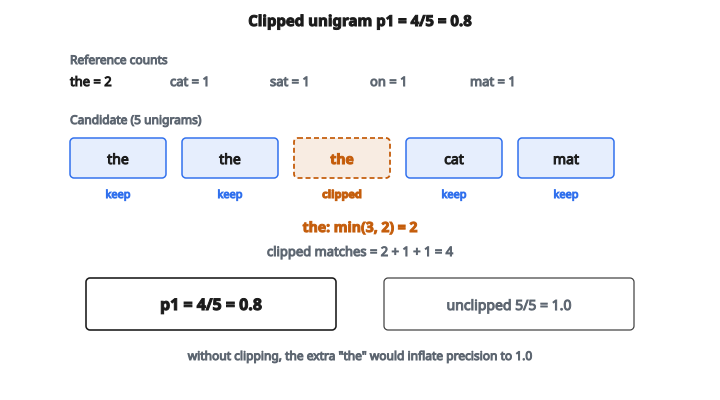

# BLEU Score

## BLEU là gì

**BLEU** (Bilingual Evaluation Understudy) là metric tự động chuẩn để đánh giá chất lượng dịch máy. Nó đo mức độ giống nhau giữa bản dịch ứng viên và một hoặc nhiều bản dịch tham chiếu.

Ý tưởng cốt lõi: đếm bao nhiêu n-gram (chuỗi $n$ từ liên tiếp) trong ứng viên cũng xuất hiện trong tham chiếu. Càng nhiều n-gram khớp, bản dịch càng tốt.

## Vì sao BLEU ra đời

Trước BLEU, đánh giá chất lượng dịch cần phán đoán của người, tốn kém. BLEU cung cấp metric tự động, nhanh, tương quan khá tốt với đánh giá của người.

BLEU hiện được dùng ngoài dịch máy:

* Image captioning
* Tóm tắt văn bản
* Mọi bài sinh văn bản có đầu ra tham chiếu

## Các thành phần của BLEU

BLEU kết hợp ba yếu tố:

**1. N-gram precision:** Tỉ lệ n-gram của ứng viên xuất hiện trong tham chiếu?

**2. Modified precision (clipping):** Ngăn gian lận bằng cách lặp từ.

**3. Brevity penalty:** Phạt bản dịch quá ngắn.

## Modified n-gram precision

Precision đơn giản sẽ đếm bao nhiêu n-gram của ứng viên xuất hiện trong tham chiếu:

$$
p_n = \frac{\text{matching n-grams}}{\text{total candidate n-grams}}
$$

Nhưng cách này dễ bị lợi dụng. Nếu ứng viên chỉ là "the the the the", nó vẫn có thể khớp nhiều tham chiếu vì "the" rất phổ biến.

**Modified precision cắt (clip) số đếm:**

Với mỗi n-gram, đếm số lần xuất hiện trong ứng viên, nhưng cắt trần bằng số đếm tối đa trong bất kỳ tham chiếu nào:

$$
p_n = \frac{\sum_{\text{n-gram}} \min(C_{\text{n-gram}}, R_{\text{n-gram}})}{\sum_{\text{n-gram}} C_{\text{n-gram}}}
$$

với:

* $C_{\text{n-gram}}$ là số đếm trong ứng viên
* $R_{\text{n-gram}}$ là số đếm max trong bất kỳ tham chiếu nào

## Ví dụ số

**Tham chiếu:** "the cat sat on the mat"
**Ứng viên:** "the the the cat mat"

**Số đếm unigram:**

Ứng viên: $\text{the}=3$, $\text{cat}=1$, $\text{mat}=1$ (tổng: $5$)
Tham chiếu: $\text{the}=2$, $\text{cat}=1$, $\text{sat}=1$, $\text{on}=1$, $\text{mat}=1$

**Modified precision cho unigram:**

* "the": $\min(3, 2) = 2$
* "cat": $\min(1, 1) = 1$
* "mat": $\min(1, 1) = 1$

Khớp sau clip: $2 + 1 + 1 = 4$
Tổng unigram ứng viên: $5$

$p_1 = 4/5 = 0.8$

::: {#fig-157-bleu fig-cap="Unigram đã clip: min(3, 2) = 2 cho 'the' nên p1 = 4/5 = 0.8; không clip sẽ đếm cả ba 'the' và ra 5/5 = 1.0." fig-alt="Unigram ứng viên the×3, cat, mat; clip the bằng min(3,2)=2 nên khớp 4/5 và p1=0.8, không clip sẽ ra 5/5=1.0."}
{fig-align="center"}
:::

Nếu không clip, ta sẽ đếm cả ba "the", được $5/5 = 1.0$, gây hiểu sai.

## Brevity penalty

Một bản dịch ngắn có thể có precision cao vì chỉ giữ những từ nó chắc. Để chống điều này, BLEU thêm **brevity penalty** (BP):

$$
BP = \begin{cases} 1 & \text{nếu } c \geq r \\ e^{1 - r/c} & \text{nếu } c < r \end{cases}
$$

với:

* $c$ là độ dài ứng viên
* $r$ là độ dài tham chiếu (hoặc độ dài tham chiếu gần nhất nếu có nhiều bản)

**Ví dụ:**

* Độ dài tham chiếu: $10$
* Độ dài ứng viên: $5$
* $BP = e^{1 - 10/5} = e^{-1} = 0.368$

Điểm được nhân với $0.368$, phạt nặng bản dịch quá ngắn.

Nếu ứng viên dài hơn tham chiếu, $BP = 1$ (không phạt). BLEU không phạt tường minh sự dài dòng, dù precision thấp trên đầu ra dài hơn tự làm giảm điểm.

## Ghép thành điểm cuối

BLEU dùng trung bình nhân của precision trên các bậc n-gram:

$$
\text{BLEU} = BP \cdot \exp\left(\frac{1}{N} \sum_{n=1}^{N} \log p_n\right)
$$

với $N$ là bậc n-gram tối đa (thường là $4$, viết BLEU-4).

Trung bình nhân bảo đảm precision bằng không ở bất kỳ bậc nào làm cả điểm bằng không. Điều này ngăn các bản dịch chỉ đúng unigram nhưng thất bại trên cụm dài hơn.

## Xử lý count bằng không

Nếu bất kỳ $p_n = 0$ (không có n-gram khớp ở bậc đó), log không xác định (âm vô cùng).

**Các kỹ thuật làm mượt:**

* Cộng epsilon nhỏ vào các count bằng không
* Add-one smoothing: cộng $1$ vào cả tử và mẫu
* Đơn giản báo BLEU $= 0$ nếu bất kỳ precision nào bằng $0$

Với từng câu, làm mượt quan trọng vì việc không có n-gram khớp là phổ biến.

## BLEU cấp corpus và cấp câu

**BLEU cấp corpus:**

* Cộng dồn số đếm n-gram trên mọi câu
* Ổn định và có ý nghĩa hơn
* Đây là cách báo cáo BLEU chuẩn

**BLEU cấp câu:**

* Tính BLEU riêng từng câu
* Phương sai cao, thường bằng không
* Cần làm mượt mới dùng được

## Diễn giải điểm BLEU

Điểm BLEU nằm trong $[0, 1]$ (thường báo từ $0$ đến $100$):

**BLEU $= 0.60$–$1.00$:** Chất lượng rất cao, gần mức người
**BLEU $= 0.40$–$0.60$:** Hiểu được, chất lượng tốt
**BLEU $= 0.20$–$0.40$:** Nắm được ý chính nhưng nhiều lỗi
**BLEU $= 0.00$–$0.20$:** Chất lượng kém

Các khoảng này mang tính gần đúng. Điểm BLEU có ý nghĩa nhất khi so các hệ trên cùng một tập kiểm tra.

## Hạn chế của BLEU

**Từ đồng nghĩa không được thưởng:**
"fast" và "quick" cùng nghĩa, nhưng BLEU coi chúng là hai từ hoàn toàn khác.

**Linh hoạt thứ tự từ:**
Một số ngôn ngữ cho phép đảo thứ tự từ. BLEU phạt cả những phép đảo hợp lệ.

**Không hiểu ngữ nghĩa:**
"The cat sat on the mat" và "The mat was sat on by a cat" có n-gram khác nhau nhưng cùng nghĩa.

**Gian lận metric:**
Hệ thống có thể tối ưu cho BLEU mà không thực sự cải thiện chất lượng dịch.

## Các lựa chọn thay BLEU

**METEOR:** Gồm từ đồng nghĩa và stemming, tương quan tốt hơn với đánh giá của người.

**ROUGE:** Dùng cho tóm tắt, nhấn recall hơn precision.

**BERTScore:** Dùng embedding neural cho tương đồng ngữ nghĩa.

**Đánh giá của người:** Vẫn là chuẩn vàng, nhưng đắt.

BLEU vẫn phổ biến nhờ đơn giản, nhanh, và được dùng rộng rãi dù có hạn chế.

## Code
```python
import numpy as np
from collections import Counter

def bleu_score(candidate, reference, max_n):
    """
    Compute the BLEU score for a candidate translation.
    """
    if len(candidate) == 0:
        return 0.0
    c = len(candidate)
    r = len(reference)
    if c <= r:
        bp = np.exp(1 - r/c)
    else:
        bp = 1.0
    precisions = []
    for n in range(1, max_n + 1):
        cand_ngrams = []
        for i in range(len(candidate) - n + 1):
            cand_ngrams.append(tuple(candidate[i:i+n]))
        ref_ngrams = []
        for i in range(len(reference) - n + 1):
            ref_ngrams.append(tuple(reference[i:i+n]))
        if len(cand_ngrams) == 0:
            precisions.append(0.0)
            continue
        cand_counts = Counter(cand_ngrams)
        ref_counts = Counter(ref_ngrams)
        clipped = 0
        for ngram, count in cand_counts.items():
            clipped += min(count, ref_counts.get(ngram, 0))
        prec = clipped / len(cand_ngrams)
        precisions.append(prec)
    if any(p == 0 for p in precisions):
        return 0.0
    log_mean = sum(np.log(p) for p in precisions) / len(precisions)
    bleu = bp * np.exp(log_mean)
    return float(bleu)

```

<!-- auto-self-check -->

::: {.callout-note}
## Kiểm tra nhanh
<details>
<summary>Ý chính của bài «BLEU Score» là gì?</summary>
**BLEU** (Bilingual Evaluation Understudy) là metric tự động chuẩn để đánh giá chất lượng dịch máy.
</details>
<details>
<summary>Công thức / quan hệ cốt lõi trong bài là gì?</summary>
$$p_n = \frac{\text{matching n-grams}}{\text{total candidate n-grams}}$$
</details>
:::
