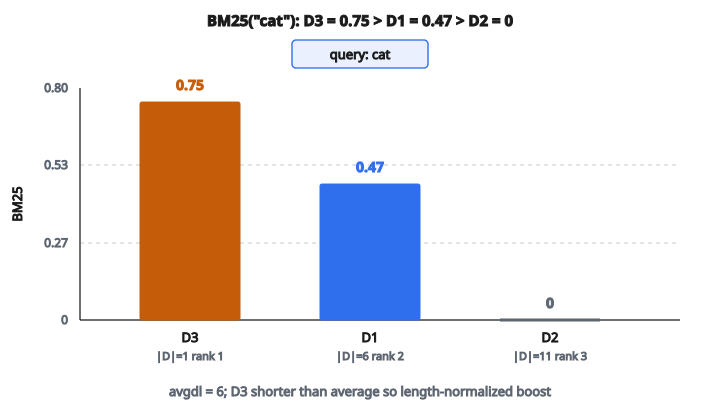

# BM25 Ranking Score

## BM25 là gì

**BM25** (Best Matching 25) là hàm xếp hạng dùng trong information retrieval để ước lượng độ liên quan của tài liệu với một query tìm kiếm. Nó phát triển từ các mô hình truy hồi xác suất những năm 1990 và vẫn là xương sống của search engine hiện đại. Dù các hướng neural đã nổi, BM25 thường là baseline mạnh và được dùng trong hệ truy hồi lai.

## Tiến hóa từ TF-IDF

BM25 xây trên các ý tưởng của TF-IDF đồng thời khắc phục hạn chế của nó:

**Cách TF-IDF:**

$$
\text{TF-IDF}(t, d) = \text{tf}(t, d) \times \text{idf}(t)
$$

**Hạn chế của TF-IDF:**

* Tần suất term tăng không bị chặn trên tài liệu dài
* Không có bão hòa — 10 lần xuất hiện được điểm gấp đôi 5 lần
* Độ dài tài liệu không được xét tường minh
* Tài liệu dài chiếm ưu thế không công bằng trên bảng xếp hạng

**Cách BM25 xử lý:**

* Đưa vào bão hòa tần suất term (lợi tức giảm dần)
* Thêm chuẩn hóa độ dài tài liệu tường minh
* Cung cấp tham số chỉnh được cho từng ngữ cảnh dùng

## Công thức BM25 đầy đủ

Với query $Q$ gồm các term $q_1, q_2, \ldots, q_n$ và tài liệu $D$:

$$
\text{BM25}(D, Q) = \sum_{i=1}^{n} \text{IDF}(q_i) \cdot \frac{f(q_i, D) \cdot (k_1 + 1)}{f(q_i, D) + k_1 \cdot \bigl(1 - b + b \cdot \frac{|D|}{\text{avgdl}}\bigr)}
$$

**Các biến:**

* $f(q_i, D)$ = tần suất term $q_i$ trong tài liệu $D$
* $|D|$ = độ dài tài liệu $D$ (tính theo số từ)
* $\text{avgdl}$ = độ dài tài liệu trung bình trên toàn corpus
* $k_1$ = tham số bão hòa tần suất term (khoảng điển hình: $1.2$–$2.0$)
* $b$ = tham số chuẩn hóa độ dài tài liệu (giá trị điển hình: $0.75$)

## Thành phần IDF

Inverse Document Frequency phạt các term phổ biến xuất hiện ở nhiều tài liệu:

$$
\text{IDF}(q_i) = \ln\left(\frac{N - n(q_i) + 0.5}{n(q_i) + 0.5} + 1\right)
$$

**Các biến:**

* $N$ = tổng số tài liệu trong corpus
* $n(q_i)$ = số tài liệu chứa term $q_i$

**Tính chất:**

* Trả giá trị cao hơn cho term hiếm (tính phân biệt mạnh hơn)
* Các hạng $+0.5$ làm mượt, tránh chia cho không
* Hạng $+1$ bên ngoài bảo đảm giá trị không âm cho mọi term
* Từ phổ biến như "the" nhận IDF gần không; term kỹ thuật hiếm nhận IDF cao

## Hiểu tham số $k_1$ (bão hòa tần suất term)

Tham số $k_1$ kiểm soát tốc độ các lần xuất hiện thêm của term mất dần tác động:

**$k_1$ thấp (ví dụ $0.5$):**

* Lợi tức giảm dần xuất hiện sớm
* Lần xuất hiện đầu tiên của term quan trọng nhất
* Các lần sau đóng góp ít
* Phù hợp khi sự hiện diện của term quan trọng hơn tần suất

**$k_1$ cao (ví dụ $2.0$):**

* Quan hệ giữa tần suất và điểm gần tuyến tính hơn
* Nhiều lần xuất hiện vẫn tiếp tục tăng độ liên quan
* Tốt hơn cho miền mà sự lặp lại báo hiệu trọng tâm chủ đề

**Các biên:**

* $k_1 = 0$: Điểm trở thành nhị phân (term có hoặc không)
* $k_1 \to \infty$: Tiến tới tần suất thô (không bão hòa)

**Giá trị điển hình:** $1.2$ cân bão hòa với độ nhạy tần suất

## Hiểu tham số $b$ (chuẩn hóa độ dài)

Tham số $b$ kiểm soát mức độ dài tài liệu ảnh hưởng đến điểm:

**$b = 0$ (không chuẩn hóa):**

* Tài liệu dài không bị phạt
* Thiên về tài liệu toàn diện
* Rủi ro: tài liệu dài dòng chiếm ưu thế

**$b = 1$ (chuẩn hóa đầy đủ):**

* Điểm tỉ lệ nghịch với độ dài tài liệu
* Thiên mạnh về tài liệu ngắn gọn
* Rủi ro: tài liệu ngắn có thể xếp quá cao

**$b = 0.75$ (cân bằng):**

* Phạt độ dài vừa phải
* Mặc định chuẩn cho hầu hết ứng dụng
* Tài liệu ngắn hơn trung bình được tăng
* Tài liệu dài hơn trung bình bị phạt

Hạng chuẩn hóa $\frac{|D|}{\text{avgdl}}$ so từng tài liệu với độ dài trung bình của corpus.

## Bão hòa tần suất term

Hàm bão hòa chặn đóng góp của tần suất term:

$$
\text{saturation}(f) = \frac{f \cdot (k_1 + 1)}{f + k_1}
$$

**Phân tích hành vi** (với $k_1 = 1.5$):

* $f=1$: đóng góp $= 1.0$
* $f=2$: đóng góp $= 1.43$ (không phải $2.0$)
* $f=5$: đóng góp $= 1.92$ (không phải $5.0$)
* $f=10$: đóng góp $= 2.17$
* $f=100$: đóng góp $= 2.46$
* $f \to \infty$: đóng góp tiến tới $k_1 + 1 = 2.5$

**Ý chính:**
Vài lần xuất hiện đầu đóng góp đáng kể, nhưng các lần thêm có lợi tức giảm dần. Đóng góp tối đa bị chặn bởi $k_1 + 1$.

## Xử lý query nhiều term

Điểm BM25 cho query nhiều term được cộng dồn:

$$
\text{BM25}(D, Q) = \sum_{i=1}^{n} \text{BM25}_{q_i}(D)
$$

**Tính chất của cộng điểm:**

* Mỗi term của query đóng góp độc lập
* Tài liệu khớp nhiều term của query được điểm cao hơn
* Cho phép tính trước: điểm theo term tính một lần rồi cộng lúc query
* Hiệu quả với inverted index

## Ví dụ số

**Corpus** (3 tài liệu):

* D1: "the cat sat on the mat" (6 từ)
* D2: "the dog ran in the park and played with the ball" (11 từ)
* D3: "cat" (1 từ)

**Query:** "cat"

### Bước 1: Thống kê corpus

* $N = 3$ tài liệu
* $\text{avgdl} = (6 + 11 + 1) / 3 = 6$ từ
* $n(\text{cat}) = 2$ (xuất hiện ở D1 và D3)

### Bước 2: Tính $\text{IDF}(\text{cat})$

$$
\ln\left(\frac{3 - 2 + 0.5}{2 + 0.5} + 1\right) = \ln\left(\frac{1.5}{2.5} + 1\right) = \ln(1.6) \approx 0.47
$$

### Bước 3: Tính điểm BM25 ($k_1=1.5$, $b=0.75$)

Với D1 ($f=1$, $|D|=6$):

* Tỉ lệ độ dài: $6/6 = 1.0$ (đúng trung bình)
* Đóng góp điểm: $\frac{1 \times 2.5}{1 + 1.5 \times (0.25 + 0.75 \times 1.0)} = \frac{2.5}{2.5} = 1.0$
* Điểm cuối: $0.47 \times 1.0 = 0.47$

Với D2 ($f=0$): Điểm $= 0$ (term không xuất hiện)

Với D3 ($f=1$, $|D|=1$):

* Tỉ lệ độ dài: $1/6 \approx 0.167$ (ngắn hơn trung bình nhiều)
* Đóng góp điểm: $\frac{1 \times 2.5}{1 + 1.5 \times (0.25 + 0.75 \times 0.167)} = \frac{2.5}{1.56} \approx 1.6$
* Điểm cuối: $0.47 \times 1.6 = 0.75$

**Kết quả xếp hạng:** D3 ($0.75$) $>$ D1 ($0.47$) $>$ D2 ($0$)

::: {#fig-39-bm25-rank fig-cap="Query 'cat': D3 = 0.75 &gt; D1 = 0.47 &gt; D2 = 0 vì D3 ngắn hơn avgdl = 6 và nhận boost chuẩn hóa độ dài." fig-alt="Ba cột BM25 cho query cat: D3 = 0.75, D1 = 0.47, D2 = 0; D3 ngắn hơn avgdl nên được tăng điểm."}
{fig-align="center"}
:::

D3 điểm cao nhất vì ngắn hơn trung bình, nên nhận boost từ chuẩn hóa độ dài.

## Các biến thể BM25

**BM25+:** Cộng thêm hằng số nhỏ $\delta$ để tránh điểm âm:

$$
\text{BM25+} = \text{BM25} + \delta
$$

**BM25L:** Xử lý việc phạt quá mức các tài liệu dài nhưng vẫn liên quan

**BM25F:** Mở rộng sang tài liệu có cấu trúc nhiều trường (title, body, anchor text) với trọng số theo trường:

$$
\text{BM25F} = \sum_{\text{fields}} w_f \cdot \text{BM25}_f
$$

## Cân nhắc khi cài đặt

* **Pipeline tiền xử lý:** Tokenization, lowercasing, stemming/lemmatization, loại stopword đều ảnh hưởng chất lượng truy hồi
* **Cấu trúc index:** Inverted index ánh xạ term sang ID tài liệu và tần suất term để truy hồi hiệu quả
* **Hiệu năng chấm điểm:** IDF tính một lần lúc lập chỉ mục; lúc query chỉ cần phần dựa trên TF
* **Chỉnh tham số:** $k_1$ và $b$ có thể tinh chỉnh trên tập validation cho từng miền

## BM25 xuất hiện ở đâu

* **Search engine:** Elasticsearch, Apache Lucene/Solr dùng BM25 làm hàm xếp hạng mặc định
* **Truy hồi tài liệu:** Tìm văn bản pháp lý, bài báo học thuật, knowledge base doanh nghiệp
* **Hệ RAG:** Retrieval-Augmented Generation kết hợp BM25 với dense retrieval để lấy ngữ cảnh cho mô hình ngôn ngữ lớn
* **Question answering:** Bước truy hồi ban đầu để tìm đoạn ứng viên trước khi áp mô hình đọc hiểu
* **Tìm kiếm thương mại điện tử:** Xếp hạng sản phẩm theo khớp query với mô tả
* **Hybrid search:** BM25 kết hợp embedding neural (lai dày–thưa) thường vượt từng phương pháp riêng
* **Tìm email:** Tìm email liên quan bằng khớp từ khóa kèm chuẩn hóa độ dài
* **Tìm mã nguồn:** Tìm đoạn code hoặc tài liệu liên quan trong kho phần mềm

## Code
```python
import numpy as np
from collections import Counter
import math

def bm25_score(query_tokens, docs, k1=1.2, b=0.75):
    """
    Returns numpy array of BM25 scores for each document.
    """
    N = len(docs)
    if N == 0:
        return np.zeros(0, dtype=float)
    doc_lens = np.array([len(d) for d in docs], dtype=float)
    avgdl = float(doc_lens.mean()) if N > 0 else 0.0
    df = Counter()
    for d in docs:
        for t in set(d):
            df[t] += 1
    doc_tfs = [Counter(d) for d in docs]
    q_terms = list(dict.fromkeys(query_tokens))
    scores = np.zeros(N, dtype=float)
    for t in q_terms:
        dfi = df.get(t, 0)
        if dfi == 0:
            idf = 0.0
        else:
            idf = math.log((N - dfi + 0.5) / (dfi + 0.5) + 1.0)
        if idf == 0.0:
            continue
        tf_vec = np.array([doc_tfs[i].get(t, 0) for i in range(N)], dtype=float)
        denom = tf_vec + k1 * (1.0 - b + b * (doc_lens / (avgdl if avgdl > 0 else 1.0)))
        with np.errstate(divide='ignore', invalid='ignore'):
            term_score = idf * ((tf_vec * (k1 + 1.0)) / np.where(denom == 0, 1.0, denom))
            term_score = np.nan_to_num(term_score, nan=0.0, posinf=0.0, neginf=0.0)
        scores += term_score
    return scores

```

<!-- auto-self-check -->

::: {.callout-note}
## Kiểm tra nhanh
<details>
<summary>Ý chính của bài «BM25 Ranking Score» là gì?</summary>
**BM25** (Best Matching 25) là hàm xếp hạng dùng trong information retrieval để ước lượng độ liên quan của tài liệu với một query tìm kiếm.
</details>
<details>
<summary>Công thức / quan hệ cốt lõi trong bài là gì?</summary>
$$\text{TF-IDF}(t, d) = \text{tf}(t, d) \times \text{idf}(t)$$
</details>
:::
