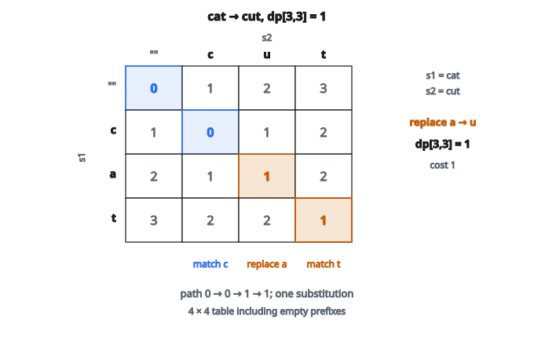

# Edit Distance

## Edit distance là gì

**Edit distance** (còn gọi là Levenshtein distance) đo số phép toán trên từng ký tự tối thiểu cần để biến một chuỗi thành chuỗi kia. Nó trả lời câu hỏi: "Hai chuỗi này khác nhau bao nhiêu?"

Ba phép được phép là:

* **Insert** một ký tự
* **Delete** một ký tự
* **Replace** một ký tự bằng ký tự khác

Mỗi phép có chi phí $1$.

## Vì sao edit distance quan trọng

**Kiểm tra chính tả:**
Khi gõ "teh", bộ kiểm tra chính tả tính edit distance tới các từ trong từ điển. "the" cách $1$ (đổi chỗ hai ký tự, hoặc xóa rồi chèn), nên là ứng viên sửa hợp lý.

**Căn chỉnh chuỗi DNA:**
Nhà sinh học so các chuỗi di truyền để tìm tương đồng. Edit distance đo bao nhiêu đột biến tách hai chuỗi.

**Khớp chuỗi mờ (fuzzy matching):**
Search engine và cơ sở dữ liệu dùng edit distance để tìm khớp gần đúng. Tìm "Shaksper" vẫn nên ra "Shakespeare".

**Phát hiện đạo văn:**
Văn bản sửa nhẹ có thể bị phát hiện bằng cách so edit distance với nguồn đã biết.

## Cách tiếp cận quy hoạch động

Tính edit distance bằng cách thử mọi chuỗi phép toán sẽ chậm theo hàm mũ. Thay vào đó, ta dùng **quy hoạch động** để dựng lời giải từ các bài toán con nhỏ hơn.

Định nghĩa $dp[i][j]$ là edit distance giữa $i$ ký tự đầu của chuỗi $s_1$ và $j$ ký tự đầu của chuỗi $s_2$.

## Các trường hợp cơ sở

**Chuỗi rỗng tới chuỗi độ dài $j$:**

$$
dp[0][j] = j
$$

Cần $j$ phép insert để dựng $s_2[0..j-1]$ từ không có gì.

**Chuỗi độ dài $i$ tới chuỗi rỗng:**

$$
dp[i][0] = i
$$

Cần $i$ phép delete để thu $s_1[0..i-1]$ về rỗng.

## Công thức đệ quy

Với mỗi vị trí $(i, j)$, có hai trường hợp:

**Trường hợp 1: Ký tự khớp ($s_1[i-1] = s_2[j-1]$)**

Không cần phép nào cho ký tự này:

$$
dp[i][j] = dp[i-1][j-1]
$$

**Trường hợp 2: Ký tự khác ($s_1[i-1] \neq s_2[j-1]$)**

Lấy min của ba lựa chọn:

$$
dp[i][j] = 1 + \min(dp[i-1][j], dp[i][j-1], dp[i-1][j-1])
$$

với:

* $dp[i-1][j] + 1$: delete từ $s_1$ (đã khớp $i-1$ ký tự của $s_1$ với $j$ ký tự của $s_2$, giờ xóa một ký tự)
* $dp[i][j-1] + 1$: insert vào $s_1$ (đã khớp $i$ ký tự của $s_1$ với $j-1$ ký tự của $s_2$, giờ chèn một ký tự)
* $dp[i-1][j-1] + 1$: replace (đã khớp $i-1$ với $j-1$, giờ thay ký tự khác nhau)

## Ví dụ số

**$s_1$ = "cat"**
**$s_2$ = "cut"**

**Khởi tạo bảng DP:**

Hàng đầu biểu diễn việc biến `""` thành `""`, `"c"`, `"cu"`, `"cut"` ($0$, $1$, $2$, $3$ phép insert).
Cột đầu biểu diễn việc biến `""`, `"c"`, `"ca"`, `"cat"` thành `""` ($0$, $1$, $2$, $3$ phép delete).

**Điền vị trí $(1,1)$: $s_1[0]$=`'c'`, $s_2[0]$=`'c'`**
Ký tự khớp, nên $dp[1][1] = dp[0][0] = 0$.

**Điền vị trí $(1,2)$: $s_1[0]$=`'c'`, $s_2[1]$=`'u'`**
Ký tự khác. Các lựa chọn:

* Delete: $dp[0][2] + 1 = 2 + 1 = 3$
* Insert: $dp[1][1] + 1 = 0 + 1 = 1$
* Replace: $dp[0][1] + 1 = 1 + 1 = 2$

Min là $1$, nên $dp[1][2] = 1$.

**Tiếp tục điền...**

**Bảng cuối:**

|     | `""` | c | u | t |
|---|---|---|---|---|
| `""` | 0    | 1 | 2 | 3 |
| c   | 1    | 0 | 1 | 2 |
| a   | 2    | 1 | 1 | 2 |
| t   | 3    | 2 | 2 | 1 |

**Đáp án:** $dp[3][3] = 1$

::: {#fig-155-edit-distance fig-cap="cat → cut: bảng DP 4×4, dp[3,3] = 1 vì chỉ cần một phép replace a thành u." fig-alt="Bảng DP 4×4 biến cat thành cut; đường đi 0 → 0 → 1 → 1, ô cuối dp[3,3] = 1 tương ứng replace a bằng u."}
{fig-align="center"}
:::

Điều này hợp lý: "cat" thành "cut" bằng cách thay `'a'` bằng `'u'` (một phép).

## Tái tạo các phép toán

Bảng DP cho biết chi phí tối thiểu, nhưng không cho biết phép nào đã dùng. Để tìm đúng các phép:

1. Bắt đầu tại $dp[m][n]$
2. Xem hàng xóm nào cho giá trị min
3. Đi tới hàng xóm đó và ghi phép toán
4. Lặp đến khi tới $dp[0][0]$

Backtracking này cho ra chuỗi các phép edit.

## Độ phức tạp thời gian và không gian

**Thời gian:** $O(mn)$ với $m = |s_1|$ và $n = |s_2|$. Ta điền bảng $m \times n$, mỗi ô $O(1)$.

**Không gian:** $O(mn)$ cho bảng đầy đủ.

**Tối ưu không gian:** Vì mỗi hàng chỉ phụ thuộc hàng trước, có thể dùng $O(\min(m, n))$ bộ nhớ bằng cách giữ đúng hai hàng.

## Các biến thể

**Chi phí phép khác nhau:**
Thay vì mọi chi phí bằng $1$, có thể đặt:

* Insert: chi phí $1$
* Delete: chi phí $1$
* Replace: chi phí $2$

Khi đó công thức đệ quy dùng đúng các chi phí này.

**Damerau–Levenshtein distance:**
Thêm phép thứ tư: đổi chỗ hai ký tự kề. "ab" thành "ba" có chi phí $1$ thay vì $2$.

**Edit distance có trọng số:**
Các phép thay ký tự khác nhau có chi phí khác nhau. Thay `'a'` bằng `'e'` có thể rẻ hơn thay `'a'` bằng `'z'` (gần nhau hơn trên bàn phím hoặc về ngữ âm).

## Edit distance so với các metric chuỗi khác

**Hamming distance:**
Chỉ đếm substitution, yêu cầu hai chuỗi cùng độ dài. Edit distance tổng quát hơn.

**Longest Common Subsequence (LCS):**
Liên quan tới edit distance. Nếu LCS có độ dài $L$, thì edit distance là $(m - L) + (n - L)$ khi chỉ cho phép insert và delete.

**Jaccard similarity:**
So tập ký tự hoặc n-gram, bỏ qua thứ tự. Edit distance tôn trọng vị trí ký tự.

## Code
```python
def edit_distance(s1, s2):
    """
    Compute the minimum edit distance between two strings.
    """
    m, n = len(s1), len(s2)
    dp = [[0] * (n + 1) for _ in range(m + 1)]
    for i in range(m + 1):
        dp[i][0] = i
    for j in range(n + 1):
        dp[0][j] = j
    for i in range(1, m + 1):
        for j in range(1, n + 1):
            if s1[i - 1] == s2[j - 1]:
                dp[i][j] = dp[i - 1][j - 1]
            else:
                dp[i][j] = 1 + min(dp[i - 1][j], dp[i][j - 1], dp[i - 1][j - 1])
    return dp[m][n]

```

<!-- auto-self-check -->

::: {.callout-note}
## Kiểm tra nhanh
<details>
<summary>Ý chính của bài «Edit Distance» là gì?</summary>
**Edit distance** (còn gọi là Levenshtein distance) đo số phép toán trên từng ký tự tối thiểu cần để biến một chuỗi thành chuỗi kia.
</details>
<details>
<summary>Công thức / quan hệ cốt lõi trong bài là gì?</summary>
$$dp[0][j] = j$$
</details>
:::
