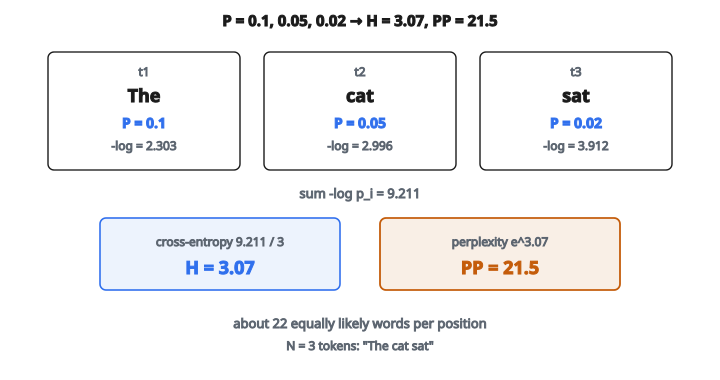

# Perplexity

## Perplexity là gì

**Perplexity** đo mức "bất ngờ" của một language model trước một chuỗi văn bản. Mô hình gán xác suất cao cho các từ thực tế có perplexity thấp; mô hình gán xác suất thấp thì perplexity cao.

Về toán, perplexity là hàm mũ của trung bình negative log-likelihood:

$$
PP = \exp\left(-\frac{1}{N} \sum_{i=1}^{N} \log P(w_i | \text{context})\right)
$$

Perplexity thấp hơn nghĩa là mô hình dự đoán văn bản tốt hơn.

## Trực giác: kích thước vocabulary hiệu dụng

Perplexity có thể được hiểu như số lựa chọn đồng xác suất hiệu dụng mà mô hình xét tại mỗi vị trí.

**Perplexity $= 10$:** Trung bình, mô hình bất định như thể chọn đều trong $10$ từ tại mỗi vị trí.

**Perplexity $= 100$:** Như chọn trong $100$ từ đồng xác suất.

**Perplexity $= 1$:** Mô hình chắc chắn. Nó luôn gán xác suất $1$ cho từ đúng.

Vocabulary 50,000 từ với dự đoán đều sẽ cho perplexity 50,000. Language model tốt đạt perplexity trong khoảng $20$–$100$ trên các benchmark chuẩn.

## Tính toán từng bước

**Cho trước:**

* Một chuỗi token: $[t_1, t_2, \ldots, t_N]$
* Các phân phối xác suất từ mô hình: $[P_1, P_2, \ldots, P_N]$
* Mỗi $P_i$ là một phân phối trên vocabulary

**Bước 1: Lấy xác suất của token thực tế**

Với mỗi vị trí $i$, lấy xác suất mô hình gán cho token thực sự xuất hiện:

$$
p_i = P_i[t_i]
$$

**Bước 2: Tính log xác suất**

Lấy log tự nhiên của từng xác suất:

$$
\log p_i
$$

Vì xác suất nằm giữa 0 và 1, log xác suất là số âm.

**Bước 3: Trung bình negative log-probability (cross-entropy)**

$$
H = -\frac{1}{N} \sum_{i=1}^{N} \log p_i
$$

Đây là cross-entropy giữa dự đoán của mô hình và chuỗi thực tế.

**Bước 4: Lấy hàm mũ**

$$
PP = e^H
$$

## Ví dụ số

**Chuỗi:** "The cat sat" ($3$ token)

**Dự đoán của mô hình:**

Vị trí 1 ("The"): mô hình gán $P(\text{The}) = 0.1$
Vị trí 2 ("cat"): mô hình gán $P(\text{cat}) = 0.05$
Vị trí 3 ("sat"): mô hình gán $P(\text{sat}) = 0.02$

**Log xác suất:**

* $\log(0.1) = -2.303$
* $\log(0.05) = -2.996$
* $\log(0.02) = -3.912$

**Cross-entropy:**

$$
H = -\frac{1}{3}(-2.303 - 2.996 - 3.912) = \frac{9.211}{3} = 3.07
$$

**Perplexity:**

$$
PP = e^{3.07} = 21.5
$$

::: {#fig-158-perplexity fig-cap="P = 0.1, 0.05, 0.02 cho H = 3.07 và PP = e^{3.07} = 21.5: trung bình mô hình bất định như chọn trong khoảng 22 từ đồng xác suất." fig-alt="Ba xác suất token 0.1, 0.05, 0.02 dẫn tới cross-entropy H = 3.07 và perplexity PP = 21.5."}
{fig-align="center"}
:::

Mô hình có perplexity $21.5$ trên chuỗi này. Trung bình, nó bất định như thể chọn trong khoảng $22$ từ đồng xác suất.

## Perplexity và bit

Perplexity gắn chặt với các đại lượng lý thuyết thông tin:

**Cross-entropy tính bằng bit** (log cơ số $2$):

$$
H_{\text{bits}} = -\frac{1}{N} \sum_{i=1}^{N} \log_2 P(w_i)
$$

**Perplexity:**

$$
PP = 2^{H_{\text{bits}}}
$$

Nếu cross-entropy là $5$ bit, perplexity là $2^5 = 32$.

Điều này gắn với nén: mô hình có perplexity $PP$ có thể mã hóa văn bản bằng khoảng $\log_2(PP)$ bit mỗi từ.

## Vì sao perplexity quan trọng

**So sánh mô hình:**
Perplexity thấp hơn thường nghĩa là mô hình tốt hơn. So perplexity trên cùng tập kiểm tra xếp hạng mô hình theo chất lượng dự đoán.

**Early stopping:**
Theo dõi perplexity trên tập validation khi huấn luyện. Dừng khi nó bắt đầu tăng để tránh overfitting.

**Tinh chỉnh hyperparameter:**
Chọn hyperparameter làm giảm perplexity trên dữ liệu held-out.

**Theo dõi tiến bộ:**
Cải thiện language model qua các năm thường được báo bằng độ giảm perplexity. GPT-2 đạt perplexity khoảng $35$ trên WikiText-103; GPT-3 giảm tiếp.

## Những điểm cần lưu ý

**Vocabulary quan trọng:**
Mô hình với vocabulary nhỏ hơn sẽ có perplexity thấp hơn trên cùng văn bản. Luôn so mô hình cùng vocabulary hoặc chuẩn hóa cho phù hợp.

**Tokenization subword:**
Mô hình hiện đại dùng BPE hoặc SentencePiece, làm thay đổi số token $N$. Perplexity theo từ khác perplexity theo subword.

**Từ ngoài vocabulary (OOV):**
Nếu một từ không có trong vocabulary, mô hình có thể gán xác suất không, khiến perplexity vô hạn. Cần xử lý OOV cẩn thận.

**Lệch miền:**
Mô hình huấn luyện trên tin tức sẽ có perplexity cao trên văn bản y khoa. Perplexity đo mức mô hình khớp đúng phân phối dữ liệu đó.

## Perplexity không phải tất cả

**Perplexity không bắt được:**

* Độ trôi chảy so với độ chính xác sự kiện
* Tính mạch lạc trên đoạn dài
* Khả năng làm theo instruction hoặc prompt
* Vấn đề an toàn và thiên lệch

Hai mô hình cùng perplexity có thể khác xa về chất lượng thực tế. Perplexity cần nhưng không đủ để đánh giá language model.

## Ổn định số

Nhân nhiều xác suất nhỏ có thể underflow. Luôn làm việc trong không gian log:

**Không ổn định:**

$$
PP = \left(\prod_i p_i\right)^{-1/N}
$$

**Ổn định:**

$$
PP = \exp\left(-\frac{1}{N} \sum_i \log p_i\right)
$$

Tổng các log được tính ổn định về số, rồi mới lấy mũ một lần ở cuối.

## Code
```python
import math

def perplexity(prob_distributions, actual_tokens):
    """
    Compute the perplexity of a token sequence given predicted distributions.
    """
    N = len(actual_tokens)
    log_sum = 0.0
    for i in range(N):
        p = prob_distributions[i][actual_tokens[i]]
        log_sum += math.log(p)
    H = -log_sum / N
    return round(math.exp(H), 4)

```
