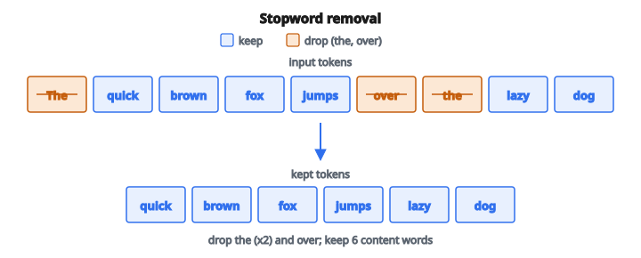

# Remove Stopwords

## Stopwords là gì

**Stopwords** là những từ phổ biến xuất hiện thường xuyên trong văn bản nhưng tự thân mang rất ít nghĩa ngữ nghĩa. Ví dụ gồm "the", "is", "at", "which", "on", "a", "an", "and", "or", "but". Loại stopwords làm giảm nhiễu trong dữ liệu văn bản, giúp mô hình tập trung vào các từ mang nội dung.

## Vì sao loại stopwords

**Giảm dimensionality**: Trong biểu diễn bag-of-words, stopwords tạo nhiều feature tần suất cao nhưng đóng góp ít giá trị.

**Cải thiện tỷ số tín hiệu trên nhiễu**: Từ nội dung (danh từ, động từ, tính từ) mang nhiều nghĩa hơn từ chức năng.

**Hiệu quả tính toán**: Ít token hơn để xử lý nghĩa là huấn luyện và inference nhanh hơn.

**Độ tương đồng tốt hơn**: Không còn stopwords, độ tương đồng tài liệu tập trung vào nội dung chủ đề thay vì cấu trúc ngữ pháp.

## Stopwords tiếng Anh thường gặp

**Mạo từ**: a, an, the

**Đại từ**: I, you, he, she, it, we, they, me, him, her, us, them

**Giới từ**: in, on, at, by, for, with, about, against, between, into, through, during, before, after

**Liên từ**: and, but, or, nor, so, yet, both, either, neither

**Trợ động từ**: is, am, are, was, were, be, been, being, have, has, had, do, does, did

**Từ phổ biến khác**: this, that, these, those, what, which, who, whom, whose, where, when, how, why

## Các danh sách stopword chuẩn

**NLTK English stopwords**: khoảng 179 từ, baseline dùng rộng rãi

**spaCy stopwords**: khoảng 326 từ, bao quát hơn

**Scikit-learn stopwords**: khoảng 318 từ, tối ưu cho ứng dụng ML

**Danh sách tùy chỉnh**: thêm hoặc bớt theo domain

**Cân nhắc**:

* Các thư viện dùng list khác nhau
* Một số tác vụ cần chỉnh sửa tùy chỉnh
* Văn bản không phải tiếng Anh cần list theo ngôn ngữ

## Quy trình loại bỏ

**Đầu vào**: danh sách token (từ) từ một tài liệu

**Đầu ra**: danh sách đã lọc, stopwords bị loại

**Các bước**:

1. Lấy hoặc định nghĩa tập stopword
2. Chuyển sang cấu trúc tra cứu hiệu quả (set, lookup $O(1)$)
3. Duyệt qua các token
4. Giữ những token không nằm trong tập stopword
5. Trả về danh sách đã lọc

**Xử lý hoa/thường**: thường chuyển cả token lẫn stopwords về chữ thường trước khi so sánh

## Ví dụ số

**Văn bản gốc**: "The quick brown fox jumps over the lazy dog"

**Tokens**: ["The", "quick", "brown", "fox", "jumps", "over", "the", "lazy", "dog"]

**Stopwords**: {"the", "a", "an", "over", "is", "are", ...}

**Sau khi lowercase**: ["the", "quick", "brown", "fox", "jumps", "over", "the", "lazy", "dog"]

**Sau khi loại**: ["quick", "brown", "fox", "jumps", "lazy", "dog"]

**Nhận xét**: đã loại "the" (hai lần) và "over". Các từ mang nội dung vẫn còn.

::: {#fig-100-stopwords fig-cap="Loại stopwords trên 'The quick brown fox jumps over the lazy dog': bỏ the (hai lần) và over; giữ [quick, brown, fox, jumps, lazy, dog]." fig-alt="Chuỗi token The quick brown fox jumps over the lazy dog; the và over bị loại; sáu từ còn lại là quick, brown, fox, jumps, lazy, dog."}
{fig-align="center"}
:::

## Khi nào không loại stopwords

**Phân tích cảm xúc**: "not good" so với "good" — loại "not" làm đổi hẳn nghĩa

**Hỏi đáp**: "what", "where", "when", "how" là stopwords nhưng then chốt để hiểu truy vấn

**Nhận diện thực thể có tên**: "The White House" — "The" là một phần tên thực thể

**Dịch máy**: mọi từ đều góp vào bản dịch đúng

**Mô hình ngôn ngữ**: dự đoán từ tiếp theo cần thấy mọi từ

**Khớp cụm**: "to be or not to be" mất nghĩa nếu bỏ stopwords

## Cân nhắc theo ngôn ngữ

**Mỗi ngôn ngữ có stopwords khác nhau**:

* French: le, la, les, un, une, de, du, des, et, ou
* German: der, die, das, ein, eine, und, oder, aber
* Spanish: el, la, los, las, un, una, y, o, pero

**Thách thức**:

* Ngôn ngữ giàu hình thái có nhiều dạng từ hơn
* Một số ngôn ngữ có ít hơn, hoặc khác, các từ chức năng
* Vấn đề chuyển tự với chữ không Latin

## Tra cứu hiệu quả

Khi xử lý corpus lớn, hiệu quả lookup rất quan trọng:

**Lookup bằng set**: thời gian trung bình $O(1)$ mỗi token

* Chuyển danh sách stopword thành set một lần
* Kiểm tra thành viên bằng `token in stopword_set`

**Lookup bằng list**: thời gian $O(n)$ mỗi token, với $n$ là độ dài list

* Chậm hơn nhiều với list stopword lớn
* Nên tránh

**Chuẩn hóa chữ hoa/thường**: làm một lần trước mọi so sánh

## Vị trí trong pipeline tiền xử lý

Thứ tự tiền xử lý văn bản điển hình:

1. **Tokenization**: tách văn bản thành từ
2. **Lowercase**: chuẩn hóa chữ hoa/thường
3. **Stopword removal**: loại từ phổ biến
4. **Stemming/Lemmatization**: đưa từ về dạng gốc
5. **Vectorization**: chuyển sang biểu diễn số

**Thứ tự quan trọng**: stopword removal thường đứng sau lowercasing nhưng trước stemming.

## Tác động lên các mô hình

**TF-IDF**: stopwords vốn đã nhận IDF thấp (xuất hiện ở nhiều tài liệu), nên loại chúng có tác động vừa phải

**Word embeddings**: embedding tiền huấn luyện vẫn gồm stopwords; việc loại phụ thuộc tác vụ phía sau

**Topic modeling (LDA)**: nên loại stopwords để chủ đề không bị từ chức năng chiếm chỗ

**Mô hình neural**: thường giữ stopwords vì transformer có thể học cách bỏ qua chúng

## Chỉnh sửa stopword tùy chỉnh

**Thêm theo domain**:

* Y khoa: "patient", "study", "results" có thể quá phổ biến trong tài liệu y
* Pháp lý: "whereas", "hereby", "pursuant"
* Kỹ thuật: "system", "method", "data"

**Bớt có chủ đích**:

* Giữ từ phủ định cho sentiment: gỡ "not" khỏi list stopword
* Giữ từ nghi vấn cho hệ QA

## Cân nhắc chất lượng

**Loại quá mạnh**: có thể mất ngữ cảnh quan trọng

**Loại quá thận trọng**: có thể giữ lại nhiễu

**Cách đánh giá**: so sánh hiệu năng mô hình có và không loại stopwords trên tập validation

## Stopword removal xuất hiện ở đâu

* **Search Engines**: xử lý truy vấn bỏ qua stopwords trong keyword search đơn giản
* **Document Classification**: phân loại văn bản hưởng lợi khi tập trung vào từ nội dung
* **Topic Modeling**: LDA và các thuật toán liên quan cần đầu vào đã loại stopwords
* **Keyword Extraction**: tìm thuật ngữ quan trọng loại trừ từ phổ biến
* **Text Summarization**: phương pháp extractive tập trung vào câu mang nội dung
* **Information Retrieval**: indexing thường loại stopwords
* **Plagiarism Detection**: so sánh từ nội dung hơn là cấu trúc ngữ pháp
* **Social Media Analysis**: xử lý tweet và bài đăng với số ký tự hạn chế

## Code
```python
def remove_stopwords(tokens, stopwords):
    """
    Returns: list[str] - tokens with stopwords removed (preserve order)
    """
    stop_set = set(stopwords)
    return [t for t in tokens if t not in stop_set]

```
