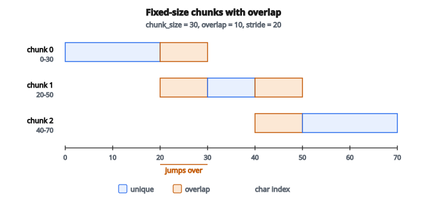

# Text Chunking

## Text chunking là gì

**Text chunking** chia tài liệu dài thành các mảnh nhỏ, dễ xử lý gọi là chunk. Việc này thiết yếu cho hệ NLP có giới hạn ngữ cảnh, retrieval-augmented generation (RAG), và xử lý tài liệu hiệu quả. Chunking tốt giữ mạch ngữ nghĩa trong khi tôn trọng ràng buộc kích thước.

## Vì sao cần chunk văn bản

**Giới hạn context window**: LLM có độ dài ngữ cảnh tối đa (ví dụ 4K, 8K, 128K token). Tài liệu vượt ngưỡng phải được cắt.

**Độ chính xác retrieval**:
Chunk nhỏ cho phép khớp chính xác hơn trong semantic search. Một đoạn liên quan hữu ích hơn một chương chỉ liên quan mơ hồ.

**Hiệu quả bộ nhớ**: Xử lý cả tài liệu lớn một lúc có thể vượt bộ nhớ sẵn có.

**Xử lý song song**: Các chunk có thể được xử lý độc lập trên nhiều worker.

## Chiến lược chunking

### Chunking kích thước cố định

Cắt văn bản thành chunk với số ký tự hoặc token cố định:

$$
\text{num\_chunks} = \left\lceil \frac{\text{text\_length}}{\text{chunk\_size}} \right\rceil
$$

**Ưu điểm**:

* Cài đặt đơn giản
* Kích thước đầu ra dự đoán được
* Chạy được với mọi văn bản

**Nhược điểm**:

* Có thể cắt giữa câu hoặc giữa từ
* Bỏ qua cấu trúc tài liệu
* Có thể phá đơn vị ngữ nghĩa

### Chunk chồng lấn

Giữ một phần overlap giữa các chunk liên tiếp để bảo toàn ngữ cảnh tại biên:

$$
\text{chunk}_i = \text{text}[i \times \text{stride} : i \times \text{stride} + \text{chunk\_size}]
$$

với $\text{stride} = \text{chunk\_size} - \text{overlap}$.

**Ví dụ**: chunk_size = 100, overlap = 20, stride = 80

* Chunk 0: ký tự 0–100
* Chunk 1: ký tự 80–180 (chồng 80–100 với chunk 0)
* Chunk 2: ký tự 160–260

**Lợi ích**: thông tin tại biên không bị mất; xuất hiện trong nhiều chunk.

### Chunking theo câu

Cắt tại biên câu, gom câu cho đến khi chạm giới hạn kích thước:

**Quy trình**:

1. Tách văn bản thành câu
2. Cộng dồn câu cho đến khi thêm câu tiếp theo sẽ vượt giới hạn
3. Bắt đầu chunk mới với câu tiếp theo

**Ưu điểm**:

* Không bao giờ cắt giữa câu
* Mạch ngữ nghĩa tốt hơn
* Đơn vị đọc tự nhiên

**Thách thức**:

* Phát hiện câu không tầm thường (viết tắt, chức danh, v.v.)
* Độ dài câu thay đổi; một số chunk nhỏ hơn giới hạn nhiều

### Chunking theo đoạn

Dùng ngắt đoạn (hai newline) làm biên chunk:

**Ưu điểm**:

* Đoạn là đơn vị ngữ nghĩa tự nhiên
* Cấu trúc tác giả chủ ý được giữ

**Thách thức**:

* Đoạn có thể rất dài hoặc rất ngắn
* Có thể cần cắt phụ cho đoạn dài

### Chunking đệ quy

Áp dụng hệ phân cấp các separator:

1. Thử cắt theo đoạn (hai newline)
2. Nếu chunk vẫn quá lớn, cắt theo một newline
3. Nếu vẫn quá lớn, cắt theo câu
4. Nếu vẫn quá lớn, cắt theo từ/ký tự

**Lợi ích**: giữ càng nhiều cấu trúc càng tốt trong khi tôn trọng giới hạn kích thước.

## Cân nhắc kích thước chunk

**Quá nhỏ**:

* Mất ngữ cảnh trong từng chunk
* Nhiều chunk hơn để xử lý và lưu
* Overhead retrieval cao hơn

**Quá lớn**:

* Có thể vượt giới hạn ngữ cảnh của mô hình
* Chunk retrieve được chứa thông tin không liên quan
* Khớp kém chính xác hơn

**Kích thước điển hình**:

* Câu: 50–150 ký tự
* Đoạn: 200–500 ký tự
* Mục tài liệu: 500–2000 ký tự
* Cho RAG: thường dùng 256–1024 token

## Ví dụ số: kích thước cố định có overlap

**Văn bản**: "The quick brown fox jumps over the lazy dog. Then it runs away quickly."

**Tham số**: chunk_size = 30 ký tự, overlap = 10

**Chunks**:

* Chunk 0: "The quick brown fox jumps over" (vị trí 0–30)
* Chunk 1: "jumps over the lazy dog. Then" (vị trí 20–50)
* Chunk 2: "og. Then it runs away quickly." (vị trí 40–70)

**Nhận xét**: "jumps over" xuất hiện ở cả chunk 0 và chunk 1, tạo tính liên tục.

::: {#fig-156-chunk-overlap fig-cap="chunk_size $= 30$, overlap $= 10$, stride $= 20$: các cửa sổ 0–30, 20–50, 40–70. Phần chồng 20–30 giữ 'jumps over'." fig-alt="Ba cửa sổ chunk size 30, overlap 10, stride 20: 0-30, 20-50, 40-70; overlap 20-30 và 40-50."}
{fig-align="center"}
:::

## Theo token vs theo ký tự

**Chunking theo ký tự**:

* Không phụ thuộc ngôn ngữ
* Số ký tự dự đoán được
* Có thể cắt giữa token (subword)

**Chunking theo token**:

* Khớp tokenization của mô hình
* Chính xác hơn với giới hạn ngữ cảnh LLM
* Cần tokenizer (theo ngôn ngữ/mô hình)

**Quan hệ**: ký tự và token không ánh xạ 1:1. Tỷ lệ trung bình thay đổi theo ngôn ngữ và tokenizer.

## Giữ metadata

Mỗi chunk nên giữ:

**Thông tin nguồn**: Document ID, tên file, URL

**Thông tin vị trí**: chỉ số chunk, offset ký tự, số trang

**Ngữ cảnh cấu trúc**: tiêu đề mục, tên chương

**Vì sao quan trọng**: sau retrieval, cần truy ngược về ngữ cảnh gốc và ghép các chunk liên quan.

## Xử lý nội dung đặc biệt

**Bảng**: có thể cần giữ cả bảng trong một chunk hoặc dùng định dạng đặc biệt

**Khối code**: tránh cắt giữa hàm hoặc cấu trúc điều khiển

**Danh sách**: giữ các mục list cùng nhau khi có thể

**Tiêu đề**: kèm header mục với nội dung của mục đó

**Ảnh/Hình**: tham chiếu chúng nhưng có thể cần xử lý riêng

## Chunking theo use case

**Semantic search/RAG**:

* Chunk vừa (256–512 token)
* Overlap để bắt nội dung tại biên
* Ưu tiên biên ngữ nghĩa

**Tóm tắt**:

* Chunk lớn hơn để giữ ngữ cảnh
* Cấp chương hoặc mục

**Hỏi đáp**:

* Chunk nhỏ, chính xác
* Cấp đoạn hoặc câu

**Phân loại**:

* Có thể cần cả tài liệu hoặc mẫu đại diện
* Cân nhắc cách tiếp cận phân cấp

## Metric chất lượng chunking

**Coherence**: chunk có biểu diễn một ý trọn vẹn không?

**Coverage**: mọi nội dung quan trọng đã được bắt (kể cả overlap) chưa?

**Consistency**: các chunk có kích thước và phạm vi tương tự không?

**Hiệu năng retrieval**: chunk retrieve được có chứa thông tin liên quan không?

## Text chunking xuất hiện ở đâu

* **Hệ RAG**: cắt tài liệu để index vector store và retrieval
* **Xử lý tài liệu**: xử lý PDF, báo cáo, và nội dung dạng dài
* **Chatbot**: quản lý lịch sử hội thoại trong giới hạn ngữ cảnh
* **Search Engines**: index trang web và tài liệu
* **Hệ dịch**: cắt văn bản để dịch song song hiệu quả
* **Pipeline tóm tắt**: xử lý tài liệu theo mảnh vừa sức
* **NLP pháp lý/y khoa**: phân tích hợp đồng dài hoặc hồ sơ bệnh nhân
* **Nền tảng giáo dục**: cắt giáo trình thành đơn vị học dễ tiêu hóa
* **Quản lý nội dung**: tổ chức và phục vụ kho tài liệu lớn

## Code
```python
def text_chunking(tokens, chunk_size, overlap):
    """
    Split tokens into fixed-size chunks with optional overlap.
    """
    if not tokens or chunk_size <= 0:
        return []
    step = chunk_size - overlap
    if step <= 0:
        step = 1
    chunks = []
    for i in range(0, len(tokens), step):
        chunk = tokens[i:i + chunk_size]
        chunks.append(chunk)
        if i + chunk_size >= len(tokens):
            break
    return chunks

```

<!-- auto-self-check -->

::: {.callout-note}
## Kiểm tra nhanh
<details>
<summary>Ý chính của bài «Text Chunking» là gì?</summary>
**Text chunking** chia tài liệu dài thành các mảnh nhỏ, dễ xử lý gọi là chunk.
</details>
<details>
<summary>Công thức / quan hệ cốt lõi trong bài là gì?</summary>
$$\text{num\_chunks} = \left\lceil \frac{\text{text\_length}}{\text{chunk\_size}} \right\rceil$$
</details>
:::
