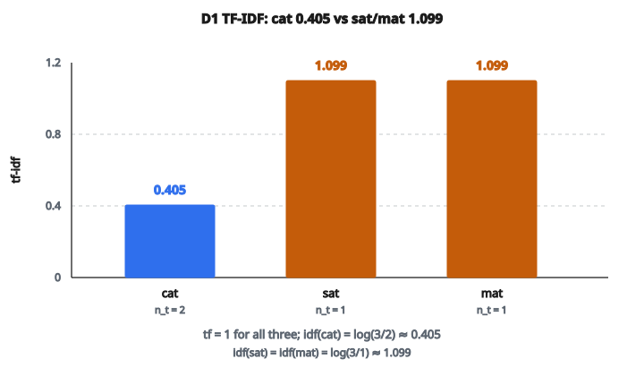

# TF-IDF Vectorizer

## TF-IDF là gì

**TF-IDF** (Term Frequency–Inverse Document Frequency) là một thống kê số phản ánh mức độ quan trọng của một từ đối với một tài liệu trong một tập hợp. Nó kết hợp hai nhân tố: tần suất từ xuất hiện trong một tài liệu (TF) và mức độ hiếm của từ đó trên toàn bộ các tài liệu (IDF). Những từ vừa xuất hiện nhiều trong một tài liệu vừa hiếm trên toàn corpus nhận điểm cao.

## Trực giác đằng sau TF-IDF

**Vấn đề của đếm thô:**
Các từ phổ biến như "the", "is", "and" xuất hiện thường xuyên trong mọi tài liệu. Dùng số đếm thô gán cho chúng tầm quan trọng cao dù chúng mang ít ý nghĩa.

**Thành phần TF:** Bắt tầm quan trọng cục bộ — một từ được nhắc nhiều lần trong một tài liệu có khả năng quan trọng với tài liệu đó.

**Thành phần IDF:** Bắt mức hiếm toàn cục — một từ xuất hiện ở ít tài liệu có tính phân biệt cao hơn từ xuất hiện khắp nơi.

**Hiệu ứng kết hợp:** Cân bằng tần suất với tính đặc trưng.

## Term Frequency (TF)

Có một số biến thể:

**Đếm thô (raw count):**

$$
\text{tf}(t, d) = f_{t,d}
$$

với $f_{t,d}$ là số lần term $t$ xuất hiện trong tài liệu $d$.

**Boolean:**

$$
\text{tf}(t, d) = \begin{cases} 1 & \text{nếu } t \in d \\ 0 & \text{nếu không} \end{cases}
$$

**Chuẩn hóa log:**

$$
\text{tf}(t, d) = 1 + \log(f_{t,d}) \quad \text{nếu } f_{t,d} > 0
$$

**Tần suất tăng cường (augmented frequency)** (tránh thiên vị tài liệu dài):

$$
\text{tf}(t, d) = 0.5 + 0.5 \cdot \frac{f_{t,d}}{\max\{f_{t',d} : t' \in d\}}
$$

## Inverse Document Frequency (IDF)

Đo mức phổ biến hay hiếm của một term trên các tài liệu:

$$
\text{idf}(t) = \log\left(\frac{N}{n_t}\right)
$$

với:

* $N$ = tổng số tài liệu
* $n_t$ = số tài liệu chứa term $t$

**Tính chất:**

* Term xuất hiện trong mọi tài liệu: $\text{idf} \to 0$
* Term xuất hiện trong đúng một tài liệu: $\text{idf} \to \log(N)$ (cực đại)
* Term hiếm nhận IDF cao, term phổ biến nhận IDF thấp

**Biến thể làm mượt** (tránh chia cho không):

$$
\text{idf}(t) = \log\left(\frac{N + 1}{n_t + 1}\right) + 1
$$

## Công thức TF-IDF

Kết hợp TF và IDF:

$$
\text{tf-idf}(t, d) = \text{tf}(t, d) \times \text{idf}(t)
$$

**Cách đọc:** TF-IDF cao nghĩa là term xuất hiện nhiều trong tài liệu này nhưng hiếm trên corpus — có khả năng là từ khóa của tài liệu đó.

## Ví dụ số

**Corpus** (3 tài liệu):

* D1: "cat sat mat"
* D2: "dog ran park"
* D3: "cat dog play"

**Vocabulary:** [cat, dog, mat, park, play, ran, sat]

**Document frequency:**

* cat: 2 tài liệu (D1, D3)
* dog: 2 tài liệu (D2, D3)
* mat: 1 tài liệu (D1)
* park: 1 tài liệu (D2)
* play: 1 tài liệu (D3)
* ran: 1 tài liệu (D2)
* sat: 1 tài liệu (D1)

**Tính IDF** (công thức chuẩn):

$$
\text{idf}(\text{cat}) = \log(3/2) \approx 0.405
$$

$$
\text{idf}(\text{mat}) = \log(3/1) \approx 1.099
$$

**TF-IDF cho D1:**

* cat: $\text{tf}=1$, $\text{idf}=0.405$, $\text{tf-idf} = 0.405$
* sat: $\text{tf}=1$, $\text{idf}=1.099$, $\text{tf-idf} = 1.099$
* mat: $\text{tf}=1$, $\text{idf}=1.099$, $\text{tf-idf} = 1.099$

::: {#fig-38-tfidf fig-cap="Trên D1, cat có tf-idf = 0.405 vì idf(cat) = log(3/2) ≈ 0.405; sat và mat chỉ xuất hiện ở D1 nên tf-idf = 1.099." fig-alt="Ba cột TF-IDF của D1: cat = 0.405 (thấp hơn vì n_t = 2), sat = 1.099 và mat = 1.099; idf(cat) = log(3/2) ≈ 0.405."}
{fig-align="center"}
:::

**Nhận xét:** "mat" và "sat" có TF-IDF cao hơn "cat" vì chúng chỉ xuất hiện ở D1.

## Ma trận TF-IDF

Với $N$ tài liệu và vocabulary kích thước $V$:

**Shape ma trận:** $(N, V)$

**Mỗi hàng:** vector TF-IDF của một tài liệu

**Mỗi cột:** giá trị TF-IDF của một term trên các tài liệu

**Tính thưa:** Hầu hết phần tử bằng không (tài liệu không chứa phần lớn các term trong vocabulary)

## Xây dựng vocabulary

**Bước 1:** Tokenize mọi tài liệu thành các term

**Bước 2:** Xây vocabulary (các term duy nhất)

**Bước 3:** Có thể lọc vocabulary:

* Loại term xuất hiện ở quá ít tài liệu (`min_df`)
* Loại term xuất hiện ở quá nhiều tài liệu (`max_df`)
* Giới hạn kích thước vocabulary (`max_features`)

**Kết quả:** Ánh xạ từ term sang chỉ số cột

## Fit và transform

**Fit** (học từ corpus huấn luyện):

* Xây vocabulary
* Tính IDF cho từng term
* Lưu vocabulary và trọng số IDF

**Transform** (áp dụng lên tài liệu):

* Đếm tần suất term trong tài liệu
* Nhân với IDF đã lưu
* Trả về vector TF-IDF

**Fit-Transform:** Kết hợp cả hai trên dữ liệu huấn luyện

**Quan trọng:** Dùng cùng vocabulary và cùng giá trị IDF cho dữ liệu huấn luyện và kiểm tra.

## Chuẩn hóa L2

Thường áp dụng sau TF-IDF:

$$
\text{normalized}(d) = \frac{\text{tf-idf}(d)}{\|\text{tf-idf}(d)\|_2}
$$

**Lợi ích:**

* Vector tài liệu có độ dài đơn vị
* Cosine similarity trở thành tích vô hướng
* Bỏ thiên vị do độ dài tài liệu

## Mở rộng n-gram

Thay vì từng từ đơn, xét chuỗi:

**Unigram:** "the", "cat", "sat"

**Bigram:** "the cat", "cat sat"

**Trigram:** "the cat sat"

**Kết hợp:** Thường dùng khoảng $(1,2)$ hoặc $(1,3)$ để bắt cả từ lẫn cụm

**Đánh đổi:** Nhiều đặc trưng hơn, biểu diễn có thể tốt hơn, nhưng số chiều cao hơn

## TF-IDF so với word embeddings

**TF-IDF:**

* Vector thưa, số chiều cao
* Không có tương đồng ngữ nghĩa (từ đồng nghĩa là các chiều khác nhau)
* Diễn giải được (mỗi chiều là một từ)
* Không cần huấn luyện

**Word embeddings (Word2Vec, GloVe):**

* Vector đặc, số chiều thấp
* Bắt tương đồng ngữ nghĩa
* Khó diễn giải hơn
* Cần tiền huấn luyện hoặc huấn luyện

**Cách tiếp cận hiện đại:** Thường kết hợp cả hai, hoặc dùng embedding từ Transformer

## Xử lý từ ngoài vocabulary

Term xuất hiện trong tài liệu kiểm tra nhưng không có trong vocabulary huấn luyện:

**Cách chuẩn:** Bỏ qua chúng (chúng không đóng góp gì vào vector)

**Hệ quả:** Tài liệu mới chứa chủ yếu term OOV nhận biểu diễn rất thưa

**Hướng xử lý:**

* Dùng tokenization theo subword
* Xử lý term hiếm ngay từ bước tiền xử lý
* Dùng character n-gram

## TF-IDF xuất hiện ở đâu

* **Search engine:** Xếp hạng tài liệu theo độ liên quan với query
* **Phân loại văn bản:** Vector đặc trưng để phân loại tài liệu
* **Document clustering:** Gom các tài liệu tương tự
* **Trích xuất từ khóa:** Term có TF-IDF cao nhất là từ khóa
* **Phát hiện trùng lặp:** So sánh độ tương đồng tài liệu
* **Hệ gợi ý:** Lọc theo nội dung dùng đặc trưng văn bản
* **Information retrieval:** Thành phần cốt lõi của nhiều hệ truy hồi
* **Phát hiện spam:** Đặc trưng cho phân loại email
* **Phân tích cảm xúc:** Biểu diễn văn bản baseline
* **Topic modeling:** Thường dùng kèm hoặc so sánh với LDA

## Code
```python
import numpy as np
from collections import Counter
import math

def tfidf_vectorizer(documents):
    """
    Build TF-IDF matrix from a list of text documents.
    Returns tuple of (tfidf_matrix, vocabulary).
    """
    tokens_list = [doc.lower().split() for doc in documents]
    N = len(documents)
    vocab = sorted(set(t for tokens in tokens_list for t in tokens))
    V = len(vocab)
    vocab_idx = {w: i for i, w in enumerate(vocab)}
    if N == 0 or V == 0:
        return np.zeros((N, 0), dtype=float), []
    df = Counter()
    for tokens in tokens_list:
        for t in set(tokens):
            df[t] += 1
    matrix = np.zeros((N, V), dtype=float)
    for i, tokens in enumerate(tokens_list):
        tf_counts = Counter(tokens)
        doc_len = len(tokens)
        if doc_len == 0:
            continue
        for t, count in tf_counts.items():
            j = vocab_idx[t]
            tf = count / doc_len
            idf = math.log(N / df[t])
            matrix[i, j] = tf * idf
    return matrix, vocab

```

<!-- auto-self-check -->

::: {.callout-note}
## Kiểm tra nhanh
<details>
<summary>Ý chính của bài «TF-IDF Vectorizer» là gì?</summary>
**TF-IDF** (Term Frequency–Inverse Document Frequency) là một thống kê số phản ánh mức độ quan trọng của một từ đối với một tài liệu trong một tập hợp.
</details>
<details>
<summary>Công thức / quan hệ cốt lõi trong bài là gì?</summary>
$$\text{tf}(t, d) = f_{t,d}$$
</details>
:::
