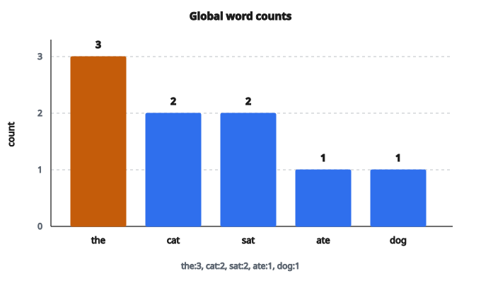

# Word Count Dictionary

## Đếm tần suất từ là gì

Đếm tần suất từ là một trong những thao tác nền tảng nhất trong xử lý ngôn ngữ tự nhiên. Cho một tập văn bản, nó tạo dictionary ánh xạ mỗi từ phân biệt tới số lần từ đó xuất hiện.

Thao tác đơn giản này là nền cho:

* Biểu diễn bag-of-words
* Vector hóa TF-IDF
* Xây vocabulary
* Phân tích và thống kê văn bản

## Thuật toán cơ bản

**Đầu vào:** một list câu, mỗi câu là một list token (từ).

**Đầu ra:** một dictionary với khóa là từ và giá trị là số đếm.

**Các bước:**

1. Khởi tạo dictionary rỗng
2. Với mỗi câu trong đầu vào:
   * Với mỗi token trong câu:
     * Nếu token đã có trong dictionary, tăng count
     * Nếu chưa, thêm vào với count 1
3. Trả về dictionary

## Ví dụ số

**Đầu vào:**

* Câu 1: ["the", "cat", "sat"]
* Câu 2: ["the", "cat", "ate"]
* Câu 3: ["the", "dog", "sat"]

**Quá trình:**

Sau câu 1: {"the": 1, "cat": 1, "sat": 1}

Sau câu 2: {"the": 2, "cat": 2, "sat": 1, "ate": 1}

Sau câu 3: {"the": 3, "cat": 2, "sat": 2, "ate": 1, "dog": 1}

**Đầu ra:**
{"the": 3, "cat": 2, "sat": 2, "ate": 1, "dog": 1}

Từ "the" xuất hiện 3 lần trên mọi câu, "cat" và "sat" mỗi từ 2 lần, v.v.

::: {#fig-102-word-counts fig-cap="Word counts trên ba câu: the:3, cat:2, sat:2, ate:1, dog:1. 'the' là từ phổ biến nhất." fig-alt="Biểu đồ cột tần suất toàn cục: the = 3, cat = 2, sat = 2, ate = 1, dog = 1."}
{fig-align="center"}
:::

## Vì sao tokenization quan trọng

Đầu vào đã được tokenize (tách thành từ). Trong thực tế, tokenization là bước tiền xử lý không tầm thường và ảnh hưởng tới word counts:

**Các quyết định khi tokenize:**

* Phân biệt hoa/thường: "The" có giống "the" không?
* Dấu câu: "cat." có giống "cat" không?
* Rút gọn: "don't" là một token hay hai ("do" + "n't")?
* Số: "123" nên là token hay bị bỏ?

Lựa chọn tokenization khác nhau dẫn tới dictionary đếm từ khác nhau.

## Tính chất tần suất từ

**Định luật Zipf:**
Tần suất từ tuân theo luật lũy thừa. Từ phổ biến nhất xuất hiện nhiều hơn hẳn từ phổ biến thứ hai, từ đó lại nhiều hơn hẳn từ thứ ba, và cứ thế.

Trong tiếng Anh, "the" thường chiếm 5–7% mọi từ. Top 100 từ thường phủ 50% mọi lần xuất hiện.

**Đuôi dài:**
Phần lớn từ trong vocabulary chỉ xuất hiện một hoặc hai lần. Những từ hiếm này gọi là "hapax legomena" (xuất hiện một lần) hoặc "dis legomena" (xuất hiện hai lần).

## Dùng word counts

**Biểu diễn bag-of-words:**
Chuyển mỗi tài liệu thành vector, mỗi chiều là một từ và giá trị là count. Bỏ qua thứ tự từ nhưng bắt được thông tin chủ đề.

**Nhận diện stop word:**
Những từ phổ biến nhất (the, a, is, of) thường là stop words, ít nội dung ngữ nghĩa. Word counts giúp nhận diện chúng để loại.

**Xây vocabulary:**
Xây vocabulary từ những từ xuất hiện ít nhất $k$ lần. Từ hiếm có thể là lỗi gõ hoặc không liên quan.

**Trích keyword:**
Từ có tần suất cao bất thường trong một tài liệu (so với corpus) có thể là keyword.

## Cài đặt hiệu quả

**Dùng default dictionary:**
Thay vì kiểm tra khóa đã tồn tại chưa, dùng cấu trúc mặc định 0 cho khóa thiếu. Code gọn hơn và thường nhanh hơn.

**Lớp Counter:**
Nhiều ngôn ngữ có lớp counter sẵn, tối ưu cho tác vụ này:

* Python: collections.Counter
* Java: HashMap với getOrDefault
* JavaScript: Map với đếm thủ công

**Cân nhắc bộ nhớ:**
Với corpus lớn, dictionary có thể tốn nhiều bộ nhớ. Cân nhắc:

* Dùng ID nguyên thay vì khóa chuỗi
* Cắt từ hiếm trong lúc đếm
* Dùng cấu trúc xác suất (Count-Min Sketch) cho đếm xấp xỉ

## Mở rộng

**Đếm n-gram:**
Thay vì từ đơn, đếm chuỗi $n$ từ liên tiếp. Bigram ($n=2$) bắt cặp từ như "New York" hoặc "ice cream".

**Đếm có trọng số:**
Gán trọng số khác nhau theo vị trí (title vs. body) hoặc tầm quan trọng (trọng số TF-IDF).

**Đếm có điều kiện:**
Đếm từ xuất hiện trong ngữ cảnh cụ thể (ví dụ sau một từ cho trước).

**Đếm phân tán:**
Với corpus rất lớn, dùng MapReduce hoặc framework tương tự để đếm song song.

## Từ counts sang vector

Dictionary đếm từ thường được chuyển thành vector số cho machine learning:

**Ánh xạ vocabulary:**
Gán mỗi từ phân biệt một chỉ số (ví dụ "the" $= 0$, "cat" $= 1$, ...).

**Tạo vector:**
Với mỗi tài liệu, tạo vector độ dài $|\text{vocabulary}|$ trong đó vị trí $i$ chứa count của từ $i$.

**Biểu diễn thưa:**
Hầu hết tài liệu chỉ chứa một phần nhỏ từ trong vocabulary. Lưu dạng vector thưa (chỉ phần tử khác không) để tiết kiệm bộ nhớ.

## Quan hệ với các khái niệm NLP khác

**Term Frequency (TF):**
Word count trong một tài liệu. Thường chuẩn hóa theo độ dài tài liệu.

**Document Frequency (DF):**
Số tài liệu chứa một từ. Dùng cùng TF cho TF-IDF.

**Inverse Document Frequency (IDF):**
$\log(N/\mathrm{DF})$ với $N$ là tổng số tài liệu. Gán trọng số cao hơn cho từ hiếm.

**TF-IDF:**
$\mathrm{TF} \times \mathrm{IDF}$. Cân bằng tần suất từ trong tài liệu với độ hiếm trên corpus.

Đếm từ là bước đầu tiên hướng tới mọi biểu diễn tinh vi hơn này.

## Code
```python
def word_count_dict(sentences):
    """
    Returns: dict[str, int] - global word frequency across all sentences
    """
    freq = {}
    for sentence in sentences:
        for word in sentence:
            freq[word] = freq.get(word, 0) + 1
    return freq

```
