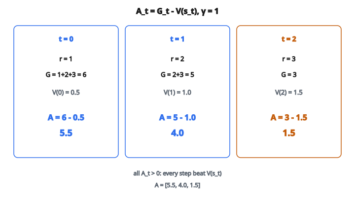

# Advantage Computation

## Thiết lập reinforcement learning

Trong reinforcement learning (RL), một **agent** tương tác với một **môi trường** qua một chuỗi bước thời gian. Ở mỗi bước $t$:

1. Agent quan sát trạng thái hiện tại $s_t$.
2. Agent lấy action $a_t$ theo policy của nó.
3. Môi trường trả về phần thưởng $r_t$ và chuyển sang trạng thái mới $s_{t+1}$.

Quá trình này tiếp tục đến khi episode kết thúc (agent tới trạng thái terminal hoặc hết số bước tối đa). Chuỗi đầy đủ các trạng thái, action, và phần thưởng gọi là **trajectory** hay **episode**:

$$
s_0, a_0, r_0, \; s_1, a_1, r_1, \; s_2, a_2, r_2, \; \ldots, \; s_T, a_T, r_T
$$

Mục tiêu của agent là học một policy cực đại hóa tổng phần thưởng tích lũy trên một episode. Nhưng “tổng phần thưởng” cần được định nghĩa cẩn thận, và đó là chỗ return xuất hiện.

## Return: đo phần thưởng dài hạn

**Return** $G_t$ tại bước $t$ là tổng phần thưởng tích lũy từ thời điểm đó trở đi. Phiên bản đơn giản nhất là **return chiết khấu**:

$$
G_t = r_t + \gamma \, r_{t+1} + \gamma^2 \, r_{t+2} + \gamma^3 \, r_{t+3} + \cdots = \sum_{k=0}^{T-t} \gamma^k \, r_{t+k}
$$

với $\gamma \in [0, 1]$ là **hệ số chiết khấu**.

**Vì sao chiết khấu?** Có vài lý do:

* **Thuận tiện toán học**: không chiết khấu ($\gamma = 1$), return có thể vô hạn trong môi trường không kết thúc. Chiết khấu đảm bảo tổng hội tụ miễn là phần thưởng bị chặn.
* **Bất định**: phần thưởng tương lai kém chắc hơn. Một phần thưởng xa trong tương lai phụ thuộc nhiều chuyển tiếp và quyết định bất định. Chiết khấu phản ánh sự bất định đó.
* **Ưu tiên thời gian**: trong nhiều bối cảnh thực, sớm hơn thì tốt hơn. Một đô-la hôm nay đáng hơn một đô-la năm sau.

**Các trường hợp cực đoan:**

* $\gamma = 0$: agent hoàn toàn cận thị. $G_t = r_t$, chỉ phần thưởng tức thời quan trọng.
* $\gamma = 1$: không chiết khấu gì cả. Mọi phần thưởng tương lai được định giá đều. Cách này chỉ làm việc trong thiết lập hữu hạn tầm (theo episode) khi episode chắc chắn kết thúc.

**Cấu trúc đệ quy**: return thỏa một đệ quy tự nhiên:

$$
G_t = r_t + \gamma \, G_{t+1}
$$

Return tại bước $t$ là phần thưởng tức thời cộng return chiết khấu từ bước kế trở đi. Ở bước cuối $T$, không còn phần thưởng tương lai, nên $G_T = r_T$.

## Hàm giá trị

**Hàm giá trị trạng thái** $V(s)$ cho kỳ vọng return từ trạng thái $s$ dưới một policy cho trước:

$$
V(s) = \mathbb{E}[G_t \mid s_t = s]
$$

Nó trả lời: “trung bình, agent sẽ thu bao nhiêu tổng phần thưởng nếu bắt đầu ở $s$ và theo policy hiện tại?”

$V(s)$ là một kỳ vọng, nghĩa là nó trung bình trên mọi độ ngẫu nhiên của chuyển tiếp và action tương lai. Trong một episode cụ thể, return thật $G_t$ từ trạng thái $s_t$ sẽ khác $V(s_t)$. Đôi khi agent làm tốt hơn kỳ vọng, đôi khi kém hơn.

Hàm giá trị được **critic** ước lượng trong các phương pháp actor-critic. Nó có thể được học bằng temporal-difference (TD) learning, ước lượng Monte Carlo, hoặc kỹ thuật khác. Trong phần code, $V$ được cho sẵn như một mảng đã tính.

## Hàm advantage

**Advantage** tại bước $t$ là:

$$
A_t = G_t - V(s_t)
$$

Nó đo hiệu giữa điều thực sự xảy ra ($G_t$, return hiện thực) và điều được kỳ vọng ($V(s_t)$, return trung bình từ trạng thái đó).

**Đọc dấu:**

* $A_t > 0$ (advantage dương): return thật vượt giá trị kỳ vọng. Những gì agent làm tại bước $t$ dẫn tới kết cục tốt hơn trung bình. Action này nên được củng cố.
* $A_t < 0$ (advantage âm): return thật thấp hơn giá trị kỳ vọng. Agent làm kém hơn trung bình. Action này nên bị ngăn.
* $A_t = 0$: kết cục đúng như kỳ vọng. Không có tín hiệu để chỉnh policy.

Advantage không chỉ nói return cao hay thấp theo nghĩa tuyệt đối. Nó nói return cao hay thấp *so với kỳ vọng từ trạng thái đó*. Phân biệt này là then chốt.

## Vì sao không dùng trực tiếp return?

Câu hỏi tự nhiên: vì sao phải trừ $V(s_t)$? Vì sao không dùng $G_t$ trực tiếp để cập nhật policy?

Câu trả lời là **giảm phương sai**.

Xét một thuật toán policy gradient đơn giản như REINFORCE. Bước gradient cơ bản là:

$$
\nabla J \propto \sum_t G_t \cdot \nabla \ln \pi(a_t \mid s_t)
$$

Nghĩa là: tăng xác suất các action dẫn tới return cao, giảm xác suất các action dẫn tới return thấp. Vấn đề là $G_t$ có thể lớn và nhiễu. Nếu mọi phần thưởng trong môi trường đều dương (ví dụ từ 50 đến 100), thì $G_t$ luôn dương, và gradient đẩy xác suất mọi action lên, chỉ khác nhau về độ lớn. Tín hiệu bị nhấn chìm trong nhiễu.

Bây giờ trừ một **baseline** $b(s_t)$ khỏi return:

$$
\nabla J \propto \sum_t (G_t - b(s_t)) \cdot \nabla \ln \pi(a_t \mid s_t)
$$

Hàm giá trị $V(s_t)$ là baseline tối ưu (theo nghĩa cực tiểu hóa phương sai). Khi trừ nó:

* Action dẫn tới kết cục tốt hơn kỳ vọng nhận trọng số dương (được đẩy lên).
* Action dẫn tới kết cục kém hơn kỳ vọng nhận trọng số âm (bị đẩy xuống).

Gradient giờ có tín hiệu hướng rõ, thay vì một độ lớn luôn dương chỉ khác nhẹ giữa action tốt và kém. Việc học nhờ đó nhanh hơn và ổn định hơn nhiều.

**Về mặt toán học, trừ bất kỳ baseline nào chỉ phụ thuộc trạng thái không đưa bias vào ước lượng gradient. Nó chỉ giảm phương sai.** Đây là kết quả nền của lý thuyết policy gradient.

## Ví dụ số

Xét một episode 3 bước, $\gamma = 1$ (không chiết khấu), và ước lượng giá trị $V = [0.5, 1.0, 1.5]$:

**$t=0$**: state=0, reward=1, return $= 1 + 2 + 3 = 6$, $V(0) = 0.5$, advantage $= 6 - 0.5 =$ **$5.5$**

**$t=1$**: state=1, reward=2, return $= 2 + 3 = 5$, $V(1) = 1.0$, advantage $= 5 - 1.0 =$ **$4.0$**

**$t=2$**: state=2, reward=3, return $= 3$, $V(2) = 1.5$, advantage $= 3 - 1.5 =$ **$1.5$**

Mọi advantage đều dương, nghĩa là ở mọi bước agent làm tốt hơn kỳ vọng. Advantage tại $t=0$ lớn nhất vì return tích lũy trên mọi bước còn lại và baseline thì nhỏ.

::: {#fig-94-advantage fig-cap="A_t = G_t − V(s_t) với γ = 1: return (6, 5, 3) trừ V = [0.5, 1.0, 1.5] cho advantage 5.5, 4.0, 1.5." fig-alt="Ba bước t=0,1,2 với gamma=1. Return G=6,5,3; V=0.5,1.0,1.5; advantage A=5.5,4.0,1.5."}
{fig-align="center"}
:::

Bây giờ với $\gamma = 0$ (cận thị) và $V = [0, 0, 0]$:

**$t=0$**: reward=1, return=1, $V(0)=0$, advantage $= 1 - 0 =$ **$1.0$**

**$t=1$**: reward=2, return=2, $V(1)=0$, advantage $= 2 - 0 =$ **$2.0$**

**$t=2$**: reward=3, return=3, $V(2)=0$, advantage $= 3 - 0 =$ **$3.0$**

Với không chiết khấu tương lai và baseline bằng không, advantage bằng phần thưởng tức thời ở mỗi bước. Phần thưởng tương lai không đóng góp vì $\gamma = 0$.

## Vai trò của hệ số chiết khấu trong advantage

Hệ số chiết khấu $\gamma$ điều khiển trực tiếp return nhìn bao xa vào tương lai:

* Với $\gamma$ cao (gần $1$), $G_t$ gồm phần thưởng từ nhiều bước phía trước. Advantage phản ánh phần còn lại của episode đi tốt hay kém.
* Với $\gamma$ thấp (gần $0$), $G_t$ bị phần thưởng tức thời $r_t$ chi phối. Advantage chủ yếu nói kết cục tức thời có tốt hơn kỳ vọng hay không.

Trong thực hành, giá trị vừa phải như $\gamma = 0.99$ là phổ biến. Nghĩa là một phần thưởng 100 bước nữa đáng $0.99^{100} \approx 0.366$ so với giá trị danh nghĩa, nên vẫn đóng góp đáng kể nhưng đã bị chiết so với phần thưởng tức thời.

## Advantage trong actor-critic

Hàm advantage là cầu nối giữa **actor** (policy) và **critic** (hàm giá trị) trong các thuật toán actor-critic.

**Kiến trúc actor-critic:**

* **Critic** học $V(s)$ bằng cách cực tiểu hóa sai số giữa giá trị dự đoán và return quan sát.
* **Actor** học policy $\pi(a \mid s)$ bằng cách dùng advantage $A_t$ để trọng số các bước gradient.

Vòng phản hồi:

1. Critic cho ước lượng giá trị ngày càng chính xác.
2. Ước lượng giá trị tốt hơn cho ước lượng advantage phương sai thấp hơn.
3. Advantage phương sai thấp hơn giúp actor học hiệu quả hơn.
4. Policy tốt hơn sinh trajectory mới, critic dùng chúng để tinh ước lượng.

**Các thuật toán lớn xây trên advantage:**

* **A2C / A3C** (Advantage Actor-Critic): công thức gốc. Dùng $A_t = G_t - V(s_t)$ trực tiếp, đúng như ở đây.
* **PPO** (Proximal Policy Optimization): dùng ước lượng advantage để tính mục tiêu surrogate đã clip, ngăn policy đổi quá nhiều trong một lần cập nhật. PPO là một trong những thuật toán RL được dùng rộng nhất trong thực tế.
* **GAE** (Generalized Advantage Estimation): thay vì dùng Monte Carlo return đầy đủ $G_t$, GAE hòa trộn các ước lượng return độ dài khác nhau bằng trọng số mũ điều khiển bởi $\lambda$. Cách này cho đánh đổi bias–variance chỉnh được cho advantage.

## Đánh đổi bias–variance khi ước lượng advantage

Phiên bản advantage ở đây, $A_t = G_t - V(s_t)$, dùng **Monte Carlo return** $G_t$. Nó có một tính chất quan trọng: **unbiased**. Return thật $G_t$ là mẫu trực tiếp của điều đã xảy ra, không xấp xỉ.

Tuy nhiên nó có thể có **phương sai cao** vì $G_t$ phụ thuộc mọi phần thưởng từ bước $t$ đến hết episode. Một chuyển tiếp xui xa trong tương lai có thể làm $G_t$ khác hẳn giữa các episode, dù cùng trạng thái xuất phát.

Một lựa chọn khác là **TD (temporal difference) advantage**:

$$
A_t^{\mathrm{TD}} = r_t + \gamma V(s_{t+1}) - V(s_t)
$$

Cách này chỉ nhìn một bước tới và dùng hàm giá trị để ước lượng phần còn lại. Nó có phương sai thấp hơn (vì không phụ thuộc cả quỹ đạo) nhưng đưa **bias** vào (vì $V$ là xấp xỉ và có thể sai).

GAE tổng quát cả hai: với $\lambda = 1$ nó rút thành advantage Monte Carlo (unbiased, phương sai cao), và với $\lambda = 0$ nó rút thành TD advantage (biased, phương sai thấp). Chọn $\lambda$ ở giữa cho đánh đổi thực tế.

## Advantage xuất hiện ở đâu

**Agent chơi game:** AlphaGo, OpenAI Five (Dota 2), và các hệ chơi game khác dùng phương pháp policy gradient dựa trên advantage. Advantage cho agent biết nước nào tốt hơn chiến lược hiện tại và hơn bao nhiêu.

**Robotics:** các phương pháp policy gradient với ước lượng advantage huấn luyện robot đi bộ, nắm đồ, và thao tác phức tạp. Tín hiệu advantage giúp tách hiệu ứng của một lệnh motor khỏi độ khó tổng thể của tác vụ.

**Fine-tune mô hình ngôn ngữ (RLHF):** Reinforcement Learning from Human Feedback dùng PPO (dựa trên advantage) để fine-tune mô hình ngôn ngữ. Advantage đo một câu trả lời cụ thể tốt hơn hay kém hơn những gì mô hình thường tạo ra.

**Quản lý tài nguyên:** agent RL phân bổ server, định tuyến mạng, hoặc hệ năng lượng dùng cập nhật dựa trên advantage để học policy cực đại hóa throughput hoặc cực tiểu hóa chi phí.

## Code
```python
import numpy as np

def compute_advantage(states, rewards, V, gamma):
    """
    Returns: A (NumPy array of advantages)
    """
    V = np.array(V, dtype=float)
    rewards = np.array(rewards, dtype=float)
    n = len(rewards)
    advantages = np.zeros(n)
    for t in range(n):
        G = 0.0
        discount = 1.0
        for k in range(t, n):
            G += discount * rewards[k]
            discount *= gamma
        if t + 1 < len(states):
            G += discount * V[states[t + 1]]
        advantages[t] = G - V[states[t]]
    return [round(float(a), 4) for a in advantages]

```
