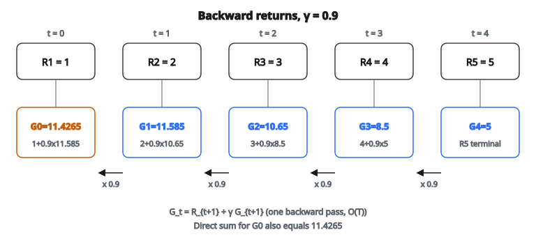

# Discounted Returns

## Discounted return là gì

**Discounted return** (còn gọi là discounted cumulative reward) là tổng phần thưởng agent nhận từ một thời điểm cho tới hết, trong đó phần thưởng tương lai được trọng số nhỏ hơn phần thưởng tức thời.

$$
G_t = R_{t+1} + \gamma R_{t+2} + \gamma^2 R_{t+3} + \cdots = \sum_{k=0}^{\infty} \gamma^k R_{t+k+1}
$$

với $\gamma \in [0, 1]$ là **discount factor**.

## Vì sao chiết khấu phần thưởng tương lai

**1. Tiện toán học:**

Chiết khấu bảo đảm chuỗi hội tụ trên horizon vô hạn. Không chiết khấu, return có thể vô hạn.

**2. Bất định về tương lai:**

Phần thưởng tương lai kém chắc chắn hơn. Chiết khấu phản ánh sự bất định đó.

**3. Ưu tiên cái đến sớm:**

Ở nhiều miền, nhận thưởng sớm hơn thì tốt hơn (giá trị thời gian của tiền, rủi ro, v.v.).

**4. Horizon hiệu dụng hữu hạn:**

Chiết khấu tạo một horizon “mềm”: ngoài đó phần thưởng hầu như không còn đóng góp.

## Discount factor $\gamma$

Discount factor $\gamma$ quyết định mức ta coi trọng phần thưởng tương lai:

**$\gamma = 0$ (myopic):**

$$
G_t = R_{t+1}
$$

Chỉ phần thưởng tức thời. Không lập kế hoạch phía trước.

**$\gamma = 1$ (không chiết khấu):**

$$
G_t = R_{t+1} + R_{t+2} + R_{t+3} + \cdots
$$

Mọi phần thưởng ngang tầm. Chỉ dùng được cho episode hữu hạn.

**$\gamma \in (0, 1)$ (thường gặp):**

Giá trị phổ biến: 0.9, 0.95, 0.99. Cân ngắn hạn và dài hạn.

## Hiểu các giá trị $\gamma$

**$\gamma = 0.9$:**

* Phần thưởng 10 bước nữa: $0.9^{10} \approx 0.35$ so với giá trị tức thời
* Phần thưởng 20 bước nữa: $0.9^{20} \approx 0.12$ so với giá trị tức thời
* Effective horizon: $\sim$10 bước

**$\gamma = 0.99$:**

* Phần thưởng 10 bước nữa: $0.99^{10} \approx 0.90$ so với giá trị tức thời
* Phần thưởng 100 bước nữa: $0.99^{100} \approx 0.37$ so với giá trị tức thời
* Effective horizon: $\sim$100 bước

$\gamma$ lớn hơn nghĩa là horizon lập kế hoạch dài hơn.

## Định nghĩa đệ quy

Return thỏa hệ thức đệ quy:

$$
G_t = R_{t+1} + \gamma G_{t+1}
$$

Hệ thức này then chốt cho tính toán hiệu quả. Thay vì cộng mọi phần thưởng tương lai, ta tính return ngược từ cuối episode.

## Ví dụ số

**Episode:** 5 timestep với phần thưởng

* $t=0$: $R_1 = 1$
* $t=1$: $R_2 = 2$
* $t=2$: $R_3 = 3$
* $t=3$: $R_4 = 4$
* $t=4$: $R_5 = 5$ (terminal)

**Discount factor:** $\gamma = 0.9$

**Tính trực tiếp $G_0$:**

$$
\begin{aligned}
G_0 &= R_1 + \gamma R_2 + \gamma^2 R_3 + \gamma^3 R_4 + \gamma^4 R_5 \\
    &= 1 + 0.9(2) + 0.81(3) + 0.729(4) + 0.6561(5) \\
    &= 1 + 1.8 + 2.43 + 2.916 + 3.2805 \\
    &= 11.4265
\end{aligned}
$$

**Tính đệ quy (ngược):**

$$
\begin{aligned}
G_4 &= R_5 = 5 \\
G_3 &= R_4 + \gamma G_4 = 4 + 0.9(5) = 4 + 4.5 = 8.5 \\
G_2 &= R_3 + \gamma G_3 = 3 + 0.9(8.5) = 3 + 7.65 = 10.65 \\
G_1 &= R_2 + \gamma G_2 = 2 + 0.9(10.65) = 2 + 9.585 = 11.585 \\
G_0 &= R_1 + \gamma G_1 = 1 + 0.9(11.585) = 1 + 10.4265 = 11.4265
\end{aligned}
$$

Cùng kết quả, tính hiệu quả bằng một lượt đi ngược.

::: {#fig-137-discounted-returns fig-cap="G_t = R_{t+1} + γ G_{t+1} với γ = 0.9: một lượt ngược cho G0 = 11.4265, khớp tổng trực tiếp." fig-alt="Năm ô phần thưởng R1=1 đến R5=5; bên dưới G4=5, G3=8.5, G2=10.65, G1=11.585, G0=11.4265; mũi tên đi ngược nhân gamma=0.9."}
{fig-align="center"}
:::

## Thuật toán tính mọi return

**Đầu vào:** Phần thưởng $[R_1, R_2, \ldots, R_T]$, discount factor $\gamma$

**Đầu ra:** Return $[G_0, G_1, \ldots, G_{T-1}]$

**Quy trình:**

1. Khởi tạo $G = 0$
2. Với $t = T-1, T-2, \ldots, 0$:
   * $G = R_{t+1} + \gamma \cdot G$
   * Lưu $G_t = G$
3. Trả về danh sách return

**Độ phức tạp thời gian:** $O(T)$

**Độ phức tạp không gian:** $O(T)$ để lưu return

## Xử lý trạng thái terminal

Ở cuối episode, return chính là phần thưởng cuối:

$$
G_{T-1} = R_T
$$

Không còn phần thưởng nào sau termination.

**Với bài continuing (không theo episode):**

Return là tổng vô hạn. Thực tế ta cắt tại một horizon hoặc bootstrap (phương pháp TD).

## n-step return

Thay vì return đầy đủ, có thể dùng return từng phần kèm bootstrap:

**1-step return (TD target):**

$$
G_t^{(1)} = R_{t+1} + \gamma V(S_{t+1})
$$

**2-step return:**

$$
G_t^{(2)} = R_{t+1} + \gamma R_{t+2} + \gamma^2 V(S_{t+2})
$$

**n-step return:**

$$
G_t^{(n)} = \sum_{k=0}^{n-1} \gamma^k R_{t+k+1} + \gamma^n V(S_{t+n})
$$

Chúng trộn phần thưởng thật với ước lượng value.

## Return trong các phương pháp RL

**Monte Carlo:**

* Dùng return đầy đủ $G_t$
* Đợi đến khi episode kết thúc

**Temporal Difference (TD):**

* Dùng 1-step return: $R_{t+1} + \gamma V(S_{t+1})$
* Cập nhật sau mỗi bước

**n-step TD:**

* Dùng n-step return
* Cân giữa MC và TD

**$\lambda$-return:**

* Trung bình có trọng số của mọi n-step return
* Dùng trong TD($\lambda$) và GAE

## Tính chất của discounted return

**Bị chặn:**

Nếu phần thưởng bị chặn bởi $R_{\max}$, thì:

$$
|G_t| \leq \sum_{k=0}^{\infty} \gamma^k R_{\max} = \frac{R_{\max}}{1 - \gamma}
$$

**Co (contraction):**

Discount factor biến return thành ánh xạ co, bảo đảm hội tụ của value iteration.

**Cộng tính:**

Return phân rã được:

$$
G_t = R_{t+1} + \gamma G_{t+1}
$$

## Effective horizon

Effective horizon xấp xỉ:

$$
H_{\mathrm{eff}} \approx \frac{1}{1 - \gamma}
$$

Đây là thang thời gian mà phần thưởng còn đóng góp đáng kể.

**Ví dụ:**

* $\gamma = 0.9$: $H_{\mathrm{eff}} \approx 10$ bước
* $\gamma = 0.99$: $H_{\mathrm{eff}} \approx 100$ bước
* $\gamma = 0.999$: $H_{\mathrm{eff}} \approx 1000$ bước

## Chọn discount factor

**Cân nhắc theo bài:**

* Episode ngắn: $\gamma$ thấp hơn (0.9–0.95) thường đủ
* Episode dài: cần $\gamma$ cao hơn (0.99–0.999)
* Reward thưa: $\gamma$ cao hơn để lan tín hiệu thưởng

**Đánh đổi:**

* $\gamma$ cao hơn: lập kế hoạch dài hạn tốt hơn, học chậm hơn, dễ bất ổn
* $\gamma$ thấp hơn: học nhanh hơn, có thể bỏ lỡ mẫu dài hạn

## Return không chiết khấu ($\gamma = 1$)

Với bài episodic hữu hạn, đôi khi dùng return không chiết khấu:

$$
G_t = \sum_{k=t}^{T-1} R_{k+1}
$$

**Khi phù hợp:**

* Episode luôn kết thúc
* Mọi phần thưởng ngang tầm
* Không ưu tiên sớm hơn muộn hơn

**Lưu ý:** Có thể gây vấn đề số học trên episode rất dài.

## Chuẩn hóa return

Return có thể lệch rất xa về độ lớn. Chuẩn hóa giúp:

**Standardization:**

$$
G_t^{\mathrm{norm}} = \frac{G_t - \mu_G}{\sigma_G}
$$

**Lợi ích:**

* Learning rate nhất quán giữa các bài
* Tránh gradient nổ
* Học nhanh và ổn định hơn

## Return, reward và value

**Reward $R_t$:**

Tín hiệu tức thời nhận tại thời $t$. Môi trường cấp.

**Return $G_t$:**

Tổng phần thưởng đã chiết khấu từ thời $t$ trở đi. Tính từ reward.

**Value $V(s)$:**

Kỳ vọng return từ state $s$. Ước lượng học được của $E[G_t \mid S_t = s]$.

## Tính return trong thực tế

**Với phương pháp policy gradient (PPO, REINFORCE):**

1. Thu thập trajectory episode đầy đủ
2. Tính return ngược: $G_t = R_{t+1} + \gamma G_{t+1}$
3. Dùng return hoặc advantage cho cập nhật gradient

**Với phương pháp value-based (DQN):**

1. Dùng TD target: $R + \gamma \max_a Q(s', a)$
2. Không cần return đầy đủ

## Tính vector hóa

Để hiệu quả, tính return cho một batch trajectory:

**Padding:** Đệm trajectory ngắn hơn về cùng độ dài

**Masking:** Dùng mask để xử lý độ dài episode khác nhau

**Reverse cumsum:** Một số framework có phép toán hiệu quả:

$$
G = \mathrm{reverse\_cumsum}(\gamma^k \cdot R)
$$

## Các lỗi thường gặp

**1. Quên xử lý trạng thái terminal:**

Tại terminal, không có $V(s')$ hay $G_{t+1}$.

**2. Áp chiết khấu sai chỗ:**

$G_t = R_{t+1} + \gamma G_{t+1}$, không phải $G_t = \gamma R_{t+1} + \gamma G_{t+1}$

**3. Tính xuôi thay vì ngược:**

Tính xuôi là $O(T^2)$; tính ngược là $O(T)$.

**4. Tràn số với return lớn:**

Dùng scale phù hợp hoặc hạ $\gamma$ cho episode rất dài.

## Code
```python
def discount_returns(rewards, gamma):
    """
    Compute the discounted return at every timestep.
    """
    n = len(rewards)
    G = [0.0] * n
    G[n - 1] = float(rewards[n - 1])
    for t in range(n - 2, -1, -1):
        G[t] = float(rewards[t]) + gamma * G[t + 1]
    return [round(g, 4) for g in G]

```
