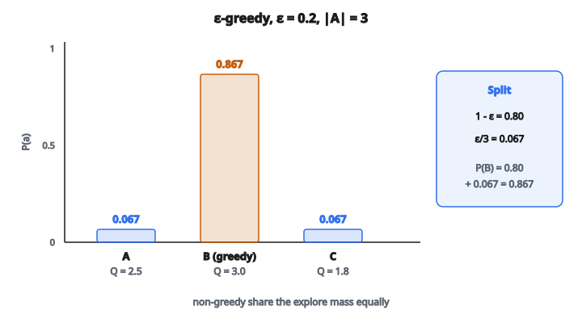

# ε-Greedy Action Selection

## Epsilon-greedy là gì?

Epsilon-greedy là một **chiến lược chọn action** cân bằng exploration và exploitation trong reinforcement learning. Phần lớn thời gian nó chọn action tốt nhất đã biết, nhưng thỉnh thoảng lấy một action ngẫu nhiên để phát hiện lựa chọn có thể tốt hơn.

Tham số $\epsilon$ điều khiển tỉ lệ exploration.

## Lưỡng nan exploration–exploitation

Trong reinforcement learning, agent đối mặt một đánh đổi cơ bản:

**Exploitation:** chọn action đã cho phần thưởng cao trong quá khứ. Cách này cực đại hóa phần thưởng ngắn hạn dựa trên kiến thức hiện có.

**Exploration:** chọn action chưa thử nhiều. Cách này thu thập thông tin có thể dẫn tới phần thưởng dài hạn cao hơn.

Exploitation thuần có thể bỏ lỡ action tốt hơn. Exploration thuần lãng phí thời gian vào action kém. Chiến lược tốt cân bằng cả hai.

## Policy epsilon-greedy

Với xác suất $1 - \epsilon$: chọn **greedy action** (giá trị ước lượng cao nhất)

Với xác suất $\epsilon$: chọn **action ngẫu nhiên** đều

Toán học:

$$
\pi(a \mid s) =
\begin{cases}
1 - \epsilon + \frac{\epsilon}{|A|} & \text{nếu } a = \arg\max_{a'} Q(s, a') \\
\frac{\epsilon}{|A|} & \text{còn lại}
\end{cases}
$$

với $|A|$ là số action khả dụng.

## Hiểu các xác suất

Với một trạng thái có 4 action và $\epsilon = 0.1$:

**Xác suất greedy action:**

$$
\begin{aligned}
P(a^*)
&= 1 - \epsilon + \frac{\epsilon}{|A|} \\
&= 1 - 0.1 + \frac{0.1}{4} \\
&= 0.9 + 0.025 \\
&= 0.925
\end{aligned}
$$

**Xác suất mỗi action không greedy:**

$$
P(a \neq a^*) = \frac{\epsilon}{|A|} = \frac{0.1}{4} = 0.025
$$

**Kiểm tra:**

$$
0.925 + 3 \times 0.025 = 0.925 + 0.075 = 1.0
$$

## Thuật toán

**Đầu vào:** Q-value $Q(s, a)$, tỉ lệ exploration $\epsilon$, trạng thái hiện tại $s$

**Đầu ra:** action $a$

1. Sinh số ngẫu nhiên $r \sim \mathrm{Uniform}(0, 1)$
2. Nếu $r < \epsilon$:

   * Trả về action ngẫu nhiên trong các action khả dụng
3. Ngược lại:

   * Trả về $\arg\max_a Q(s, a)$

## Ví dụ số

**Thiết lập:**

* Trạng thái $s$ với 3 action: A, B, C
* Q-value: $Q(s, A) = 2.5$, $Q(s, B) = 3.0$, $Q(s, C) = 1.8$
* $\epsilon = 0.2$

**Greedy action:** B (Q-value cao nhất $3.0$)

**Xác suất action:**

* $P(B) = 1 - 0.2 + 0.2/3 = 0.8 + 0.067 = 0.867$
* $P(A) = 0.2/3 = 0.067$
* $P(C) = 0.2/3 = 0.067$

::: {#fig-92-epsilon-greedy fig-cap="Epsilon-greedy với ε = 0.2: greedy B có P(B) = 0.867; mỗi action còn lại P = ε/|A| = 0.067." fig-alt="Ba action A, B, C với Q = 2.5, 3.0, 1.8 và epsilon=0.2. Xác suất P(B)=0.867 greedy, P(A)=P(C)=0.067."}
{fig-align="center"}
:::

**Nếu số ngẫu nhiên $r = 0.15$:**

Vì $0.15 < 0.2$ (epsilon), explore: chọn action ngẫu nhiên

**Nếu số ngẫu nhiên $r = 0.75$:**

Vì $0.75 \geq 0.2$, exploit: chọn action B

## Chọn epsilon

**$\epsilon$ cao (ví dụ $0.5$):**

* Exploration nhiều hơn
* Hội tụ chậm hơn tới policy tối ưu
* Tốt cho giai đoạn học sớm
* Hữu ích trong môi trường rất ngẫu nhiên

**$\epsilon$ thấp (ví dụ $0.01$):**

* Exploitation nhiều hơn
* Hội tụ nhanh hơn nếu ước lượng đã tốt
* Có thể kẹt ở cực tiểu địa phương
* Tốt khi Q-value đã được ước lượng chắc

**Giá trị điển hình:** $\epsilon \in [0.01, 0.3]$

## Epsilon decay

Chiến lược phổ biến là bắt đầu với exploration cao rồi giảm dần:

**Linear decay:**

$$
\epsilon_t = \max(\epsilon_{\min}, \epsilon_0 - \mathrm{decay\_rate} \times t)
$$

**Exponential decay:**

$$
\epsilon_t = \max(\epsilon_{\min}, \epsilon_0 \times \mathrm{decay}^{t})
$$

**Inverse decay:**

$$
\epsilon_t = \frac{1}{1 + \mathrm{decay\_rate} \times t}
$$

Cách này cho exploration rộng lúc đầu, rồi tinh chỉnh policy.

## Ví dụ epsilon decay

**Thiết lập:**

* Ban đầu: $\epsilon_0 = 1.0$ (100% exploration)
* Cuối: $\epsilon_{\min} = 0.01$
* Decay rate: $0.995$ (mũ)

**Sau 100 episode:**

$$
\epsilon_{100} = \max(0.01, 1.0 \times 0.995^{100}) = \max(0.01, 0.606) = 0.606
$$

**Sau 500 episode:**

$$
\epsilon_{500} = \max(0.01, 1.0 \times 0.995^{500}) = \max(0.01, 0.082) = 0.082
$$

**Sau 1000 episode:**

$$
\epsilon_{1000} = \max(0.01, 1.0 \times 0.995^{1000}) = \max(0.01, 0.0067) = 0.01
$$

## Xử lý hòa khi chọn greedy

Khi nhiều action có cùng Q-value cực đại:

**Cách 1:** chọn ngẫu nhiên trong các action hòa

* Cách phổ biến nhất
* Cho exploration ẩn

**Cách 2:** chọn cố định (ví dụ action đầu tiên)

* Tất định
* Có thể gây bias

**Cách 3:** ưu tiên có thứ tự

* Dùng tiêu chí phụ (ví dụ chỉ số action)

## Epsilon-greedy trong Q-learning

Q-learning dùng epsilon-greedy để chọn action trong lúc học:

**Trong lúc học:**

1. Quan sát trạng thái $s$
2. Chọn action $a$ bằng epsilon-greedy từ $Q(s, \cdot)$
3. Thực thi $a$, quan sát phần thưởng $r$ và trạng thái kế $s'$
4. Cập nhật: $Q(s,a) \leftarrow Q(s,a) + \alpha[r + \gamma \max_{a'} Q(s',a') - Q(s,a)]$
5. $s \leftarrow s'$

Exploration epsilon-greedy đảm bảo mọi cặp state–action được thăm.

## Epsilon-greedy trong SARSA

SARSA cũng dùng epsilon-greedy, nhưng cho cả chọn action và cập nhật:

1. Quan sát trạng thái $s$
2. Chọn action $a$ bằng epsilon-greedy
3. Thực thi $a$, quan sát phần thưởng $r$ và trạng thái kế $s'$
4. Chọn action kế $a'$ bằng epsilon-greedy từ $Q(s', \cdot)$
5. Cập nhật: $Q(s,a) \leftarrow Q(s,a) + \alpha[r + \gamma Q(s',a') - Q(s,a)]$
6. $s \leftarrow s'$, $a \leftarrow a'$

SARSA học giá trị của chính policy epsilon-greedy.

## Tính chất của epsilon-greedy

**1. GLIE (Greedy in the Limit with Infinite Exploration):**

Với $\epsilon$ giảm sao cho $\sum_t \epsilon_t = \infty$ và $\lim_{t \to \infty} \epsilon_t = 0$, epsilon-greedy thỏa điều kiện GLIE cho hội tụ.

**2. Mọi action có xác suất khác không:**

Mọi action đều có thể được chọn, đảm bảo exploration toàn bộ không gian state–action.

**3. Đơn giản và hiệu quả:**

Dễ cài và làm việc tốt trong thực tế.

## So với các chiến lược exploration khác

**Greedy ($\epsilon = 0$):**

* Không exploration
* Exploit hoàn toàn kiến thức hiện có
* Có thể kẹt ở action không tối ưu

**Ngẫu nhiên ($\epsilon = 1$):**

* Exploration thuần
* Không exploit giá trị đã học
* Học rất chậm

**Softmax (Boltzmann):**

$$
\pi(a \mid s) = \frac{e^{Q(s,a)/\tau}}{\sum_{a'} e^{Q(s,a')/\tau}}
$$

* Xác suất action tỉ lệ với Q-value
* Temperature $\tau$ điều khiển exploration
* Xét Q-value tương đối, không chỉ max

## Softmax và epsilon-greedy

**Epsilon-greedy:**

* Mọi action không greedy đều có xác suất bằng nhau
* Đơn giản để cài và tinh chỉnh
* Không xét chênh lệch Q-value

**Softmax:**

* Action tốt hơn có xác suất cao hơn
* Exploration tinh hơn
* Tham số temperature có thể khó chỉnh hơn

**Ví dụ:** Q-value $[10.0, 9.9, 1.0]$

Epsilon-greedy: action 2 và 3 đều như nhau khi explore

Softmax: action 2 khả năng cao hơn hẳn action 3

## Upper Confidence Bound (UCB)

Một chiến lược exploration khác xét độ bất định:

$$
a_t = \arg\max_a \left[ Q(a) + c\sqrt{\frac{\ln t}{N(a)}} \right]
$$

với $N(a)$ là số lần action $a$ đã được chọn.

UCB ưu tiên action có Q-value cao **hoặc** bất định cao (ít lần thăm).

## Epsilon-greedy trong deep RL

Trong deep reinforcement learning (ví dụ DQN):

* Q-value đến từ mạng nơ-ron: $Q(s, a; \theta)$
* Epsilon-greedy vẫn dùng cho exploration
* Thường dùng linear epsilon decay trên hàng triệu frame
* Ví dụ: DQN dùng $\epsilon$ từ $1.0$ xuống $0.1$ trên 1M frame

## Cài đặt epsilon-greedy đúng

**Lỗi thường gặp:**

1. Quên decay epsilon
2. Không xử lý hòa action
3. Dùng epsilon khi evaluation (nên dùng greedy)
4. Decay quá nhanh (exploration không đủ)

**Thực hành tốt:**

1. Bắt đầu với epsilon cao ($0.5$ đến $1.0$)
2. Decay từ từ theo độ phức tạp môi trường
3. Giữ epsilon tối thiểu $> 0$ cho bền vững
4. Dùng policy greedy khi đánh giá cuối

## Evaluation và training

**Trong lúc training:**

* Dùng epsilon-greedy để exploration
* Học từ các action exploratory

**Trong lúc evaluation:**

* Dùng policy greedy ($\epsilon = 0$)
* Báo cáo hiệu năng của policy đã học
* Không cần exploration khi kiểm tra

Tách hai giai đoạn này quan trọng để đánh giá công bằng policy đã học.

## Code
```python
import numpy as np

def epsilon_greedy(q_values, epsilon, rng=None):
    """
    Returns: action index (int)
    """
    q_values = np.asarray(q_values)
    n_actions = len(q_values)
    if rng is not None:
        rand_val = rng.random()
    else:
        rand_val = 0.0
    if rand_val < epsilon:
        if rng is not None:
            action = int(rng.integers(0, n_actions))
        else:
            action = 0
        return action
    else:
        return int(np.argmax(q_values))

```
