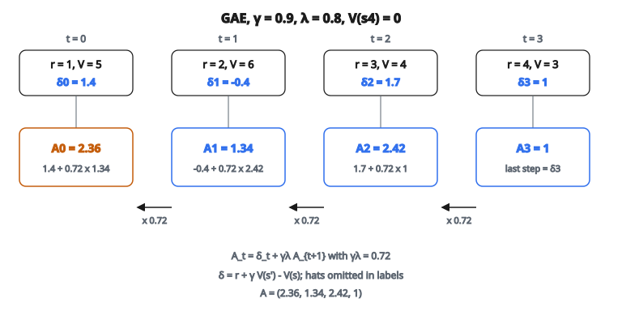

# Generalized Advantage Estimation

## Generalized Advantage Estimation (GAE) là gì

**Generalized Advantage Estimation** là kỹ thuật tính **ước lượng hàm advantage** cân bias và phương sai. Nó nội suy trơn giữa ước lượng bias cao–phương sai thấp và ước lượng bias thấp–phương sai cao.

Đưa ra bởi Schulman et al. (2016), GAE được dùng rộng rãi trong các phương pháp policy gradient như PPO và TRPO.

## Hàm advantage

Hàm advantage đo action tốt hơn trung bình bao nhiêu:

$$
A^\pi(s, a) = Q^\pi(s, a) - V^\pi(s)
$$

**Diễn giải:**

* $A > 0$: Action $a$ tốt hơn trung bình tại state $s$
* $A < 0$: Action $a$ kém hơn trung bình
* $A = 0$: Action $a$ đúng bằng trung bình

Advantage được dùng trong policy gradient để nhân trọng bước cập nhật gradient.

## Vì sao dùng advantage

Dùng advantage thay vì return làm giảm phương sai trong cập nhật policy gradient:

**Với return:**

$$
\nabla_\theta J \approx E\left[\sum_t \nabla_\theta \log \pi_\theta(a_t|s_t) \cdot G_t\right]
$$

**Với advantage:**

$$
\nabla_\theta J \approx E\left[\sum_t \nabla_\theta \log \pi_\theta(a_t|s_t) \cdot A_t\right]
$$

Trừ baseline $V(s)$ không đổi kỳ vọng gradient nhưng giảm phương sai.

## TD error (TD residual)

TD error một bước được định nghĩa:

$$
\delta_t = r_t + \gamma V(s_{t+1}) - V(s_t)
$$

Đây là ước lượng advantage $A(s_t, a_t)$ với:

* Phương sai thấp (chỉ một bước reward thật)
* Bias cao (bootstrap từ $V(s_{t+1})$)

## Ước lượng advantage n-bước

Có thể dùng các horizon khác nhau để ước lượng advantage:

**1-bước (TD error):**

$$
\hat{A}_t^{(1)} = \delta_t = r_t + \gamma V(s_{t+1}) - V(s_t)
$$

**2-bước:**

$$
\hat{A}_t^{(2)} = \delta_t + \gamma \delta_{t+1} = r_t + \gamma r_{t+1} + \gamma^2 V(s_{t+2}) - V(s_t)
$$

**n-bước:**

$$
\hat{A}_t^{(n)} = \sum_{l=0}^{n-1} \gamma^l \delta_{t+l}
$$

**$\infty$-bước (Monte Carlo):**

$$
\hat{A}_t^{(\infty)} = \sum_{l=0}^{\infty} \gamma^l \delta_{t+l} = G_t - V(s_t)
$$

## Đánh đổi bias–phương sai

**Horizon ngắn (n nhỏ):**

* Phương sai thấp: Chỉ vài reward ngẫu nhiên
* Bias cao: Phụ thuộc nặng vào ước lượng hàm value

**Horizon dài (n lớn):**

* Phương sai cao: Nhiều reward ngẫu nhiên cộng dồn
* Bias thấp: Ít phụ thuộc ước lượng hàm value

GAE cho một cách có nguyên lý để trộn các ước lượng này.

## GAE: công thức

GAE tính trung bình có trọng số của mọi ước lượng advantage n-bước:

$$
\hat{A}_t^{\mathrm{GAE}(\gamma, \lambda)} = \sum_{l=0}^{\infty} (\gamma \lambda)^l \delta_{t+l}
$$

với:

* $\gamma$ là discount factor
* $\lambda \in [0, 1]$ là tham số GAE điều khiển đánh đổi bias–phương sai

## Hiểu tham số $\lambda$

**$\lambda = 0$:**

$$
\hat{A}_t = \delta_t
$$

TD error thuần. Bias cao, phương sai thấp.

**$\lambda = 1$:**

$$
\hat{A}_t = \sum_{l=0}^{\infty} \gamma^l \delta_{t+l} = G_t - V(s_t)
$$

Advantage Monte Carlo. Bias thấp, phương sai cao.

**$\lambda \in (0, 1)$:**
Nội suy giữa TD và MC. Giá trị điển hình: 0.9 đến 0.99.

## Tính đệ quy

GAE tính hiệu quả bằng đệ quy ngược:

$$
\hat{A}_t = \delta_t + \gamma \lambda \hat{A}_{t+1}
$$

**Thuật toán (đi ngược từ cuối trajectory):**

1. Đặt $\hat{A}_T = 0$ (hoặc $\delta_{T-1}$ cho bước cuối)
2. Với $t = T-1, T-2, \ldots, 0$:
   * Tính $\delta_t = r_t + \gamma V(s_{t+1}) - V(s_t)$
   * Tính $\hat{A}_t = \delta_t + \gamma \lambda \hat{A}_{t+1}$

## Ví dụ số

**Trajectory:** 4 timestep với reward và value

* $t=0$: $r_0 = 1$, $V(s_0) = 5$
* $t=1$: $r_1 = 2$, $V(s_1) = 6$
* $t=2$: $r_2 = 3$, $V(s_2) = 4$
* $t=3$: $r_3 = 4$, $V(s_3) = 3$
* Terminal: $V(s_4) = 0$

**Tham số:** $\gamma = 0.9$, $\lambda = 0.8$

**Bước 1: Tính TD error**

$$
\begin{aligned}
\delta_3 &= r_3 + \gamma V(s_4) - V(s_3) = 4 + 0.9(0) - 3 = 1 \\
\delta_2 &= r_2 + \gamma V(s_3) - V(s_2) = 3 + 0.9(3) - 4 = 3 + 2.7 - 4 = 1.7 \\
\delta_1 &= r_1 + \gamma V(s_2) - V(s_1) = 2 + 0.9(4) - 6 = 2 + 3.6 - 6 = -0.4 \\
\delta_0 &= r_0 + \gamma V(s_1) - V(s_0) = 1 + 0.9(6) - 5 = 1 + 5.4 - 5 = 1.4
\end{aligned}
$$

**Bước 2: Tính GAE ngược**

$$
\begin{aligned}
\hat{A}_3 &= \delta_3 = 1 \quad \text{(bước cuối)} \\
\hat{A}_2 &= \delta_2 + \gamma\lambda\hat{A}_3 = 1.7 + 0.9(0.8)(1) = 1.7 + 0.72 = 2.42 \\
\hat{A}_1 &= \delta_1 + \gamma\lambda\hat{A}_2 = -0.4 + 0.9(0.8)(2.42) = -0.4 + 1.74 = 1.34 \\
\hat{A}_0 &= \delta_0 + \gamma\lambda\hat{A}_1 = 1.4 + 0.9(0.8)(1.34) = 1.4 + 0.96 = 2.36
\end{aligned}
$$

::: {#fig-141-gae fig-cap="δ = (1.4, −0.4, 1.7, 1) và Â_t = δ_t + γλ Â_{t+1} với γλ = 0.72 cho  = (2.36, 1.34, 2.42, 1)." fig-alt="Bốn timestep: delta 1.4, -0.4, 1.7, 1; advantage GAE 2.36, 1.34, 2.42, 1; mũi tên ngược nhân gamma lambda = 0.72."}
{fig-align="center"}
:::

## Xử lý biên episode

Tại trạng thái terminal, không có value của state kế:

$$
\delta_{T-1} = r_{T-1} + \gamma \cdot 0 - V(s_{T-1}) = r_{T-1} - V(s_{T-1})
$$

Với truncation không terminal (ví dụ hết độ dài episode tối đa):

$$
\delta_{T-1} = r_{T-1} + \gamma V(s_T) - V(s_{T-1})
$$

Dùng cờ “done” để phân biệt termination thật và truncation.

## GAE trong thực tế

**Hyperparameter điển hình:**

* $\gamma = 0.99$: Discount factor chuẩn
* $\lambda = 0.95$: Cân bias–phương sai tốt

**Trong PPO:**

1. Thu trajectory bằng policy hiện tại
2. Tính ước lượng value $V(s_t)$ cho mọi state
3. Tính advantage GAE $\hat{A}_t$
4. Chuẩn hóa advantage: $\hat{A}_t = \frac{\hat{A}_t - \mu}{\sigma}$
5. Dùng advantage trong cập nhật policy gradient

## Vì sao GAE hiệu quả

**Trọng số mũ:**

$(\gamma\lambda)^l$ giảm theo hàm mũ. TD error gần đây quan trọng nhất, nhưng thông tin xa vẫn đóng góp.

**Nội suy trơn:**

Khác việc chọn một n-bước cố định, GAE trộn trơn mọi horizon.

**Giảm phương sai:**

Với $\lambda$ điển hình (0.9–0.99), GAE đạt phương sai thấp hơn nhiều so với Monte Carlo thuần, trong khi bias vẫn chấp nhận được.

## So sánh các ước lượng advantage

**TD error ($\lambda = 0$):**

* Chỉ dùng reward tức thời và một lần bootstrap
* Phương sai rất thấp
* Bias cao nếu hàm value không chính xác

**Monte Carlo ($\lambda = 1$):**

* Dùng return đầy đủ
* Không chệch nếu cho trước hàm value
* Phương sai cao do ngẫu nhiên của reward

**GAE ($\lambda \in (0.9, 0.99)$):**

* Lấy cả hai phía
* Bias và phương sai vừa phải
* Thực nghiệm thường tốt nhất

## Chuẩn hóa advantage

Sau khi tính GAE, advantage thường được chuẩn hóa:

$$
\hat{A}_t^{\mathrm{norm}} = \frac{\hat{A}_t - \mathrm{mean}(\hat{A})}{\mathrm{std}(\hat{A}) + \epsilon}
$$

**Lợi ích:**

* Ổn định cập nhật policy gradient
* Learning rate phát huy nhất quán
* Tránh gradient quá lớn hoặc quá nhỏ

## GAE khi khớp hàm value

Advantage GAE cũng dùng để tạo target cho cập nhật hàm value:

**Value target:**

$$
V_{\mathrm{target}}(s_t) = \hat{A}_t + V(s_t) = \sum_{l=0}^{\infty} (\gamma\lambda)^l \delta_{t+l} + V(s_t)
$$

Hoặc tương đương, dùng $\lambda$-return:

$$
G_t^\lambda = (1-\lambda)\sum_{n=1}^{\infty} \lambda^{n-1} G_t^{(n)}
$$

## Độ phức tạp tính toán

**Thời gian:** $O(T)$ với $T$ là độ dài trajectory

* Một lượt đi ngược qua trajectory
* Mỗi bước: phép toán thời gian hằng

**Không gian:** $O(T)$

* Lưu mọi TD error (hoặc tính tại chỗ)
* Lưu mọi giá trị GAE

Rất hiệu quả với độ dài trajectory thông thường.

## Chi tiết cài đặt thường gặp

**Vector hóa:**

Xử lý nhiều trajectory song song bằng phép toán batch.

**Độ dài khác nhau:**

Đệm trajectory ngắn hơn và dùng mask để bỏ padding.

**Tăng tốc GPU:**

TD error và GAE tính hiệu quả trên GPU.

## GAE so với phương pháp advantage khác

**Actor-Critic với TD error:**

* Dùng trực tiếp $\delta_t$ làm advantage
* Đơn giản hơn nhưng bias cao hơn

**n-step return:**

* Horizon cố định
* GAE là phiên bản mềm với trung bình mũ

**V-trace (IMPALA):**

* Hiệu chỉnh off-policy
* Dùng cắt importance sampling

## Tính chất lý thuyết

**Bias:**

GAE đưa bias qua xấp xỉ hàm value. Nếu $V$ đúng, ước lượng không chệch khi $\lambda = 1$.

**Phương sai:**

Phương sai giảm khi $\lambda$ giảm. Phương sai bị chặn bởi phương sai Monte Carlo.

**Hội tụ:**

Policy gradient với GAE hội tụ tới cực trị địa phương dưới các điều kiện chuẩn.

## Code
```python
def gae(rewards, values, gamma, lam):
    """
    Compute Generalized Advantage Estimation.
    """
    T = len(rewards)
    advantages = [0.0] * T
    last_adv = 0.0
    for t in range(T - 1, -1, -1):
        delta = rewards[t] + gamma * values[t + 1] - values[t]
        advantages[t] = delta + gamma * lam * last_adv
        last_adv = advantages[t]
    return advantages

```

<!-- auto-self-check -->

::: {.callout-note}
## Kiểm tra nhanh
<details>
<summary>Ý chính của bài «Generalized Advantage Estimation» là gì?</summary>
**Generalized Advantage Estimation** là kỹ thuật tính **ước lượng hàm advantage** cân bias và phương sai.
</details>
<details>
<summary>Công thức / quan hệ cốt lõi trong bài là gì?</summary>
$$A^\pi(s, a) = Q^\pi(s, a) - V^\pi(s)$$
</details>
:::
