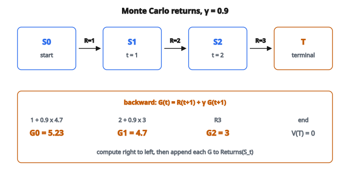

# Monte Carlo Policy Evaluation

## Policy evaluation là gì?

Policy evaluation là quá trình tính **hàm giá trị** cho một policy $\pi$ cho trước. Hàm giá trị cho biết việc ở mỗi trạng thái tốt đến đâu khi theo policy đó.

Trong Monte Carlo (MC) policy evaluation, ta ước lượng giá trị bằng **trung bình các return** từ trải nghiệm thật, chứ không dùng mô hình môi trường.

## Hàm giá trị

Hàm state-value $V^{\pi}(s)$ là kỳ vọng return khi bắt đầu từ trạng thái $s$ và theo policy $\pi$:

$$
V^{\pi}(s) = \mathbb{E}_{\pi}[G_t \mid S_t = s]
$$

với return $G_t$ là tổng phần thưởng chiết khấu:

$$
G_t = R_{t+1} + \gamma R_{t+2} + \gamma^2 R_{t+3} + \cdots = \sum_{k=0}^{\infty} \gamma^k R_{t+k+1}
$$

Hệ số chiết khấu $\gamma \in [0, 1]$ quyết định mức ta định giá phần thưởng tương lai.

## Cách tiếp cận Monte Carlo

Phương pháp Monte Carlo học từ **episode đầy đủ** của trải nghiệm. Ý chính:

1. Sinh episode bằng cách theo policy
2. Với mỗi trạng thái đã thăm, ghi return đi theo sau
3. Trung bình các return để ước lượng giá trị

**Không cần mô hình:** ta học trực tiếp từ trải nghiệm, không từ xác suất chuyển tiếp.

**Chỉ tác vụ theo episode:** episode phải kết thúc thì mới tính được return.

## First-visit và every-visit MC

**First-visit MC:**

Chỉ dùng return đi theo **lần thăm đầu** tới trạng thái $s$ trong mỗi episode.

Nếu một episode thăm $s$ nhiều lần, chỉ lần xuất hiện đầu được tính.

**Every-visit MC:**

Dùng return đi theo **mọi** lần thăm trạng thái $s$ trong mỗi episode.

Nếu $s$ xuất hiện 3 lần trong một episode, ta có 3 mẫu return.

Cả hai đều hội tụ tới $V^{\pi}(s)$ khi số episode tiến tới vô hạn.

## Thuật toán first-visit MC

**Khởi tạo:**

* $V(s) \leftarrow$ tùy ý với mọi $s$
* $\mathrm{Returns}(s) \leftarrow$ danh sách rỗng với mọi $s$

**Lặp cho mỗi episode:**

1. Sinh episode: $S_0, A_0, R_1, S_1, A_1, R_2, \ldots, S_{T-1}, A_{T-1}, R_T$
2. $G \leftarrow 0$
3. Với $t = T-1, T-2, \ldots, 0$:

   * $G \leftarrow \gamma G + R_{t+1}$
   * Nếu $S_t$ không thuộc $\{S_0, S_1, \ldots, S_{t-1}\}$:
     + Thêm $G$ vào $\mathrm{Returns}(S_t)$
     + $V(S_t) \leftarrow \mathrm{average}(\mathrm{Returns}(S_t))$

## Tính return: ví dụ số

**Episode:** $S_0 \to S_1 \to S_2 \to \mathrm{Terminal}$

**Phần thưởng:** $R_1 = 1$, $R_2 = 2$, $R_3 = 3$

**Hệ số chiết khấu:** $\gamma = 0.9$

**Tính return ngược từ cuối:**

$$
G_2 = R_3 = 3
$$

$$
\begin{aligned}
G_1
&= R_2 + \gamma G_2 \\
&= 2 + 0.9 \times 3 \\
&= 2 + 2.7 \\
&= 4.7
\end{aligned}
$$

$$
\begin{aligned}
G_0
&= R_1 + \gamma G_1 \\
&= 1 + 0.9 \times 4.7 \\
&= 1 + 4.23 \\
&= 5.23
\end{aligned}
$$

**Cập nhật:**

* $\mathrm{Returns}(S_2).\mathrm{append}(3)$
* $\mathrm{Returns}(S_1).\mathrm{append}(4.7)$
* $\mathrm{Returns}(S_0).\mathrm{append}(5.23)$

::: {#fig-93-mc-returns fig-cap="Tính return ngược: G₂ = 3, G₁ = 2 + 0.9 × 3 = 4.7, G₀ = 1 + 0.9 × 4.7 = 5.23 với γ = 0.9." fig-alt="Episode S0 đến S1 đến S2 đến T với R=1,2,3 và gamma=0.9. Return ngược: G2=3, G1=4.7, G0=5.23."}
{fig-align="center"}
:::

## Vì sao tính return ngược từ cuối?

Tính return ngược từ cuối episode là cách hiệu quả:

$$
G_t = R_{t+1} + \gamma G_{t+1}
$$

Quan hệ đệ quy này cho phép tính mọi return trong một lượt đi ngược qua episode, độ phức tạp $O(T)$ thay vì $O(T^2)$.

## Cập nhật trung bình tăng dần

Thay vì lưu mọi return rồi tính trung bình, ta có thể cập nhật tăng dần:

$$
V(S_t) \leftarrow V(S_t) + \frac{1}{N(S_t)}[G_t - V(S_t)]
$$

với $N(S_t)$ là số lần trạng thái $S_t$ đã được thăm.

**Tương đương:**

$$
V_{\mathrm{new}} = V_{\mathrm{old}} + \alpha [G - V_{\mathrm{old}}]
$$

với $\alpha = 1/N$ cho trung bình đúng.

## Learning rate hằng

Trong môi trường không dừng hoặc khi cần thích nghi nhanh hơn, dùng learning rate không đổi:

$$
V(S_t) \leftarrow V(S_t) + \alpha [G_t - V(S_t)]
$$

với $\alpha \in (0, 1]$ cố định.

**Tính chất:**

* Return gần đây ảnh hưởng nhiều hơn
* Quên dữ liệu cũ theo hàm mũ
* Theo dõi được hàm giá trị đang đổi
* Không hội tụ tới trung bình đúng

## Ví dụ chi tiết: gridworld

**Thiết lập:** gridworld 4 trạng thái, policy luôn đi phải

Trạng thái: A $\to$ B $\to$ C $\to$ Terminal

Phần thưởng: $+1$ mỗi bước, $\gamma = 0.9$

**Episode 1:** A $\to$ B $\to$ C $\to$ T

Return:

* $G(C) = 1$
* $G(B) = 1 + 0.9(1) = 1.9$
* $G(A) = 1 + 0.9(1.9) = 2.71$

**Sau episode 1:**

* $V(A) = 2.71$
* $V(B) = 1.9$
* $V(C) = 1.0$

**Episode 2:** A $\to$ B $\to$ C $\to$ T (cùng quỹ đạo)

Cùng return. Sau khi trung bình:

* $V(A) = (2.71 + 2.71)/2 = 2.71$
* $V(B) = 1.9$
* $V(C) = 1.0$

Giá trị ổn định vì policy tất định.

## Policy ngẫu nhiên

Với policy ngẫu nhiên, các episode khác nhau có thể đi đường khác nhau, nên return từ cùng một trạng thái cũng khác nhau.

**Ví dụ:** từ trạng thái A, policy đi phải với xác suất 70%, đi trái với xác suất 30%.

Các episode khác nhau sẽ cho return khác nhau. Trung bình Monte Carlo ước lượng kỳ vọng return dưới policy ngẫu nhiên này.

## Phương sai của ước lượng Monte Carlo

Ước lượng MC có thể có **phương sai cao** vì:

1. Return phụ thuộc toàn bộ quỹ đạo episode
2. Episode dài có biến thiên lớn hơn
3. Môi trường ngẫu nhiên thêm nhiễu

**Giảm phương sai:**

* Dùng nhiều episode hơn
* Trừ baseline (trong các phương pháp policy gradient)
* Cân nhắc TD nếu muốn phương sai thấp hơn (nhưng đưa bias vào)

## Bias của ước lượng Monte Carlo

Ước lượng MC là **unbiased**: kỳ vọng của ước lượng bằng giá trị đúng.

$$
\mathbb{E}[G_t \mid S_t = s] = V^{\pi}(s)
$$

Vì ta lấy mẫu trực tiếp return thật, không bootstrap từ ước lượng khác.

## Tính chất hội tụ

**First-visit MC:**

* Ước lượng unbiased của $V^{\pi}(s)$
* Hội tụ tới $V^{\pi}(s)$ khi số lần thăm $\to \infty$
* Trung bình mẫu hội tụ theo luật số lớn

**Every-visit MC:**

* Cũng hội tụ tới $V^{\pi}(s)$
* Biased trên mẫu hữu hạn (các mẫu trong cùng episode tương quan)
* Thường dùng dữ liệu hiệu quả hơn trong thực tế

## Ưu điểm của phương pháp Monte Carlo

**1. Model-free:**

Không cần xác suất chuyển tiếp hay hàm phần thưởng.

**2. Unbiased:**

Ước lượng hội tụ tới giá trị đúng, không sai số hệ thống.

**3. Làm việc với trải nghiệm lấy mẫu:**

Học được từ tương tác thật hoặc episode mô phỏng.

**4. Đơn giản để hiểu và cài:**

Chỉ việc trung bình các return.

## Nhược điểm của phương pháp Monte Carlo

**1. Cần episode đầy đủ:**

Không học được từ quỹ đạo chưa kết thúc.

**2. Phương sai cao:**

Return có thể khác nhau mạnh giữa các episode.

**3. Học chậm:**

Chỉ cập nhật sau khi episode kết thúc.

**4. Bộ nhớ:**

Có thể phải lưu cả episode trước khi xử lý.

## Monte Carlo và dynamic programming

**Dynamic programming:**

* Cần mô hình đầy đủ (chuyển tiếp, phần thưởng)
* Cập nhật dựa trên giá trị trạng thái kế
* Bootstrapping: $V(s) = \sum_a \pi(a \mid s) \sum_{s',r} p(s',r \mid s,a)[r + \gamma V(s')]$

**Monte Carlo:**

* Model-free, học từ trải nghiệm
* Cập nhật dựa trên return đầy đủ
* Không bootstrap: $V(s) \approx \text{trung bình các } G_t \text{ lấy mẫu}$

## Monte Carlo và temporal difference

**Monte Carlo:**

* Cập nhật sau khi episode kết thúc
* Dùng return đầy đủ thật $G_t$
* Unbiased, phương sai cao

**Temporal Difference (TD):**

* Cập nhật sau mỗi bước
* Dùng return ước lượng: $R_{t+1} + \gamma V(S_{t+1})$
* Biased (dùng ước lượng), phương sai thấp hơn

MC và TD là hai đầu của một phổ, với các phương pháp n-step ở giữa.

## Importance sampling (MC off-policy)

Để đánh giá policy $\pi$ bằng dữ liệu từ behavior policy $b$:

$$
V^{\pi}(s) = \mathbb{E}_{b}\left[\frac{\prod_{k=t}^{T-1} \pi(A_k \mid S_k)}{\prod_{k=t}^{T-1} b(A_k \mid S_k)} G_t \;\middle|\; S_t = s\right]
$$

Tỉ số importance sampling tái trọng số các return để hiệu chỉnh xác suất action khác nhau.

Nhờ đó có thể học về một policy trong khi theo một policy khác.

## Code
```python
import numpy as np

def mc_policy_evaluation(episodes, gamma, n_states):
    """
    Returns: V (NumPy array of shape (n_states,))
    """
    returns_sum = [0.0] * n_states
    returns_count = [0] * n_states
    for episode in episodes:
        G = 0.0
        visit_return = {}
        for t in range(len(episode) - 1, -1, -1):
            state, reward = episode[t]
            G = reward + gamma * G
            visit_return[state] = G
        for state, ret in visit_return.items():
            returns_sum[state] += ret
            returns_count[state] += 1
    V = [0.0] * n_states
    for s in range(n_states):
        if returns_count[s] > 0:
            V[s] = round(returns_sum[s] / returns_count[s], 4)
    return V

```

<!-- auto-self-check -->

::: {.callout-note}
## Kiểm tra nhanh
<details>
<summary>Ý chính của bài «Monte Carlo Policy Evaluation» là gì?</summary>
Policy evaluation là quá trình tính **hàm giá trị** cho một policy $\pi$ cho trước.
</details>
<details>
<summary>Công thức / quan hệ cốt lõi trong bài là gì?</summary>
$$V^{\pi}(s) = \mathbb{E}_{\pi}[G_t \mid S_t = s]$$
</details>
:::
